---

title: Chap 1 | “AVL Trees, Splay Trees,and Amortized Analysis”

hide:
  #  - navigation # 显示右
  #  - toc #显示左
  #  - footer
  #  - feedback  
comments: true  #默认不开启评论

---

<h1 id="欢迎">Chap 1 | “AVL Trees, Splay Trees,and Amortized Analysis”</h1>

!!! note "章节启示录"
    <!-- === "Tab 1" -->
        <!-- Markdown **content**. -->
    <!-- === "Tab 2"
        More Markdown **content**. -->
    本章节是ADS的第一章，第一节课就已经感受到这门课的不一般之处，许多内容需要课后花时间好好消化，仅仅依靠上课听讲是不够的（也可能是我听的不认真以及没什么算法基础的缘故🥺）。接下来进入正题！
## 1.AVL树

### 1.1定义
!!! note ""
    AVL树的定义其实可以这么理解：它是一个较为平衡的二叉搜索树。AVL树希望解决的问题是让搜索变得更加迅速 ***（Speed up searching (with insertion and deletion)）***。因为在二叉搜索树中，可能会出现1~N这样Tree Height为N的极端坏情况。
### 1.2性质
#### 1.2.1性质介绍
!!! note ""
    *  空二叉树是一个AVL树
    *  如果 T 是一棵 AVL 树，那么其左右子树也是 AVL 树，并且 $\lvert h(ls) - h(rs)\rvert≤1$，h 是其左右子树的高度  
    *  树的高度为$O(logn) $
    !!! note ""
        因此我们有了一个新的定义 **平衡因子**（The balance factor）$BF=h(ls) - h(rs)$。  
        在一个AVL树中，$BF=-1,0,1$
#### 1.2.2性质证明
在实现构造AVL树前，我们先来分析并证明为什么AVL树的高度一定是$O(logn)$。
!!! abstract "$TreeHeight=O(logn)$"
    我们记$n_h$是高度为$h$的AVL树所包含的最少节点数，那么这个树一定长成这个样子:  
    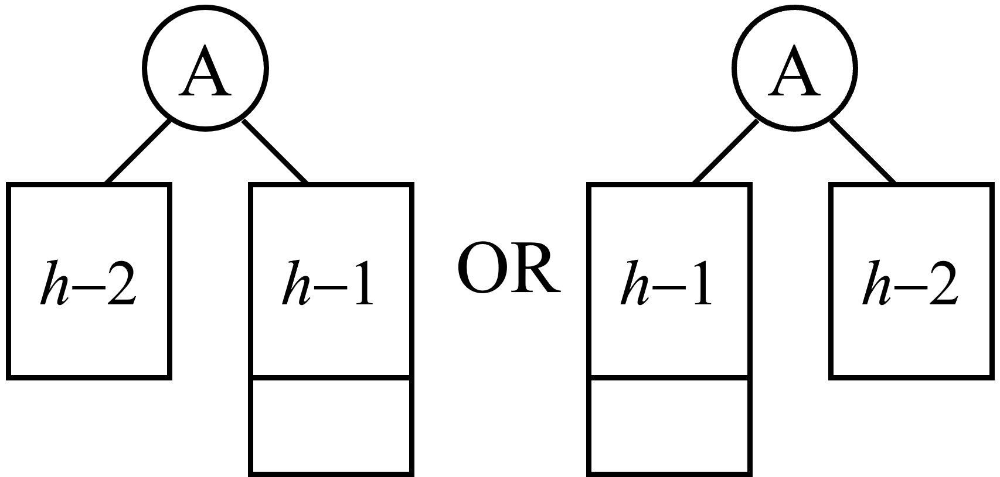{width="400"}
    !!! danger "注意"
        在讨论最少节点数时，A的左右子树的高度不可能相等，若相等的话，则应该为该高度的最多节点。
    因此我们容易得到如下的递推关系式：  
    $$
        n_h =
        \begin{cases}
            1  &(h=0)\\\\
            2  &(h=1)\\\\
            n_{h-1}+n_{h-2}+1 &(h>1)\\\\
        \end{cases}
    $$
    这个形式与我们学过的斐波那契数列极其相似。
    斐波那契数列：
    $F_0=0,F_1=1,F_i=F_{i-1}+F_{i-2}$  
    由一些厉害的理论可以推出:
    $$
    F_i≈\frac{1}{\sqrt{5}} \left(\frac{1+\sqrt{5}}{2} \right)^i
    $$
    所以
    $$
    log(F_n)≈n
    $$
    而
    $$
    n_h+1≈F_{h+3} \implies h=O(\ln n)
    $$


### 1.3构建AVL树
在一般的情况下，我们希望在建树的过程中直接构造出AVL树，而不是先构造出二叉搜索树再将其转换为AVL树，因此，我们需要在每一次添加节点（Insert node）后，使得新形成的树成为AVL时。当然，在此次插入前，我们构建的树必然也已经是一个AVL树，可以看到，这是一个迭代的问题。  
  
在介绍如何构建AVL树前，我们需要首先知道两个概念。
!!! note ""
    * Trouble Maker:当一个新插入的节点使得这棵新树不再是AVL树时，我们称它为Trouble Maker.
    * Trouble Finder:当出现Trouble Maker时，不断地向上寻找，看看是第一个找到的BF值跳出-1，0，-1的是哪一位祖辈，那么称这个祖辈对应的节点为Trouble Finder.
当我们了解清楚一些前情提要后，接下来就可以进入本章节的正题了！

!!! abstract "实现方法：旋转(Rotation)"
    旋转这个名字取得很有意思，接下来我会用比较多的篇幅介绍四种旋转的方式，一开始我觉得每一种旋转理解起来都不太容易，或者说都仿佛要记忆一样，但实际上“旋转”只是我们做的一个操作的形象的代名词（正如计算机中其他很多专业的术语一样，他们喜欢找一个生活中形象的例子来帮助人们理解）。但你可以简单地理解为，为了实现我们构造AVL树的目标，我们按照一些前任发现的特定的步骤，而这些步骤只要满足构造出来的新树仍然是二叉搜索树即可。听起来会有点抽象，下面我会具体来谈谈。

#### 1.3.1**RR/LL旋转**

!!! tips "命名"
    * RR旋转的命名是因为：对于Trouble Finder来说，Trouble Maker在它的右孩子的右孩子上（或者右孩子的右孩子的子树上）。我们注意到：RR旋转实际上应该是向左旋转，即逆时针。
    * LL旋转的命名是因为：对于Trouble Finder来说，Trouble Maker在它的左孩子的左孩子上（或者左孩子的左孩子的子树上）。我们注意到：LL旋转实际上应该是向右旋转，即顺时针。     
    **因此，我们可以简单的记忆：右逆左顺。**
以RR旋转为例进行说明，LL旋转为其镜像。   
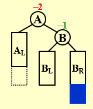{width="200"}
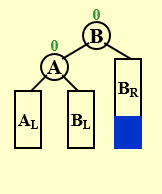{ width="200"}  
我们可以在脑海中想象一下，将左图整个逆时针旋转，然后为了仍然满足二叉搜索树成立的条件，我们需要将B的左子树BL移动到A的右侧。

#### 1.3.2**RL/LR旋转**
!!! tips "命名"
    * RL旋转的命名是因为：对于Trouble Finder来说，Trouble Maker在它的右孩子的左孩子上（或者右孩子的左孩子的子树上）。RL旋转实际上应该是**从下到上****先**向左旋转，**再**向右旋转。
    * LL旋转的命名是因为：对于Trouble Finder来说，Trouble Maker在它的左孩子的右孩子上（或者左孩子的右孩子的子树上）。LR旋转实际上应该是**从下到上****先**向右旋转，**再**向左旋转。   
以RL旋转为例进行说明，LR旋转为其镜像。  
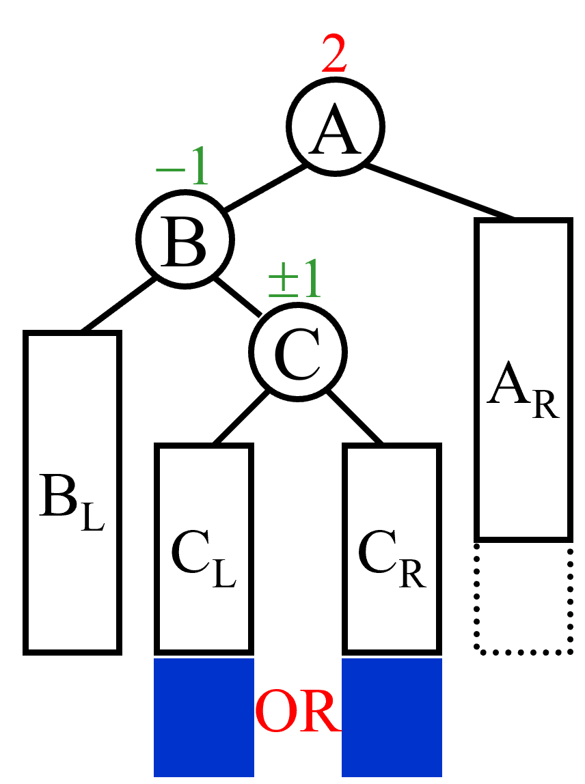{width="200"}
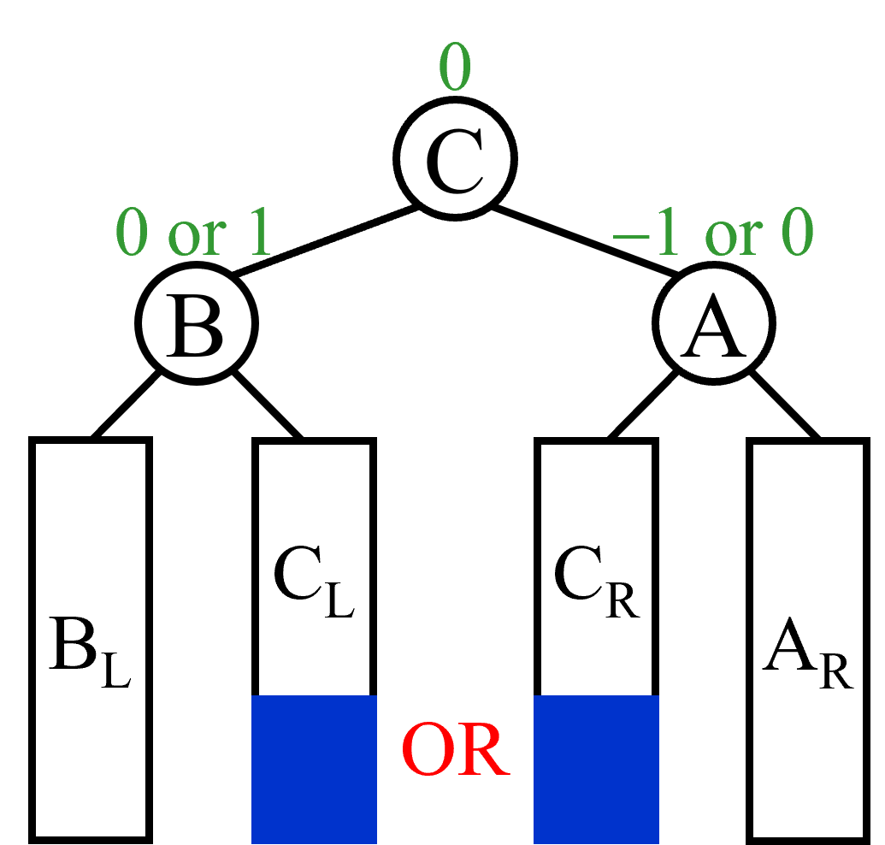{ width="200"}  
两次旋转的变化在脑海中有点难以想象，但稍微动一下笔，先向左进行旋转（将以B为根节点的子树做一遍RR旋转），再向右进行旋转（将以A为根节点的子树做一遍LL旋转）我们需要将B的左子树BL移动到A的右侧。

!!! question "AVL树的问题"
    尽管AVL树能够在最坏输入情况下保证它的操作复杂度并不高，但它付出了额外的代价，它在二叉搜索树中增加了额外的负担。比如在真正实现时，我们一般会在二叉搜索树的每个节点上加一个标志树高(Height)的数据，或者记录BF的值。但是这样会带来一个问题，每当我们插入一个节点或做一次旋转时，我们都会做一次检查（检查从Trouble Maker节点到根节点的高度（或者BF）的值）。这样就带来了许多负担。  
**那么尽管AVL树作为一种***强约束***的数据结构实现了我们想要的目标，但是不是可以稍微放松一些呢？比如可不可以不计较单次操作的时间，而直接考虑多次操作时间的总和呢？**  
**所以接下来就有了Splay树。**
## 2.Splay树（伸展树）

### 1.1定义
!!! note ""
    Splay树的定义其实可以这么理解：它也是一个较为平衡的二叉搜索树。它能够在**摊还时间**$O(\log N)$时间内完成插入，查找和删除操作，并且保持平衡。
    !!! danger "注意"
        注意到这里出现了一个新的时间名词**摊还时间(amortize time)**这是一个很重要的概念，我们在介绍Splay树的过程中会有所涉及，并且会在下文单独对其进行一个分析，此处需要注意它与FDS中学过的平均时间是不同的即可。
* 伸展树的目标是解决AVL树中过度严格的问题，它并不希望每次都对BF或者Height做检查，但它也不能太放松，它需要保证从空树开始任意连续M次对树的操作最多花费$O(M\log N)$时间。
* 虽然这样并不排除任意 ***一次*** 操作花费$O(N)$时间的可能，而且这样的界也不如每次操作最坏情形的界$O(\log N)$那么短，但实际效果是一样的。于是，我们可以把伸展树花费的总时间$O(M\log N)$ ***摊还*** 到每次操作中，即每次操作的摊还代价是$O(\log N)$。
### 1.2分析
我们知道，最坏情形的运行时间是$O(N)$，如果不对这个节点进行一些处理，那么在接下来再次遇到它时（即这个运行时间为$O(N)$的节点再次成为了Trouble Finder），我们仍然需要花费$O(N)$的时间，这是我们不希望看到的。因此，我们需要对这个节点做**移动**的处理。而对其移动还有一些可能存在的实际效用，因为在许多应用中当一个节点被访问时，它就很可能不久再被访问到。
### 1.3实现
由以上的分析可以得出，Splay 树的核心思想就是，每当我们访问一个节点（比如查询某个点、插入某个点，甚至是删除某个点），我们就通过一系列操作将目标点转移到根部，形象上理解就是不断旋转整个树的构造，直到把点转到根部。

!!! note "一个简单的想法"
    实施上面描述的重新构造的一种方法是执行**单旋转**，从下向上进行。也就是把我们的目标节点看成X,找到它的**Parent**和**Grandparent**，然后再利用AVL树中的四种旋转进行操作，直到将这个节点移到根节点上。
    === "Step 0"
        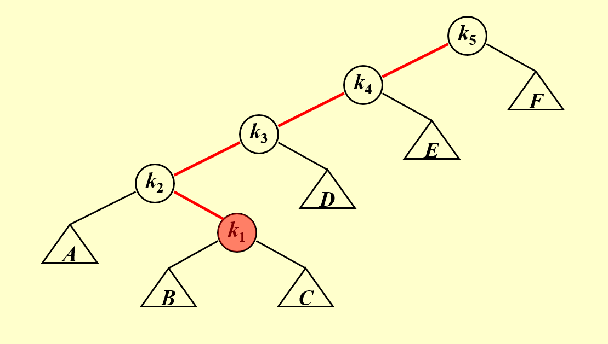
    === "Step 1"
        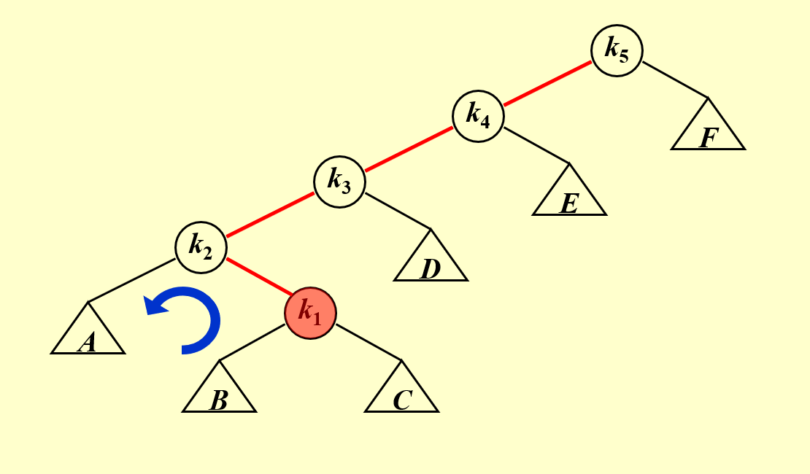
    === "Step 2"
        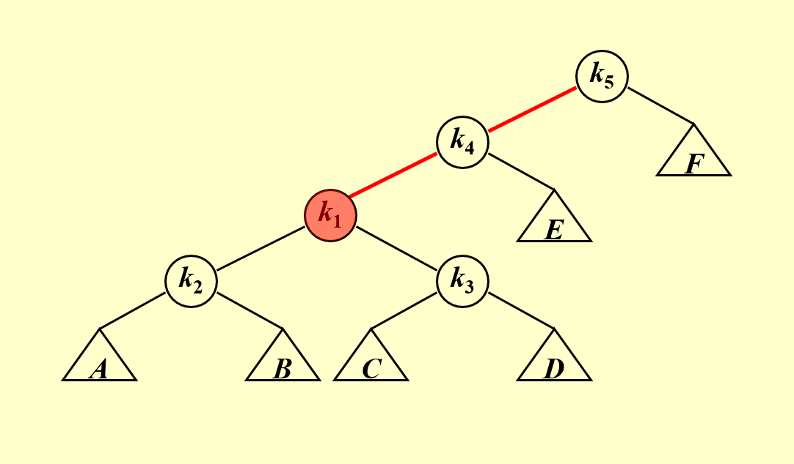
    === "Step 3"
        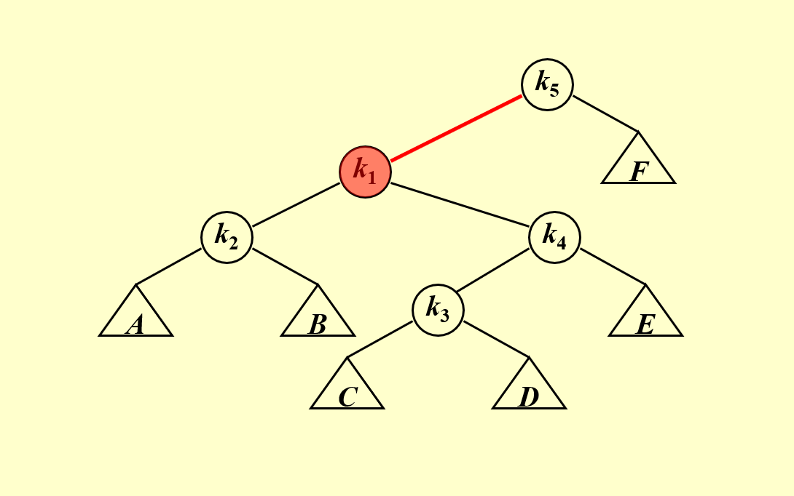
    === "Step 4"
        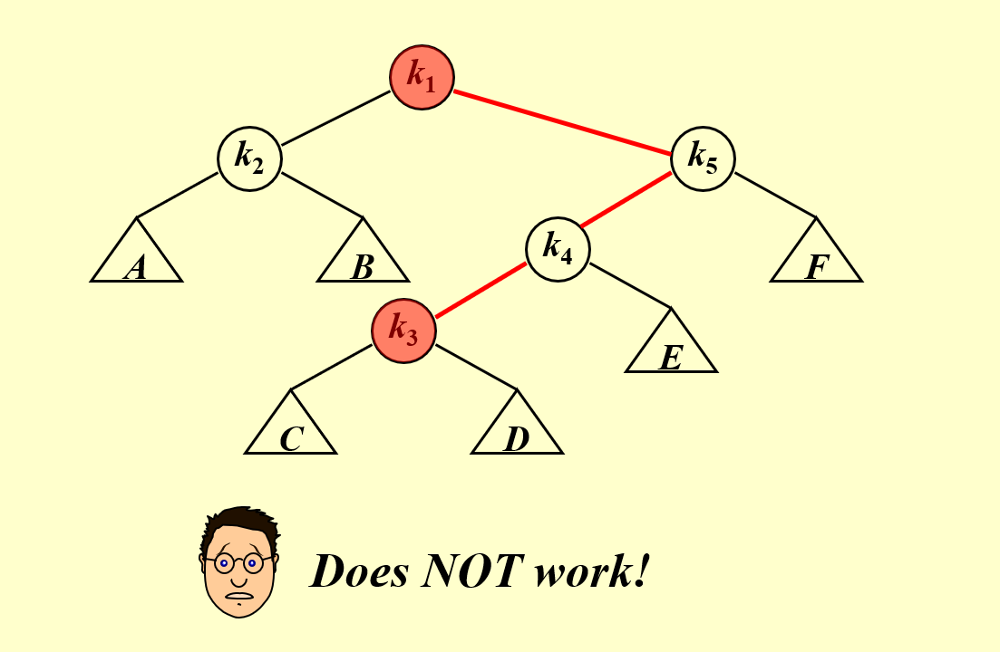    
    !!! bug "问题"
        当我们成功地将目标节点移动到根节点的位置时，却发现又出现了新的Trouble Maker，这违背了我们的初衷！  
        更糟糕的情况是，可能会出现$O(N^2)$的时间！  

        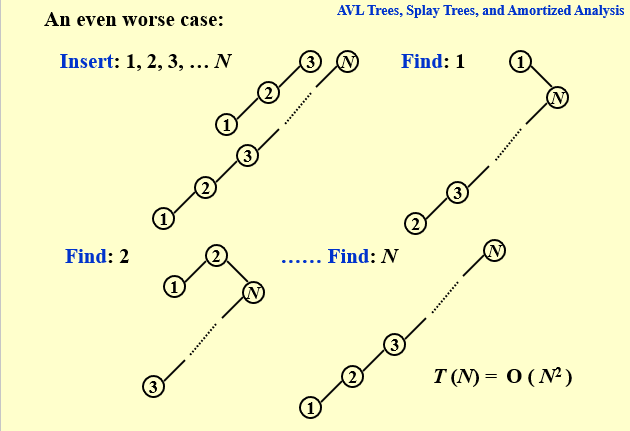
!!! success "真正的方法"
    显而易见，仅仅依靠单旋转是不够的。我们这里将采用**“双”旋转**的方式。为什么带引号呢？请往下看。

    这里我们对节点X与其Parent（下文简称P）和Grandparent（下文简称G）的关系做一个讨论。分为以下两种情况：  

    > Case 1: P 是根节点$\implies$旋转 X 和 P (即做一次单旋转)  

    > Case 2: P 不是根节点（这里将继续分类）
    >> Zig-zag(之字形): 做两次旋转，在下图中应做LR旋转，先交换P和X，再交换G和X。  

    >>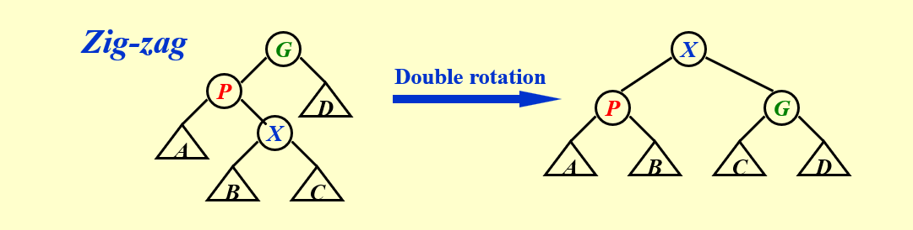

    >> Zig-zig(一字形): 做**两次**单旋转！（不要被箭头上的Single所迷惑！），在下图中应做**两次**LL旋转，**先交换G和P，再交换X和P。**（此处也不要想当然认为是自下而上的旋转，这里的操作是两次相同方向单旋转和双旋转有着很大的区别！）  

    >>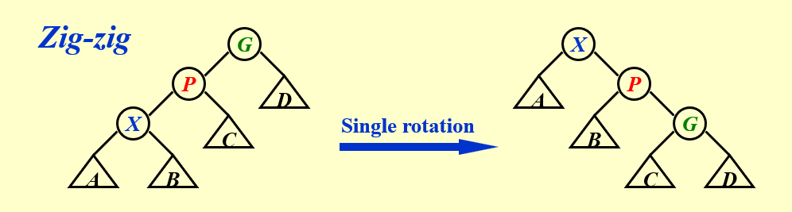  

    至此，我们给出了完整的解决方法！
### 1.4一些基本操作
!!! tip "Find X"
    根据 BST 的性质，可以在$O(\log N)$ 的时间里找到$X$，接下来通过旋转操作，将$X$不断旋转至根，最终直接取出 Root 即为结果。
!!! tip "Remove X"
    根据 BST 的性质，可以在$O(\log N)$的时间里找到$X$，接下来通过旋转操作，将$X$不断旋转至根，接下来删除 Root 节点，并在维护 BST 性质的情况下递归地合并左右孩子树即可。
!!! tip "Find Max"
    根据 BST 的性质，可以在$O(\log N)$的时间里找到最大值，将它旋转到根部以后，可以发现它没有右孩子树，直接删掉就行。


AVL一定是Splay
## 3.摊还分析(Amoritzed Analysis)

## 3.1 介绍
!!! question "一家之言"
    说实话，由于作者本人也是第一次接触到这个概念，下面给出的将是一些浅薄甚至不敢保证正确的理解，希望之后水平提高后还记得回来看看现在写的是否正确，如果这段话还在说明还是最初的版本🥺。
我想从一个与平均分析的“比较”开始讲起(或许好理解一些)。摊还分析不同于平均情况分析，**它并不涉及概率**，它可以保证**最坏情况下每个操作的平均性能**（此“平均”非彼“平均”）

我们可以得到如下不等关系：  
$$
worst-case\;\;  bound ≥ amortized\;\; bound ≥ average-case\;\;  bound
$$
**这里引用了修佬的一段话：**我们知道，由于 amortized bound 限制了所有的 M 次操作，所以其上界就等于最差的情况发生 M 次（当然，很多情况下不一定能取到全都是最差情况）；同样的，由于需要对任意组合都成立，所以一定不会小于统计学意义上的平均情况。

常见的摊还分析的方法有三种：聚合分析(Aggregate analysis)、核算法(Accounting method)、势能法(Potential method)。接下来我们将一一介绍。

### 3.1.1聚合分析

我们证明对所有$n$，一个$n$个操作的序列**最坏情况**下花费的总时间为$T(n)$，因此，在最坏情况下，每个操作的平均代价，或**摊还代价**为$T(n)/n$。

!!! example "举个栗子🌰：栈操作"
    MultiPop的函数如下：  
    ```  
    Stack with MultiPop( int k, Stack S )
    Algorithm  {  
        while ( !IsEmpty(S) && k>0 ) {  
            Pop(S);  
            k - -;  
        } /* end while-loop */ 
    }
    ```
    $$
    T=min\left[
        sizeof\left(S\right),k
    \right]
    $$
    考虑一组含$n$个数的序列，我们有3个操作，分别是:Push,Pop和MultiPop。  
    在一个包含$k$个对象的栈上执行MultiPop(k,S)操作。我们知道$\;sizeof(S)≤n\;$似乎随便想想的话，是很有可能到达n的，那么序列中一个MultiPop操作的最坏情况代价就是$O(n)$了，因为栈的大小最大为$n$。因此，一个$n$个操作的序列的最坏情况代价就是$O(n^2)$了。**但要注意的是，我们通过单独分析每个操作的最坏情况代价得到的操作序列的最坏情况时间并不是一个确界！**
      
    实际上，虽然一个单独的MultiPop操作可能代价很高，但在一个空栈上执行$n$个Push,Pop和MultiPop的操作序列，代价至多是$O(n)$。因为很直观的来说，当一个对象压入栈后，我们至多将其弹出一次！因此，一个操作的平均时间就是$O(n)/n=O(1)$。

### 3.1.2核算法
我们对不同操作赋予不同费用，赋予某些操作的费用可能多于或少于其实际代价。我们将这个赋予的费用称为**摊还代价**。当一个操作的摊还代价超出其实际代价时，我们将差额存入数据结构中的特定对象，存入的差额称为**信用(Credit)**。信用（Credit）有什么用呢？当我们在后续操作中遇到摊还代价小于实际代价的情况时，信用可以用来支付差额。
!!! example "举个栗子🌰："
    这次我们不用具体的代码或者函数来举例子了，我们采用一个生活中的例子（当然你也可以想想栈操作如何用核算法计算摊还时间）。  
    我们先以一个很正常思路看一看某个生活中的例子。  
    >例子：我每天都想买一些东西用来增加幸福感，于是我向妈妈请求要一些零花钱。**假设妈妈每天给我2元的零花钱（摊还代价）*****（注意这一步的假设！！！）***，我第一天只花了1元（某一个操作只需要1单位的代价），那么我第一个天就会有1元的存款（1单位的信用），之后第二天我又只花了1元，那么我总共就有2元的存款，然后我在第三天花了3元，那么我的存款就变成了-1元（这里与实际不同，在摊还中我们可以让信用是负数，因为我们“承诺”在之后会进行弥补）……一个月过去后，我们完成了增加幸福感的任务（函数实现），然后我们余下的信用≥0，代表我们成功了！  

    在讲完这个例子后，我们不妨想一想，为什么我们成功了？这是因为妈妈每天给的零花钱足够用（尽管可能某一天不够，但总和是够用的），也就是说，预付的代价总是能够满足函数等操作所需的代价。为了找到这个摊还代价，我们需要在具体情况中具体分析，寻找那些非负的量（大多是变量）。比如在栈操作中，栈的大小永远是非负的，也就是Push的数量！是不是与聚合分析联系起来了！总之，我们在假设摊还代价时必须要小心。

* 总结一下，如果我们希望通过分析摊还代价来证明每个操作的平均代价的最坏情况很小，就应确保操作序列的总摊还代价给出了序列总真实代价的上界，而且需要满足以下的式子（其中$\hat{c_i}$表示摊还代价，$c_i$表示某个操作的代价）：
$$
\sum_{i=1}^n \hat{c_i} ≥ \sum_{i=1}^n c_i
$$

### 3.1.3势能法

    