---

title: Chap 2 | “Red-Black Trees and B+ Trees”

hide:
  #  - navigation # 显示右
  #  - toc #显示左
  #  - footer
  #  - feedback  
comments: true  #默认不开启评论

---
<h1 id="欢迎">Chap 2 | “Red-Black Trees and B+ Trees”</h1>
!!! note "章节启示录"
    <!-- === "Tab 1" -->
        <!-- Markdown **content**. -->
    <!-- === "Tab 2"
        More Markdown **content**. -->
    本章节是ADS的第二章，经过上一周的笔记整理，对AVL树有了更加深刻的理解，这也加深了我继续将笔记写下去的决心。本章的内容是红黑树和B+树，其中红黑树的许多操作建立在AVL的旋转基础上，所以如果第一节课没有把旋转的操作掌握扎实的话，红黑树将更加云里雾里。红黑树的重点在于插入和删除，其中涉及了诸多分类讨论，我将尽我所能尝试把分类的情况讲清楚。而B+树的部分相对简单，不过有许多细节需要注意，相信在做完HW2的编程题后将感触颇深！

## 1.红黑树

### 1.1定义
!!! note ""
    红黑树是一颗二叉搜索树，唯一的不同是，每个节点额外存储了一个 $color$ 字段（红/黑），用来确保树在插入和删除时保持平衡。（也就是说，红黑树通过增加每个节点的颜色字段为我们搜索数据提供的速度和时间上的便利。在学习后你会发现，这简单的红黑属性，竟能降低许多操作的时间复杂度）

### 1.2性质
当然，我们不能只是简单地设定这样的一个颜色字段，它们需要满足如下的性质，才可称之为红黑树。  
!!! tips "性质"
    * 1.每一个节点都是红色或黑色的。  
    * 2.根节点是黑色的。（在某些版本中或许存在“松弛”红黑树这一说法，此时根不一定是黑的，但此处我们认为根必须为黑色）
    * 3.每一个空叶节点（我取的名字）是黑色的。我们称之为NIL节点（官方名字）。  
    
    * 4.如果一个节点是红色的，那么它的孩子都是黑色的。
    * 5.从根节点到 NIL 节点的每条路径上的黑色节点数量相同（这条路径也被称为黑高）  

    **不难发现，性质123是显然的，我们需要重点关注的是性质45。**
!!! question "一个简单的提问"
    === "题目"
        请判断以下这棵树是不是红黑树。  
        
    === "答案"
        16号节点的右儿子是一个黑叶子，而这个叶子到根的路径上只有 3 个黑节点，而其他叶子到根都有 4 个黑节点。（注意图中并没有标出NIL节点，但我们心中要有数）  
        
!!! abstract "一些思考和结论"
    !!! success "结论1"
        **1.红黑树不存在只有一个非叶子节点的红色节点。**  
        它的证明也很简单，因为如果一个红色节点只有一个孩子，那么这个孩子不能是红色的（根据性质4），那么这个孩子只能是黑色的，由于这个黑色的孩子还有一个空叶节点（NIL）所以这个孩子所在的子树的黑高会比另外一边多一，那么就与性质5矛盾了！
    !!! success "结论2"
        **2.一个度为1的节点，它本身一定是黑色的，且它唯一的孩子一定是红色的。**  
        由结论1可知不存在度为1的红色节点，因此度为1的节点本身一定是黑色。那么如果它的孩子是黑色，那与结论1中的分析类似，它的两棵子树的黑高并不相等。所以它的孩子一定是红色。  
        也就是说，在红黑树中，度为1的节点的存在条件是最苛刻的（相比度为0和度为2的节点）！
    !!! success "结论3"
        **3.一个有 $N$ 个内部节点（不包括NIL）的红黑树，其最大高度为 $2log_2(N+1)$。**  
        证明这个结论之前，我们需要先证明两个小结论。  
        ① $N≥2^{bh}-1$  
        ② $bh(tree)≥h(tree)/2$  
        其中结论①需要用到归纳法：  
        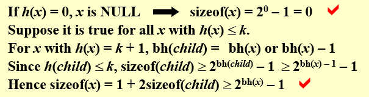  
        结论②可以从直观上理解：  
        在一棵红黑树中，因为对红节点的限制较多，因此红节点的数量一定小于等于黑节点的数量，因此结论成立。  
        有了这两个结论，我们就可以根据不等式的传递性得到结论3了。

### 1.3插入
下面将进入红黑树的重头戏之一：**插入**。  
在具体介绍之前，我们先来想一想插入的基本逻辑是怎么样的。我们知道，插入后的黑高极有可能改变，导致原有的红黑性质遭到破坏，那么我们就需要想一种合理的办法，将这种破坏消除掉，就是使得插入并不影响黑高！而在红黑树中，红节点不会影响黑高，所以自然而然我们会想到，把插入的节点染成红色。那么接下来问题就来了，根据性质4，如果插入的节点的父亲也是一个红节点，就又破坏了红黑性质（若它的父亲是黑节点，那么皆大欢喜），所以我们接下来要做的，就是通过一些基本的变换，修复这棵被破坏的红黑树！  
  
接下来，我们将利用两个最基本也是唯二的方法进行变换：

* **染色**和**旋转**。  请大家牢牢记住这两个方式！

那么下面，分类开始！

!!! tips "分类讨论"
    其中，第三层的红色节点为我们插入的节点。（下文中的图片仅仅将插入节点附近的节点进行了讨论，实际上我们也只需要关注它的父亲和叔叔节点，因为树是很具有迭代向上的性质的）  
    注意到我们只分了三种情况（但实际有六种，他们的**镜像**在此处就不详细列举了，长什么样子我放在了下面，大家可以对照来看）  

    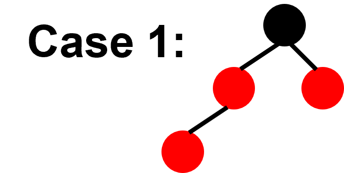{width="200"}
    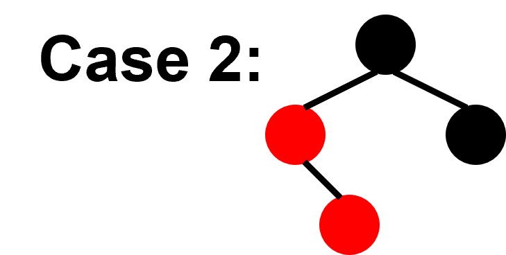{width="200"}
    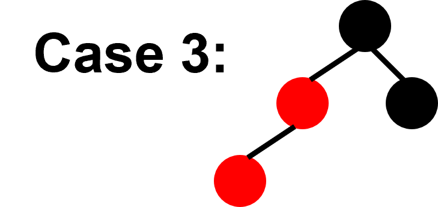{width="200"}
    === "Case1"
        对于Case1,我们先将其爷爷染成红色，再将其父亲和叔叔染成黑色。

        * tips:在Case1中，如果它的爷爷就是根节点，那么做完Case1的变换后，将根节点染黑。
        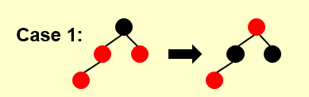
    === "Case2"
        对于Case2,我们对其所在的子树做一次RR旋转。  

        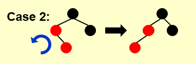
    === "Case3"
        对于Case3，我们先将其爷爷染成红色，再将其父亲染成黑色，然后再做一次LL旋转。  

        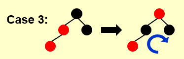  
        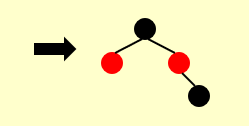
    
    镜像的情况(Symmetric)：
    === "Case1`"
        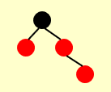
    === "Case2`"
        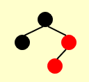
    === "Case3`"
        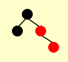
    !!! warning "注意"
        可能有人会说，Case1做完变换后不是会变成Case3第一步的变换嘛，那为什么不继续往下做呢？  
        我们要明白，做这些操作的目的是不断地**“向上”**而不是向下。因为实际上，我们一开始的讨论是从树的最底部开始，我们需要不断地向上，慢慢到根的部位来恢复红黑性质。下面我将举一个例子来更形象地进行说明。
    !!! example "一个例子🌰"
        一开始这棵红黑树是这样的： 

        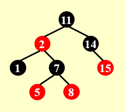  

        然后我们插入$4$：  

        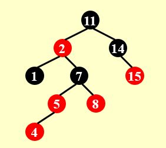

        好，接下来我们开始恢复它的红黑性！
        === "Step1"
            首先它满足Case1的情况（4、5、7、8这四个节点构成的子树）于是我们做一次Case1中的变换。得到下图。注意到，此时红色开始向上“渗透”（我自己取的称呼，因为我觉得红黑树的变换和堆的操作有异曲同工之妙）  

            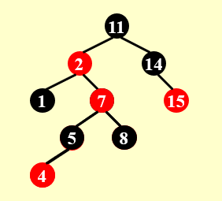
        === "Step2"
            然后进入了第二阶段，我们不再关注最下方的子树，转而关注往上一级的子树（2、7、11、14这四个节点构成的子树），它满足Case2的情况，于是我们按照Case2中的方式做一次变换。  

            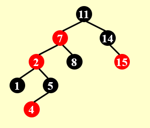
        === "Step3"
            最后一步，我们继续关注这棵子树（2、7、11、14这四个节点构成的子树），此时它满足了Case3的情况，于是我们按照Case3中的方式做一次变换。  

            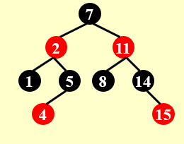

* [引用一下修佬的总结](https://note.isshikih.top/cour_note/D2CX_AdvancedDataStructure/Lec02/#%E6%8F%92%E5%85%A5)，我觉得他讲的特别清楚。在三个Case中，只有Case1的转换会让我们递归向上，而Case2向Case3的转换并不会改变我们关注的子树的范围。
>此处引用修佬画的一个状态机来更清晰地看一看他们之间地关系  
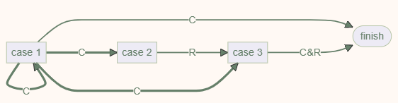  
状态机中的**粗线**表示转换过程中，我们关注的“子树”向上攀升了一级；而**细线**表示我们关注的子树仍然是这一层的那一棵。其中，`C`表示染色操作`R`表示旋转操作。  

其中，任何一个情况都可以作为一个初始情况。所以可以数出，到达 finish 的路径中，最多出现 2 次 Rotation（case 2 -> case 3 -> finish）。

### 1.4删除
下面将进入红黑树的重头戏之二：**删除**。   
同样地，我们先来想一下基本的逻辑。因为红黑树它首先是一棵二叉搜索树，因此它的删除和二叉搜索树的删除一样，首先需要分为度为0/度为1/度为2这三类。那么对于最简单的度为0这种情况（但其实在一会的讨论中你会发现度为1时是最简单的），我们要删除掉一个点，如果这个点是红色的，就不会影响黑高，但如果很不幸它是黑色的，我们就要做进一步的调整来恢复红黑性质。  
!!! abstract "目标"
    * 我们先来看看我们的目标是什么。我们需要维护红黑性质，但删除一个黑色节点显然会让它所在的子树的黑高减一，那么，如果我们能够通过**染色**和**旋转**将 $x$ 变为一个**额外**的黑色节点，那么我们就可以删除它了。  
    * 我们再来深入理解一下**额外**这个概念。我们根据性质5知道根节点到所有空叶节点（NIL）的黑高是相等的，也就是说，我们可以改变一些子树的位置，比如通过AVL树中的旋转，但保持除了 $x$ 所在的子树外所有的子树黑高不变，而使得 $x$ 所在的子树的黑高加了 $1$ 。这样我们就可以安心删除了 $x$ 了。  
    * 那为什么会出现**额外**的黑高呢？这是因为我们通过旋转，把其他的一些点（一般是 $x$ 的父亲）“下放”到了 $x$ 的树上，但对于原本的路径的黑高是不影响的，仅仅影响了 $x$ 所在树的黑高。（当然，在接下来的例子中你可能会看到，其他所有树的黑高减少 $1$ 而 $x$ 所在的子树黑高不变的情况，这样也是一种变相的黑高加 $1$ ） 
仅仅这么说一定是有些抽象的！但我们需要大概有一个概念，你可以先往下阅读，看看具体的实践是怎么做的，才回过头来看看我们的目标，或许就会恍然大悟了！  
下面将先介绍度为0时我们应该如何做（相信看懂插入后，应该对红黑树的分类有了一定感觉，下面的分类会更加的详细！）。

#### 1.4.1度为0
!!! tips "分类讨论"
    !!! warning "注意（有好多细节，老师上课应该有提到，但不整理回顾一下肯定是没印象的）"
        其中 $x$ 标志了我们要删除的节点**（注意这里我的用词是“标志了”，意味着 $x$ 并不一直是我们要删除的节点，它只是一开始作为要删除节点的标志，而后应该是作为黑高加 $1$ 的标志）**， $w$ 代表的节点是它的兄弟节点，空心节点代表可红可黑, $w$ 并不一定是度为0的节点（甚至我们一般认为它还有子树）。我们只讨论 $x$ 是黑色时的情况，因为根据上面的分析，当 $x$ 是红色时，我们直接删除就可以了。当然当然，我们这里依旧没有讨论镜像的模式，可以注意到我们讨论的四种情况， $x$ 均位于 $w$ 的左边。（建议大家在查看每一种Case是如何做变换前，先看一下各个Case的形态！） 
    === "Case1"
        Case1的情况是： $w$ 是红色的。因为 $w$ 是红色，根据性质4（红节点不能连续），所以这种情况的父亲一定是黑色的。

        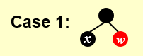  

        Case1的做法是：先将 $w$ 染成黑色，再将它的父亲染成红色，然后对这个部分进行一次RR旋转。我们可以看到，在结果中多出了一个节点（右下角），这个节点其实原本是 $w$ 的左子树，原图中并没有画出来。  

        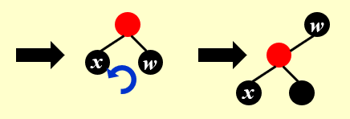{width="320"}  

        !!! warning "注意"
            此时并没有完全解决问题，因为对于 $x$ 所在的树，它的黑高并没有发生改变，没有达到我们想要的黑高加 $1$ 的效果。
    === "Case2"
        Case2的情况是:  $w$ 是黑色的，且 $w$ 的两个儿子都是黑色的。  
        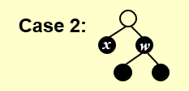

        我们先把 $w$ 染成红色，然后我们注意到，在Case2中又分了两种情况，我们一一来看:

        * Case2.1（ $x$ 的父亲是红色时）的做法是:很简单，我们只需要把它的父亲染成黑色，那么就实现了 $x$ 所在子树黑高加一的目标，同时我们发现右边的树尽管 $w$ 变红了，但由于 $w$ 的父亲（同时也是 $x$ 的父亲）变黑了，所以黑高没有变化！也就是我们造出了**额外**的黑高！此时直接删除 $x$ 即可。  
        * Case2.2（ $x$ 的父亲是黑色时）的做法是:将 $x$ 上移。此处虽然我们没有做任何实质的操作，但我们将让黑高加 $1$ 的这个目标任务向上传递了！你可以理解为你解决不了的任务就丢给上级去干吧！在接下来的实际例子中你会有更加深刻的理解的。

        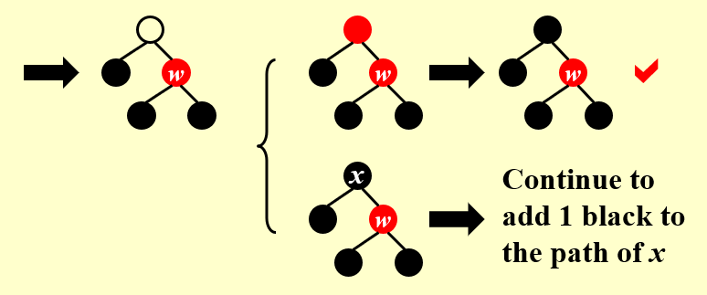{width="480"}
    === "Case3"
        Case3的情况是:  $w$ 是黑色的，且 $w$ 的左儿子都是黑色的。  

        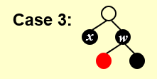

        Case3的做法是:我们将 $w$ 染红，将它的左儿子染黑，然后做一次LL旋转。同样，这里我们并没有完成任务，我们将任务推给了Case4。

        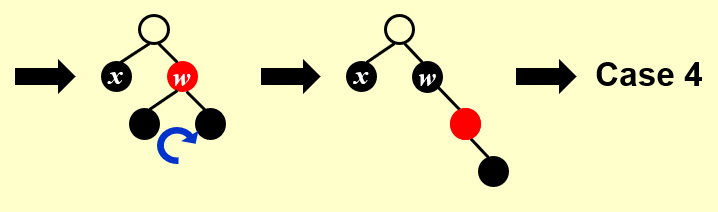{width="480"}
    === "Case4"
        Case4的情况是:  $w$ 是黑色的，且 $w$ 的右儿子都是黑色的。 我们注意到这里 $w$ 的左儿子是空心的，那是因为我们将 $w$ 的儿子都为红色的情况也归并到Case4中去讨论了。  

        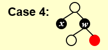

        Case4的做法是:我们将 $w$ 和 它的父亲换一个颜色，然后做一个RR旋转。注意到，这里 $x$ 所在的子树的黑高加 $1$ 了！而且其他的子树的黑高全都没有变！成功了！

        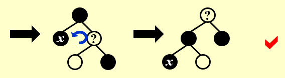{width="400"}
!!! example "一个例子🌰"
    === "Step0"
        一开始我们要删除的节点是3，我们用 $x$ 对它做一个初始标记。  

        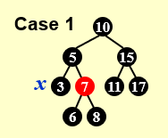
    === "Step1"
        为了看着方便，我在每一步都存下上一步的图片，方便比较。  
        我们对3、5、7构成的树做一次Case1中的变换，然后就变成了Case2.1中的情况。

         
        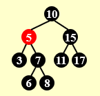{width="160"}
        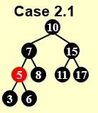
    === "Step2"
        我们对3、5、6构成的树做一次Case2.1中的变换，然后就可以直接删除3啦！接下来我们将要删除的节点是17。

        
        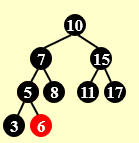{width="153"}
    === "Step3"
        我们发现11、15、17构成的树满足Case2.2（镜像的）的条件，于是我们做一次Case2.2对应的变换。做完变换后，我们发现 $x$ 的位置上移了，也就是任务推卸到上级啦！这时我们观察7、10、15构成的树，又满足了Case2.2（镜像的）的条件

        
        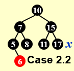
        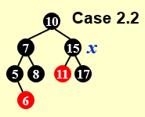
    === "Step4"
        我们对7、10、15构成的树做一次Case2.2对应的变换。此时，虽然我们并未实现黑高加 $1$ ，但是其他树的黑高都减少了 $1$ ，也就是变相地实现了黑高加 $1$ 的效果！接下来直接删除17即可。
 
        
        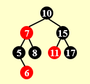
    === "Step5"
        在删除17后，我们希望删除8。这时5、6、7、8构成的树满足Case3（镜像的）的情况

        {width="165"}
        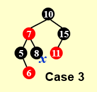
    === "Step6"
        我们对5、6、7、8构成的树做一次Case3对应的变换。然后就变成了Case4对应的情况。

        
        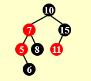{width="175"}
        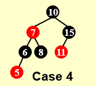{width="173"}
    === "Step7"
        我们对5、6、7、8构成的树做一次Case4对应的变换。然后 $x$ 所在的黑高成功地加 $1$ 了！接下来心安理得地删除节点8即可。

        
        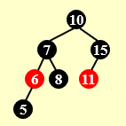
        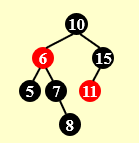
* 总结一下，我们发现只有Case2.1和Case4可以解决问题。而Case1和Case2.2是将问题向上级推卸，也就是会改变 $x$ 的位置，而Case3是将问题推给Case4但 $x$ 的位置不发生改变。

#### 1.4.2度为1
度为1的情况是最简单的，为什么呢？还记得我们说过的**结论2**吗？（如果忘了请翻上去看看）  
>一个度为1的节点，它本身一定是黑色的，且它唯一的孩子一定是红色的。
  
对于这种情况，我们只需要直接删除这个节点，然后把它的孩子放到它的位置，并把它的孩子从红色染成黑色即可！

#### 1.4.3度为2
对于度为2的情况，我们的核心思想是将其转换为度为1和度为0的情况进行处理。如何做呢？根据二叉搜索树删除度为2节点的方式，我们用右子树的最小值（或左子树的最大值）对其进行替换。**注意：这里只替换值，并不替换红黑性**。  
我们知道右子树的最小值（或左子树的最大值）最多只有一个孩子，否则它就不会是右子树的最小值（或左子树的最大值），因此接下来我们只要对这个替换后的节点进行删除操作即可。问题转换成了度为0/度为1的情况。
!!! success "可能存在的疑问"
    在一开始构想这个解决方法时，我想到了一个问题，就是替换后这棵树不再是BST（二叉搜素树）了，因为替换后的这个节点破坏了BST的性质，**那么接下来的用度为0/度为1的情况进行操作时，会不会导致其他部分的BST性质也遭到破坏呢**？这是一个很大的问题。接下来我会给出一个直观的，但严谨的证明。

    * 首先，对于度为0的情况，我们知道此处这个节点一定是叶节点了，而对于任何一棵二叉搜索树，任意抹去一个叶节点是不会影响它的性质的，所以我们可以对这个破坏者**“视而不见”**！而在接下去的旋转变换中，这个叶节点也将永远是叶节点，我们所有的Case中都保证了它永远是叶节点！也就是说，对于红黑性质维护时，我们也可以对它**“视而不见”**！尽管过程中它不再是一棵二叉搜索树，但当我们做完变换，对其进行最后一步删除操作后，它又摇身一变，变回了BST。
    * 其次，对于度为1的情况，接下来我们将直接对它进行删除，也就是BST失效的情况只存在了一瞬间，这并无大碍。

    问题完美解决！
| **Option**      | **AVL Tree** | **RB Tree** |
| ----------- | ----------- | ---------- |
| Insertion   | ≤2       | ≤2|
| Deletion   | $O(log N)$   | ≤3|

## 2.B+树

### 2.1定义
>B+ 树是一种用树状形式维护有序数列比较信息的数据结构，其增改操作拥相对于二叉树结构更加稳定的对数时间复杂度，通常用于数据库和操作系统的文件系统中。

!!! tips "M阶的 B+ 树"
    B+ 树其实可以理解为一个二叉搜索树的**升级版**，他为搜索内容提供了更大的便利性。  
    M 阶的 B+ 树是具有以下结构属性的树: 

    * 1.根要么是一片叶子，要么有 2 到 M 个孩子。
    * 2.所有非叶节点（根节点除外）都具有 $\lceil M/2 \rceil$ 到 $M$ 个的孩子。
    * 3.所有叶子的深度都相同。  
    
    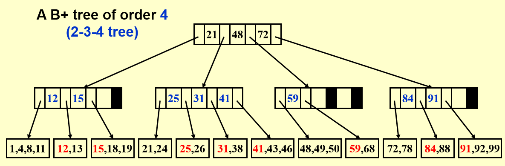  

    一般来说，我们会选择让 $M=3/4$ 这样做最有意义。对于常见的 $M$，比如一棵 $4$ 阶 B+ 树，我们也称之为一棵 2-3-4 树。对于 B+ 树，将它的叶子结点拼接起来，实际上就是一个有序数列。
    !!! warning "注意"
        尽管通过定义我们可以容易地得出一个节点最多存储 $M$ 个值,但实际上，**非叶节点**最多存储 $M-1$ 个值，因为若是一个非叶节点存储 $M$ 个值，它就能分出 $M+1$ 个区间，那么在插入的过程中就有可能出现 $M+1$ 个子树，这是与定义相悖的！

### 2.2操作（Find、Insert、Delete）
!!! tips "Find"
    和二叉搜索树的查找类似，跟每一级中的元素比较大小，然后向下一级对应的位置做搜索。

    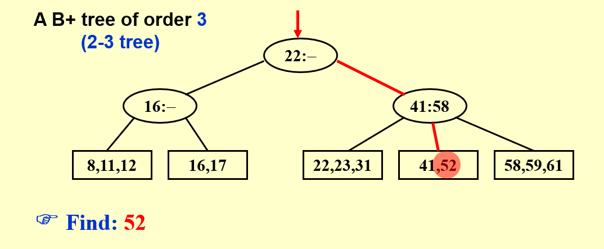

!!! tips "Insert"
     插入时，同样我们先做与二叉搜索插入类似的操作，通过Find找到需要插入的位置，然后在对该节点的数量进行判断，比如在这个例子中，一个节点最多存储 $3$ 个值，那么如果超出 $3$ 个时，就要进行分裂的操作，来保证 B+ 树的性质依然成立。  
    === "Step0"
        第一步我们需要插入18。

        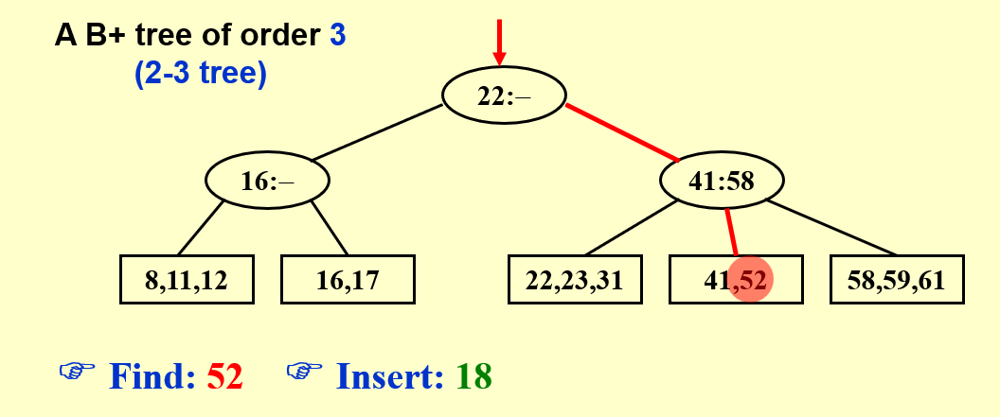
    === "Step1"
        我们通过Find，找到18应该插入的节点（原本只有16、17，数量＜ $3$），直接插入即可。

        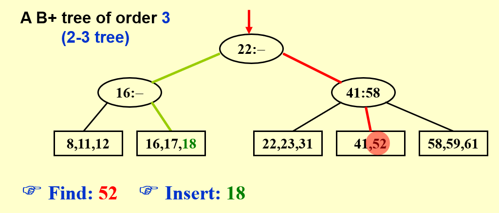
    === "Step2"
        第二步我们想插入1。但我们通过Find后发现要插入的地方已经有3个值了，那么再次插入就会超出上限 $3$ 。此时我们就需要进行分裂（Split）了。下一步我会先放上Split的通用方法，你可以结合下下一步的具体例子一起来看。

        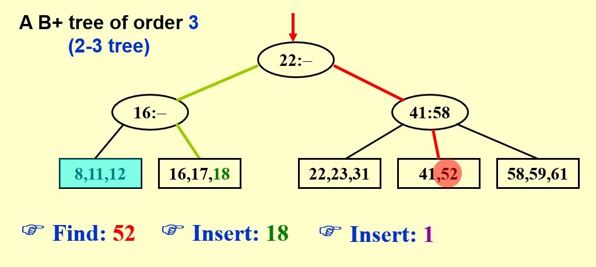
    === "Split"
        在分裂中，我们需要分为 $2$ 种情况：**叶子节点分裂**和**非叶节点分裂**（这里我们都用 $M=3$ 的 B+ 树进行讨论）。
        
        * 1.叶子节点分裂
    
        把左右两个变为子节点，把中间的传递上去。  

        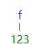
        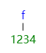
        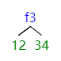

        * 2.非叶节点分裂
  
        把左右两个（可能只是节点也可能是子树）变为子节点，把中间的传递上去。  

        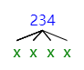
        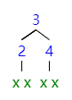
    === "Step3"
        这里我们根据分裂的规则，8、11、12所在的节点是叶子节点，需要向上分裂，于是我们把8、12变为子节点，然后把11传递到上方16所在的节点（此处打✔是因为16所在的节点还未充满，可以容纳下11）。

        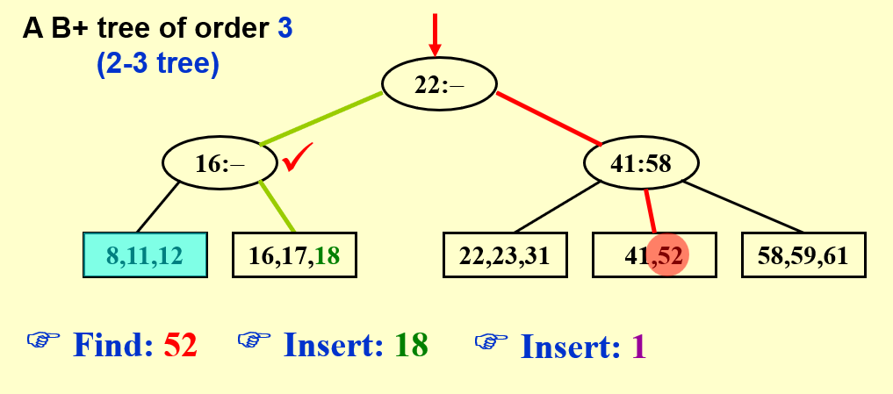  

        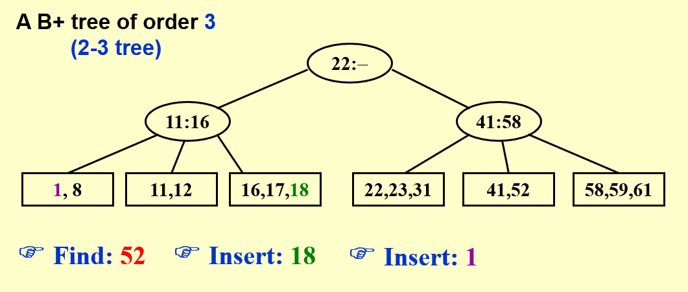

        需要注意的是，此时11、16所在的节点**已经被填满了**！因为**非叶节点**最多存储 $M-1$ 个值
    === "Step4"
        下一步我们要插入的是19。  

          
        
        注意到，此处19原本应该插入的节点已经被填充满了（16、17、18这 $3$ 个），而且这个节点的父亲也被填充满了（11、16这 $2$ 个）。因此我们要进行两次分裂，其实也就是不断向上迭代的分裂。

        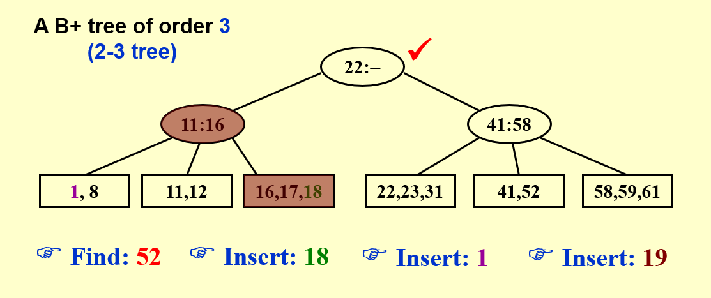
    === "Step5"
        这里直接给出了分裂后的结果，但希望你可以自己手动的操作一下，从底层开始，一点点向上分裂，作业的编程题也需要你彻底理解 B+ 树的分裂。   

          
    === "Step6"
        最后我们要插入的是28。可以看到这里连续3个节点都被充满了，甚至根也被充满了，但不要紧，我们只需要耐心的向上迭代就好啦！

        

        
    
    === "Step7"
        至此，我们已经把所有插入的情况想明白啦！其实无非是直接插入和插入时需要分裂，而分裂又分为两种，相比红黑树还是简单的。
        
        

!!! tips "Delete（此处存疑，希望回过头来可以再加确认）"
    删除的操作是和插入类似的，可以理解为插入的逆过程。我们知道，每进行一次分裂，B+ 树中就会多出一个重复的值，而在删除时，如果删除了一个值后，有两个节点可以合并，那么我们就可以将其通过插入的逆过程进行合并，同时将其父亲中“上提”的那个值重新“下放”（或者说直接删除，因为下方一定存在这个值）

    * 具体的例子可以将**插入**中的Step2和Step3倒过来看

    
!!! tip "复习时的一些补充"
    为了记忆红黑树的操作，写了一个口诀（非常不通顺，应该只有我自己能看懂）：

    * 插入：  
        三红我就染  
        两红逆就转  
        两红顺就染再转  
    * 删除：  
        我是红就直接删  
        红色兄弟向我转  
        
        黑色兄弟看侄子  
        侄子全黑看爸爸  
        先把侄子染个色  
        红爸爸变黑爸爸  
        黑爸爸提我自己  

        左侄是红向下换，换完颜色向右转  
        右侄是红向上换，换完颜色向左转  

