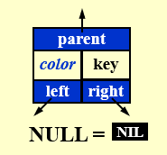

---

title: Chap 2 | “Red-Black Trees and B+ Trees”

hide:
  #  - navigation # 显示右
  #  - toc #显示左
  #  - footer
  #  - feedback  
comments: true  #默认不开启评论

---
<h1 id="欢迎">Chap 2 | “Red-Black Trees and B+ Trees”</h1>
!!! note "章节启示录"
    <!-- === "Tab 1" -->
        <!-- Markdown **content**. -->
    <!-- === "Tab 2"
        More Markdown **content**. -->
    本章节是ADS的第二章，经过上一周的笔记整理，对AVL树有了更加深刻的理解，这也加深了我继续将笔记写下去的决心。本章的内容是红黑树和B+树，其中红黑树的许多操作建立在AVL的旋转基础上，所以如果第一节课没有把旋转的操作掌握扎实的话，红黑树将更加云里雾里。红黑树的重点在于插入和删除，其中涉及了诸多分类讨论，我将尽我所能尝试把分类的情况讲清楚。而B+树的部分相对简单，不过有许多细节需要注意，相信在做完HW2的编程题后将感触颇深！

## 1.红黑树

### 1.1定义
!!! note ""
    红黑树是一颗二叉搜索树，唯一的不同是，每个节点额外存储了一个 $color$ 字段（红/黑），用来确保树在插入和删除时保持平衡。（也就是说，红黑树通过增加每个节点的颜色字段为我们搜索数据提供的速度和时间上的便利。在学习后你会发现，这简单的红黑属性，竟能降低许多操作的时间复杂度）
### 1.2性质
当然，我们不能只是简单地设定这样的一个颜色字段，它们需要满足如下的性质，才可称之为红黑树。  
!!! tips "性质"
    * 1.每一个节点都是红色或黑色的。  
    * 2.根节点是黑色的。（在某些版本中或许存在“松弛”红黑树这一说法，此时根不一定是黑的，但此处我们认为根必须为黑色）
    * 3.每一个空叶节点（我取的名字）是黑色的。我们称之为NIL节点（官方名字）。  
    
    * 4.如果一个节点是红色的，那么它的孩子都是黑色的。
    * 5.从根节点到 NIL 节点的每条路径上的黑色节点数量相同（这条路径也被称为黑高）  

    **不难发现，性质123是显然的，我们需要重点关注的是性质45。**
!!! question "一个简单的提问"
    === "题目"
        请判断以下这棵树是不是红黑树。  
        
    === "答案"
        16号节点的右儿子是一个黑叶子，而这个叶子到根的路径上只有 3 个黑节点，而其他叶子到根都有 4 个黑节点。（注意图中并没有标出NIL节点，但我们心中要有数）  
        
!!! abstract "一些思考和结论"
    !!! success "结论1"
        **1.红黑树不存在只有一个非叶子节点的红色节点。**  
        它的证明也很简单，因为如果一个红色节点只有一个孩子，那么这个孩子不能是红色的（根据性质4），那么这个孩子只能是黑色的，由于这个黑色的孩子还有一个空叶节点（NIL）所以这个孩子所在的子树的黑高会比另外一边多一，那么就与性质5矛盾了！
    !!! success "结论2"
        **2.一个度为1的节点，它本身一定是黑色的，且它唯一的孩子一定是红色的。**  
        由结论1可知不存在度为1的红色节点，因此度为1的节点本身一定是黑色。那么如果它的孩子是黑色，那与结论1中的分析类似，它的两棵子树的黑高并不相等。所以它的孩子一定是红色。  
        也就是说，在红黑树中，度为1的节点的存在条件是最苛刻的（相比度为0和度为2的节点）！
    !!! success "结论3"
        **3.一个有 $N$ 个内部节点（不包括NIL）的红黑树，其最大高度为 $2log_2(N+1)$。**  
        证明这个结论之前，我们需要先证明两个小结论。  
        ① $N≥2^{bh}-1$  
        ② $bh(tree)≥h(tree)/2$  
        其中结论①需要用到归纳法：  
          
        结论②可以从直观上理解：  
        在一棵红黑树中，因为对红节点的限制较多，因此红节点的数量一定小于等于黑节点的数量，因此结论成立。  
        有了这两个结论，我们就可以根据不等式的传递性得到结论3了。
## 1.3插入
下面将进入红黑树的重头戏之一：**插入**。  
在具体介绍之前，我们先来想一想插入的基本逻辑是怎么样的。我们知道，插入后的黑高极有可能改变，导致原有的红黑性质遭到破坏，那么我们就需要想一种合理的办法，将这种破坏消除掉，就是使得插入并不影响黑高！而在红黑树中，红节点不会影响黑高，所以自然而然我们会想到，把插入的节点染成红色。那么接下来问题就来了，根据性质4，如果插入的节点的父亲也是一个红节点，就又破坏了红黑性质（若它的父亲是黑节点，那么皆大欢喜），所以我们接下来要做的，就是通过一些基本的变换，修复这棵被破坏的红黑树！  
  
接下来，我们将利用两个最基本也是唯二的方法进行变换：

* **染色**和**旋转**。  请大家牢牢记住这两个方式！

那么下面，分类开始！

!!! tips "分类讨论"
    其中，第三层的红色节点为我们插入的节点。（下文中的图片仅仅将插入节点附近的节点进行了讨论，实际上我们也只需要关注它的父亲和叔叔节点，因为树是很具有迭代向上的性质的）  
    注意到我们只分了三种情况（但实际有六种，他们的**镜像**在此处就不详细列举了，长什么样子我放在了下面，大家可以对照来看）  

    {width="200"}
    {width="200"}
    {width="200"}
    === "Case1"
        对于Case1,我们先将其爷爷染成红色，再将其父亲和叔叔染成黑色。

        * tips:在Case1中，如果它的爷爷就是根节点，那么做完Case1的变换后，将根节点染黑。
        
    === "Case2"
        对于Case2,我们对其所在的子树做一次RR旋转。  

        
    === "Case3"
        对于Case3，我们先将其爷爷染成红色，再将其父亲染成黑色，然后再做一次LL旋转。  

          
        
    
    镜像的情况(Symmetric)：
    === "Case1`"
        
    === "Case2`"
        
    === "Case3`"
        
    !!! warning "注意"
        可能有人会说，Case1做完变换后不是会变成Case3第一步的变换嘛，那为什么不继续往下做呢？  
        我们要明白，做这些操作的目的是不断地**“向上”**而不是向下。因为实际上，我们一开始的讨论是从树的最底部开始，我们需要不断地向上，慢慢到根的部位来恢复红黑性质。下面我将举一个例子来更形象地进行说明。
    !!! example "一个例子🌰"
        一开始这棵红黑树是这样的： 

          

        然后我们插入$4$：  

        

        好，接下来我们开始恢复它的红黑性！
        === "Step1"
            首先它满足Case1的情况（4、5、7、8这四个节点构成的子树）于是我们做一次Case1中的变换。得到下图。注意到，此时红色开始向上“渗透”（我自己取的称呼，因为我觉得红黑树的变换和堆的操作有异曲同工之妙）  

            
        === "Step2"
            然后进入了第二阶段，我们不再关注最下方的子树，转而关注往上一级的子树（2、7、11、14这四个节点构成的子树），它满足Case2的情况，于是我们按照Case2中的方式做一次变换。  

            
        === "Step3"
            最后一步，我们继续关注这棵子树（2、7、11、14这四个节点构成的子树），此时它满足了Case3的情况，于是我们按照Case3中的方式做一次变换。  

            

* [引用一下修佬的总结](https://note.isshikih.top/cour_note/D2CX_AdvancedDataStructure/Lec02/#%E6%8F%92%E5%85%A5)，我觉得他讲的特别清楚。在三个Case中，只有Case1的转换会让我们递归向上，而Case2向Case3的转换并不会改变我们关注的子树的范围。
>此处引用修佬画的一个状态机来更清晰地看一看他们之间地关系  
  
状态机中的**粗线**表示转换过程中，我们关注的“子树”向上攀升了一级；而**细线**表示我们关注的子树仍然是这一层的那一棵。其中，`C`表示染色操作`R`表示旋转操作。  

其中，任何一个情况都可以作为一个初始情况。所以可以数出，到达 finish 的路径中，最多出现 2 次 Rotation（case 2 -> case 3 -> finish）。
## 1.4删除

