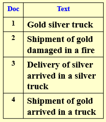
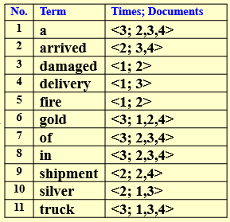
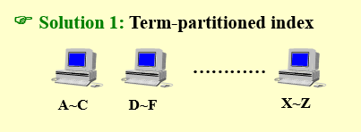
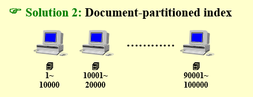
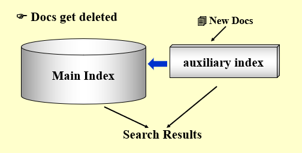
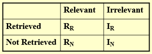
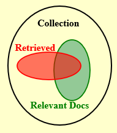
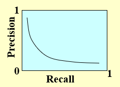
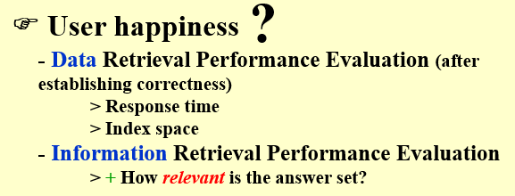
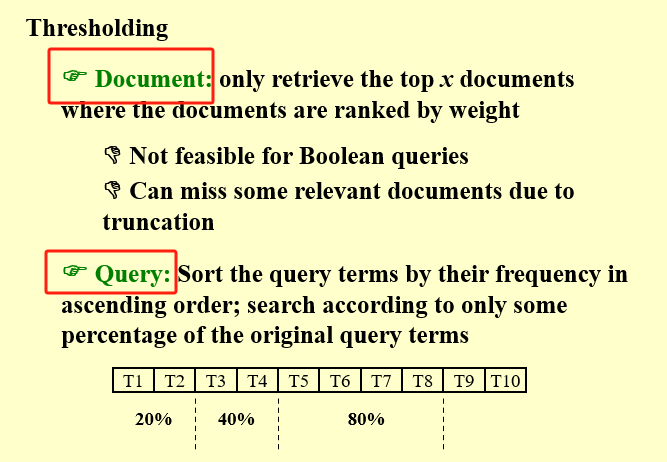

---

title: Chap 3 | “Inverted File Index”

hide:
  #  - navigation # 显示右
  #  - toc #显示左
  #  - footer
  #  - feedback  
comments: true  #默认不开启评论

---
<h1 id="欢迎">Chap 3 | “Inverted File Index”</h1>
!!! note "章节启示录"
    本章节没有较难的内容，是“倒排索引”的介绍，涉及到的算法内容不多，以一些思路和概念为主。

## 1.倒排索引

### 1.1何为倒排索引
在介绍倒排索引之前，我们不妨看看正向的索引是怎么样的。  
**正向索引：**当用户发起查询时（假设查询为一个关键词），搜索引擎会扫描索引库中的所有文档，找出所有包含关键词的文档，这样依次从文档中去查找是否含有关键词的方法叫做正向索引。但是这样就产生了很大的问题，互联网上包含这样那样的关键词的页面数不胜数，遍历搜索的效率将极其低下，无法满足用户的需求。    

 
于是我们就开始思考如何加快索引的速度，倒排索引应运而生。倒排索引就是对于每一个单词，我们都记录它出现的位置（在哪个文件中），并将这些位置做成一串指针。

!!! example "一个例子🌰"
    如下图所示，左边是文本集，右边则是倒排索引  

    
    {width="265"}

### 1.2一些改进
但仅仅如此，我们还不满意，课程中介绍了以下两个可以改进的地方（实际上应该有很多可以改进，而且应该有针对某一方面性能提升的“专用”搜索引擎）。 

*  1.Word Stemming（词干分析）：只留下一个单词的词干或词根形式。比如我们将`process`,`processing`,`processes`,`processed`这几个词都转换为`process`；还比如我们将`says`,`said`,`saying`这几个词都转换为`say`。类似的操作还有很多，但它的实现比较的暴力，就是堆case，判条件emmm……所以HW3的编程题如果不使用特定的库的话，还是非常折磨的……
*  2.Stop Words（停用词）：有些词汇它的出镜率太高了！比如`a`,`the`,`it`，他们太想要表现自己了，但我们不喜欢太张扬的孩子，他们对实际的索引不起作用，因此我们把他们叫做停用词。对于停用词，我们就不需要存储啦。

 

### 1.3查找方式
我们目前已知的比较常见且好用的查找有如下**两种**：  

* 1.Search trees( B- trees, B+ trees, Tries, ... )
* 2.Hashing

我们可以对这两种方式做一个对比，看看它们的优缺点（这是一个上课的思考题，以下是我们组讨论的结果）：  
我们以Hash作为视角，以下的优缺点指的是Hash相对于Search tree而言。当然，对于Search tree 以下将是相反的

| **优点** | **缺点** |
|----------- | ---------- |
|一般来说（频繁地插入、删除和查找，并且数据量较大）效率更高|搜索成本较高 |
|冲突解决方式（结构）灵活可变，可根据具体情况具体选择| 无序，查找最大值最小值不方便|

 

### 1.4存储方式
对于索引的存储也是很重要的（比如历史记录），提前存储也可以加快数据的搜索速度。此处也介绍**两种**存储方式：

* 1.Distributed indexing（分布式）：顾名思义，我们将数据“分块”地存储在不同的地方。因此选择如何分块就比较重要了。  
  **字典序**：按照字母顺序进行分块。"A~C" "D~F" ……   
    
  **文档序**：按照文档序列进行分块。"1~10000" "10001~20000" ……    
  
* 2.Dynamic indexing（动态）：我们将一块区域作为主存（用来存储比较稳定、比较频繁被利用的数据），而对于每小时每天新加入的数据，我们将其放在auxiliary index（辅助存储）中，之后再考虑其中数据的使用频率，将其适时更新到主存中。  

### 1.5评估标准
我们需要制定一个评估标准对搜索引擎的效果进行判定。
!!! tips "相关性测量"
    相关性测量需要考虑以下三个要素：  

    * 1.基准文档集合  
    * 2.基准查询集  
    * 3.对于每个查询-文档对,进行相关或不相关的二元评估
有了以上的条件，我们可以将一次搜索后的信息分为以下四类：相关的且搜索到的、相关的但未搜索到的、不相关的但搜索到的、不相关的且未搜索到的。  

如果用维恩图表示它们之间的关系，将是这个样子：  

!!! abstract "指标"
    * 1.$Precision$（准确率）： $P=R_R/(R_R+I_R)$  
    **准确率**表示在搜索到的信息中，相关的（用户想要的）信息的占比。 
    * 2.$Recall$（召回率）：$R=R_R/(R_R+R_N)$   
    **召回率**表示在相关的（用户想要的）信息中，搜索到的占比。  

我们注意到，这两个指标都是$\lt1$的。最理想的情况当然是这两个值都趋近于$1$，但这显示是很难做到的，为此在实际应用中我们需要做一些trade-off，看看在什么情况下提高准确率，在什么情况下提高召回率。  

>例如：在机场安检查询旅客有无携带违禁物品时，召回率显然要比准确率更加重要，因为我们需要尽可能多的知道携带违禁物品的人，而并不在乎我们寻找的人中违禁者的比例。

!!! tip "复习时的一些补充"
    有一个很大的坑（~~文字游戏英文版~~）

    

    * Data Retrieval Performance Evaluation :是确定正确性后的评估标准。  
        1.Response time  
        2.Index space  
    * Information Retrieval Performance Evaluation：  
        How relevant is the answer set?也就是利用上文提到的两个评估标准（准确率和召回率）。

    >所以这道题是错的。
    When evaluating the performance of data retrieval, it is important to measure the relevancy of the answer set. F

    * Word stemming is to eliminate the commonly used words from the original documents.F

    * Thresholding
    
    