---

title: Chap 4 | “Leftist Heaps and Skew Heaps”

hide:
  #  - navigation # 显示右
  #  - toc #显示左
  #  - footer
  #  - feedback  
comments: true  #默认不开启评论

---
<h1 id="欢迎">Chap 4 | “Leftist Heaps and Skew Heaps”</h1>
!!! note "章节启示录"
    本章介绍了左式堆和斜堆，难度上不算太大，要注意区分左式堆和斜堆的实现以及变换过程，还有就是要小心NPL的大小的计算，这个会在后续具体讨论中出现，请见下文。

## 1.左式堆
与前面红黑树以及AVL树不同的是，我们此处不先介绍定义，因为定义中有一些概念需要提前说清楚，我们从为什么要发明左式堆说起，或者说左式堆的目标是什么。
!!! abstract "Target"
    **Speed up merging in O(N).即加速merge操作，使其时间复杂度降为 $O(N)$ 。**  
    那么，这个目标是怎么来的呢？我们来思考这样一个问题：如果我们只使用原始堆结构，可以以多快的速度合并两个堆？

    * 1.我们可以将较小堆（M个）的元素一一插入到较大堆（N个）中，这样产生的复杂度为 $O(MlogN)$ 。注意，实际上要大于 $O(MlogN)$ ，因为随着插入，$N$会随之增大。
    * 2.我们可以将两个堆的元素全都取出然后重新建堆，这样的时间复杂度与建堆的时间复杂度一样，为 $O(M+N)$。但这样会带来一些额外的空间开销，面对大数据时或许不是一个较好的选择。

### 1.1定义
* 1.null path length（Npl）：任何节点 $X$ 的空路径长度 Npl（$X$） 是从 $X$ 到没有两个孩子的节点的最短路径的长度。  
**note**：$Npl(X) = min \{Npl(C)+1 \  for \ all \  C \ as \ children \ of \  X\}$。
* 2.左式堆：对于堆中的每个节点 X，左子节点的 null 路径长度至少与右子节点的 null 路径长度一样大。即对任何一个节点，它的左孩子的Npl值都要大于等于右孩子的Npl的值。
!!! example "两个例子🌰"
    === "Example1"
        === "题面"
            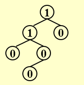
        === "答案"
            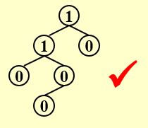
    === "Example2"
        === "题面"
            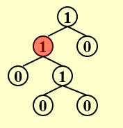
        === "答案"
            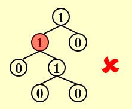

!!! success "一个结论📜"
    **在右路径上有 r 个节点的左式堆必须至少有 2r – 1 个节点。**  
<hr></hr>

### 1.2插入
我们可以借此思考一个问题，左式堆的右树较少，为 $O(logN)$ 级别，这对我们实现“插入/融合”操作有什么好处呢？我们可以这样去想，如果我们将较小堆Merge到较大堆的右树上，时间复杂度一下就降下去了，因为节点数是 $O(logN)$ 级别的，之后若是不经意间破坏了左堆的性质，我们只需要做一次左右子树的交换即可。这是我们大致的想法。

!!! tips "插入过程"
    我们直接通过一个具体的例子来看一看。（我的建议是可以先看迭代版本，可以先有一个直观的理解，同样地做题也更加方便）  

    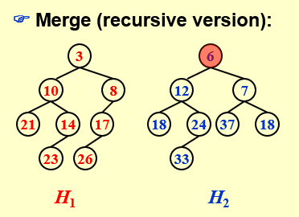{width="300"}
    &nbsp;&nbsp;&nbsp;&nbsp;
    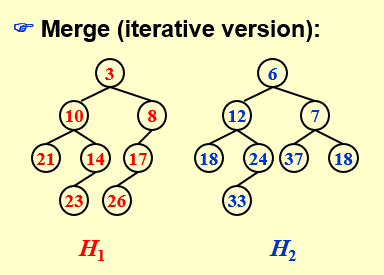{width="300"}
    === "递归版本"
        递归版本在程序上较好实现，但理解起来可能有些困难，不算太直观，但逻辑是清晰的。这个版本因为老师上课也没有给出动画形式，而作者最近事情有点多，没时间做动画了，大家可以看一下修佬做的步骤，非常的清晰和详细。  
        [（附一个链接）](https://note.isshikih.top/cour_note/D2CX_AdvancedDataStructure/Lec04/#%E9%80%92%E5%BD%92%E5%BC%8F)
    
        * **Step1**:将 $H1$ 的右子树与 $H2$ 融合，这个融合的函数实际上是一个递归的函数，并不是一步实现的，是一步一步推下去的。
  
        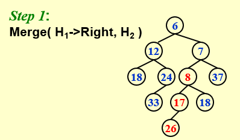  
      
        * **Step2**:这只是一步简单的连接操作了，将Merge过的右子树重新连回原来的树中。    

        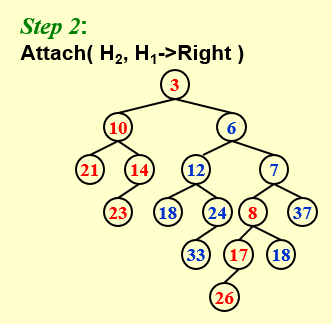 

        * **Step3**:如果不满足左式堆的性质（比如Step2的结果），我们就对左右两棵子树做一个交换。因为左边的树我们没有动过，而右边的树我们在递归的过程中保证了它是一个左式堆，即所有节点的左孩子的Npl值都大于等于右孩子的Npl值，因此交换后将满足左式堆的性质。  

    
        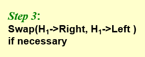  

        * 代码实现：
        这里的递归与传统意义上单个函数的递归并不一样，它采用了两个函数进行交叉递归的方式。  
        ```C 
        struct TreeNode   {   
            ElementType	    Element;  
            PriorityQueue	Left;  
            PriorityQueue	Right;  
            int		        Npl;  
        } ;/*结构体定义*/
        PriorityQueue  Merge ( PriorityQueue H1, PriorityQueue H2 ){ 
            if ( H1 == NULL )   return H2;	
            if ( H2 == NULL )   return H1;	
            if ( H1->Element < H2->Element )  return Merge1( H1, H2 );
            else return Merge1( H2, H1 );
        }
        static PriorityQueue Merge1( PriorityQueue H1, PriorityQueue H2 ){ 
            if ( H1->Left == NULL ) 	/* single node */
                H1->Left = H2;	/* H1->Right is already NULL 
                            and H1->Npl is already 0 */
            else {
                H1->Right = Merge( H1->Right, H2 );     /* Step 1 & 2 */
                if ( H1->Left->Npl < H1->Right->Npl )
                    SwapChildren( H1 );	/* Step 3 */
                H1->Npl = H1->Right->Npl + 1;
            } /* end else */
            return H1;
        }
        ```
    === "迭代版本"
        * **Step1**首先比较两棵树根节点的大小，将根节点较大的树插入到另一棵树中。所有树的左子树都不管，只对右子树进行排序。  
        === "Step1.1"
            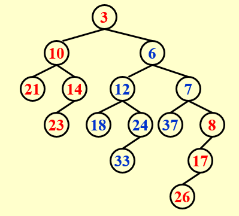{width="300"}  
        === "Step1.2"
            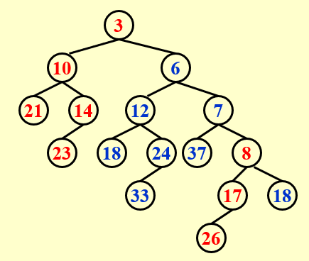{width="300"} 

        * **Step2** 如果一棵树的左子树和右子树不满足左式堆的性质，则对它们进行一次交换。
        === "Step2.1"
            如图，在目前的结果中，节点 $3$ 和 $7$ 不满足要求，那么我们就需要将它们的孩子进行左右交换，当然先换 $3$ 还是先换 $7$ 并不影响最终的结果。 

            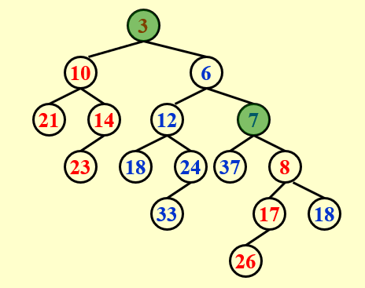
        === "Step2.2"
            圆满完成！  

            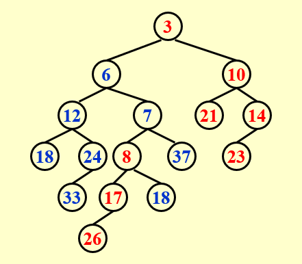
!!! tips "DeleteMin"
    * **Step1**:Delete the root
    * **Step2**:Merge the two subtrees  
    $T_p=O(logN)$

## 2.斜堆
### 2.1定义与插入
同样地，我们来看一下创建斜堆的目标是什么。在左式堆中，我们需要自下而上地维护Npl的值，几乎每做一次Merge我都需要进行更新，就像AVL树我们需要更新BF值一样。在Chap01中，我们学习了Splay Tree作为AVL Tree的放松版本，而在本章中，斜堆则是一个比左式堆更一般的数据结构，尽管它丧失了左式堆严格的性质，但换来了便捷性。  
同时，在斜堆中，我们实现这样一个目标：**任何 $M$ 个连续操作最多需要 $O(MlogN)$ 时间。** 
!!! tips "斜堆的Merge"
    插入后（前）始终交换左边和右边的子节点，但右边路径上所有节点中最大的节点没有交换其子节点。（到底是在插入前还是插入后进行交换，这并不影响最后的结果，看你如何理解，我们通过一个例子更加直观地感受一下）

    * 例子：注意到这里 $H2$ 的根节点值较大，因此我们需要将 $H2$ 插入到 $H1$ 中。按照之前左式堆的插入方式，我们将 $H2$ 插入到右边，同时进行排序，并把其左子树原封不动的带回来。但区别是，我们现在并不等待所有插入都结束再进行判断是否交换，**我们每一次插入都需要进行交换**！
  
    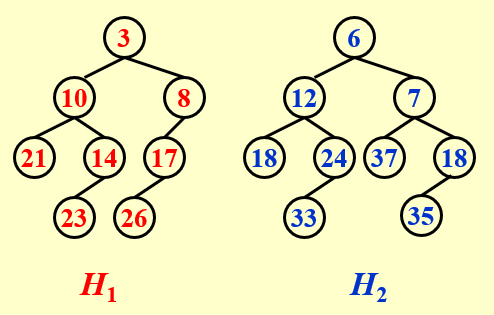{width="300"}
    === "Step1"
        既然每一次插入都需要交换，我们这里就以插入前交换为例，将 $H1$ 的左右子树交换。当然，这里因为节点 $8$ 比 $H2$ 的根节点 $6$ 要小，所以需要给节点 $6$ 让位。注意到，原本 $6$ 的左子树已经变成了右子树，我们这里已经提前为下一次插入做好了交换。  

        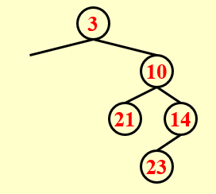
        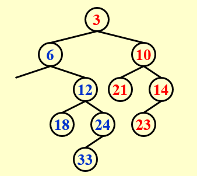{width="270"}
    === "Step2"
        接下来我们原本的节点 $8$ 依旧需要给节点 $7$ 让位。随后我们做了一次交换，将 $7$ 的左孩子放到了右孩子的位置，为下一步插入做准备。

        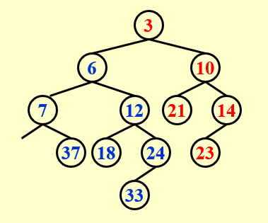{width="270"}
    === "Step3"
        接下来我们原本的节点 $8$ 插入到对应的位置上，同时再做一次交换！  

        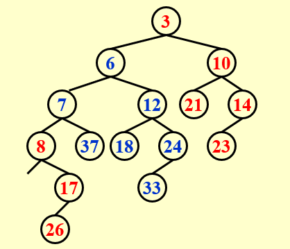{width="270"}
    === "Step4"
        然后我们将由 $7$ 交换得来的（Step2）最开始属于 $7$ 的右孩子（后由交换变成了 $7$ 的左孩子，但因为比 $8$ 大，所以它还在排队）的 $18$ 放入到空的位置，然后就大功告成了！  

        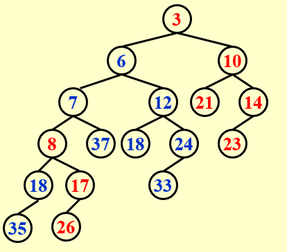{width="270"}
自然地，我们可以想到斜堆的插入就是把那个要插入的节点看成另外一个斜堆，然后两个斜堆做Merge即可。

* 总结一下，斜堆的优点是不需要额外的空间来保持路径长度，并且不需要通过测试来确定何时交换子树。
<hr></hr>

### 2.2斜堆的摊还分析
还记得我们斜堆的目标吗？
>**任何 $M$ 个连续操作最多需要 $O(MlogN)$ 时间。**   

此处，我们先给出结论：$T_{amortized}=O(logN)$
我们下面将使用**势能法**进行分析，在势能法中，较难的是选择一个合适的势能函数。  
!!! abstract "势能函数"
    $\Phi(D_i)=number \ of \ heavy \ nodes$ 

    * heavy nodes:  如果 $p$ 的右子树的节点数至少是 $p$ 节点数的一半，则节点 $p$ 为heavy node。注意，节点数包括节点本身。简单来说，右子树节点数多于左子树的为heavy node，少于或等于左子树的为light node。
    
    根据heavy node的定义，我们有以下三个性质： 

    * 1.如果一个节点是 heavy node，并且在其右子树发生了合并（包括翻转），那么它**一定**变为一个 light node；  
    * 2.如果一个节点是 light node，并且在其右子树发生了合并（包括翻转），那么它**可能**变为一个 heavy node；
    这里的**可能**将会使得下面的分析中出现不等式（式3）。  
    * 3.合并过程中，如果一个节点的 heavy/light 发生变化，那么它**原先**一定在堆的最右侧路径上；
下列式子中：$l_i$为light节点数，$h_i$为heavy节点数。由此可以得到最差的情况为左右的轻重节点全部交换。$h$ 为非右路径上的heavy node（不会发生改变）。
$$
H_i=l_i+h_i \Longrightarrow T_{worst}=l_1+h_1+l_2+h_2 
$$

$$
Before\  merge: \Phi_i=h_1+h_2+h
$$

$$
After\  merge: \Phi_{i+1}≤l_1+l_2+h
$$

$$
T_{amortized}=T_{worst}+\Phi_{i+1}-\Phi_{i}≤2（l_1+l_2）
$$

而我们知道 $l=O(logN)$ ，所以$T_{amortized}=O(logN)$
<hr></hr>