---

title: Chap 5 | “Binomial Queue”

hide:
  #  - navigation # 显示右
  #  - toc #显示左
  #  - footer
  #  - feedback  
comments: true  #默认不开启评论

---
<h1 id="欢迎">Chap 5 | “Binomial Queue”</h1>
!!! note "章节启示录"
    本章介绍了二项树和二项队列，或许还要自学一下斐波那契堆。对于二项队列而言，它可以弥补二叉堆的不足: $merge$ 操作的时间复杂度为 $O(N)$ 。二项队列的 $merge$ 操作的最坏时间复杂度为 $O(logN)$ 。

## 1.定义
同样地，在这里我们也想先了解二项队列的作用和意义。  
我们知道，二叉堆的 $merge$ 时间复杂度为 $O(N)$ ,但我们想把这个复杂度降下来，降到 $O(logN)$ ，于是有了二项队列。

!!! tips "思考"
    二项队列的名字由来是什么呢？二项？什么地方会出现二项？二项式定理、二进制！不妨思考一下二项队列与二进制的联系，非常的巧妙与神奇。

* 二项树：高度为 0 的二项式树是单节点树。高度为 $k$ 的二项式树 $B_k$ 是通过将二项式树 $B_{k-1}$ 附加到另一个二项式树 $B_{k-1}$ 的根而形成的。要注意的是：二项树同时是一个堆，它应该具备小根堆（大根堆）的性质。  
* 性质：二项树的节点个数等于它的名称下标（如 $B_3$ 的子节点个数为 $3$ ）,且它的子树一定是一系列二项树（如 $B_3$ 的子树为 $B_0,B_1,B_2$ ）。

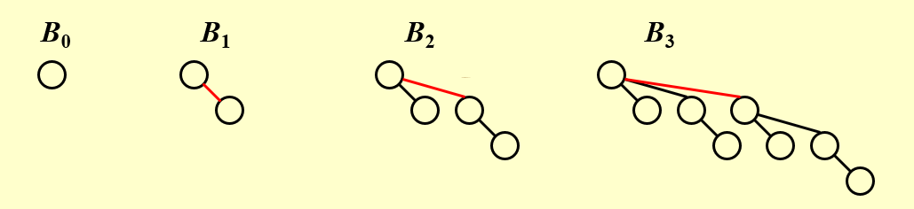

* 二项队列：二项队列是二项树的集合。  
* 性质：一个二项队列中，**不会存在两个形式上一样的二项树**（即不会出现两个形如 $B_0$ 这样的二项树），它们将会被合并成新的二项树，类似于二进制中的进位！  


还记得我们说的二项队列与二进制之间的联系吗？其实每一个二项队列都可以被特定地表示成一个二进制数，我们来看下面的例子。
!!! example "例子🌰"
    === "Example1"
        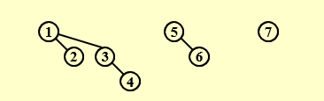  

        可以看到图中从左自右依次是：$B_2,B_1,B_0$  
        那么这个二项队列表示的数字就是：$\large(111)_{2}=2^2+2^1+2^0=(7)_{10}$
    === "Example2"
        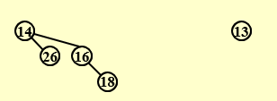

        可以看到图中从左自右依次是：$B_2,B_0$
        那么这个二项队列表示的数字就是：$\large(101)_{2}=2^2+2^0=(5)_{10}$
    * 我们可以发现，这个数字恰好是节点的个数。
## 2.操作
### 2.1 FindMin
因为二项队列实际上是堆的集合，所以根据堆的性质，最小值位于其中一个根中。对于任意 $n$ 个节点，它们最多可以划分成 $\lceil logN \rceil$ 个二项树，因此FindMin的时间复杂度为 $T_p=O(logN)$
!!! abstract "Note:"
    我们可以记住最小值，并在更改时进行更新。 然后这个操作将只需要 $O(1)$。

### 2.2 Merge
对于Merge操作我想直接借助一个例子来展示，请尤其注意Merge的操作其实和二进制的加法有异曲同工之妙。

!!! example "例子🌰"
    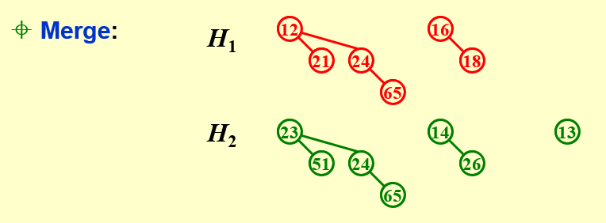{width="450"}
    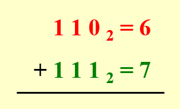{width="200"}

    * 注意到 $H_1$ 代表的是 $(110)_2=(6)_{10}$,$H_2$ 代表的是 $(111)_2=(7)_{10}$。
    
    === "Step1"
        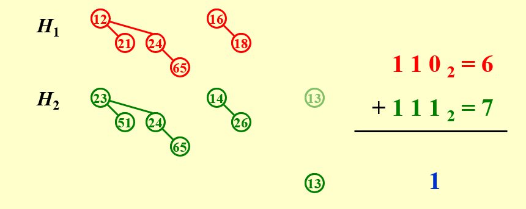  

        先从 $B_0$ 开始，只有 $H_2$ 有 $B_0$ ，直接拿下来，相当于加法中最末位的 $0+1=1$。
    === "Step2"
        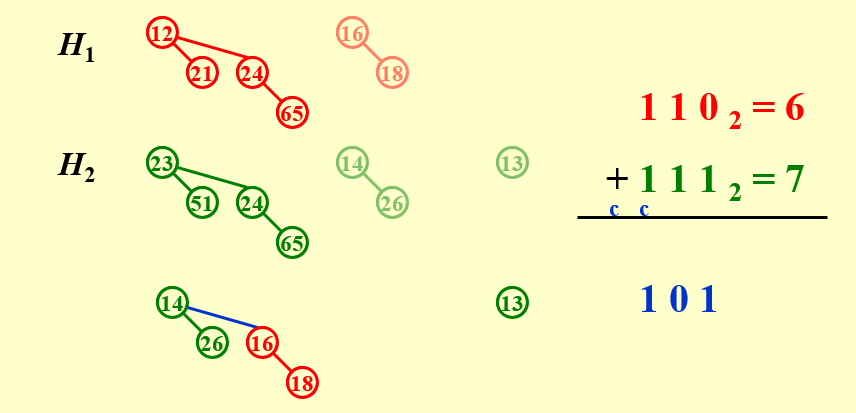
    === "Step3"
        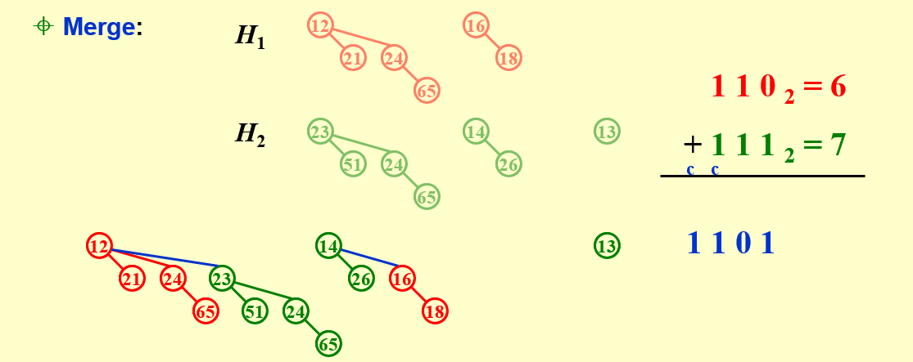

### 2.3 Insert
和左堆的插入一样，这里的插入也是Merge的一种特殊形式。
如果最小的不存在的二项式树是 $B_i$ ,那么 $T_p=Const*(i+1)$。  
在初始空的二项式队列上执行 N 个插入将花费 O（N） 个最坏情况的时间。 因此，平均时间是恒定的。
### 2.4 DeleteMin
* Step1:FindMin in $B_k$ 。
* Step2:Remove $B_k$ from $H$ ,形成 $H^{\prime}$ 。
* Step3:Remove root from $B_k$ ,形成 $H^{\prime\prime}$ 。
* Step4:Merge $(H^{\prime},H^{\prime\prime})$

!!! example "一个例子🌰"
    === "Step 1"
        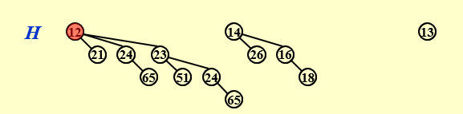
    === "Step 2"
        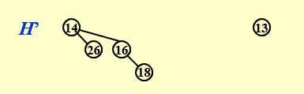
    === "Step 3"
        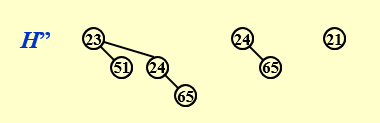
    === "Step 4"
        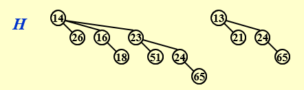
## 3.实现
二项队列的实现我们可以参考将任意树转化为二叉树的步骤。  
即：将每个节点的左孩子指向他的兄弟节点形成链表。
```C
struct BinNode 
{ 
    ElementType	    Element;
    Position	    LeftChild;
    Position 	    NextSibling;
} ;
```
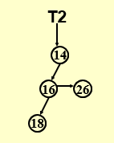  

* 我们对子树的排序有两种选择：  
1.升序排列子树（按子树节点的数量，即它对应的二进制数或者说它的下标）  
2.降序排列子树（按子树节点的数量，即它对应的二进制数或者说它的下标）  

* 先给出结论：我们按照降序排列。

接下来我们来分析一下为什么。其实主要考虑的因素就是升序/降序对操作的时间复杂度的影响。我们可以用Insert操作为例进行分析。 

* 如果我们按升序排列，那么当二项队列中出现两个同种二项树时，我们需要进行合并，合并时需要将其中一个二项树连接到另一个二项树上。因为我们选择使用NextSibling的方式，所以我们需要遍历到最后一个Sibling然后插入，这样的时间复杂度是 $O(logN)$ 。 

* 如果我们按降序排列，我们选择Root较小的二项树作为被连接对象，那么只需要先将另一个二项树的根节点指向LeftChild,然后将被连接二叉树的根节点指向连接二叉树的根节点即可，这样的时间复杂度是 $O(1)$ 。

下面是简单的代码实现，可以明显看出这样的时间复杂度是 $O(1)$
```C
BinTree
CombineTrees( BinTree T1, BinTree T2 )
{  /* merge equal-sized T1 and T2 */
    if ( T1->Element > T2->Element )
        /* attach the larger one to the smaller one */
        return CombineTrees( T2, T1 );
    /* insert T2 to the front of the children list of T1 */
    T2->NextSibling = T1->LeftChild;
    T1->LeftChild = T2;
    return T1;
}
```
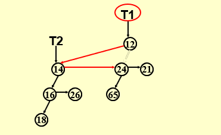

## 4.摊还分析
* 聚合分析：   
 
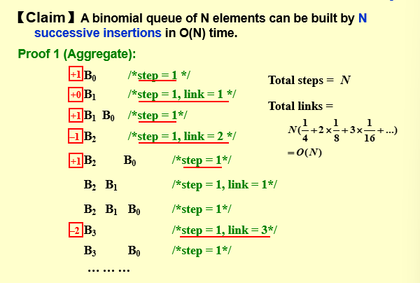  

我们观察到每过 $4$ 个节点，会出现一次 $link=1$;每过 $8$ 个节点，会出现一次 $link=2$ ……  
因此不难得出总的 $\large link$ 数为 $Total \;\; links=N(\frac{1}{4}+2×\frac{1}{8}+3×\frac{1}{16})=O(N)$

* 摊还分析：
!!! success "势能函数"
    $\large C_i+(\Phi_i-\Phi_{i-1})=2$   
       
    $C_i$ 是第 $i$ 次插入的cost。  
    $\Phi_i$ 第 $i$ 次插入后的树的个数。（$\Phi_0=0$）
    
将势能函数累加得： 

$$\large \sum_{i=0}^NC_i+\Phi_N-\Phi_0=2N$$  

$$\large \sum_{i=0}^NC_i=2N-\Phi_N≤2N=O(N)$$

所以我们可以发现：

$$\large T_{worst}=O(logN),but \;\; T_{amortized}=2$$
