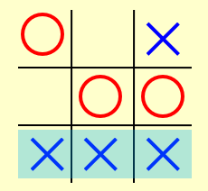

---

title: Chap 6 | “Backtracking”

hide:
  #  - navigation # 显示右
  #  - toc #显示左
  #  - footer
  #  - feedback  
comments: true  #默认不开启评论

---
<h1 id="欢迎">Chap 6 | “Backtracking”</h1>
!!! note "章节启示录"
    要清明放假啦，本章偷个懒吧……本章的内容主要是一种思想，其实也是比较简单的思想，就是暴力枚举，但是中间我们需要通过剪枝来加快遍历的速度。

## 结构
一般回溯算法是一个递归的函数，具有终止条件和递归条件，通常会符合下面的结构：  
```C++
void BackTracing(参数) {
    if (终止条件) {
        存放结果;
        return;
    }
    for (选择：本层集合中元素（树中节点孩子的数量就是集合的大小）) {
        处理节点;
        BackTracking(下一个参数); 
        撤销处理;
        BackTracking(下一个参数); 
    }
}
```

## 应用
### 1.Tic-tac-toe（井字棋）
  

使用评估函数来量化职位的“好坏”。 例如：

$$\large f(P)=W_{Computer}-W_{Human}$$  

* W 是位置 P 的潜在获胜次数。  
* 圆圈为Human下的，叉叉为Computer下的。  

>e.g:  
  
注意到：   
这里圆圈只有4种win的方式，第一行、第一列、第三行、第三列。而叉叉有6种win的方式，第一列、第三列、第二行、第三行以及两条对角线。  
$f(P)=W_{Computer}-W_{Human}=6-4=2$

### 2.α-β pruning（α-β剪枝）  
* α剪枝：  
max-min形式，因为DFS是先搜左孩子，所以剪枝只会剪右孩子。若右孩子的父亲比叔叔小（40≤44），那么它的父亲不会被选中，然后黑色区域被剪枝。

  

* β剪枝：  
min-max形式，因为DFS是先搜左孩子，所以剪枝只会剪右孩子。若右孩子的父亲比叔叔大（68≥44），那么它的父亲不会被选中，然后黑色区域被剪枝。


