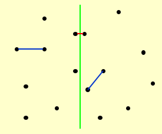
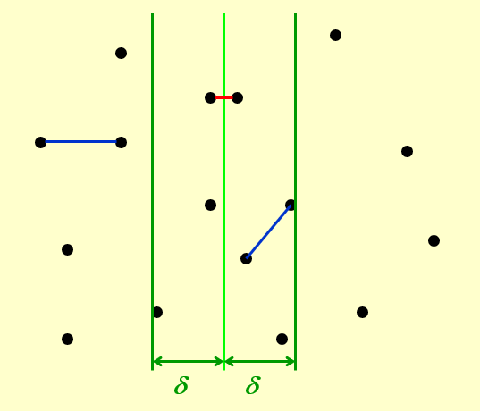
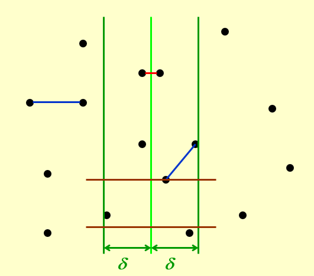
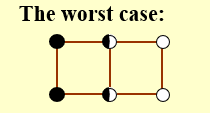
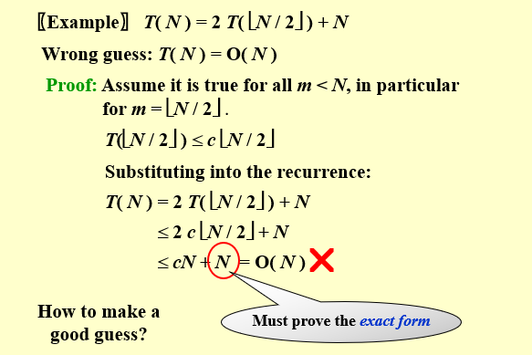
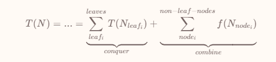
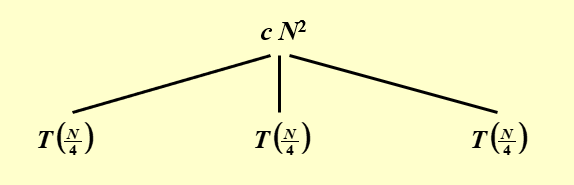
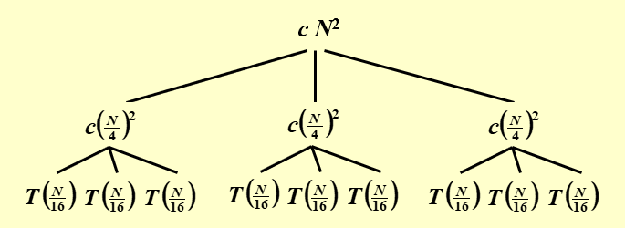
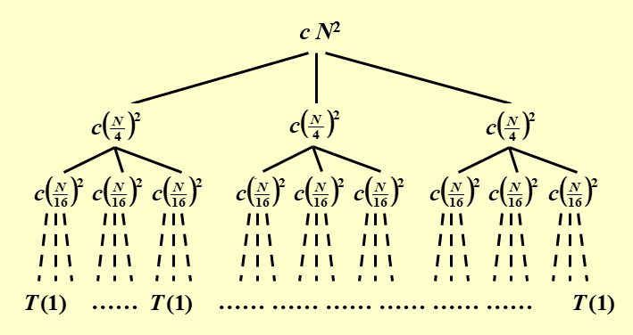
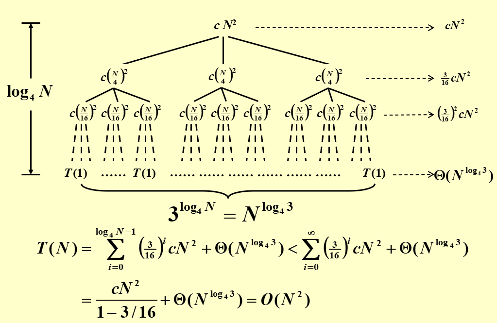

---

title: Chap 7 | “Divide and Conquer”

hide:
  #  - navigation # 显示右
  #  - toc #显示左
  #  - footer
  #  - feedback  
comments: true  #默认不开启评论

---
<h1 id="欢迎">Chap 7 | “Divide and Conquer”</h1>
!!! note "章节启示录"
    本章节主要介绍了分治法，它的基本思想是将一个问题分解为若干个规模较小的相同问题，然后递归地解决这些子问题，最后将这些子问题的解合并得到原问题的解，一个比较经典的案例就是归并排序。本章节重点在于如何分析一个递归式的时间复杂度。

General recurrence: $T(N)=aT(N/b)+f(N)$

## 1.分治法的例子：最近点对
给定平面中的 $N$ 个点。找到最接近的一对点。
!!! success "方法"
    1.将序列分为左右两部分，分别求解最大子序列和；  
    2.求解跨越中点的最大子序列和；  
    3.比较三者的大小，取最大值；  
我们将图中的平面用绿色的线分成两个部分，然后继续用以上的方法进行划分……  

{width="300"}

其中最主要的问题是如何高效的解决方法中的第 $2$ 步,如果检查 $N(N-1)/2$ 个点对，那么额外的时间复杂度将是 $T=O(N^2)$

!!! abstract "减少搜索范围"
    首先我们假设在第一步中求得的最短距离$\large\delta$，然后如果第二步中的距离大于$\large\delta$，那么我们则无需考虑。也就是说，我们可以划定一个界限，在界限之外的点距离一定大于$\large\delta$，因此它们就不会被纳入考虑范围。

* 我们首先从 $x$ 方向上进行考虑。

{width="300"}

如图所示，只有在两条绿线中的点才会被纳入考虑范围，即有可能更新答案。但这样依旧可能出现极端恶劣的情况，于是我需要从二维上去考虑这个问题。

*  从 $y$ 方向上考虑。
  
{width="300"}

如图所示，对在 $x$ 范围内的任意两个点，如果纵向距离大于 $\large\delta$ 那么就不考虑。  
因此，对于选定点 $\large p_{l_i}$ ,其所有可能导致答案更新的点都被框定在一个 $\large 2\delta × \delta$ 的矩形中。 
不难发现，在最理想最理想的情况下——闭区间、允许点重合的情况下，这个矩形最多也只能放八个点（两边各四个）：  

   

因此我只需要遍历这几种情况，而遍历这些情况的时间复杂度为 $O(N)$ ，即 $f(N)=O(N)$ 。

所以我们可以得到最近点对的分治法的递推公式：
$$
T(N)=2T(N/2)+O(N)=O(NlogN)
$$
伪代码：
```C
/* points are all in the strip */
/* and sorted by y coordinates */
for ( i = 0; i < NumPointsInStrip; i++ )
    for ( j = i + 1; j < NumPointsInStrip; j++ ) 
        if ( Dist_y( Pi , Pj ) > δ )
            break;
        else  if ( Dist( Pi , Pj ) < δ )
            δ = Dist( Pi , Pj );
```

* 以上是分治方法的一个具体例子，主要用来说明分治的大致思路。下面将进入本章节的重点内容，如何计算一个分治递归表达式的时间复杂度。

## 2.三个计算方法:

### 2.1 Substitution method — guess, then prove by induction
顾名思义，这个方法需要我们先行猜测答案是多少，然后代入验证（使用数学归纳法）。也就是中学阶段我们常说的题感（~~连蒙带猜~~）
!!! example "一个例子🌰"
    === "题目"
        $$\large T(N)=2 T(\lfloor N / 2 \rfloor) + N$$
    === "答案"
        * **Guess**: $T( N ) = O( N log N )$  
        * **Proof**:对足够小的 $m<N$ ,有：
        $$\large
        T(\lfloor N/2 \rfloor) ≤ c\lfloor N/2 \rfloor log \lfloor N/2 \rfloor
        $$

        * 代入到递归表达式中：  
        $$\large
        T(N)=2 T(\lfloor N / 2 \rfloor) + N ≤ 2c\lfloor N/2 \rfloor log \lfloor N/2 \rfloor+N≤
        $$
        $$\large
        cN(logN-log2)+N≤cNlogN,\;\;for \;\; c≥1
        $$
!!! warning "证明到最后的表达式一定要严格相等"
    &nbsp;&nbsp;&nbsp;&nbsp;&nbsp;&nbsp;&nbsp;

* 代换法最大的缺陷就是我们找到的（猜测的）结果复杂度不一定准确，不一定足够紧凑，而且对于较为复杂的递归式，猜测也十分的困难。

### 2.2 Recursion-tree method（递归树法）
递归树法其实也是猜测（bushi），利用树清晰的性质，将递归的过程可视化，更加便于我们进行猜测。（与代换法的原理基本一致，但优化了猜测的过程）
对于一个递推式，我们将它不断展开以后，形式大概长成这个样子：(用了修佬的公式！)  



* 具体来说解释其含义，combine 部分就是在每一次“分治”的处理时间，如合并当前的子问题分治后的结果，体现在递推式的 $f(N)$ 部分；而 conquer 部分指的是当“分治”的“治”在“分”的末端的体现，即对于足够小的规模的问题，不再需要继续“分”的时候，对其处理的开销。

!!! example "一个例子🌰"
    $$\large
    T(N)=3T(N/4)+\Theta(N^2)
    $$
    === "Step1"
        初始情况时，$T(N)$ 是根和叶子节点的总和，也就是说根其实是 $f(N)$ 部分，而不是 $T(N)$

        
    === "Step2"
        {width="600"}
    === "Step3"
        {width="600"}

    {width="600"}

    * 在上图中， $\large a=3,b=4,f(N)=\Theta(N^2)$ ,也就是每次都分成了 $3$ 个子问题，一共分裂的次数（树的高度）是 $\large log_4N$ 。然后我们对所有的开销进行累加，最底层是一个常数，也就是公式中的 $\large \Theta(N^{log_43})$,随后我们将其扩展到∞进行等比数列的计算。


### 2.3 Master method（主方法）
主方法是我们需要重点掌握（记忆的），当然讨论的基础都是针对形如 $\large T(N)=aT(N/b)+f(N)$ 这样的递归式。

!!! abstract "形式1"
    1.若 $\large f(N)=O(N^{log_b\;a-\varepsilon}),for \;\;\varepsilon＞0$ ，那么 $\large T(N)=\Theta(N^{log_b\;a})$  
    2.若 $\large f(N)=\Theta(N^{log_b\;a}),for \;\;\varepsilon＞0$ ，那么 $\large T(N)=\Theta(N^{log_b\;a}logN)$  
    3.若 $\large f(N)=\Omega(N^{log_b\;a+\varepsilon}),for \;\;\varepsilon＞0$ ，且 $\large af(N/b)<cf(N),for \;\; c<1 \;\; and \;\; \forall N>N_0$ ，那么$\large T(N)=\Theta(f(N))$

* 主方法其实可以类比成“主元法”。我们考虑主要的变量，也就是去分析combine部分和conquer部分谁大谁小。当 $f(N)$ 足够小时，以conquer开销为主（case 1），当一样大时（case 2），当 $f(N) $足够大时，以combine开销为主（case 3）

~~证明这里就不写了~~，看看修佬的吧！[证明方法](https://note.isshikih.top/cour_note/D2CX_AdvancedDataStructure/Lec07/#%E8%AF%81%E6%98%8E)

!!! abstract "形式2"
    1.若 $\large af(N/b)=\kappa f(N)\;\;for\;\;some\;\;\kappa<1$ ，那么 $\large T(N)=\Theta(f(N))$  
    2.若 $\large af(N/b)=K f(N)\;\;for\;\;some\;\;K>1$ ，那么 $\large T(N)=\Theta(N^{log_b\;a})$  
    3.若 $\large af(N/b)=f(N)$ ，那么 $\large T(N)=\Theta(f(N)log_b\;N)$

    !!! example "一个例子🌰"
        * 已知：$\large a=4,b=2,f(N)=NlogN$  

        $\large af(N/b)=4(N/2)log(N/2)=2NlogN-2N$

        此处由于最后多了一个小尾巴 $2N$，因此用不了形式2的主定理。但它可以用形式1的主定理！但我们注意到
        
        $\large f(N)=NlogN=O(N^{logb_\;a-\varepsilon})=O(N^{2-\varepsilon})$

        * 因此，由形式1中的case 1可得， $\large T(N)=O(N^{log_b\;a})=O(N^2)$

!!! abstract "形式3"
    第三种形式讨论了一系列特殊形式，当递推关系满足:

    $\large T(N)=aT(N/b)+\Theta(N^klog^pN)\;\;Where \;\;a≥1,b>1,p≥0$

    它的时间复杂度为：

    $$\large
        T(N) =
        \begin{cases}
            O(N^{log_b\;a}) & a>b^k\\\\
	        O(N^klog^{p+1}N) & a=b^k\\\\
	        O(N^klog^pN) & a<b^k\\\\
        \end{cases}
    $$


