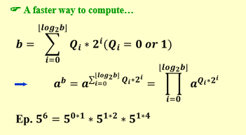
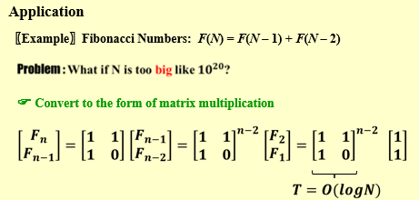
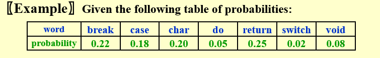
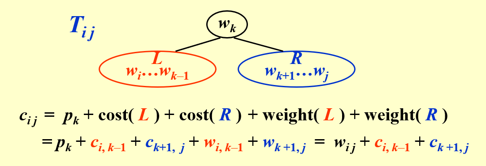
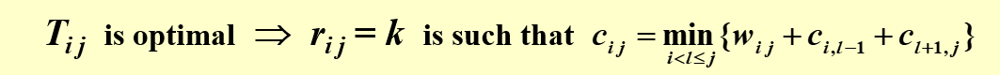

---

title: Chap 8 | “Dynamic Programming”

hide:
  #  - navigation # 显示右
  #  - toc #显示左
  #  - footer
  #  - feedback  
comments: true  #默认不开启评论

---
<h1 id="欢迎">Chap 8 | “Dynamic Programming”</h1>
!!! note "章节启示录"
    本章节主要介绍了动态规划算法，这个算法应该是算法中的重点，本节课中运用了许多例子进行介绍，但没有系统地讲解背包问题，在这里我想选取几个例子进行分析，然后写一下背包问题的思路与所谓的“模板”。

## 1.Fibonacci Numbers
冗余计算的增长是爆炸性的。

```c++
int  Fibonacci ( int N ) 
{   int  i, Last, NextToLast, Answer; 
    if ( N <= 1 )  return  1; 
    Last = NextToLast = 1;    /* F(0) = F(1) = 1 */
    for ( i = 2; i <= N; i++ ) { 
        Answer = Last + NextToLast;   /* F(i) = F(i-1) + F(i-2) */
        NextToLast = Last; Last = Answer;  /* update F(i-1) and F(i-2) */
    }  /* end-for */
    return  Answer; 
    /*T(N)=O(N) */
}
```

!!! success "一个改进：矩阵快速幂"
    先来思考一个简单的问题：计算 $a^b$ ,正常的思路就是一个一个乘，那么复杂度就是 $T = O(b)$

    

    ```c++
    int quickPow(int a,int b)
    {
      int ans = 1;/*Initialization */
      while(b)
      {
        if(b % 2 == 1)
          ans = ans * a;
        a = a * a;
        b = b / 2;
      }
      return ans;
    }
    /*T = O(logb) */
    ```
    而对于矩阵的乘法，由于其同样满足结合律。可以使用上面的方式。

    ```c++
    int MatrixQuick(Matrix A,int B)
    {
      Matrix Ans = initialize_1();/*Initialize to E */
      while(B)
      {
        if(B % 2 == 1)/*Qi = 1 */
          Ans = matrixMul(Ans,A);
        A = matrixMul(A,A);/*recursive compute A^(2^i) */
        B = B / 2;
      }
      return Ans;
      /*T(N) = O(a^2*logB) */
    }
    ```
    


## 2.Optimal Binary Search Tree
—— The best for static searching (without insertion and deletion)

Given  $N$  words  $w_1 < w_2 < …… < w_N$ , and the probability of searching for each  $w_i$  is  $p_i$ .  Arrange these words in a binary search tree in a way that minimize the expected total access time.



* 参数定义：  
    $\large T_{ij}::=OBST\;\;for\;\;w_i,……,w_j\;(i<j)$  
    $\large c_{ij} ::= cost\;\;of\;\;T_{ij}\;( c_{ii} = 0 )$  
    $\large r_{ij} ::= root of T_{ij}$    
    $\large w_{ij} ::= weight\;\;of\;\;T_{ij}=\sum_{k=i}^j p_k( w_{ii} = p_i )$
  

