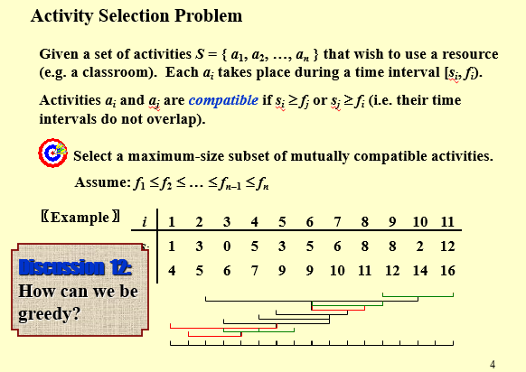

---

title: Chap 9 | “Greedy Algorithms”

hide:
  #  - navigation # 显示右
  #  - toc #显示左
  #  - footer
  #  - feedback  
comments: true  #默认不开启评论

---
<h1 id="欢迎">Chap 9 | “Greedy Algorithms”</h1>
!!! note "章节启示录"
    本章节主要介绍了贪心算法，忙忙忙！
  
!!! warning "需要注意的前提："
    * 贪婪算法仅在局部最优值等于全局最优值时才有效。
    * 贪婪算法并不能保证最优解。 但是，它通常生成的解在值（启发式）上非常接近最优，因此当找到最优解需要太多时间时，直观上很有吸引力。

## 案例：Activity Selection Problem

简单来说，就是给定时间线上的若干区间 $[s_i,f_i)$，求出最多能不重叠地在这个时间线上放置多少个区间。

!!! tip "贪心算法的思路:"
    * 寻找最早开始的  
  
      
    

    * 寻找最短的  
  
      
    

    * 寻找最少冲突的  
  
      
    

    * 寻找最晚结束的  
  
      
    

!!! success "策略四的证明"

!!! tip "复习时的一些补充"
    * 哈夫曼树的最短路径是 $1$ ，最长路径是 $n-1$ 。
