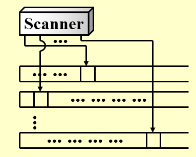
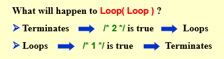
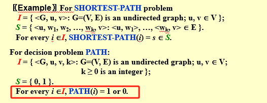
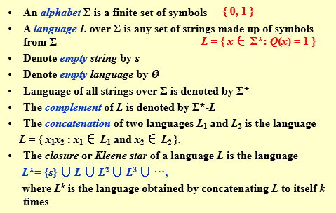
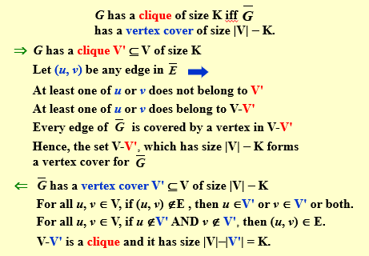

---

title: Chap 10 | “NP-Completeness”

hide:
  #  - navigation # 显示右
  #  - toc #显示左
  #  - footer
  #  - feedback  
comments: true  #默认不开启评论

---
<h1 id="欢迎">Chap 10 | “NP-Completeness”</h1>
!!! note "章节启示录"
    本章节主要介绍了NP相关的问题，以一些基本概念为主。本章的结构基于作者自己的理解，与ppt上的顺序有所不同。

## 1.图灵机

!!! tip "Links"
    Wikipedia:[https://en.wikipedia.org/wiki/Turing_machine](https://en.wikipedia.org/wiki/Turing_machine)  
    Wikipedia:[https://en.wikipedia.org/wiki/Nondeterministic_Turing_machine](https://en.wikipedia.org/wiki/Nondeterministic_Turing_machine)

>图灵机由一个无限长的纸带和一个读写头组成。纸带被划分为一个个格子，每个格子上有一个符号，读写头可以在纸带上移动，读写头可以读取当前格子上的符号，也可以改变当前格子上的符号。图灵机的状态是一个有限集合，每个状态都有一个转移函数，转移函数的输入是当前状态和当前格子上的符号，输出是下一个状态、下一个格子上的符号和读写头的移动方向。  



* 流程概括：  
    1.更改有限控制状态。  
    2.擦除当前头部指向的单位中的符号，并在其中写入一个新符号。  
    3.头部向左 （L） 或向右 （R） 移动一个单元，或停留在其当前位置 （S）。
* 分类：  
    1.确定型图灵机（Deterministic Turing Machine）：下一步要做什么可以根据当前状态确定。  
    2.非确定型图灵机（Nondeterministic Turing Machine）：可以从有限集合中自由选择下一步，并且最终总是选择通向正确答案的方向的那条路。

## 2.NP问题
根据问题的难度，由不同的定义划分，问题可以分为：
不可计算问题(undecidable)、$P$ 问题(polynomial time)、$NP$ 问题(nondeterministic polynomial time)、$NPC$ 问题(NP complete)、$NPH$ 问题(NP hard)。
!!! abstract "P"
    P 取自 polynomial time，指的是可以用确定型图灵机在多项式时间内解决的问题。  

    也就是我们通常意义下所说的，可以在多项式时间内解决的问题。
!!! abstract "NP"
    NP 即 nondeterministic polynomial time，指的是可以用非确定型图灵机在多项式时间内解决的问题。这个说法等价于可以用确定型图灵机在多项式时间内**验证**（判断答案是否正确）。

    也就是我们通常意义下所说的，可以在多项式时间内验证的问题。
!!! abstract "NPC"
    NPC 即 NP complete，NP 完全，是 NP 中最难的决定性问题（并不是全部问题中最难的问题！）。而我们称满足如下条件的问题为 NPC 问题：

    1. 是一个 NP 问题；
    2. 所有 NP 问题都可以多项式时间归约为该问题；
    
    !!! tip "多项式时间归约"
        如果我们能在多项式时间的复杂度内，将问题 A 转化为问题 B，则称问题 A 可以多项式时间归约(polynomial reduce)为 B，记为 $\large A≤_pB$ ，表示 A 不会比 B 难。


    由 2 可以有结论，所有的 NPC 问题难度相同——一旦有一个 NPC 问题被解决，那么所有 NPC 问题，乃至所有 NP 问题都能被解决。

    若要证明一个问题是 NPC 问题，我们可以通过以下步骤：

    1. 判定该问题是一个 NP 问题；
    2. 判定一个已知的 NPC 问题可以多项式时间归约为该问题，或判定该问题是 NPH（在下面）问题；
    
    >第一个被证明是 NPC 的问题是 Circuit-SAT 问题。

!!! abstract "NPH"
    NPH 即 NP hard，NP 困难，它不一定需要是 NP 问题。所有的NPC问题都可以在多项式时间内转化为他的话，我们就叫他NPH（hard）问题。

    * NP-Hard问题是这样一种问题，它满足NPC问题定义的第二条但不一定要满足第一条（就是说，NP-Hard问题要比 NPC问题的范围广）。
    * NP-Hard问题同样难以找到多项式的算法，但它不列入我们的研究范围，因为它不一定是NP问题。即使NPC问题发现了多项式级的算法，NP-Hard问题有可能仍然无法得到多项式级的算法。事实上，由于NP-Hard放宽了限定条件，它将有可能比所有的NPC问题的时间复杂度更高从而更难以解决。

由上面的定义我们可以得到：$NPC = NP \cap NPH$。

## 3.案例
### 3.1 Halting Problem（停机问题）
是否有可能让你的 C 编译器检测所有无限循环。换句话说，对于任意一个程序，我们无法设计一个算法来判断它是否会在有限时间内停机（即判断程序是否会死循环）。

!!! success "证明"
    如果存在一个无限循环检查程序，那么它肯定可以用来检查自身。
    ```c++
    Loop( P )
    {  
    /* 1 */ if ( P(P) loops )	print (YES);
    /* 2 */ else infinite_loop();
    }
    ```
    

### 3.2 Hamiltonian cycle problem（哈密顿回路问题）
给定一个图，判断是否存在一条路径，使得它经过图中的每个点恰好一次，且最后回到起点。

!!! tip "哈密顿回路问题"
    哈密顿回路问题是一个NPC问题
### 3.3 Traveling Salesman Problem（旅行商问题）
旅行推销员问题：给定一个完整的图 G=（V， E），具有边成本和一个整数 K，是否存在访问所有顶点并具有总成本 ̂≤ K 的简单循环？

!!! tip "旅行商问题"
    旅行商问题是一个NPC问题，可以利用**哈密顿回路问题**证明，下面给出证明。

* 证明：
    * 首先回顾证明 NPC 的步骤：   
        1.  判定该问题是一个 NP 问题；   
        2.  判定一个已知的 NPC 问题可以多项式时间归约为该问题，或者说判定该问题是 NPH 问题；

    * 代入到这个问题中，也就是我们需要证明：
        1. TSP 是一个 NP 问题；
        2. Hamilton Cycle Problem 可以多项式时间归约为 TSP；
!!! success "证明 TSP is NP"
    * 证明 TSP 是一个 NP 问题即证明 TSP 的解可以在多项式时间内被验证。而验证一个解是 TSP 问题的解，需要证明下面两个点：  
        1.  这条路径经过了所有节点恰好一次；  
        2.  这条路径长度不超过 $k$ ;  

    显然，这两个条件只需要 $O(N)$ 就能验证。  
    于是我们得到结论 $TSP \in NP$

!!! success "证明 TSP is NPH"
    * 要证明 TSP 是一个 NPH 问题，我们可以通过证明 Hamilton Cycle Problem(HCP) 可以多项式时间归约为 TSP。
    * 也就是证明 $HCP ≤_p TCP$ 。我们可以做以下这样形式的构造进行证明：  
        1.  连接 $G$ （哈密顿问题的图）中所有没连上的边，使 $G$ 成为一张无权完全图。  
        2.  对于无权完全图中的每一条边 $v_i^c$ ，如果在 $G$ 中也有这条边，那么令它的边权为 $0$ ，否则它边权为 $1$ ，于是得到了 $G^\prime$ 。显而易见，这个 $G^\prime$ 属于TSP中的一种。  

    因此，在 $G$ 上寻找哈密顿环，等价于 $G^\prime$ 上做 $k=0$ 的TSP。因此 $HCP≤_pTSP$，即 $TSP \in NPH$。

综上所述，$TSP \in NP$ 且 $TSP \in NPH$ ，所以 $TSP \in NPC$。

### 3.4 最早被证明的NPC问题——Circuit-SAT（circuit satisfiability problem）
Circuit-SAT 即为确定给定布尔电路是否具有使输出为真的输入分配的决策的问题。
  
上图中，左侧电路满足条件，右侧电路不满足条件。

### 3.5 A Formal-language Framework

* abstract problem（抽象问题） Q : 是一组问题实例 $I$ 和一组问题解 $S$ 上的二元关系。  
>e.g:  

* Encodings: 将 $I$ 映射到一个二进制字符串 $\{0,1\}^*$ 

!!! abstract "Formal-language Theory <font color = "red">(for decision problem)</font>"
    


### 3.6 Clique problem（团问题） and Vertex cover problem
* Clique problem（团问题）：给定一个无向图 $G = (V， E)$ 和一个整数 $K$ ，$G$ 是否包含（至少）$K$ 个顶点的完整子图（集团）？
* Vertex cover problem：给定一个无向图 $G = (V， E)$ 和一个整数 $K$ ，$G$ 是否包含一个子集 $V'\subset  V$ ，使得 $|V'|$（最多）是 $K$ ，$G$ 中的每条边在 $V'$ 中都有一个顶点（顶点覆盖）？

\## 问题：假设我们已经知道团问题是NPC的。 证明顶点覆盖问题也是 NPC 的。

* 证明：
    * 首先回顾证明 NPC 的步骤：   
        1.  判定该问题是一个 NP 问题；   
        2.  判定一个已知的 NPC 问题可以多项式时间归约为该问题，或者说判定该问题是 NPH 问题；

    * 代入到这个问题中，也就是我们需要证明：
        1. VCP 是一个 NP 问题；
        2. CP 可以多项式时间归约为 VCP；
!!! success "证明 VCP is NP"
    * 证明 VCP 是一个 NP 问题即证明 TSP 的解可以在多项式时间内被验证。
    给定任意 $x = <G， K>$ ，取 $V'\subset V$ 
    验证算法：检查是否 $|V'|= K$ ;检查对于每个边 $(u， v) ∈ E$ ，$u$ 是否 $∈ V'$ 或 $v ∈ V'$ 。
    显然，这个条件只需要 $O(E)$ 就能验证。  
    于是我们得到结论 $VCP \in NP$
!!! success "证明 VCP is NPH （$CLIQUE ≤_P VERTEX-COVER $）" 
    
    * 从理解上证明：因为团问题的目标得到一个大小至少为 K 的图，问题也可以等价于找这个图的补图（一个大小最大是 $|V|-K$ 的图）。也就是说，团问题的一个实例为一张无向图，其可以映射一张补图，为顶点覆盖的一个实例。
    * 抽象成逻辑表达式：$G$  有一个规模为 $K$ 的团，当且仅当 $\overline{G}$ 的顶点覆盖大小为 $|V|-K$。
    
    
<hr></hr>