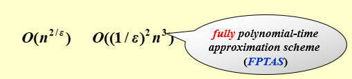
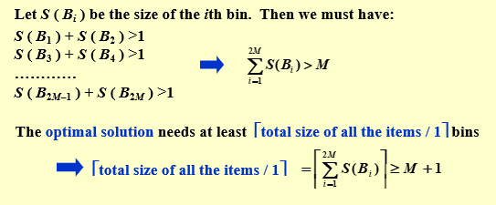
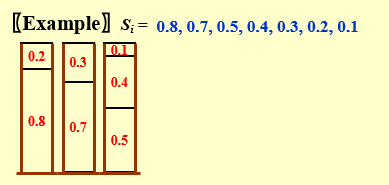
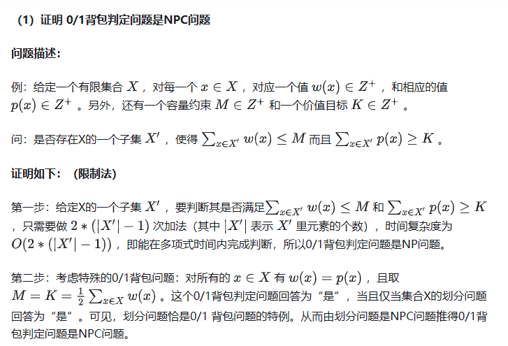
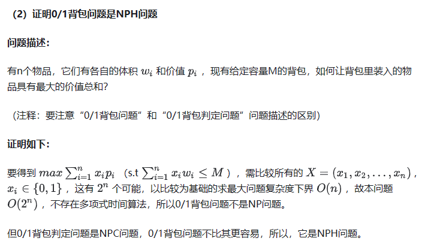
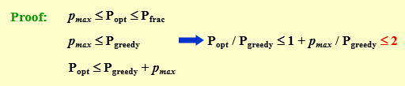
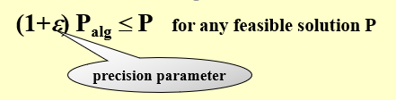
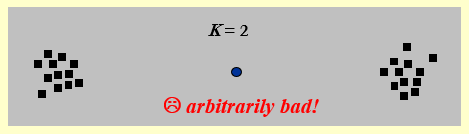

---

title: Chap 11 | “Approximation”

hide:
  #  - navigation # 显示右
  #  - toc #显示左
  #  - footer
  #  - feedback  
comments: true  #默认不开启评论

---
<h1 id="欢迎">Chap 11 | “Approximation”</h1>
!!! note "章节启示录"
    本章节主要介绍了近似算法相关的问题。我们知道对于一些较难的问题，给出严谨的多项式时间（即在所有情况下都是多项式时间）是很困难的，因此我思考去寻找近似的算法对之进行替代。~~启示录写的真的是越来越简略了~~

## 1.目标与标准

* What for?
   对于某些问题，我们无法使用多项式时间解决。因此我们尝试寻找一种多项式算法，使得最后的结果在一个可接受的偏差范围内。
* 标准（Approximation Ratio）：近似比  
  
    $\large max(\frac{C}{C^*},\frac{C^*}{C}≤\rho(n))$

    优化问题的近似方案是一种近似算法，它不仅将问题的实例作为输入，而且还将值 $ \varepsilon> 0$ 作为输入，因此对于任何固定 $\varepsilon$ ，该方案是 $(1+ \varepsilon)$ 近似算法。  
    如果对于任何固定的 $\varepsilon > 0$，该方案在其输入实例的大小 n 中按时间多项式运行。我们就称近似方案是a polynomial-time approximation scheme（PTAS）（多项式时间近似范式）
!!! 近似范式
    近似范式(approximation scheme)指的是对于某个优化问题的一族相同模式的算法，它们满足对于确定的 $\varepsilon > 0$，算法的近似比为 $1+\varepsilon$。

    * 当 $f(n,\varepsilon)$ 关于 $n$ 是多项式时，**我们称其为多项式时间近似范式(polynomial-time approximation scheme, PTAS)**。
    * 当 $f(n,\varepsilon)$ 关于 $n$ 和 $1/\varepsilon$ 都是多项式时，我们称其为**<font color="red">完全</font>多项式时间近似范式(fully polynomial-time approximation scheme, FPTAS)**。
  
    
##  2.装箱问题
给定 $N$ 个大小为 $S_1 ， S_2 ， ...， S_N$ 的物品，使得 $0 < S_i ≤ 1$ 对于所有的 $1 ≤ i ≤ N$ . 将这些物品包装在最少数量的箱子中，每个箱子的最大容量都是 $1$。

!!! example "一个例子🌰"
    给定 7 个item ，size 分别是 0.2 , 0.5 , 0.4 , 0.7 , 0.1 , 0.3 , 0.8 ,那么最少需要 3 个箱子。

    * bin 1 : 0.2 + 0.8
    * bin 2 : 0.7 + 0.3
    * bin 3 : 0.4 + 0.1 + 0.5

!!! warning "注意"
    装箱问题是一个 NPH 问题，但装箱问题的判定问题是一个 NPC 问题。  
    Decision problem: given K bins, can we pack N items? 

在介绍具体的方式前，我们先对其进行一个分类：在线算法（online algorithm）和离线算法（offline algorithm）

* 在线算法：输入是一个一个知道的，也就是一开始只知道第一个，随着进程进入才知道后面的部分
* 离线算法：输入是一下子全部知道的，也就是一开始就知道所有物品的size，可以进行更加合理的安排布置。

### 2.1 Next Fit（online）
```c++
void NextFit ( )
{   read item1;
    while ( read item2 ) {
        if ( item2 can be packed in the same bin as item1 )
            place item2 in the bin;
        else
            create a new bin for item2;
        item1 = item2;
    } /* end-while */
}
```
NF 策略总是选择当前最后一个bin，若剩余量足够，则放入，否则就开一个新的。  
NF 策略的箱子个数不会超过 $2M-1$，其中 $M$ 表示准确解。
!!! success "证明"
    证明当 NF 的结果为需要 $2M$ 或 $2M+1$ 个 bin 时，准确解为至少需要 $M+1$ 个bin。

    

### 2.2 First Fit（online）
```c++
void FirstFit ( )
{   while ( read item ) {
        scan for the first bin that is large enough for item;
        if ( found )
    place item in that bin;
        else
    create a new bin for item;
    } /* end-while */
}
```
FF 策略总是选择第一个能放下当前item的箱子，如果所有箱子都装不下了，那么就新开一个箱子。  
FF 策略总是使用不超过 $\lfloor 1.7M \rfloor$ 个 bin，并且存在一组能对边界取等的输入

### 2.3 Best Fit（online）
BF 策略总是选择能够容纳当前 item 且剩余空间最小的 bin（即 tightest），若所有 bin 都无法容纳当前 item，则新开一个 bin。
BF 策略也总是使用不超过 $\lfloor 1.7M \rfloor$ 个 bin，并且存在一组能对边界取等的输入。

### 2.4 First Fit Decreasing（offline）
离线做法的优势在于它能够获得所有 item 的信息以求统筹规划。这里给出的近似做法是，将 item 按照 size 降序排序，而后使用 FF（或 BF，由于单调性，两者等价）。



FFD 策略总是使用不超过 $\large \frac{11}{9}M+\frac{6}{9}$个 bin，并且存在一组能对边界取等的输入。

## 3.Knapsack Problem（背包问题）
问题描述：要打包容量为 $M$ 的背包。 给定 $N$ 个项目。 每个项目 $i$ 都有一个权重 $w_i$ 和一个利润 $p_i$。 如果 $x_i$ 是被打包的物料 $i$ 的百分比，则打包的利润将为 $p_ix_i$  。

### 3.1 Fractional Version（可以装0.1个物品，连续可分）
$x_i ∈ [0,1]$ ，我们可以很自然地想到用性价比（profit density）最优策略进行选择，即 $p_i/w_i$。这样得到的答案是准确解。

### 3.2 0-1 Version
$x_i∈{0,1}$，一个物品要么选要么不选。这是一个 NPH 问题，w我们可以近似算法来求较优解。

!!! tip "拓展：背包判定问题与背包问题"
    * 先给出结论，背包判定问题是NPC问题，但背包问题是NPH问题。[证明](https://zhuanlan.zhihu.com/p/102362515#:~:text=%E6%96%87%E7%AB%A0%E5%BC%80%E5%A4%B4%E7%BB%99%E5%87%BA%E7%BB%93%E8%AE%BA%EF%BC%9A%200%2F1%E8%83%8C%E5%8C%85%E5%88%A4%E5%AE%9A%E9%97%AE%E9%A2%98%E6%98%AFNPC%E9%97%AE%E9%A2%98%EF%BC%9B%200%2F1%E8%83%8C%E5%8C%85%E9%97%AE%E9%A2%98%E6%98%AFNPH%E9%97%AE%E9%A2%98%E4%BD%86%E4%B8%8D%E6%98%AFNPC%E9%97%AE%E9%A2%98%E3%80%82%20%EF%BC%88%E4%B8%8B%E6%96%87%E4%BC%9A%E7%BB%99%E5%87%BA%E5%85%B7%E4%BD%93%E8%AF%81%E6%98%8E%E8%BF%87%E7%A8%8B%EF%BC%89,%E5%AF%B9P%E9%97%AE%E9%A2%98%E3%80%81NP%E9%97%AE%E9%A2%98%E3%80%81NPC%E9%97%AE%E9%A2%98%E3%80%81NPH%E9%97%AE%E9%A2%98%E4%B9%8B%E9%97%B4%E7%9A%84%E5%85%B3%E7%B3%BB%E8%BF%98%E4%B8%8D%E5%A4%AA%E4%BA%86%E8%A7%A3%E7%9A%84%E5%90%8C%E5%AD%A6%EF%BC%8C%E5%8F%AF%E4%BB%A5%E5%85%88%E8%8A%B1%E5%87%A0%E5%88%86%E9%92%9F%E7%9C%8B%E7%9C%8B%E4%B8%8B%E9%9D%A2%E7%9A%84%E5%AE%9A%E4%B9%89%E5%92%8C%E5%85%B3%E7%B3%BB%E5%9B%BE%EF%BC%8C%E7%84%B6%E5%90%8E%E5%86%8D%E7%9C%8B%E5%90%8E%E9%9D%A2%E7%9A%84%E5%85%B7%E4%BD%93%E8%AF%81%E6%98%8E%E8%BF%87%E7%A8%8B%20P%E9%97%AE%E9%A2%98%EF%BC%9A%E5%A6%82%E6%9E%9C%E4%B8%80%E4%B8%AA%E9%97%AE%E9%A2%98%E8%83%BD%E6%89%BE%E5%88%B0%E5%9C%A8%E5%A4%9A%E9%A1%B9%E5%BC%8F%E6%97%B6%E9%97%B4%E5%86%85%E8%A7%A3%E5%86%B3%E5%AE%83%E7%9A%84%E7%AE%97%E6%B3%95%EF%BC%8C%E9%82%A3%E4%B9%88%E8%AF%A5%E9%97%AE%E9%A2%98%E6%98%AFP%E9%97%AE%E9%A2%98%E3%80%82%20NP%E9%97%AE%E9%A2%98%EF%BC%9A%E5%A6%82%E6%9E%9C%E5%8F%AF%E4%BB%A5%E5%9C%A8%E5%A4%9A%E9%A1%B9%E5%BC%8F%E6%97%B6%E9%97%B4%E5%86%85%E9%AA%8C%E8%AF%81%E4%B8%80%E4%B8%AA%E9%97%AE%E9%A2%98%E7%9A%84%E8%A7%A3%E7%9A%84%E6%AD%A3%E7%A1%AE%E6%80%A7%EF%BC%8C%E9%82%A3%E4%B9%88%E8%AF%A5%E9%97%AE%E9%A2%98%E6%98%AFNP%E9%97%AE%E9%A2%98%E3%80%82%20NPC%E9%97%AE%E9%A2%98%EF%BC%9A%E4%B8%80%E4%B8%AANPC%E9%97%AE%E9%A2%98%E9%9C%80%E8%A6%81%E5%90%8C%E6%97%B6%E6%BB%A1%E8%B6%B3%E4%B8%A4%E4%B8%AA%E6%9D%A1%E4%BB%B6%EF%BC%9A%EF%BC%881%EF%BC%89%E8%AF%A5%E9%97%AE%E9%A2%98%E6%98%AFNP%E9%97%AE%E9%A2%98%EF%BC%9B%EF%BC%882%EF%BC%89NP%E9%87%8C%E6%89%80%E6%9C%89%E9%97%AE%E9%A2%98%E5%8F%AF%E4%BB%A5%E5%9C%A8%E5%A4%9A%E9%A1%B9%E5%BC%8F%E6%97%B6%E9%97%B4%E5%86%85%E5%BD%92%E7%BA%A6%E5%88%B0%E8%AF%A5%E9%97%AE%E9%A2%98%E3%80%82)  
    
    **0/1背包判定问题:**
    给定一个有限集合 $X$ ，对每一个 $x∈X$ ，对应一个值 $w(x)∈Z^+$ ，和相应的值 $p(x)∈Z^+$ 。另外，还有一个容量约束 $M∈Z^+$ 和一个价值目标 $K∈Z^+$。  
    问：是否存在 $X$ 的一个子集 $X^\prime$ ，使得 $\large\sum_{x∈X^\prime} w(x)≤M$ 而且 $\large\sum_{x∈X^\prime} p(x)≥K$

      
    
#### 贪心算法    
我们可以使用贪心算法，贪心策略可以是总是选可以放得下的、还没放入中的，利润最大的或$p_i/w_i$最大的。这些做法的近似比都是 2。  


#### 动态规划算法
$W_{i,p}$ 为总利润正好是 $p$ 的最小权重集合。
$$
     W_{i,p} =
    \begin{cases}
        ∞  &(i=0)\\\\
        W_{i-1,p}  &(p_i>p)\\\\
        min\\{{W_{i-1},w_i+W_{i-1,p-p_i}\\}} &(otherwise)\\\\
    \end{cases}
$$

$$\large
i=1,…，n;p=1,…,n \;\;p_{max} \Rightarrow O(n^2\;p_{max})
$$
* 注意：input size包括 $\large p_{max}$ 的二进制编码长度 $d$，所以 $\large p_{max}=O(2^d)$ 是指数级的复杂度。
!!! abstract "伪多项式时间算法"
    * 多项式时间算法：根据输入的**数量**
    * 伪多项式时间算法：根据输入中最大数的**数量级**
        1.  当一个算法的最坏时间复杂度是依据输入的**数量级**的时候，我们就称算法的时间复杂偶是伪多项式时间。
        2. 给一个wiki上的解释可能更好理解：若一个数值算法的时间复杂度可以表示为输入数值规模N的多项式，但其运行时间与输入数值规模N的二进制位数呈指数增长关系，则称其时间复杂度为伪多项式时间。这是由于，N的值是N的位数的幂，故该算法的时间复杂度实际上应视为输入数值N的位数的幂。  
    

    背包问题实例的规模是它的参数所占的存储空间。那么动态规划中的 $\large p_{max}$ 所占用的空间便是 $d$ 位。因此动态规划算法也是一个伪多项式时间算法。
    [相关链接](https://www.zhihu.com/question/20686504)  
因此，如果 $\large p_{max}$ 很大，可以考虑将他们除以一个较大的数（比如十万），然后向上取整，再进行运算。但是这个带来了精度的损失，我们用 $\varepsilon$ 来表示。也就如下图所示：  



## 4.The K-center Problem
选择 $K$ 个中心 $C$ ，使得最大距离（最大半径）的值最小。
即：  
设 $C = \{c_1,c_2,…,c_k\}$ 为 $k$ 个 center， $S=\{s_1,s_2,…,s_n\}$ 为 $n$ 个site，我们定义site到center的距离的集合 $C$ 为:
$$\large
dist(s_i,C)=min_{c_i∈C}\\{{dsit(s_i,c_i)\\}}
$$
定义最大的最小覆盖半径为:
$$\large
r(C)=max_{s_i,S}\\{dist(s_i,C)\\}
$$

我们的目标是寻找一个集合 $C$ 使得 $r(C)$ 最小。（约束条件是集合 $C$ 的基数等于 $k$）

### 4.1 简单的贪心策略
!!! quesiton "一个简单的想法"
    将第一个中心放在所有点的中心位置，然后不断添加中心，以使得每次尽可能减小覆盖半径。

    1. 如果是第一个点，就选取所有点的中心；
    2. 如果不是第一个点，就选取能一个最能让 $r(C)$ 下降的；
   
    这样的做法在某些情况是错误的，所以我们不再考虑这个方法。  

    

### 4.2 2r-Greedy
正向思考这个问题有些难度，我们不妨反向来想，假设我们知道答案（或者说我们提前猜一个答案，给定一个约束的半径值 $r(C^*)≤r(C_x)$），也就是知道准确解 $r(C^*)$ ，那么我们就有 $r(C^*)≤r(C_x)$，在这里 $r$ 成为了一个约束条件！
于是我们将按照 $K$ 和 $r$ 这两个约束条件去寻找点。  

* 首先我们引入一个定理：
!!! abstract "引理"
    假设给定半径为 $r$ ，以 $c$ 为圆心的圆 $C$ 覆盖了 $S$ 中d的所有点。  
    那么，对于固定的半径 $r^\prime$ ，要想取任意的 $s_i∈S$ 为圆心，形成对的圆 $C_i$ ，总是能覆盖 $S$ 中的所有点，则 $r^\prime≥2r$。   
    >这个结论是比较显然的，大家可以想象一下有两个点分别在直径两端。

* 伪代码：
```c++
Centers  Greedy-2r ( Sites S[ ], int n, int K, double r )
{   Sites  S’[ ] = S[ ]; /* S’ is the set of the remaining sites */
    Centers  C[ ] = 空集;
    while ( S’[ ] != 空集 ) {
        Select any s from S’ and add it to C;
        Delete all s’ from S’ that are at dist(s’, s) ≤ 2r;
    } /* end-while */
    if ( |C| ≤ K ) return C;
    else ERROR(No set of K centers with covering radius at most r);
}
```

此时我们发现了一个问题， $r(C^*)$ 我们实际上是不知道的！那么我们接下来的做法就是去猜！也就是我们猜测一个较为合理的约束条件，去逼近真实值。提到逼近，很自然就会想到二分法了。

我们令 $r_{max}$ 为距离最远的两个 site 的距离。

1. Guess:$\large r = (0+r_{max})/2$
2. Yes:K centers found with 2r  
   No:r is too small

准确解 $r$ 的范围在 $r_0<r≤r_1$  
我们得到的解是 $r_1$ 


### 4.3 A smarter solution — be far away
这个做法其实有点像上面那个做法的反向思路。上面是不断寻找符合要求的，而这个是一旦不符合要求就返回。  
我们关注到，上面那个做法总是随机的选取新的 $c_i$，但是对于 center 的选取，我们其实可以总是选择距离已有的 center 最远的点，此外，当 $∣C∣>K$ 时，我们也没必要继续做了。
!!! success "证明"
    使用反证法证明。若结果 $r>r*$ ，则每步添加的 $s$ 距离都大于 $2r*$ 。根据前一个算法的结论， $S’$ 在 $K$ 步以内必然非空，推出 $K-center$ 无解满足 $r*$ 。
* 伪代码：
```c++
Centers  Greedy-Kcenter ( Sites S[ ], int n, int K )
{   Centers  C[ ] = 空集;
    Select any s（其实很重要） from S and add it to C;
    while ( |C| < K ) {
        Select s from S with maximum dist(s, C);
        Add s it to C;
    } /* end-while */
    return C;
}
```

这里一开始对初始点的选取是任意的，但若对其做一些限定，相信结果会更加准确。

## 5.总结
我们需要从三个维度来考虑算法的设计是否优秀：

1. 最优性(optimality)：即能求准确解；
2. 高效性(efficiency)：即算法是否高效；
3. 普遍性(all instances)：即算法是否普遍适用于所有的情况


同时满足最优性和高效性，那么这个算法对特殊情况能高效求准确解；  
同时满足最优性和普遍性，那么这个算法对所有情况都能求准确解；  
同时满足高效性和普遍性，那么这个算法可能是个近似算法；

* 即使 N=NP 成立，我们仍然无法保证三个愿望一次满足。这句话指的应该是对于 NPH 问题，我们依然无法保证三个性质同时成立。