---

title: Chap 12 | “Local Search”

hide:
  #  - navigation # 显示右
  #  - toc #显示左
  #  - footer
  #  - feedback  
comments: true  #默认不开启评论

---
<h1 id="欢迎">Chap 12 | “Local Search”</h1>
!!! note "章节启示录"
    摆烂了。……

## 1.Framework of Local Search
* Local:  
    在可行集中定义 $\large neighborhoods$  
    $\large local \;\;optimum$ （局部最优）是 $neighborhoods$ 的最佳解决方案
  
* Search:  
    从可行的解决方案开始，然后在附近寻找更好的解决方案  
    如果无法改进，则实现局部最优  

### Neighbor Relation

* S ~ S' : S' is a neighboring solution of S – S' can be obtained by a small modification of S.(通过微小改动得到)
* N(S): neighborhood of S – the set { S': S ~ S' }.

```c++
SolutionType Gradient_descent()
{   Start from a feasible solution S  FS ;
    MinCost = cost(S);
    while (1) {
        S’ = Search( N(S) ); /* find the best S’ in N(S) */
        CurrentCost = cost(S’);
        if ( CurrentCost < MinCost ) {
            MinCost = CurrentCost;    S = S’;
        }
        else  break;
    }
    return S;
}
```

## 2.[Example] The Vertex Cover Problem.
顶点覆盖问题：给定一个无向图 $G=(V,E)$ ，找到一个最小的顶点集 $S \subseteq V$ ，使得每条边 $(u,v)$ 都至少有一个端点在 $S$ 中（即 $u \in S \cup v\in S$）   

这个问题的可行解为 $S=V$ ，即完全覆盖，其目标函数为 $cost(S)=S$ 。即，我们尝试使用local search来降低 $|S|$ 。

!!! example "几个例子🌰"
    === "Case 0:"
        没有边，只有一堆点，显然空集就是最后的答案。

        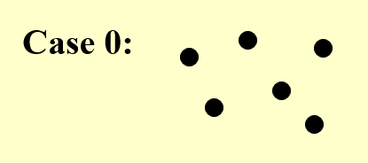

        我们根据local search逐步删除每一个点，直到：  

        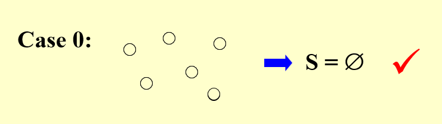

        可以看到这个过程的曲线是这样的：也就是没有阻碍，**梯度下降**  

        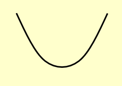

    === "Case 1:"
        Case 1中，显然只要留第一个点就可以了，但如果我们从中间的点开始删除（或者说只要中间的点不是最后一个被删除时）就会出现剩下的任何一个点都不能删除的情况：  

        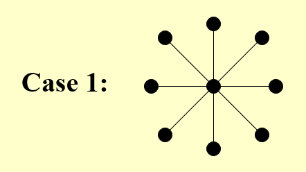

        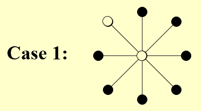

        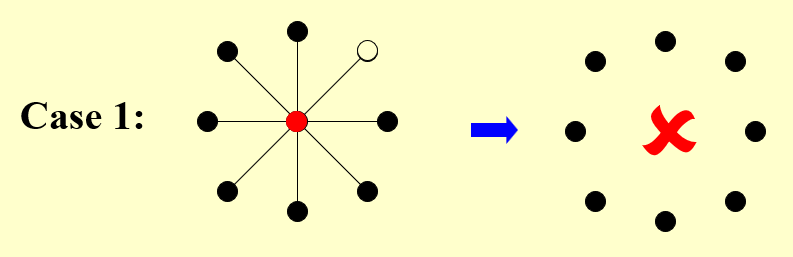

        于是它的下降曲线是这样的：需要避开中间的点，否则就会停滞在第一个波谷中。  

        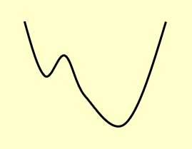
    === "Case 2:"
        Case 2中,若是不选择奇数位置的点，而选择偶数位置的点依次删除，则无法实现最优解，它的下降曲线中的每个波谷就是偶数位置的点（因为只有都选择奇数位置的点才能实现最优解）。
        
        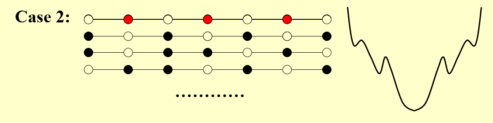

!!! success "一个改进：The Metropolis Algorithm"
    ```c++
    SolutionType Metropolis() {   
        Define constants k and T;
        Start from a feasible solution S \in FS ;
        MinCost = cost(S);
        while (1) {
            S’ = Randomly chosen from N(S); 
            CurrentCost = cost(S’);
            if ( CurrentCost < MinCost ) {
                MinCost = CurrentCost;    S = S’;
            }
            else {
                With a probability e^{-\Delta cost / (kT)}, let S = S’;
                else  break;
            }
        }
        return S;
    }
    ```
    这个算法其实很好理解，就是在每次“陷入波谷”时，我们都做一次随机的变化，使得结果有一定几率跳出波谷继续下降，而这个随机的算法是需要好好斟酌确定的。
    >注：对于case 1，有一定概率可以跳出local optimum得到正确解。但是对case 0，有可能在加1和减1之间无限震荡……  
    注：当（温度）T很高时，上坡的概率几乎为1，容易引起底部震荡；当T接近0时，上坡概率几乎为0，接近原始的梯度下降法。
    


* 与这个算法类似思想的一个问题是：模拟退火问题。  
    我在网上找到了一个有点意思的动图，可以看一下。  
    [链接：模拟退火](https://oi-wiki.org/misc/simulated-annealing/)

## 3.[Example] Hopfield Neural Networks

Graph $G = (V, E)$ with integer edge weights $w$ (positive or negative).

* 如果 $w_e< 0$  ，其中 $e = (u， v)$，那么 u 和 v 需要相同的状态;
* 如果 $w_e> 0$ ，那么 u 和 v 需要不同的状态。
* 绝对值 $|w_e|$ 表示此要求的强度（消耗/权重）。

输出：网络的配置 S ，即将状态 $s_u$ 分配给每个节点 $u$。
>可能没有符合所有边所需要求的配置。

### 来看一个更加具体一点的例子：
* 定义1：在配置 $S$ 中，边$ e = (u， v)$ 如果$ w_es_us_v < 0 (w_e < 0 iff su = sv)$ 是 $good$ ;否则，是 $bad$ 。
* 定义2: 在配置 $S$ 中，如果好边的权重 <font color = "red">≥</font> 坏边的权重，则称节点 $u$ is satisfied。
$$\large
\sum_{v:e=(u,v)\in E}w_es_us_v≤0
$$
* 定义3: 如果所有节点 is satisfied，则称配置 $S$ 是稳定的。

!!! example "一个例子🌰"
    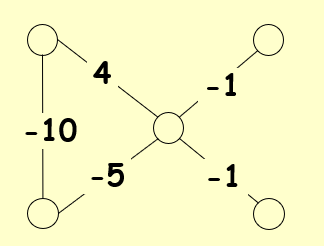
    === "Step 1"
        我们注意到，对 $4$ 这条边来说，它是一条坏边。因此我们把中间那个点染黑（理由或许可以理解为代价小一些）。

        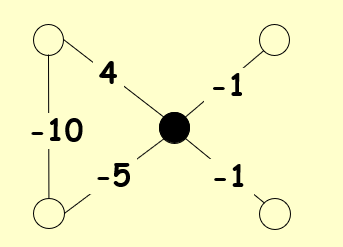
    === "Step 2"
        然后两条 $-·$ 的边变成了坏边，我们需要把对应的两个顶点染黑。

        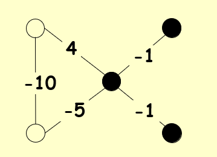

    === "Step 3"
        经过验证，满足上述说的定义2。

        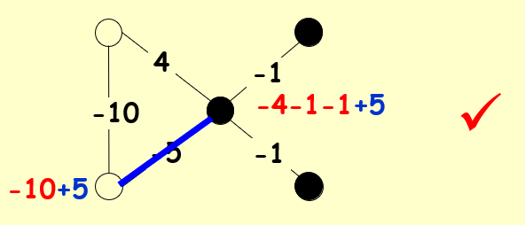

### State-flipping Algorithm
```c++
ConfigType State_flipping()
{
    Start from an arbitrary configuration S;
    while ( ! IsStable(S) ) {
        u = GetUnsatisfied(S);
        su = - su;
    }
    return S;
}
```

### 问题：它一定能终止吗？
先给出结论：一定可以！

* 结论1：状态翻转算法在进行最多 $W = \sum_e|we|$ 次迭代后一定会终止。

!!! success "证明"
    先寻找一个度量函数：

    $\large \Phi (S) = \sum_{e\;is\;good}|w_e|$

    * 当 $u$ 经过切换后 (S becomes S’):  
        1. all good edges incident to u become bad  
        2. all bad edges incident to u become good   
        3. all other edges remain the same  
   
    $\large \Phi(S^{\prime})=\Phi(S)-\sum_{e:e=(u,v)\in E}|w_{e\;is\;bad}|+\sum_{e:e=(u,v)\in E}|w_{e\;is\;good}| ≥ \Phi(S)+1$

    因为原来这个点是 unsatisfied 的，所以经过变换后好边一定变多了，又因为是整数，所以一定大于等于原来的度量函数加一。

    所以显然有， $0 ≤ \Phi ≤ W$ 。
    
### 与 local search 的关联
* Problem:  To maximize $\Phi$.
* Feasible solution set FS : configurations
* S ~ S': S' can be obtained from S by flipping a single state


* 结论2：状态翻转算法中任何局部最大值以最大化 $\Phi$ 都是稳定的配置。

!!! question "Is it a polynomial time algorithm?"
    * 结论是它并不是。$n$ 和 $w$ 一起是一个 open question。
    * 但 $n$ 和 $log w$ 就是一个可以在多项式时间内解决的问题了。


## 4.[Example] The Maximum Cut Problem.
最大切割问题：给定一个具有正整数边权重的无向图 $G = (V， E)$，我们找到一个节点分区 $(A， B)$，使穿过切割的边的总权重最大化。
$$\large
w(A,B):=\sum_{u\in A,v\in B}w_{uv}
$$

### 与 local search 的关联
* Problem:  To maximize $w(A, B)$ 。$\Phi(S) = \sum_{e\;is\;good}|w_e|$
* Feasible solution set FS : any partition (A, B) 
* S ~ S': S' can be obtained from S by moving one node from A to B, or one from B to A.

我们可以发现，其实这是 Hopfield Neural Networks 的一个特殊形式——所有的 $w_e$ 都是正数。
```c++
ConfigType State_flipping()
{
    Start from an arbitrary configuration S;
    while ( ! IsStable(S) ) {
        u = GetUnsatisfied(S);
        su = - su;
    }
    return S;
}

```

### 三个问题
#### 1.How good is this local optimum?

结论1：设 $(A， B)$ 为局部最优分区，设 $(A^*， B^*)$ 为全局最优分区，那么有 $w(A， B) ≥ \frac{1}{2}w(A^*， B^*)$。

!!! success "证明" 
    因为对于任意的 $u\in A$ ，$(A, B)$ 是局部最优解，所以

    $$\large
    \sum_{v\in A}w_{uv}≤\sum_{v\in B}w_{uv}
    $$ 

    这一步我们可以反过来想，如果不满足这个结论，那么至少有一个点需要从 $A$ 移到 $B$,但这与条件“局部最优解”相矛盾了！

    接下来，我们把所有 $u\in A$的权重相加：  

    $$\large
    2\sum_{\{u,v\}\subseteq A}w_{uv}=\sum_{u\in A}\sum_{v\in A}w_{uv}≤\sum_{u\in A}\sum_{v\in B}w_{uv}=w(A,B)
    $$

    同样地，我们对 $u\in B$ 的部分做一样的分析可以得到：  
    $$\large 
    2\sum_{\\{{u,v\\}}\subseteq B}w_{uv}≤w(A,B)
    $$ 

    所以我们有以下的式子：（式子左边是全局最优解，一定小于等于右边，右边则是各自属于 $A,B$ 的权重以及跨越 $(A,B)$ 的权重之和，也就是所有的权重）

    $$\large
    w(A^*,B^*)≤\sum_{\{u,v\}\subseteq A}w_{uv}+\sum_{\{u,v\}\subseteq B}w_{uv}+w(A,B)≤2w(A,B)
    $$


#### 2.May NOT in polynomial time?  

当没有“足够大”的改进时停止算法。  
Big-improvement-flip：只选择一个节点，该节点在翻转时至少会增加以下大小的切割值：（这个过程中有精度的损失，但是做了加速，提高了效率，本质上还是一个 trade-off 的过程）

$$
\frac{2\varepsilon}{|V|}w(A,B)
$$ 

结论1：终止后，big-improvement-flip 算法返回一个cut $(A， B)$，使得：

$$
(2 + \varepsilon) w(A， B) ≥ w(A^*， B^*)
$$

结论2：big-improvement-flip 算法在最多 $O(n/ \varepsilon log W)$ 翻转后终止。

根据时间简单描述证明：

1. 每次flip至少增加(1+epsilon/n)倍，其实是(1+2*epsilon/n)倍
2. n/epsilon次flip之后，总增长至少是2倍。利用(1+1/x)^x >= 2, 如果x>=1
3. 总量不超过W，而cut翻倍的次数不能超过logW

#### 3.Try a better local?

* 解决方案的邻域应该足够丰富，以至于我们不容易陷入糟糕的局部最优状态;但
* 解决方案的邻域不应太大，因为我们希望能够有效地搜索邻域集以查找可能的局部移动。

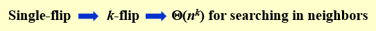

* K-L启发式算法：（翻过了尽量不再翻）

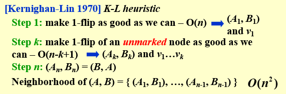

1. 第一步找一个最优的；  
2. 第二步做标记，从未标记的点中寻找；（即使被标记的当中有更好的，也翻未标记的！）

>K-L的分析还是未解决的。


!!! tip "复习时的一些补充"
    * 顶点覆盖问题中，一个点可以删除的条件是：这条边的另一个点没有被删除。如果可以删除，则任意删除一个。如果不能删除，则算法结束。剩下的点越少越好。
    * 搜索空间指的是所有可能
    
        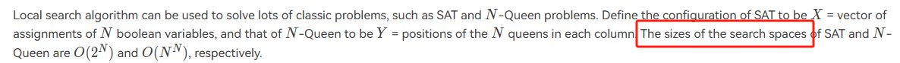

