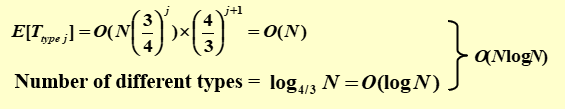

---

title: Chap 13 | “Randomized Algorithms”

hide:
  #  - navigation # 显示右
  #  - toc #显示左
  #  - footer
  #  - feedback  
comments: true  #默认不开启评论

---
<h1 id="欢迎">Chap 13 | “Randomized Algorithms”</h1>
!!! note "章节启示录"
    摆烂了。……

## 1.概述


## 2.[Example] The Hiring Problem

1. 从猎头公司聘请办公室助理
2. 每天面试不同的申请人，持续 N 天
3. 面试成本 = $C_i$ << 招聘成本 = $C_h$
4. 分析面试和招聘成本，而不是运行时间

假设雇用了 $M$ 人。
总成本：$O(NC_i+MC_h)$

* 朴素的解决方案
  
```c++
int Hiring ( EventType C[ ], int N )
{   /* candidate 0 is a least-qualified dummy candidate */
    int Best = 0;
    int BestQ = the quality of candidate 0;
    for ( i=1; i<=N; i++ ) {
        Qi = interview( i ); /* Ci */
        if ( Qi > BestQ ) {
            BestQ = Qi;
            Best = i;
            hire( i );  /* Ch */
        }
    }
    return Best;
}
```
Worst case:候选人的质量越来越高

* 假设候选人以随机顺序到达
>随机性假设：到目前为止，前 $i$ 名候选人中的任何一个都同样可能最有资格

```c++
int RandomizedHiring ( EventType C[ ], int N )
{   /* candidate 0 is a least-qualified dummy candidate */
    int Best = 0;
    int BestQ = the quality of candidate 0;

    randomly permute the list of candidates;

    for ( i=1; i<=N; i++ ) {
        Qi = interview( i ); /* Ci */
        if ( Qi > BestQ ) {
            BestQ = Qi;
            Best = i;
            hire( i );  /* Ch */
        }
    }
}
```


### Online Hiring Algorithm – hire only once
```c++
int OnlineHiring ( EventType C[ ], int N, int k )
{
    int Best = N;
    int BestQ = -  ;
    for ( i=1; i<=k; i++ ) {
        Qi = interview( i );
        if ( Qi > BestQ )   BestQ = Qi;
    }
    for ( i=k+1; i<=N; i++ ) {
        Qi = interview( i );
        if ( Qi > BestQ ) {
            Best = i;
            break;
        }
    }
    return Best;
}
```
$S_i:=$ 第 $i$ 个申请人是最好的  
当且仅当：{ A:= the best one is at position i } $\cap$ { B:=  no one at positions k+1 ~ i–1 are hired }

$$
Pr[S_i]=Pr[A\cap B] = Pr[A]*Pr[B]=(1/N)*(k/(i-1))=\frac{k}{N(i-1)}
$$

其中，

$$
Pr[B] = 1-Pr[\overline{B}]=1-(\frac{(i-1)-(k+1)+1}{i-1})=\frac{k}{i-1}
$$

$$
Pr[S] = \sum_{i=k+1}^{N}Pr[S_i]=\sum_{i=k+1}^{N}\frac{k}{N(i-1)}=\frac{k}{N}\sum_{i=k}^{N-1}\frac{1}{i}
$$


{width="300"}

## 3.[Example] Quicksort

* Central splitter := the pivot that divides the set so that each side contains <font color="red">at least n/4</font>  
小的部分要超过四分之一（大的部分不超过四分之三）

* Modified Quicksort := always select a central splitter before recursions  
每次需要先找到Central splitter再继续，若找的不是Central splitter，则需重新寻找。

* 结论1：在我们找到Central splitter之前，所需的预期迭代次数最多为 2 次。
!!! success "证明"
    其实用抽屉原理就可以证明。最坏情况时，选的不满足Central splitter的数量最多是 n/2 个。  

    

* Type j : the subproblem S is of type j if $N(\frac{3}{4})^{j+1}≤|S|≤N(\frac{3}{4})^{j}$

* 结论2：声明：最多存在 $(\frac{4}{3})^{j+1}$ 个 $j$ 类型的子问题。

$$
E[T_{type_j}]=O(N(\frac{3}{4})^j)×(\frac{4}{3})^{j+1}=O(N)
$$



## 4.附录[Skip List]
[跳表的相关定义与实现](https://www.jianshu.com/p/9d8296562806)