---

title: Chap 14 | “Parallel Algorithms”

hide:
  #  - navigation # 显示右
  #  - toc #显示左
  #  - footer
  #  - feedback  
comments: true  #默认不开启评论

---
<h1 id="欢迎">Chap 14 | “Parallel Algorithms”</h1>
!!! note "章节启示录"
    摆烂了。……这章感觉重点是几个例子的掌握

## 1.两个问题
* To describe a parallel algorithm  
    1. Parallel Random Access Machine (PRAM)
    2. Work-Depth (WD)

* To resolve access conflicts
    1. Exclusive-Read Exclusive-Write (EREW) (读写都不能并发)
    2. Concurrent-Read Exclusive-Write (CREW) (读可以并发，写不能并发)
    3. Concurrent-Read Concurrent-Write (CRCW) (读写都可以并发)
        1. Arbitrary rule (随机选择一个processor写)
        2. Priority rule (P with the smallest number) (优先级高的processor写)
        3. Common rule (if all the processors are trying to write the same value) (有相同的值时可以并发，写成功一次后就停止)

* 评估标准
    1. Work load – total number of operations: $W(n)$
    2. Worst-case running time: $T(n)$
    
    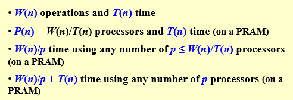


## 2.[Example] The summation problem
Input:  A(1), A(2), …, A(n)  
Output: A(1) + A(2) + … +A(n)

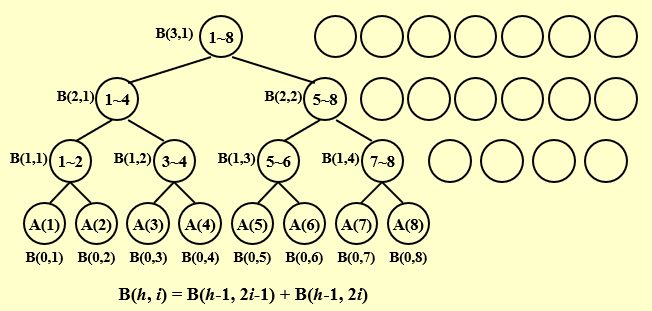

### 2.1 PRAM model
```c++
for Pi ,  1 ≤ i ≤ n  pardo
  B(0, i) := A( i )
  for h = 1 to log n do
    if i ≤ n/2^h
      B(h, i) := B(h-1, 2i-1) + B(h-1, 2i)
    else stay idle
  for i = 1: output B(log n, 1); for i > 1: stay idle
```
$T(n)=logn+2$  

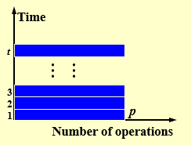

* PRAM 的两个缺点：
    1. 处理器数量变化时可迁移性差
    2. 所有处理器指令都要由程序员逐一分配，细节太多
   
### 2.2 Work-Depth (WD) Presentation
```c++
for Pi ,  1 ≤ i ≤ n  pardo
   B(0, i) := A( i )
for h = 1 to log n 
    for Pi, 1 ≤ i ≤ n/2h  pardo
        B(h, i) := B(h-1, 2i-1) + B(h-1, 2i)
for i = 1 pardo
   output  B(log n, 1)
```

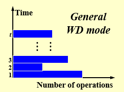

$\large T(n) = logn+2$  
$\large W(n) = n+n/2+n/2^2+…+n/2^k+1=2n,where\;\;2^k=n$  
任何WD模型的algorithm，用 $P(n)$ 个 processor，运行时间都至多为 $\large O(\frac{W(n)}{P(n)}+T(n))$
        
## 3.[Example] Prefix-Sums
Input:  A(1), A(2), …, A(n)  
Output: $\sum_{i=1}^1A(i),\sum_{i=1}^2A(i),…,\sum_{i=1}^3A(i)$

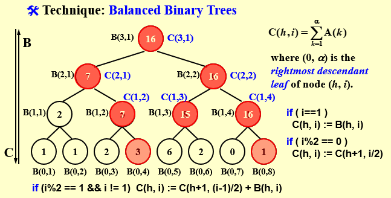

$C(h,i)=\sum_{k=1}^αA(k)$   
where (0, α) is the rightmost descendant leaf of node (h, i).（最右最底的node）
$$
    C(h,i) =
    \begin{cases}
        B(h,i)  &(i==1)\\\\
        C(h+1,i/2)  &(i\%2==0)\\\\
        C(h+1,(i-1)/2)+B(h,i) &(i\%2==1\&\&i!=1)\\\\
    \end{cases}
$$

```c++
for Pi , 1 ≤ i ≤ n pardo
  B(0, i) := A(i)
for h = 1 to log n
  for i , 1 ≤ i ≤ n/2h pardo
    B(h, i) := B(h - 1, 2i - 1) + B(h - 1, 2i)
for h = log n to 0
  for i even, 1 ≤ i ≤ n/2h pardo
    C(h, i) := C(h + 1, i/2)
  for i = 1 pardo
    C(h, 1) := B(h, 1)
  for i odd, 3 ≤ i ≤ n/2h pardo
    C(h, i) := C(h + 1, (i - 1)/2) + B(h, i)
for Pi , 1 ≤ i ≤ n pardo
  Output C(0, i)
```
$T(n)=O(logn)$  
$W(n)=O(n)$

## 4.[Example] Merging – merge two non-decreasing arrays 
A(1), A(2), …, A(n) 和 B(1), B(2), …, B(m) 变成另一个非递减数组 C(1), C(2), …, C(n+m) 

* 为了简化起见，假设：
    1. $A$ 和 $B$ 的元素成对不同
    2. $\large n = m$
    3. $\large log n$ 和 $\large n/log n$ 都是整数

1. partitioning - 将输入划分为大量独立的小作业，比如 $p$，这样最大的小作业的个数大约是 $n/p$
2. actual work  - 同时执行小作业，对每个作业使用单独的（可能是串行）算法  

### Merging  $\Rightarrow$  Ranking
将 Merging 问题转换为 Ranking 问题。本质上是得出 $A$ 中每个元素在 $B$ 中的排序位置，然后将其放在 $C$ 中对应的位置（A元素本身的下标加上在B中的位置），同理， $B$ 也一样。

$$
RANK(j, A) = i,   if A(i) < B(j) < A(i + 1), for\; 1 ≤ i < n  
$$

$$  
RANK(j, A) = 0,  if\;B(j) < A(1)   
$$

$$
RANK(j, A) = n,  if\;B(j) > A(n)  
$$

>e.g:  
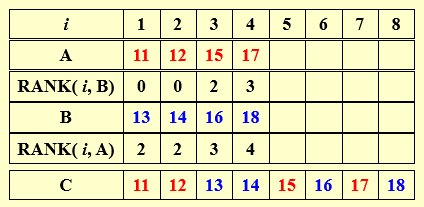


```c++
for Pi , 1 ≤ i ≤ n  pardo
    C(i + RANK(i, B)) := A(i)
for Pi , 1 ≤ i ≤ n  pardo
    C(i + RANK(i, A)) := B(i)
```
假设Ranking问题可解，则Merging可在 $T(n)=O(1)$ 和 $W(n)=O(n+m)$ 下求解

### 法一：Binary Search:
```c++
for Pi , 1 ≤ i ≤ n  pardo
    RANK(i, B) := BS(A(i), B)
    RANK(i, A) := BS(B(i), A)
```
$T(n)=O(logn)$
$W(n)=O(nlogn)$
### 法二：Serial Ranking:
```c++
i = j = 0; 
while ( i ≤ n || j ≤ m ) {
    if ( A(i+1) < B(j+1) )
        RANK(++i, B) = j;
    else RANK(++j, A) = i;
}
```
$T(n)=W(n)=O(n+m)$

>注意：串行算法中默认增加了A(n+1)和B(m+1)，它们比原始的最大元要大。  
比较：串行减少了W，但增大了T

### 法三：Parallel Ranking:   
假设 $n = m$ ;并且 $A(n+1)$ 和 $B(n+1)$ 都大于 $A(n)$ 和 $B(n)$。

* Stage 1: Partitioning  $p=n/logn$  
$A\_Select( i ) = A( 1+(i-1)logn ) \;\;  for 1 ≤ i ≤ p$  
$B\_Select( i ) = B( 1+(i-1)logn ) \;\;  for 1 ≤ i ≤ p$  
$T=O(logn)$   
$W=O(plogn)=O(n)$

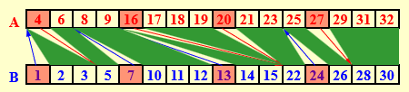

* Stage 2: Actual Ranking  
At most $2p$ smaller sized $(O(logn))$ problems.   
$T=O(logn)$  
$W=O(n)$

## 5.[Example] Maximum Finding
### 法一：在求和算法中将“+”替换为“max”
$T(n)=O(logn)$ , $W(n)=O(n)$

### 法二：比较所有对
```c++
for Pi , 1 ≤ i ≤ n  pardo
    B(i) := 0
for i and j, 1 ≤ i, j ≤ n  pardo
    if ( (A(i) < A(j)) || ((A(i) = A(j)) && (i < j)) )
            B(i) = 1
    else B(j) = 1
for Pi , 1 ≤ i ≤ n  pardo
    if B(i) == 0
       A(i) is a maximum in A
```
$T(n)=O(1)$ , $W(n)=O(n^2)$

### 法三：Doubly-logarithmic Paradigm
设 $\large h=loglogn$ 是一个整数 ($\large n=2^{2^h}$)

1. 将 $n$ 个元素划分为 $\sqrt{n}$ 个长 $\sqrt{n}$ 的段

    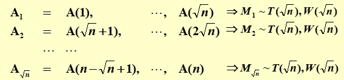

    共用 $T_1=T(\sqrt{n})$ ， 空间需要 $W_1 = \sqrt{n}W(\sqrt{n})$。之后在 $max1,max2,…,max\sqrt{n}$ 中找最大(用比较所有对的方法)，$T_2=O(1)=c$ ，$W_2=O(\sqrt{n}^2)=O(n)$ 。  
    综上所述，$T≤T_1+T_2 = T(\sqrt{n})+c$ , $W≤W_1+W_2=\sqrt{n}W(\sqrt{n})+O(n)$

    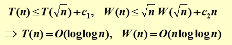

2. 将 $n$ 个元素划分为 $\large \frac{n}{h}$ 个长 $h$ 的段
   
    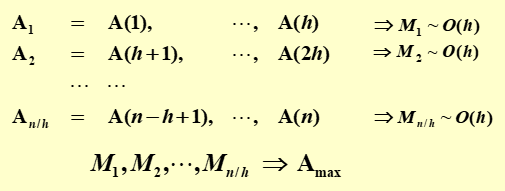
    
    共用 $T_1 = O(h)$ ， $W_1 = n/h * O(h)$。之后在 $max1,max2,…,max\frac{n}{h}$ 中找最大(用以 $\sqrt{n}$ 为划分的方式找最大)， $T_2 = O(loglog\frac{n}{h})$ , $W_2 = O(\frac{n}{h}loglog\frac{n}{h})$ 。   
    综上所述，$T ≤ T_1+T_2=O(h)+O(loglog\frac{n}{h})$ ， $W≤W_1+W_2=n/h * O(h)+O(\frac{n}{h}loglog\frac{n}{h})$ 

    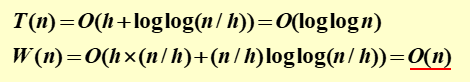

### 法四：Random Sampling
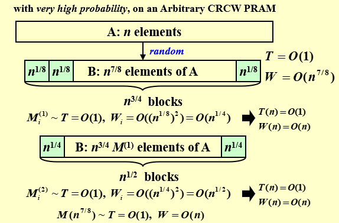

* 第一步：选取 $n^{7/8}$ 个数，每 $n^{1/8}$ 为一个block，总共有 $n^{7/8}/n^{1/8}=n^{3/4}$ 个block 。  
  $T=O(1)$ , $W=O(n^{7/8})$
* 第二步：对每个block用比较所有对，得到 $n^{3/4} $ 个max值。   
  $T=O(1)$ , $W_i=O((n^{1/8})^2)=O(n^{1/4})$ , $W=n^{3/4}*W_i=O(n)$
* 第三步：将 $n^{3/4} $ 个max值进行进一步寻找，此时设置每 $n^{1/4}$ 为一个block，总共有 $n^{3/4}/n^{1/4}=n^{1/2}$ 个block。
* 第四步：对每个block用比较所有对，得到 $n^{1/2} $ 个max值。
  $T=O(1)$ , $W_i=O((n^{1/4})^2)=O(n^{1/2})$ , $W=n^{1/2}*W_i=O(n)$
* 第五步：继续向下迭代

最终可以解出 $n^{7/8}$ 个中最大的，但不是 $n$ 个数中最大的。  
该算法在 $n$ 个元素中找到最大值。 它以 $O(1)$ 时间和 $O(n)$ 功运行的概率非常高。在此时间和工作复杂度内未完成的概率为 $O(1/n^c)$。
