---

title: Chap 2 | Relational Model 

hide:
  #  - navigation # 显示右
  #  - toc #显示左
  #  - footer
  #  - feedback  
comments: true  #默认不开启评论

---
<h1 id="欢迎">Chap 2 | Relational Model</h1>
!!! note "章节启示录"
    本章节是课程的第二节内容，虽然但是，这是我第一篇DB的笔记。感觉前面的部分有点乱，但主要是一些定义和概念的熟悉。本章节上课讲的速度比较快，主要内容是关系基本模型、各种键值和各种关系代数式的表示，听起来难度不大，但要想自己解决题目还需要多加熟悉和练习。

## 1.关系模型
!!! abstract "相关定义"
    1.关系模型非常简单和优雅。  
    2.关系数据库是基于关系模型的一个或多个关系的集合。  
    3.关系是包含**行**和**列**的表。  
    4.关系模型的主要优点是其简单的数据表示，并且可以轻松表达复杂的查询。  
一个简单的例子：  
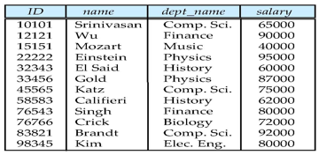

## 2.关系数据库的基本结构

### 2.1基本定义
一般地，给出一个集合的集群（多个集合的意思，我自己取的名字）$D_1,D_2,……，D_n(D_i=a_{ij} |_{j=1……k})$,   
关系 $r$ 则是 $D_1×D_2×……×D_n$ （笛卡尔积）的一个子集。  
因此，一个关系是一个 $n-tuples （可以理解为行）的集合 $(a_{1j},a_{2j},……，a_{nj})$，且 $a_{ij}∈D_i(i∈[1,n])$  
  
一个实际例子：  
>$D_1$ = 导师集合 = {张清玫, 刘逸},   
$D_2$ = 专业集合 = {计算机, 信息},   
$D_3$ = 学生集合 = {李勇, 刘晨, 王名}   
则$D_1×D_2×D_3$=  
{(张清玫, 计算机, 李勇),   
(张清玫, 计算机, 刘晨),   
(张清玫, 计算机, 王名),   
(张清玫, 信    息, 李勇),   
(张清玫, 信    息, 刘晨),   
(张清玫, 信    息, 王名),   
(刘   逸, 计算机, 李勇),   
(刘   逸, 计算机, 刘晨) }  

一个代数化例子：  
>$customer-name$ = {Jones, Smith, Curry, Lindsay}  
$customer-street$ = {Main, North, Park}   
$customer-city$ = {Harrison, Rye, Pittsfield}   
则 $r$ =   
{(Jones, Main, Harrison),   
(Smith, North, Rye),                 
(Curry, North, Rye),                  
(Lindsay, Park, Pittsfield)}  

!!! tips "关系理论第一范式"
    关系中的所有分量不可再分，即它是**原子的（atomic）**。  
    关系中的所有分量（attribute）其实就是像excel中的表的每一列的属性值，每一个属性值的取值范围称为它的域（domain）。

    * 一个特殊的值 $NULL$ 存在于所有的域中，$NULL$ 的含义有两种，分别是：①不存在 ②存在但不知道。

!!! abstract "两个定义（relation schema和relation instance）"
    * 1.relation schema（关系架构）：它描述了关系中的结构。直接看例子。  
    $Student-schema$ = (**sid:** string, **name:** string, **sex:** string, **age:** int, **dept:**  string)   
    我们可以把这个架构简写为：  
    $Student-schema$ = (sid, name, sex, age, dept)   
    那么我们如果把这个例子抽象成一个理论定义，接下来的表述应该是这样的：  
    假设$A_1,A_2,……,A_n$ 是属性值（attributes），那么 $R=(A_1,A_2,……,A_n)$ 是一个关系架构（relation schema）。  
    而$r(R)$则是一个在关系架构$R$中的关系。
    * 2.relation instance（关系实例）：是指关系中的具体的值，其中行被称为tuple，列被称为attribute。
    
### 2.2Key(码/键)
!!! abstract "几个键"
    * 1.超码（superkey）：在一个关系中唯一地标识一个元组。  
    >e.g:{ID} 和 {ID，name} 都是超码
    * 2.候选码(candidate key)：超码的最小子集。
    候选码的任意真子集都不可能是超码，候选码就是最小的超码。  
    >e.g:{ID}是一个候选码
    * 3.主码（primary key）：是候选码之一。唯一或者没有。由数据库设计者指定，不指定的话就没有主码。一般**<u>主码</u>**会有下划线标注
    * 4.外码（foreign）:关系 $r1$ 的属性中包含关系 $r2$ 的主码,该主码就是 $r1$ 的外码。

## 3.代数表达式
### 3.1基本代数关系表达式
1.选择（Select）  

$\large\sigma_p(r)=\{t|t∈ r\ and\ p(t)\}$
>e.g:$\large\sigma_{branch-name='Perryridge'}(account)$  
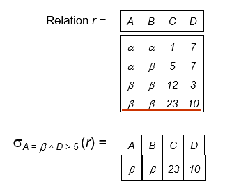  

2.投影（Project）  

$\large\Pi_{A_1,A_2,……，A_k}(r)$  
>e.g:$\large\Pi_{account-number,balance}(account)$    
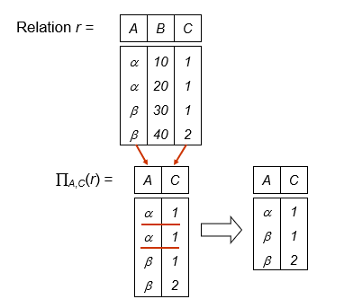  

3.并（Union）  

$\large r \cup s = \{t|t∈r\ or\ t∈s\}$
>e.g:$\large\Pi_{customer-name}(depositor) \cup \Pi_{customer-name}(borrower)$  
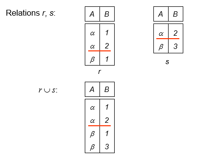  

4.差（Set Difference）  

$r-s=\{t|t∈r\ and\ t\ \notin s\}$  
>e.g:  
  

5.笛卡尔积（Cartesian Product）  
>e.g:  
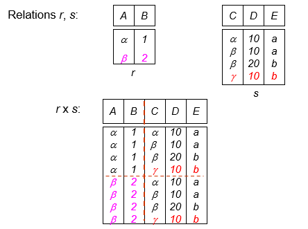
$r×s=\{\{t,q\}|t∈r \ and \ q∈s\}$  

6.重命名（Rename）  

$\rho_{Newname}(E)$

!!! example "一个例子🌰"
    下面将借助一个银行的例子熟悉以上提到的6个基本操作。  

    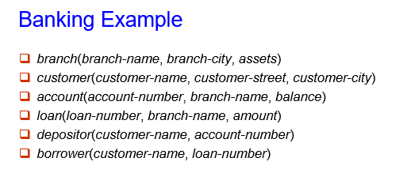
    === "Example1"
        * Find all loans of over $1200.   
        $\large\sigma_{amount>1200}(loan)$
    === "Example2"
        * Find the loan number for each loan of an amount greater than $1200.   
        $\large\Pi_{loan-number}(\sigma_{amount>1200}(loan))$
    === "Example3"
        * Find the names of all customers who have a loan, or an account, or both, from the bank.   
        $\large\Pi_{customer-name}(borrower) \cup \Pi_{customer-name}(depositor)$
    === "Example4"
        * Find the names of all customers who at least have a loan and an account at bank. 
        $\large\Pi_{customer-name}(borrower) \cap \Pi_{customer-name}(depositor)$
    === "Example5"
        * Find the names of all customers who have a loan at the Perryridge branch.   
        **Query 1:**  
        $\large\Pi_{customer-name}(\sigma_{branch-name='Perryidge'}\sigma_{borrower.loan-number=loan.loan-number}(borrower×loan))$  
        **Query 2:**  
        $\large\Pi_{customer-name}(\sigma_{borrower.loan-number=loan.loan-number}(borrower×(\sigma_{branch-name='Perryridge'}(loan))))$  
        第二个算法要更加的好，因为它在做笛卡尔积之前做了一些筛选，减少了表的大小。
    === "Example6(最大值问题)"
        * Find the largest account balance (i.e., **self-comparison**).  
        $Step1$:Rename account relation as d.   
        $Step2$:Find the relation including all balances except the largest one. 
        $\large\Pi_{account.balance}(\sigma_{account.balance<d.balance}(account×\rho_d(account)))$   
        $Step3$:Find the largest account balance.   
        $\large\Pi_{balance}(account)-\Pi_{account.balance}(\sigma_{account.balance<d.balance}(account×\rho_d(account)))$  

        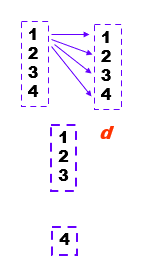
### 3.2其他代数关系表达式
1.交（Set Intersection）  

$\large r\cap s=\{t|t∈ r\ and\ t∈s\}$  
提示：$\large r\cap s=r-(r-s)$ 
>e.g:  
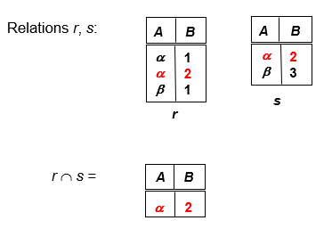  

2.自然连接（Natural Join）  
若$R=(A,B,C,D),S=(B,D,E)$  
$\large r\bowtie s=\Pi_{r.A,r.B,r.C,r.D,s.E}(\sigma_{r.B=s.B\ \cap \ r.D=s.D}(r×s))$  
>e.g:  
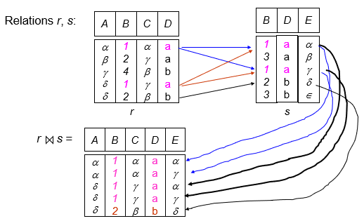  

注意：  
(1) r, s必须含有共同属性(名和域都对应相同);  
(2) 连接二个关系中同名属性值相等的元组;   
(3) 结果属性是二者属性集的并集, 但消去重名属性。    

3.除（Division）  

$\large r\div s=\{t|t∈\Pi_{R-S}(r)\ \cap\ [\forall u ∈ s(tu ∈ r)]\}$
>e.g:  
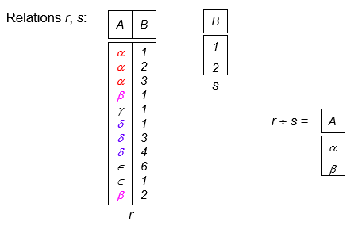  

4.赋值（Assignment）  

$r\gets s$  
>e.g:    
$\large temp \gets \Pi_{R-S}(r)$

!!! example "一个例子🌰"
    同样地我们来看一个例子。  
    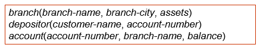  
    === "Example1"
        * Find all customers who have an account from at least the “Downtown” and the “Uptown” branches.   
        **Query1**:  
        $\large\Pi_{customer-name}(\sigma_{branch-name='Downtown'}(depositor\bowtie account))\newline \cap\Pi_{customer-name}(\sigma_{branch-name='Uptown'}(depositor\bowtie account))$
        **Query2**:  
        $\large\Pi_{customer-name,branch-name}(depositor\bowtie account)\div \rho_{temp(branch-name)}(\{('Downtown'),('Uptown')\})$
    === "Example2"
        * Find all customers who have an account at all branches located in Brooklyn city. 
        $\large\Pi_{customer-name,branch-name}(depositor \bowtie account)\div \Pi_{branch-name}(\sigma_{branch-city='Brooklyn'}(branch))$
    === "Example3"
        * 查询选修了全部课程的学生学号和姓名  
        涉及表: 课程信息course(cno, cname, pre-cno, credits), 选课信息 enrolled(sno, cno, grade), 学生信息student(sno, sname, sex, age)     
        当涉及到求“全部”之类的查询，常用**“除法”**。  
        $Step1$:找出全部课程号：$\Pi_{Cno}(Course)$  
        $Step2$:找出选修了全部课程的学生的学号：$\Pi_{Sno,Cno}(enrolled)\div \Pi_{Cno}(Course)$  
        $Step3$:与student表自然连接（连接条件Sno）获得学号、姓名：$\Pi_{Sno,Cno}(enrolled)\div \Pi_{Cno}(Course) \bowtie Pi_{Sno,Sname}(student)$

!!! tips "运算顺序"
    * project  $\Pi$
    * select $\sigma$
    * cartesian product  $×$
    * join,divison $\bowtie \ \div$ 
    * intersection $\cap$
    * union,difference $\cup \ -$

### 3.3扩展代数关系表达式
1.广义投影（Generalized Projection）
通过允许在投影列表中使用算术函数来扩展投影操作。  
$\large\Pi_{F_1,F_2,……，F_n}(E)$  
>e.g:    
给定一个关系$credit-info(customer-name, limit, credit-balance)$  
$\large\Pi_{customer-name,limit'-'credit-balance}(credit-info)$  
'-'表示减法而不是连接词。  
这个代数关系表达式找出了每个人可以多花多少钱。

2.聚合函数（Aggregate Functions）   
聚合函数接受值的集合并返回单个值作为结果。 

* $avg$: average value 
* $min$: minimum value 
* $max$: maximum value 
* $sum$: sum of values 
* $count$: number of values   
  
$G_1,G_2,……，G_n \ \LARGE g_{\large F_1(A_1),F_2(A_2),……，F_n(A_n)}\large(E)$  

>e.g:  
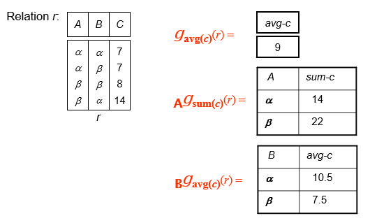     

3.外部连接（Outer Join）   
连接操作的扩展，可避免信息丢失。  
$\large ⟕ $ 和 $\large ⟖ $
>e.g:  
   
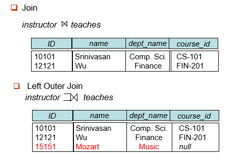  
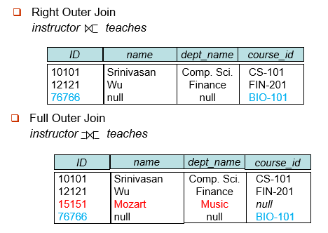

!!! info "Null Values"
    **关于NULL值的一些讨论。**  
    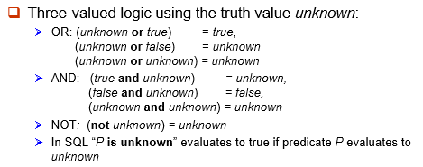