---

title: Chap 3 | SQL 

hide:
  #  - navigation # 显示右
  #  - toc #显示左
  #  - footer
  #  - feedback  
comments: true  #默认不开启评论

---
<h1 id="欢迎">Chap 3 | SQL </h1>
!!! note "章节启示录"
    本章节主要涉及SQL相关的语句编写。其中的内容和Chap02的关系代数表达式很像，可以说基本一致了，难度上也不是很大，但有一些细节需要注意，而且需要多加练习才可以熟练掌握。

## 1.Data Definition Language(DDL) 

### 1.1 SQL 中的域类型
!!! abstract "域类型"
    * $\large char(n)$:固定长度的字符串，具有用户指定的长度。
    * $\large varchar(n)$:可变长度字符串，用户指定的最大长度为 n。
    * $\large int$:整数（整数的有限子集，与计算机相关）。
    * $\large smalint$:小整数（整数域类型的与计算机相关的子集）。
    * $\large numeric(p,d)$:定点数，用户指定的精度为 p 位，小数点右侧为 d 位。
    * $\large real,double precison$：浮点数和双精度浮点数，具有与机器相关的精度。
    * $\large float(n)$:浮点数，用户指定的精度至少为 n 位。
    * $\large Null values$:在所有域类型中都允许。将属性声明为非 null 将禁止该属性的 null 值。
    * $\large date$:日期，包含（4 位数字）年、月和日期。
    >e.g:date ‘2007-2-27’  
    * $\large Time$:一天中的时间，以小时、分钟和秒为单位。
    >e.g:time ‘11:18:16’, time ‘11:18:16.28’ 
    * $\large timestamp$:日期加上一天中的时间。
    >e.g:timestamp ‘2011-3-17 11:18:16.28’ 
### 1.2 Create Table
Create table command:  

* CREATE TABLE r(A1,D1,A2,D2,……,An,Dn,(integrity constraint_1),……,(integrity constraint_k))

$r$ 是关系的名称。    
每个 $A_i$ 都是关系 $r$ 架构中的一个属性名称。     
$D_i$ 是属性 $A_i$ 域中值的数据类型。  

>e.g:  
声明 branch_name 作为分支的主键，并确保资产的值为非负数。  
**Method1:**  
CREATE TABLE *branch*(*branch_name* char(20) not null,*branch_city* char(30),assets integer,primary key(*branch_name*),check(assets>=0));  
**Method2**:  
CREATE TABLE branch2(*branch_name* char(20) primary key,*branch_city* char(30),assets integer,check(assets >= 0)); 

### 1.3 Drop and Alter Table 
Drop Table command:  

* DROP TABLE r
>e.g:  
DROP TABLE branch2  

Alter Table command:

* ALTER TABLE r ADD A D
* ALTER TABLE r ADD (A_1,D_1,……,A_n,D_n); 


A 是要添加到关系 r 中的属性的名称。   
D 是 A 的域。
### 1.4 Create Index
Create Index command:

* CREATE INDEX <i-name\> ON  <table-name\> 

>e.g:  
create index b_index on branch (branch_name);   
create **unique** index uni_acnt_index on account (account_number); 

## 2.Basic Structure 
### 2.1 The Select Clause
Select command: 

* SELECT branch_name   
  FROM loan   
* SELECT **distinct** branch_name   
  FROM loan （强制消除重复项）
* SELECT **all** branch_name   
  FROM loan （显示所有）
* SELECT * FROM loan （select 子句中的* 表示所有属性。）
### 2.2 The Where Clause
WHERE 子句指定了结果必须满足的条件。  
Where command:  

* SELECT loan_number  
  FROM loan    
  WHERE branch_name = ‘Perryridge’ and amount > 1200    

在 WHERE 子句中，可以使用逻辑连接词（包括 AND、OR 和 NOT）组合比较结果，并且可以使用 BETWEEN 比较运算符来指定范围。

* SELECT loan_number  
  FROM loan    
  WHERE amount BETWEEN 90000 AND 100000 
### 2.3 The From Clause
FROM 子句列出查询中涉及的关系。  
From command:

* SELECT *   
  FROM borrower, loan 

>e.g:  
查找所有在Perryridge branch有贷款的customer name、loan number and loan amount。  
SELECT customer_name, **borrower**.loan_number, amount   FROM borrower, loan   
WHERE borrower.loan_number = loan.loan_number and   
      &nbsp;&nbsp;&nbsp;&nbsp;&nbsp;&nbsp;&nbsp;&nbsp;&nbsp;&nbsp;&nbsp;branch_name = ‘Perryridge’ 
### 2.4 The Rename Operation
Rename command:

* old_name as new_name 

元组变量可以通过 as 子句在 FROM 子句中定义。  
>e.g:  
Find the customer names, their loan numbers and amount for all customers of the bank.   
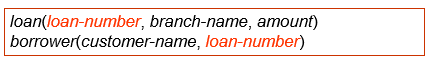  
SELECT customer_name, T.loan_number, S.amount   
FROM borrower as T, loan as S   
WHERE T.loan_number = S.loan_number 

### 2.5 String Operations
SQL 中可以使用以下两个特殊字符用于对字符串进行比较：

* % --- matches any substring (likes * in the file system). 
* _ --- matches any character (like ? in the file system). 

串联：
  
* SELECT ‘客户名=’ **||** customer_name   
  FROM customer   
  WHERE … 
  
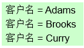  

对元组的显示进行排序: 

* order by  
>e.g:  
按字母顺序列出所有在Perryridge branch有贷款的客户的姓名。  
SELECT distinct customer_name  
FROM borrower A, loan B   
WHERE A.loan_number = B.loan_number and   
&nbsp;&nbsp;&nbsp;&nbsp;&nbsp;&nbsp;&nbsp;&nbsp;&nbsp;&nbsp;&nbsp;branch_name = ‘Perryridge’  
order by customer_name 

我们可以指定 desc 作为降序，或者指定 asc 作为升序，对于每个属性，升序是默认的。
>e.g:  
SELECT * FROM customer   
ORDER BY customer_city, customer_street desc,   customer_name 
## 3.Set Operations
在 SQL 中，使用集合运算，包括 UNION、INTERSECT 和 EXCEPT 对关系运算，并对应于关系代数运算 $\cup$ 、 $\cap$ 和 $\neg$。
>e.g:  
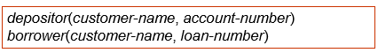  
**Example1:**查找所有拥有贷款或账户或两者都有的客户。  
(SELECT customer_name FROM depositor)  
UNION  
(SELECT customer_name FROM borrower)  
**Example2:**查找所有同时拥有贷款和账户的客户。  
(SELECT customer_name FROM depositor)  
INTERSECT  
(SELECT customer_name FROM borrower)   
**Example3:**查找所有有账户但没有贷款的客户。  
(SELECT customer_name FROM depositor)  
EXCEPT  
(SELECT customer_name FROM borrower) 
## 4.Aggregate Functions

* avg(col): average value 
* min(col): minimum value 
* max(col): maximum value 
* sum(col): sum of values 
* count(col): number of values 

>e.g:  
查找Perryridge branch的平均账户余额。  
SELECT **avg**(balance) avg_bal   
FROM account   
WHERE branch_name = ‘Perryridge’
!!! warning "注意"
        
      
    聚合函数之外的 select 子句中的属性必须用**GROUP BY**显示。 
    >e.g:查找**每个**分行的平均账户余额。  
    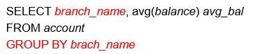

* Having Clause:
聚合函数之外的 HAVING 子句中的属性必须用**GROUP BY**显示。
>e.g:  
查找位于city Brooklyn中the average account balance 超过 1,200 美元的所有分行的名称。  
SELECT A.branch_name, avg(balance)   
FROM account A, branch B   
WHERE A.branch_name = B.branch_name and   
&nbsp;&nbsp;&nbsp;&nbsp;&nbsp;&nbsp;&nbsp;&nbsp;&nbsp;&nbsp;&nbsp;branch_city =‘Brooklyn’   
GROUP BY A.branch_name   
**HAVING avg(balance) > 1200** 

!!! info "总结"
    The execution order of SELECT: 

    * From → where → group (aggregate) → having → select → distinct → order by 
    * 请注意，having 子句中的谓词在组形成之后应用，而 where 子句中的谓词在形成组之前应用。
    === "Example1"
        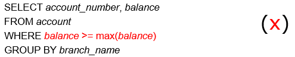 

        执行顺序错误，先执行WHERE后执行GROUP BY,需要使用having
    === "Example2"
        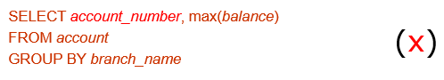

        account_number没有对应的GROUP BY


## 5.Nested Subqueries 
嵌套子查询是嵌套在另一个查询中的select_from_where表达式。  
>e.g:  
查找所有在银行拥有账户和贷款的客户。  
SELECT distinct customer_name  
FROM borrower  
WHERE customer_name in(SELECT customer_name                                        FROM depositor) 

!!! abstract "其他命令"
    * some/all
    === "some"
        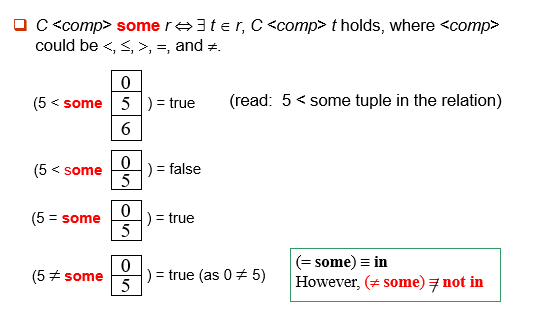
    === "all"
        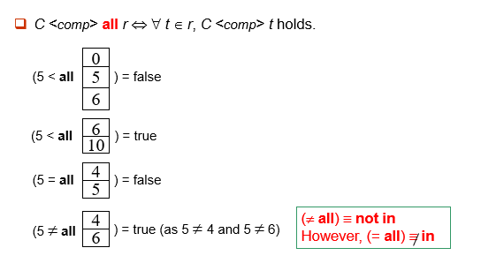
    <hr></hr>

    * exists/not exists
    === "exists"
        $\Large r\Leftrightarrow r\neq \varnothing$
    === "not exists"
        $\Large r\Leftrightarrow r= \varnothing$
    <hr></hr>

    * unique/not unique  
    检查子查询的结果中是否有任何重复的元组。
    === "unique"
        at most one
    === "not unique"
        at least two 
!!! warning "注意"
    Note: The derived table must have its own alias.   
    (不管是否被引用，导出表(或称嵌套表)必须给出别名)
    >e.g:  
    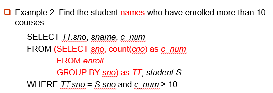

    
## 6.Views
提供一种机制，以隐藏某些用户的视图中的某些数据。
>Provide a mechanism to hide certain data from the view of certain users.

创建视图命令：

* CREATE VIEW <v_name\> AS   
  SELECT c1, c2, … From …   
  CREATE VIEW <v_name\> (c1, c2, …) AS   
  SELECT e1, e2, … FROM … 

删除视图命令：   

* DROP VIEW <v_name\> 

>e.g:  
如果关系 S（a，b，c） 拆分为两个子关系 S1（a，b） 和 S2（a，c）,要如何实现逻辑数据独立性？  
1)  create table S1 …;      create table S2 …  
2)  insert into S1 select a, b from S;  
    &nbsp;&nbsp;&nbsp;&nbsp;insert into S2 select a, c from S;  
3) drop table S;  
4) create view S(a,b,c) as select a,b,c from S1, S2 where S1.a = S2.a;

## 7.Derived Relations 
### With Clause
WITH 子句允许在本地为查询定义视图，而不是全局定义视图。
>e.g1:  
查找所有余额最高的账户。
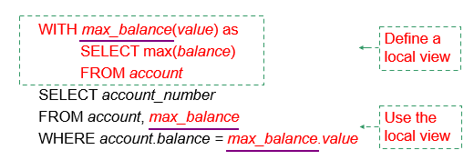  

>e.g2:  
查找所有账户存款总额大于所有分行账户存款总额平均值的分行。  
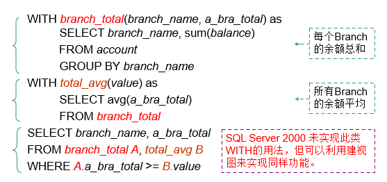

!!! example "练习"
    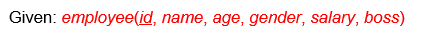
    === "练习1"
        === "题面"
            Find the employee who is younger than his/her boss and whose gender is different from his/her boss’s. 
        === "答案"
            ```SQL
            Select e2.name 
            From employee as e1,employee as e2  
            Where e1.id=e2.boss
                  and e2.age<e1.age
                  and e1.gender <> e2.gender
            ```
    === "练习2"
        === "题面"
            Find the employee who has the maximum number of underlings. 
        === "答案"
            ```SQL
            With max_underlining(id,value) as
            Select boss,count(id)
            From employee 
            Group by boss

            With max_id(id) as
            Select id 
            From max_underlining.value>=
                (select max(value)
                from max_underlinings
                )
            Select name
            From employee
            Where id in 
              (select id
              from max_id
              )
            ```
## 8.Modification of the Database 
### 8.1 Deletion
Deletion command:

*  DELETE FROM <table | view\>   
   [WHERE <condition\>]

>e.g:  
DELETE FROM account   
WHERE branch_name = ‘Perryridge’ 

!!! warning "删除顺序/删除数量"
    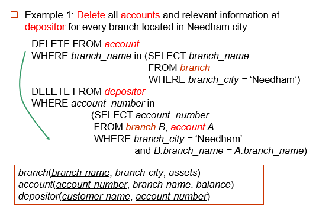

    * **应该**先删除depositor，再删除account

    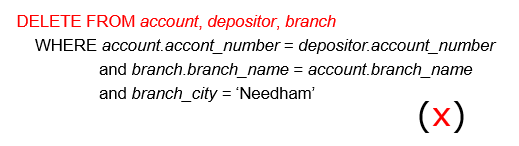

    * **只能**一张表一张表删除
    
    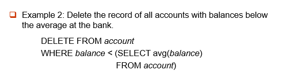

    * **会动态变化**，删除一个值后可能会影响avg

### 8.2 Insertion
Insertion command(省略attribute时，需要按照已有的schema顺序赋值) : 

* INSERT INTO <table|view\> [(c1, c2,…)]   
  VALUES (e1, e2, …) 

* INSERT INTO <table|view> [(c1, c2,…)]   
  SELECT e1, e2, …   
  FROM … 

>e.g:  
添加新元组并将余额设置为null。
INSERT INTO account   
VALUES ('A_777','Perryridge', null)   
或者  
INSERT INTO account (account_number, branch_name)   
VALUES ('A_777', 'Perryridge')   

### 8.3 Updates
Updates command:  

* UPDATE <table | view\>   
SET <c1 = e1 [, c2 = e2, …]\> [WHERE <condition\>] 

>e.g:  
将所有余额超过 10,000 美元的账户增加 6%，所有其他账户将获得 5%。  
UPDATE account   
SET balance = balance * 1.06   
WHERE balance > 10000   
UPDATE account 
SET balance = balance * 1.05   
WHERE balance ≤ 10000   
**注意：**若交换顺序则错误，因为部分存款可能乘1.05后会大于10000，导致其再乘1.06。

!!! warning "视图的更新"
    建立在单个基本表上的视图，且视图的列对应表的列，称为“行列视图” 。  
    查询操作时，VIEW与基表没有区别，但对VIEW的更新操作有严格限制，如**只有行列视图，可更新数据**。  
    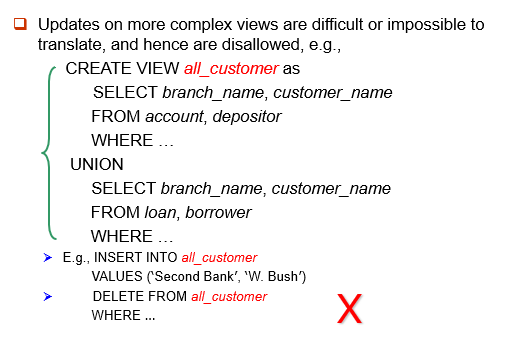
### 8.4 Indexes
索引是用于加快对具有索引属性指定值的记录的访问速度的数据结构。  
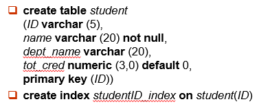
>e.g:  
select * 
from student  
where ID = ‘12345’    
可以使用索引来查找所需的记录，而无需查看学生的所有记录。
### 8.5 Transactions
COMMIT WORK：使Transactions的所有更新永久保存在数据库中。(断电也不影响)  
ROLLBACK WORK: 撤消Transactions执行的所有更新。

!!! example "一个例子🌰"
    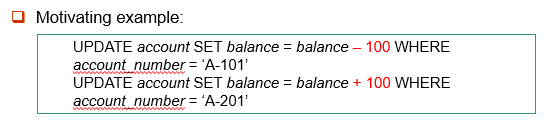

    * 如果一个步骤成功而另一个步骤失败，则数据库处于不一致状态。因此，这两个步骤要么成功，要么两者都不成功。**原子性（atomicity）**
    * 如果任何步骤失败，则可以通过 **ROLLBACK WORK** 撤消已完成的所有工作。
    * 在系统发生故障时，会自动 **ROLLBACK WORK** 未完成的事务。

在某些数据库系统中，每个成功执行的 SQL 语句都会自动提交。自动提交通常可以关闭：  
`SET AUTOCOMMIT=0;`
>e.g:  
```SQL
SET AUTOCOMMIT=0

UPDATE account SET balance=balance-100 WHERE ano='1001';  
UPDATE account SETbalance=balance+100 WHERE ano='1002';  
COMMIT;  
      
UPDATE account SET balance=balance -200 WHERE ano='1003';  
UPDATE account SET balance=balance+200 WHERE ano='1004';        
COMMIT;  

UPDATE account SET balance=balance+balance*2.5%;  
COMMIT; 
``` 
## 9.Joined Relations
* Join condition – 定义两个关系中的哪些元组匹配，以及连接结果中存在哪些属性。
* Join type – 定义如何处理每个关系中不匹配另一个关系中的任何元组（基于连接条件）。  
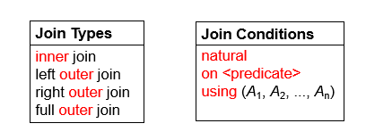

!!! example "一个例子🌰"
    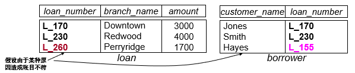  
    === "Inner Join"
        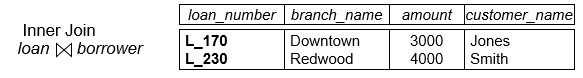
    === "Left Out Join"
        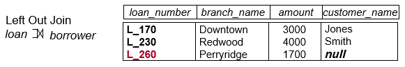
    === "Right Out Join"
        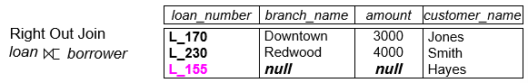
    === "Full Outer Join"
        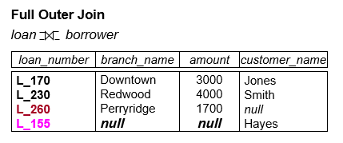

* Combination of Join Type and Join Condition:  

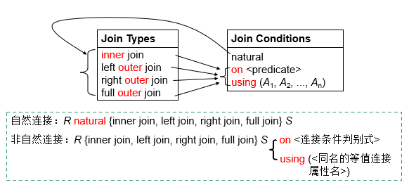  
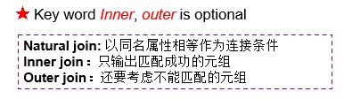

!!! example "一个例子🌰"
    === "natural inner join"
        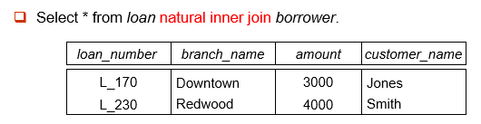
    === "natural right outer join "
        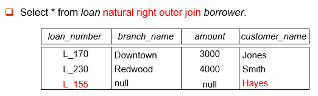
    === "inner join"
        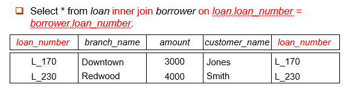 

        * 非自然连接，容许不同名属性的比较，且结果关系中不消去重名属性（attribute）。
    === "left outer join"
        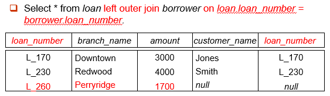  

        
    === "full outer join"
          
        
        * 使用using的连接类似于natural连接，但仅以using列出的公共属性为连接条件。


    


