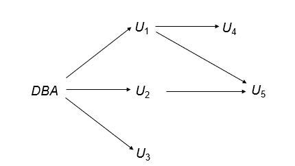
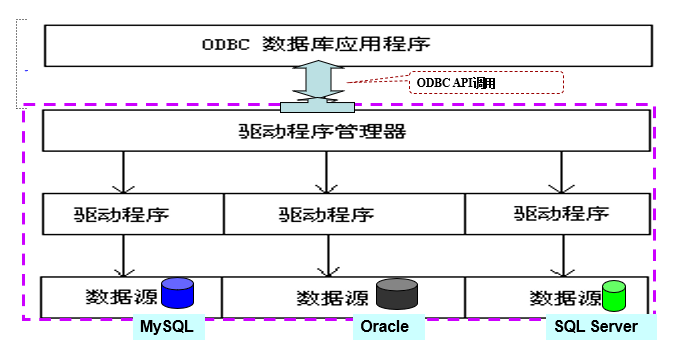
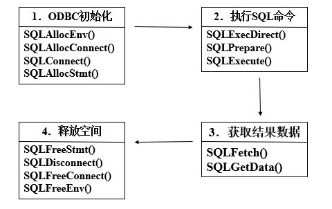

---

title: Chap 4 | Advanced SQL 

hide:
  #  - navigation # 显示右
  #  - toc #显示左
  #  - footer
  #  - feedback  
comments: true  #默认不开启评论

---
<h1 id="欢迎">Chap 4 | Advanced SQL </h1>
!!! note "章节启示录"
    本章节主要涉及高级SQL相关的语句编写。理解上难度不大，但要熟练运用，还是有难度的！。

## 1.SQL Data Types and Schemas 
### 1.1 User-defined types 
```SQL
Create type person_name as varchar (20)   
Create table student   
            (sno char(10) primary key,   
            sname person_name,   
            ssex char(1),   
            birthday date)   
Drop type person_name   
```

### 1.2 Domains

``` SQL
Create domain Dollars as numeric(12, 2) not null; 
Create domain Pounds as numeric(12,2); 
Create table employee 
            (eno char(10) primary key, 
            ename varchar(15), 
            job varchar(10), 
            salary Dollars, 
            comm Pounds); 

```

!!! warning "对比"
    与 TYPE 不同的是，DOMAIN 是在现有基本类型的基础上添加了约束和限制的新类型，它是对现有类型进行包装的一种方式。DOMAIN 允许我们在不修改底层数据类型的情况下，根据数据类型的特定需求创建新类型。

### 1.3 Large-object types 
大型对象（例如，照片、视频、CAD 文件等）将以大型对象的方式存储：

* blob: 二进制大型对象 （Binary Large Object），对象是大量未解释的二进制数据（其解释留给数据库系统外部的应用程序）
* clob: 字符大对象 -- 对象是字符数据的大型集合，当查询返回大型对象时，将返回指针，而不是大型对象本身。

!!! info "BLOB in MySQL"
    * TinyBlob ： 0 ~ 255 bytes.
    * Blob： 0 ~ 64K bytes.
    * MediumBlob ： 0 ~ 16M bytes.
    * LargeBlob : 0 ~ 4G bytes.

## 2.Integrity Constraints 
完整性约束：确保当数据库的授权更改时，不会导致数据一致性的丢失。

### 2.1 Constraints on a single relation 

* Not null
* Primary key 
* Unique
* Check (P), where P is a predicate   

前三者之前已经介绍过，这里我们重点来看第四种约束方式。  
Check command:
```SQL
Create table branch2 
            (branch_name varchar(30) primary key, 
            branch_city varchar(30), 
            assets integer not null, 
            check (assets >= 100)) 

```
* SQL-92 中的 check 子句允许限制域.
>e.g:  
Create domain hourly-wage numeric(5, 2)   
Constraint value-test check(value > = 4.00) 

* 子句约束值测试是可选的;用于指示更新违反了哪个约束。
### 2.2 Assertions
Assertion是一个谓词，表示我们希望数据库始终满足的条件。它将对**多个关系**进行**复杂的**检查条件！  

Assertion command:  
```SQL
CREATE ASSERTION <assertion-name> 
        CHECK <predicate>; 
```
创建Assertion时，系统会对每个更新进行测试。（当谓词为 true 时，它是 OK，否则报告错误。）

>e.g:  
每个分行的所有贷款金额的总和必须小于该分行所有账户余额的总和。
```SQL
CREATE ASSERTION sum-constraint CHECK 
                (not exists (select * from branch B 
                where (select sum(amount) from loan 
                        where loan.branch-name = B.branch-name) 
                            > (select sum(balance)from account 
                        where account.branch-name = B.branch-name))) 

```

### 2.3 Triggers
Triggers是系统自动执行的语句，在数据库数据被修改时会自动触发，并执行预先设定好的程序。  
要设计Trigger的机制，我们必须设计以下两点：  

* 指定执行触发器的条件。
* 指定触发器执行时要执行的操作。

>e.g:  
假设银行不允许负账户余额，而是通过（以下操作）处理透支：  
1.将帐户余额设置为零  
2.创建透支金额的贷款，为该贷款提供与透支账户的帐号相同的贷款编号
那么执行触发器的条件就是：对账户关系的更新导致了余额值为负值。
```SQL
CREATE TRIGGER overdraft-trigger after update on account 
    referencing new row as nrow for each row 
    when nrow.balance < 0 
        begin atomic 
        insert into borrower 
            (select customer-name, account-number from depositor 
             where nrow.account-number = depositor.account-number) 
            insert into loan values 
            (nrow.account-number, nrow.branch-name, – nrow.balance) 
            update account set balance = 0 
            where account.account-number = nrow.account-number 
        end 

```

!!! abstract "Trigger的相关性质"
    * 触发事件可以是插入、删除或更新。  
    * 更新时的触发器可以限制为特定属性。
    >e.g:  
    Create trigger overdraft-trigger   
    &nbsp;&nbsp;&nbsp;&nbsp;&nbsp;&nbsp;&nbsp;&nbsp;&nbsp;after update of balance on account

    * 可以引用更新前后的属性值。
    >Referencing old row as: for deletes and updates.   
    Referencing new row as: for inserts and updates.

    * 触发器不能用于直接实现外部操作。
  
* 总结一下提到的三个操作：Check,Assertion,Trigger。

| **Check** | **Assertion** |**Trigger**|
| ----------- | ----------- | ---------- | 
| 单表中做简单判断|可以做复杂判断操作|可以做复杂判断操作|
| 性能较好| 效率较低| **？（应该比Check性能要差一些）**|
|只能阻止|只能阻止|可以做额外操作|

## 3.Authorization
这里我们主要研究针对DATABASE的授权权限。 

!!! abstract "对数据库各部分的授权形式:"
    * Read authorization：允许读取，但不允许修改数据。
    * Insert authorization：允许插入新数据，但不允许修改现有数据。
    * Update authorization：允许修改，但不允许删除数据。
    * Delete authorization：允许删除数据。
  
!!! abstract "修改数据库架构的授权形式:"
    * Index authorization：允许创建和删除索引。
    * Resources authorization：允许创建新关系。
    * Alteration authorization：允许添加或修改关系中的属性。
    * Drop authorization：允许删除关系。

* 授予权限：从一个用户到另一个用户的授权传递可以用授权图来表示。  
  1.此图的节点是用户。  
  2.图形的根是数据库管理员。  
  3.$U_i \longrightarrow U_j$表示用户 $U_i$ 已向 $U_j$ 授予了权限。    



### 3.1 GRANT
GRANT command:  
```SQL
GRANT <privilege list> ON <table | view> 
TO <user list> 
```

* <privilege list\>:操作  
* <user list\>：  
  user-ids  
  public：允许所有有效用户授予权限  
  A role:（稍后会详细介绍）

>e.g:  
允许被授予权限的用户将权限传递给其他用户。
```SQL
grant select on branch to U1 with grant option; 
      gives U1 the select privileges on branch and 
      allows U1 to grant this privilege to others. 

```

!!! abstract "Roles"
    通过创建相应的“角色”，可以只指定一类用户具有通用权限的角色。
    ```SQL
    Create role teller; 
    Create role manager; 
    Grant select on branch to teller; 
    Grant update (balance) on account to teller; 
    Grant all privileges on account to manager; 
        Grant teller to manager; 
        Grant teller to alice, bob; 
        Grant manager to avi; 
    
    ```

### 3.2 Revoking Authorization 
Revoke 语句用于撤销授权。  
Revoke command:  
```SQL
REVOKE <privilege list> ON <table | view> 
FROM <user list> [restrict | cascade] 
```
撤销用户的权限可能会导致其他用户也失去该权限，这称为撤销级联（**cascade**）。
>e.g:  
Revoke select on branch from U1, U3 cascade; 

### 3.3 Audit
审计跟踪是对数据库的所有更改（插入/删除/更新）的日志。  
Audit command: 

```SQL
/*语句审计：*/
AUDIT <st-opt> [BY <users>] [BY SESSION | ACCESS]
[WHENEVER SUCCESSFUL | WHENEVER NOT SUCCESSFUL] 
```

* 当 BY <users\> 缺省，对所有用户审计。 
* BY SESSION每次会话期间，相同类型的需审计的SQL语句仅记录一次。 
* 常用的<st-opt\>：table, view, role, index, … 
* 取消审计：NOAUDIT …(其余同audit语句)。 


>e.g:  
审计用户scott每次成功地执行有关table的语句 (create table, drop table, alter table)。   
```SQL
audit table by scott by access whenever successful
```

```SQL
/*对象（实体）审计*/ 
AUDIT <obj-opt> ON <obj> | DEFAULT [BY SESSION | BY ACCESS]  
[WHENEVER SUCCESSFUL | WHENEVER NOT SUCCESSFUL] 
```

* 实体审计对所有的用户起作用。 
* ON <obj\> 指出审计对象表、视图名。 
* ON DEFAULT 对其后创建的所有对象起作用。 
* 取消审计：NOAUDIT … 

>e.g:  
审计所有用户对student表的delete和update操作。   
```SQL
audit delete, update on student 
```

!!! question "怎么看审计结果？"

    * 审计结果记录在数据字典表: sys.aud$中，也可从dba_audit_trail, dba_audit_statement, dba_audit_object中获得有关情况。 
    * 上述数据字典表需在DBA用户（system）下才可见。 

## 4.Embedded SQL 
SQL功能不完备（计算，资源...），因此 SQL 标准定义了各种编程语言（如 Pascal、PL/I、Fortran、C 和 Cobol）的 SQL 嵌入。  
嵌入 SQL 查询的语言称为宿主语言，主机语言中允许的 SQL 结构包括嵌入式 SQL。  
`EXEC SQL` 语句用于识别对预处理器的嵌入式 SQL 请求：`EXEC SQL <嵌入式 SQL 语句> END_EXEC`注意：这因语言而异，例如，Java 嵌入使用 `# SQL { .... }`

### 4.1 Query
* 单行查询：  
```SQL 
EXEC SQL BEGIN DECLARE SECTION; 
char V_an[20], bn[20]; 
float  bal; 
EXEC SQL END DECLARE SECTION; 
……. 
scanf(“%s”, V_an);   /*读入账号,然后据此在下面的语句获得bn, bal的值*/ 
EXEC SQL SELECT branch_name, balance INTO :bn, :bal FROM 
account WHERE account_number = :V_an; 
END_EXEC
printf(“%s, %s, %s”, V_an, bn, bal); 
……. 
```
!!! warning "变量的使用"
    :V_an, :bn, :bal是宿主变量，可在宿主语言程序中赋值，从而将值带入SQL。宿主变量在宿主语言中使用时不加:号。

* 多行查询

!!! example "一个例子🌰"  
    在宿主语言中，查找某个帐户中超过可变金额美元的客户的姓名和城市。

    * Step1:在 SQL 中指定查询并为其声明游标(CURSOR)
    ```SQL
    EXEC SQL 
    DECLARE c CURSOR FOR 
    SELECT customer_name, customer_city 
    FROM depositor D, customer B, account A 
    WHERE D.customer_name = B.customer_name 
        and D.account_number = A.account_number 
        and A.balance > :v_amount 
    END_EXEC  
    ```

    * Step2:OPEN 语句使查询被计算
    ```SQL
    EXEC SQL OPEN c END_EXEC 
    ```

    * Step3:FETCH 语句将查询结果中的一个元组的值放在宿主语言变量上。  
    ```SQL
    EXEC SQL FETCH c INTO :cn, :ccity END_EXEC 
    ```
    重复调用以提取查询结果中的连续元组。

    * Step4:CLOSE 语句使数据库系统删除保存查询结果的临时关系。  
    ```SQL
    EXEC SQL CLOSE c END_EXEC 
    ```

    上述细节因语言而异，例如，Java 嵌入定义了 Java 迭代器来单步执行结果元组。

### 4.2 Updates
* 单行修改:
```SQL
Exec SQL BEGIN DECLARE SECTION; 
    char an[20]; 
    float bal; 
Exec SQL END DECLARE SECTION; 
…… 
scanf(“%s, %d”, an, &bal);   /* 读入账号及要增加的存款额*/
EXEC SQL update account set balance = balance + :bal 
    where account_number = :an; 
…… 
```

* 多行修改：
可以通过声明游标来更新元组。  
```SQL
Exec SQL BEGIN DECLARE SECTION;  
    char an[20]; 
    float bal; 
Exec SQL END DECLARE SECTION; 
EXEC SQL DECLARE csr CURSOR FOR 
    SELECT * 
    FROM account 
    WHERE branch_name = ‘Perryridge’ 
    FOR UPDATE OF balance; 
…… 
EXEC  SQL OPEN csr; 
While (1) { 
    EXEC SQL FETCH csr INTO :an, :bn, :bal; 
        if (sqlca.sqlcode <> SUCCESS) BREAK; 
          ……   /* 由宿主语句对an, bn, bal中的数据进行相关处理(如打印) */
        EXEC SQL update account 
        set balance = balance + 100 
        where CURRENT OF csr; 
    } 
…… 
EXEC SQL CLOSE csr; 
…… 
```

## 5.Dynamic SQL
允许程序在运行时构造和提交 SQL 查询。  
```SQL
char *sqlprog = “update account 
                set balance = balance * 1.05 
                where account_number = ?” 
EXEC SQL PREPARE dynprog  FROM :sqlprog; 
char v_account [10] = “A_101”; 
……
```
动态 SQL 程序包含一个 ？，它是执行 SQL 程序时由 'using' 变量提供的值的占位符。

## 6.ODBC and JDBC
### 6.1 ODBC
ODBC提供了一个公共的、与具体数据库无关的应用程序设计接口API 。它为开发者提供单一的编程接口，这样同一个应用程序就可以访问不同的数据库服务器。 


* ODBC编程基本流程:  



!!! example "一个例子🌰"
```SQL
int ODBCexample()   // 程序结构 
{ 
    RETCODE error; 
    HENV env;   /* environment */ 
    HDBC conn;   /* database connection */ 
    SQLAllocEnv(&env); 
    SQLAllocConnect(env, &conn);   /* 建立连接句柄 */ 
    SQLConnect (conn, “MySQLServer”, SQL_NTS, “user”, SQL_NTS, “password”, SQL_NTS);  /* 建立用户user与数据源的连接，  SQL_NTS表示前 一参量以null结尾 */ 
    { …. Main body of program … }   /* 细节在下方 */ 
    SQLDisconnect(conn); 
    SQLFreeConnect(conn); 
    SQLFreeEnv(env); 
}

/*Main body of program*/ 
 …… 
{char branchname[80]; 
float balance; 
int lenOut1, lenOut2; 
HSTMT stmt; 
    SQLAllocStmt(conn, &stmt);   /* 为该连接建立数据区，将来存放查询结果 */ 
char * sqlquery = “select branch_name, sum (balance) from account 
                group by branch_name”;   /* 装配SQL语句 */ 
error = SQLExecDirect(stmt, sqlquery, SQL_NTS); /* 执行sql语句,查询结果存放到数据区stmt ，同时sql语句执行状态的返回值送变量error*/ 
```

### 6.2 JDBC
JDBC 是一个 Java API，用于与支持 SQL 的数据库系统进行通信。
```SQL
public static void JDBCexample(String dbid, String userid, String passwd) 
{ 
    try { 
          Class.forName ("oracle.jdbc.driver.OracleDriver"); 
          Connection conn = DriverManager.getConnection 
                    ("jdbc:oracle:thin:@aura.bell_labs.com:2000:bankdb", userid, passwd); 
          Statement stmt = conn.createStatement(); 
                … Do Actual Work …. 
          stmt.close(); 
          conn.close(); 
          } 
     catch (SQLException sqle) { 
          System.out.println("SQLException : " + sqle); 
                        } 
} 

```
