---

title: Chap 5 | Entity-Relationship Model

hide:
  #  - navigation # 显示右
  #  - toc #显示左
  #  - footer
  #  - feedback  
comments: true  #默认不开启评论

---
<h1 id="欢迎">Chap 5 | Entity-Relationship Model</h1>
!!! note "章节启示录"
    忘记写了。

## 1.E-R Diagram 

### 1.1 定义
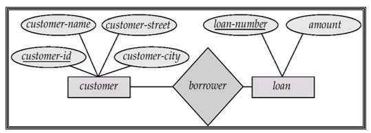

* 矩形表示实体集。  
* 菱形代表关系集。  
* 线将属性链接到实体集，将实体集链接到关系集。  
* 椭圆表示属性。  
* 双椭圆表示多值属性。  
* 虚线省略号表示派生属性。  
* 下划线表示主键属性（稍后将研究）。  

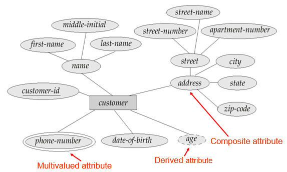

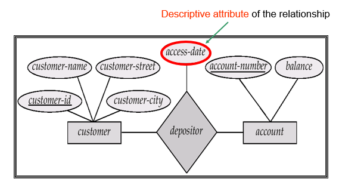

* 自环联系集：  
Role:实体在关系中扮演的角色，例如，“manager”和“worker”称为角色;它们指定员工实体如何通过 Works-for 关系集进行交互。  
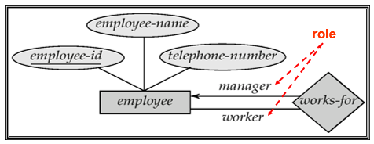

### 1.2 表示方法
* 我们通过在关系集和实体集之间绘制一条有向线 （$\longrightarrow$）来表示“一”的，绘制一条无向线（——）来表示“多” 。

=== "“一”对“一”"
    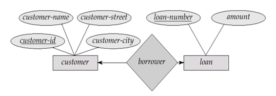
=== "“一”对“多”"
    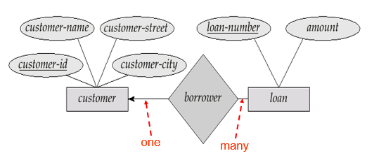
=== "“多”对“一”"
    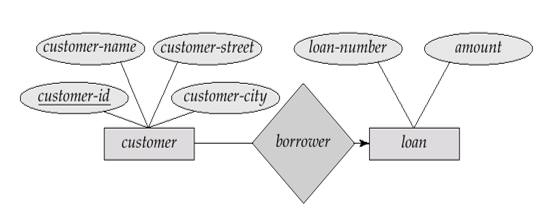
=== "“多”对“多”"
    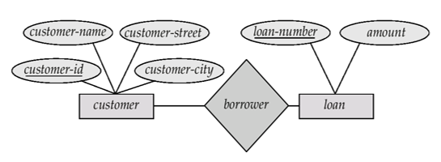

* Total Participation （全参与） （用双线表示）：实体集中的每个实体都参与关系集中的至少一个关系。

>例如，借款人参与贷款是总的。每笔贷款都必须有一个通过借款人关联的客户。

* Partial participation （部分参与）：某些实体可能不参与关系集中的任何关系。

>例如，客户对借款人的参与是部分的。

全参与和部分参与约束，反映了一个实体参与关联的数目下限：0次，还是至少1次。 
>e.g:  
一个客户可以借多笔或0笔贷款，一笔贷款至少、至多属于一个客户。 
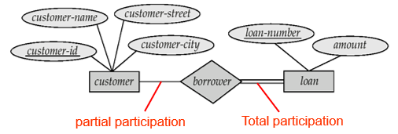

!!! abstract "替代表示法"
    E.g., 一个客户可以借多笔或0笔贷款，一笔贷款至少、至多属于一个客户。 
    
    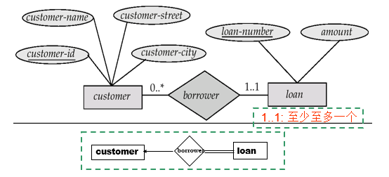

!!! question "Binary vs. Non-Binary Relationships"
    使用二元关系可以更好地表示某些看似非二元的关系。

    >例如，将孩子与他/她的父亲和母亲联系起来的三元关系父母最好用父亲和母亲两种二元关系代替。
    

    !!! success "converting"
        通常，任何非二元关系都可以通过创建人工实体集来使用二元关系来表示。  
        将实体集 A、B 和 C 之间的非二元关系 R 替换为实体集 E 和三个新关系集。 

        * 为 E 创建特殊的标识属性。
        * 将 R 的任何属性添加到 E。
        * 对于 R 中的每个关系（ai、bi、ci），创建 RA、RB、RC。  
        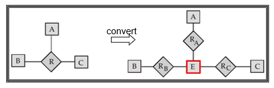
        >e.g:  
        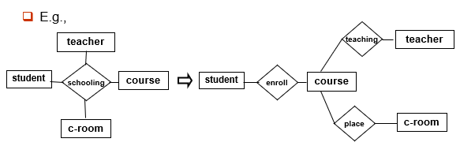

## 2.Weak Entity Sets
没有主键的实体集称为弱实体集。  
>e.g:  
还贷登记表 payment(pay-num, pay-date, pay-amount). 假设为了清楚起见，pay-num按对应的每项贷款分别编号(都从1, 2, 3 …开始), 这样，pay-num就不是码，并且该实体集没有码。故payment是弱实体集。 pay-num is discriminator or partial key (**分辨符或部分码**). 
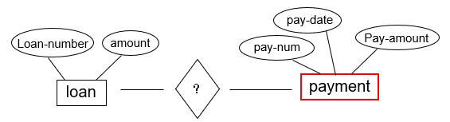

弱实体集的存在取决于标识实体集或所有者实体集（标识实体集或属主实体集）的存在。

* 弱实体集的E-R图表示法

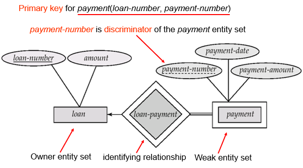

## 3.Extended E-R Features 

### 3.1 Specialization (特殊化、具体化) 
* 自上而下的设计流程;我们指定实体集中的子分组，这些子分组与集合中的其他实体不同。
* 这些子分组将成为具有属性或参与不适用于较高级别实体集的关系的较低级别实体集。
* 属性继承 – 较低级别的实体集继承与其链接的高级实体集的所有属性和关系参与。

>e.g:  
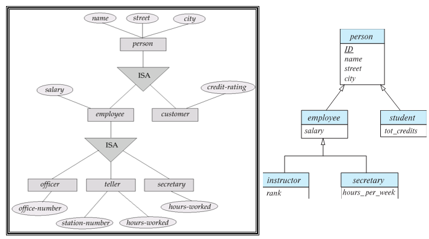

### 3.2 Generalization (泛化、普遍化) 
* Completeness constraint （完全性约束） -- 指定较高级别实体集中的实体是否必须至少属于概化中的一个较低级别实体集。  
    Total:实体必须属于较低级别的实体集之一。  
    Partial:实体不一定属于较低级别的实体集之一。

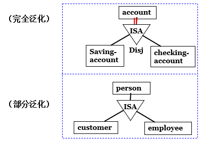

### 3.3 Aggregation（复合实体集）
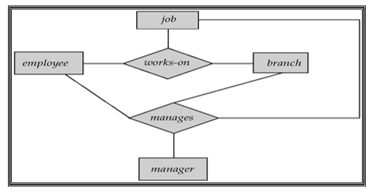

“workss-on”和“manages”关系集表示重叠信息。  
每个管理关系都对应于一个工作关系。
但是，某些工作关系可能与任何管理关系不对应。
因此，我们不能抛弃工作关系。

通过聚合可以消除这种冗余。
将关系视为一个抽象实体。允许关系之间的关系。将关系抽象为新实体。

在不引入冗余的情况下，下图表示：
员工在特定分支机构从事特定工作。
员工、分支机构、工作组合可能具有关联的经理。

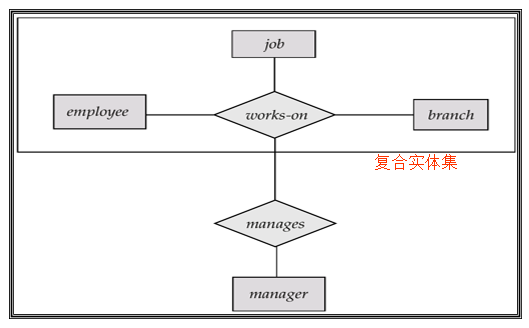

### 3.5 总结
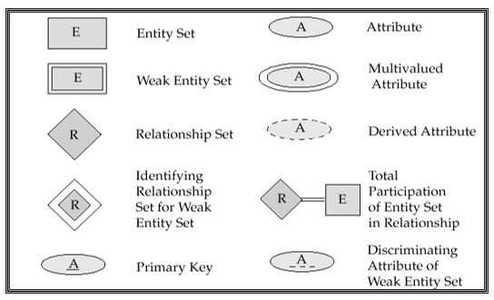
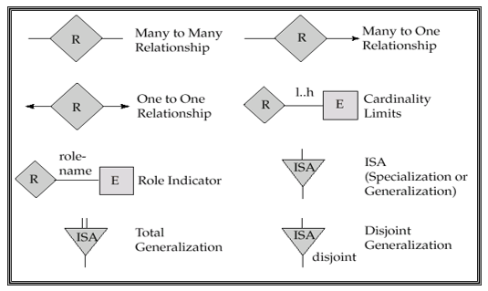

* Alternative E-R Notations 

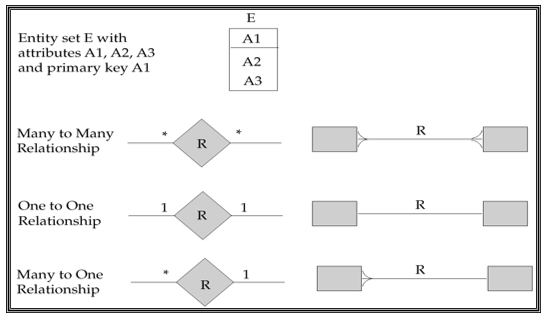
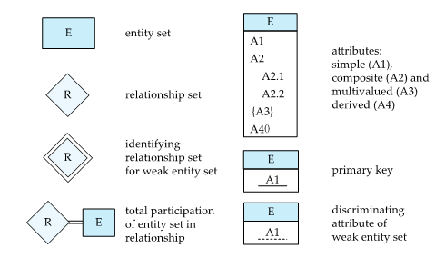
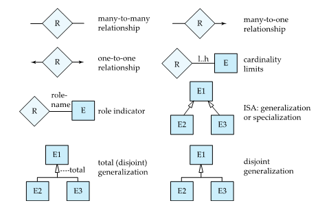

## 4.Reduction of an E-R Schema to Tables（将 E-R 架构简化为表）
* Composite attributes（组合属性）:  
    例如，给定的实体集客户具有组合属性名称(名字和姓氏)。与实体集对应的表具有两个属性：
    

* 只存“树的叶子节点”  
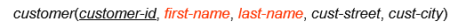

* Multivalued attribute（多值属性）:  
    例如，员工的多值属性：  
    拆成两个表    
    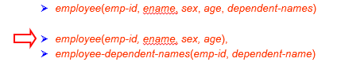

* Weak Entity Sets（弱实体集）:  
    弱实体集变成一个表，需要包含标识强实体集的主键。
    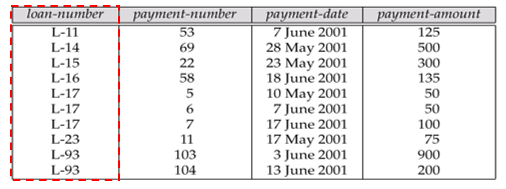  
    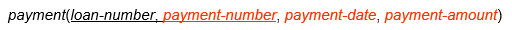

 

