---

title: Chap 6 | Relational Database Design

hide:
  #  - navigation # 显示右
  #  - toc #显示左
  #  - footer
  #  - feedback  
comments: true  #默认不开启评论

---
<h1 id="欢迎">Chap 6 | Relational Database Design</h1>
!!! note "章节启示录"
    本章节讲了一些 ~~奇奇怪怪~~ 的东西。关键应该是函数的依赖关系及其保持，还有闭包的概念，后续是两个范式。上课有点没听懂，希望整理的时候可以搞懂吧。

## 1.First Normal Form 
* 如果 R 的所有属性域都是原子的，那么关系模式 R 符合第一范式 （1NF）。  
对于关系数据库，要求所有关系都位于 1NF 中。

## 2.Pitfalls in Relational Database Design （关系数据库设计中的陷阱）

* Redundancy (冗余)：  
>分支机构名称、分支城市和资产的数据将针对分支机构提供的每笔贷款重复进行。  

问题：浪费空间，可能导致不一致。

* Updating anomaly (更新异常)：
>修改资产值，需要更改许多元组。

问题：使更新复杂化，引入不一致的可能性。

* Insert/delete anomalies (插入/删除异常)。
如果有密钥：（分支名称、客户名称、贷款号码）  
或者使用 Null 值：（如果没有键）
要存储有关分支的信息，如果没有贷款存在，可以使用空值，但它们很难处理。


前情提要完毕，下面将进入本章节的正题。我们先来看看我们的目标。
!!! abstract "目标"
    * 确定特定关系 R 是否为“良好”形式。--- 无冗余    
    * 如果关系 R 不是“好”形式，请将其分解为一组关系 {R1， R2， ...， Rn}，使得
    每个关系都处于良好的状态。
    * 这个分解被称为无损连接分解。

    * 我们的理论基于：
    **Functional** **dependencies** （函数依赖）
    **Multivalue** **dependencies** （多值依赖）

## 3.Functional Dependencies （函数依赖）

* 定义：数据库中函数的依赖关系与数学中的函数很相近，我们可以进行类比：数学中 $x$ 能够决定 $f(x)$ 或者说 $y$ ，而在数据库中，我们有以下的说法：  
$y$ 依赖于 $x$ , $x$ 决定 $y$

>e.g:  
Consider r(A, B) with the following instance of r.   
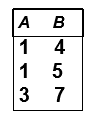  
在这里，因为若B属性值确定了，则A属性值也唯一确定了；因此B → A成立。

\#\#下面是几个前置定义。 

* 平凡的函数依赖：$α \rightarrow β ,if\;\; β\subsetα$
* 非平凡的函数依赖：$α \rightarrow β ,if\;\; β\not\subsetα$
* 函数依赖的闭包：给定一组功能依赖关系 $F$，则 F 在逻辑上隐含某些其他功能依赖关系。$F$ 逻辑上隐含的所有功能依赖关系的集合称为 $F$ 的闭包，用 $F^+$ 表示。
>e.g:  
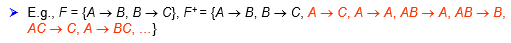
* 属性的闭包：给定一组属性 $a$，在 $F$ 下由 $a$ 所直接和间接函数决定的属性的集合称为 $a$ 的闭包，用 $a^+$ 表示。

### 3.1 函数依赖的用途
* 1.测试关系，看看它们在一组给定的功能依赖关系 F 下是否合法。
>如果关系 r 在函数依赖关系的集合 F 下是合法的，我们说 r 满足 F。
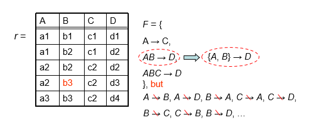  
$AB \rightarrow D$ 意味着 $\{A,B\} \rightarrow D$
* 2.指定schema上的合法关系集的约束。
>如果 R 上的所有法律关系 r 都满足函数依赖关系 F 的集合，则 F 在 R 上成立。
!!! warning "注意："
    * 容易判别一个r是否满足给定的F;
    * 不易判别F是否在R上成立。不能仅由某个r推断出F。
    R上的函数依赖F, 通常由定义R的语义决定。 


### 3.2 Armstrong’s Axioms （登月定理——~~我瞎起的名字~~）
因为Armstrong读起来真的很像阿姆斯特朗（bushi）

* reflexivity （自反律）：$if\;\; β\subset α，then\;\;a \rightarrow β$
* augmentation （增补律）: $if\;\; α\rightarrow β,then\;\;γα\rightarrow γβ$,同时有 $γα\rightarrow β$
* transitivity （传递律）: $if\;\;α\rightarrow β,and\;\;β\rightarrow γ,then\;\; α\rightarrow γ$

下面是登月定理的补充定理，我也把它们一起放在登月定理的部分中了。

* union （合并律）: $if\;\; α\rightarrow β\;\;and\;\;α\rightarrow γ,then\;\;α\rightarrow βγ$
* decomposition （分解律）: $if\;\;α\rightarrow βγ,then\;\;α\rightarrow β\;\;and\;\;α\rightarrow γ$ （其实我更喜欢称它为分配律）。
* pseudotransitivity （伪传递律）: $if\;\;α\rightarrow β\;\;and\;\;γβ\rightarrow\delta,then\;\;αγ\rightarrow\delta$

>分配律的证明如下：  


!!! question "一个问题：How to test whether a is a superkey? "
    * 方法一：先找 $F^+$，然后对 $F^+$ 中的所有 $a \rightarrow β_i$，看 $\{β_1， β_2， β_3， ...\} = R$ 是否成立。但是计算 $F^+$ 并不容易。
    * 方法2：找到 $a$ 的闭包。
    
    由于方法一中需要寻找 $F^+$ ，且比较麻烦，于是引入了一个新的问题，如何找到 $a$ 的闭包 $a^+$ 。

!!! question "How to get $a^+$ ?"
    ```
    Algorithm for computing a+, the closure of a under F 
        result := a; 
        while (changes to result) do 
            for each β → α in F do 
                begin 
                    If β 属于 result then result := result 并 γ 
                end; 
            a+ := result 
    ```
    且看一个例子来理解一下:
    >e.g:  
    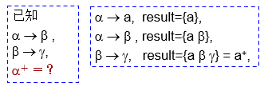

### 3.3 属性闭包的用途
* Testing for a superkey（测试超码）：$α \rightarrow R\;\;?$  
为了测试 $α$ 是否是超码，我们计算 $a^+$，然后检查 $a^+$ 是否包含 R 的所有属性，即检查 $R \subset a^+$

* Testing functional dependencies（测试功能依赖关系）： $α \rightarrow β\;\;?$
要检查功能依赖关系 $α \rightarrow β$ 是否成立（或者换句话说，在 $F^+$ 中），仅检查 $β \subset a^+$ 。  
这是一个简单而便宜的测试，非常有用。

* Computing the closure of F （计算 $F$ 的闭包）：$F^+ = ?$
对于每个 $γ \subset R$，我们找到闭包 $γ^+$，对于每个 $S \subset γ+$，我们输出一个功能依赖关系 $γ \rightarrow S$，所有 $γ \rightarrow S$ 形成 F+。

### 3.4 正则覆盖
正则覆盖 $F_c$ 是函数依赖集 $F$ 的最小化。得到 $F_c$ 的关键步骤是消去现有函数依赖中的extraneous（无关的、多余的）属性，从而排除相应的函数依赖，使函数依赖集最小化。 

* 要消去现有函数依赖 → 中的extraneous（无关的、多余的）属性，无非有2种情况：   

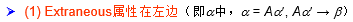  


* 对于情况(1), $Aα^{\prime} \rightarrow β$ : 如果 $α^{\prime} \rightarrow β$ 已经由原来的函数依赖集 $F$ 所蕴涵（即 $F$ 中已经包含了 $α^{\prime} \rightarrow β$，或F可以推出$α^{\prime} \rightarrow β$ ），则根据Armstrong公理， $α^{\prime} \rightarrow β$ 可以推出 $Aα^{\prime} \rightarrow β$ ，因此 $Aα^{\prime} \rightarrow β$ 是多余的 (replace $Aα^{\prime} \rightarrow β with α^{\prime} \rightarrow β$ )，也即A是多余的属性。也就是说，如果F蕴涵F，则左属性A可删除，只要保留剩余部分就可以了。
* 对于情况（2），$α \rightarrow Aβ^{\prime}$ ，等价于${α \rightarrow β^{\prime}, α \rightarrow A}$，如果 $α \rightarrow A$ 可以由其余的函数依赖所蕴涵，则说明 $α \rightarrow A$ 多余，即 $α \rightarrow Aβ^{\prime}$ 中的 $A$ 多余，只要保留 $α \rightarrow β^{\prime}$ 就可以了。换句话说，如果我们把 $F$ 中去掉 $α \rightarrow A$ 之后余下的部分叫 $F^{\prime}$ , 即 $F^{\prime} = ((F – \{α \rightarrow β\}) \cup \{α \rightarrow(β – A)\})$，则如果 $F^{\prime}$ 可以推出 $α \rightarrow A$ ，这说明 $α \rightarrow A$ 多余，只要保留 $F^{\prime}$ 就可以了。也就是说，如果 $F^{\prime}$ 蕴涵 $F$ ，则右属性 $A$ 可删除。

>e.g:  
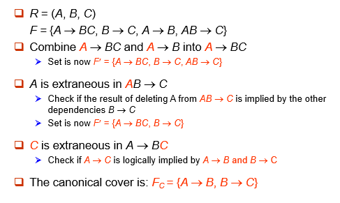

## 4.Decomposition
无损连接分解的条件： 分解后的二个子模式的共同属性必须是R1或R2的码（适用于一分为二的分解）。 

* 分解时要注意的问题是依赖的保持。

>e.g:  
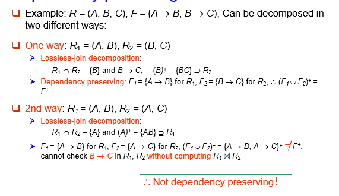


* 分解结果的测试：  
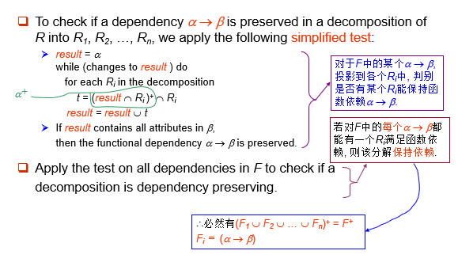

## 5.Boyce-Codd Normal Form（BC范式）
* 定义: 若关系模式 $R$ 属于 BCNF 中，相对于功能依赖关系的集合 $F$，如果对于 $F^+$ 中 $α\rightarrow β$ 形式的所有功能依赖关系，其中 $a\subset R$ and $β\subset R$，至少满足以下条件之一：
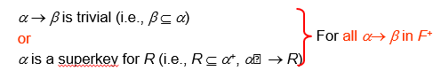

>e.g:  
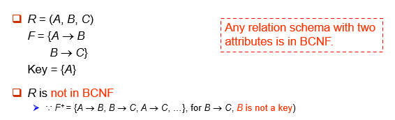

!!! abstract "性质"
    任意一个只有两个属性值的关系一定满足BC范式。

* 测试BCNF: 检查非平凡依赖项 $α\rightarrow β$ 是否导致 BCNF 冲突。
    * 计算 $a^+$ ，验证 $a^+$ 是否包含 R 的所有属性，即 $a$ 是否为 R 的超键。
    * **简化测试**：要检查关系模式 $R$ 是否在 BCNF 中，只需检查给定集合 $F$ 中的依赖项是否违反 BCNF 就足够了，而不是检查 $F^+$ 中的所有依赖项。
    如果 $F$ 中的任何依赖项都不会导致 BCNF 的冲突，那么 $F^+$ 中的任何依赖项也不会导致 BCNF 的冲突。
    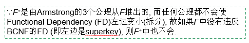
    !!! warning "注意"
        但是，在 $R$ 分解中测试关系 $R_i$ 时，仅使用 $F$ 来测试 BCNF 可能是不正确的。因此，虽然我们可在 $F$ 下判别R是否违反BCNF, 但必须在 $F^+$ 下判别R的分解式是否违反BCNF. 
        >e.g:  
        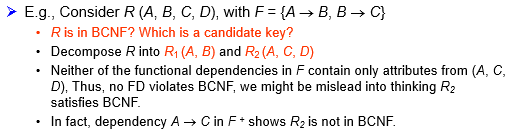  
        在这个例子中，由于A能推C，而D与其他无关，所以主键是AD，A不算超码。

* BCNF的分解算法：      
    ```
    result := {R}; 
        done := false; 
        compute F+; 
        while (not done) do 
            if (there is a schema Ri in result that is not in BCNF) 
                then begin 
                    let α → β be a nontrivial functional 
                    dependency that holds on Ri such 
                    that α → Ri is not in F+, and α 交 β = 空; 
                    result := (result – Ri) 并 (α, β) 并 (Ri – β); 
                        end
                else done := true; 
    ```
    简单来说，就是先在 $F$ 中找一组形如 $α → β$ 且不满足BCNF的关系，取 $R_1=(α,β)$,然后用减法得到 $R_2 = R - β$（若 $R_2$ 仍不满足，则继续分解），并用 $R_1,R_2$ 替代原来的关系，接着考虑下一组不满足形如 $α → β$ 的关系，取 $R_3=(α,β)$，然后用减法得到 $R_4 = R_2 - β$，以此类推，直到所有 $R_i$ 都满足BCNF。
     
    !!! success "分解步骤" 
        ①令ρ=（R）；  
        ②如果ρ中所有模式都是BCNF，若是转④,否则继续③；  
        ③若其中一个关系模式S不是BCNF,则S中必能找到一个函数依赖X->A，X不包含S的候选码，且A不属于X,设S1=XA,S2=S-A,用分解{S1,S2}代替S,转②；  
        ④停止分解，输出ρ；  

    >e.g:  
    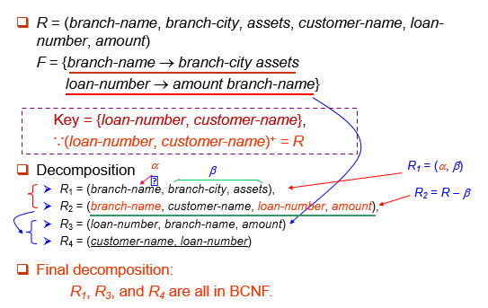

* BCNF的缺陷： 并不总是能够获得保留依赖关系的 BCNF 分解。
    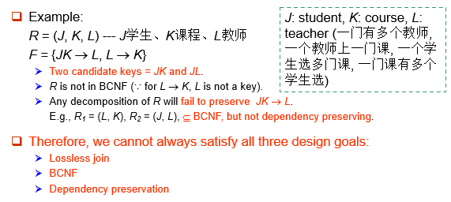

## 6.Third Normal Form（第三范式）
第三范式的目的是BCNF做一些放松，即允许一定的冗余。

* 定义：如果 $F^+$ 中的所有 $α\rightarrow β$ 至少满足以下条件之一，则关系模式 R 采用第三范式 （3NF）：
    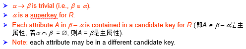

!!! abstract "讨论"
    国内其他教材关于3NF的定义: 不存在非主属性对码的部分依赖和传递依赖. 该定义实际是说, 当α为非主属性时, α必须是码; 但当α为主属性时, 则α无限制. 国内外这二种定义本质上是一致的. 

>e.g:  
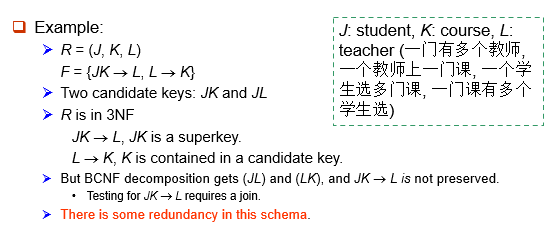

* 冗余带来的问题：  
    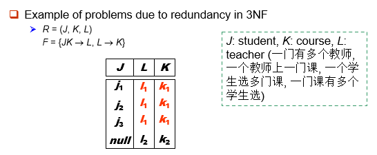  
    在 3NF 中但不在 BCNF 中的模式存在信息重复的问题（例如，关系 l1、k1），并且可能需要使用 null 值（例如，表示关系 l2、k2，其中 J 没有相应的值）。

* 测试3NF:  
    优化：只需要检查 $F$ 中的 $FD$，不需要检查 $F^+$ 中的所有 $FD$。  
    使用属性闭包检查每个依赖项 $α\rightarrow β$，以查看 α 是否为超码。  
    如果 α 不是超码，我们必须验证 β 中的每个属性是否都包含在 $R$ 的候选键中。  
    此测试相当昂贵，因为它涉及查找所有候选密钥。  
    3NF 的测试已被证明是 NP 困难的。  
    有趣的是，分解为第三范式形式（稍后描述）可以在多项式时间内完成。
* 3NF分解算法：
    ```
    Let Fc be a canonical cover for F; 
    i := 0; 
    for each functional dependency    in Fc do 
        {if none of the schemas Rj, 1 ≤ j ≤ i contains α β 
            then begin 
                i := i  + 1; 
                Ri := (α β) 
            end} 
    if none of the schemas Rj, 1 ≤ j  ≤ i contains a candidate key for R then 
    begin 
        i := i  + 1; 
        Ri := any candidate key for R; 
    end 
    return (R1, R2, ..., Ri) 
    ```
    简单来说，就是将 $F_c$ 中的每个 $α\rightarrow β$ 分解为子模式 $Ri := (α, β)$ , 从而保证 dependency-preserving.并且保证至少在一个 $R_i$ 中存在 $R$ 的候选码, 从而保证 lossless-join。

    >e.g:  
    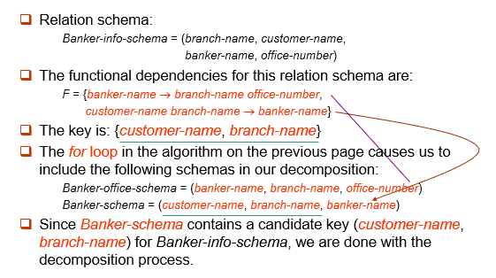

!!! question "BCNF vs. 3NF"
    * 总是可以将关系分解为 3NF 中的关系，并且
        * 分解是无损的。
        * 将保留依赖项。

    * 总是可以将关系分解为BCNF关系，并且
        * 分解是无损的。
        <font color='red'>
        * 但是，可能无法保留依赖项。
        </font>

!!! example "一些例子🌰"
    === "Example1:正则覆盖"
        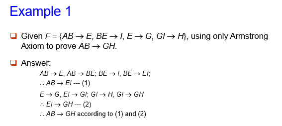
    === "Example2:BCNF"
        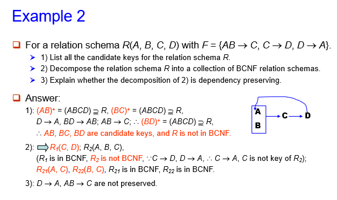
    === "Example3:BCNF and 3NF"
        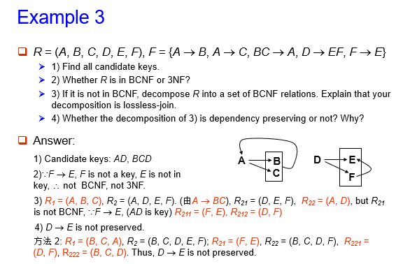
    === "Example4:BCNF and 3NF"
        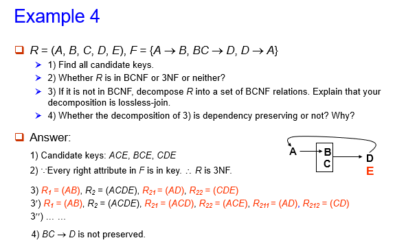

## 7.Fourth Normal Form （第四范式）
第四范式其实就是多值依赖的第二范式。  

* 定义: 若关系模式 $R$ 属于 4NF 中，相对于功能依赖关系的集合 $F$，如果对于 $F^+$ 中 $α\rightarrow\rightarrow β$ 形式的所有功能依赖关系，其中 $a\subset R$ and $β\subset R$，至少满足以下条件之一：  
    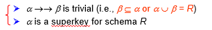

* If a relation is in 4NF, it is in BCNF. 

其余内容与第二范式类似，在此不做过多赘述。
    


        


 

    


    
    


