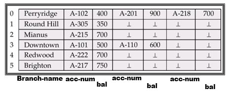

---

title: Chap 7 | Storage and File Structure 

hide:
  #  - navigation # 显示右
  #  - toc #显示左
  #  - footer
  #  - feedback  
comments: true  #默认不开启评论

---
<h1 id="欢迎">Chap 7 | Storage and File Structure </h1>
!!! note "章节启示录"
    本章节是夏学期的第一节课，开始了MiniSQl的部分，但我还不太清楚后半部分的整体架构是怎么样的，所以就先梳理一下概念和基本的定义。

## 1.Overview of Physical Storage Media

* 物理存储介质的分类：
    1. 访问数据的速度
    2. 每单位数据的成本
    3. 可靠性（易失性与非易失性）

### Physical Storage Media

* Cache:最快、最昂贵的存储形式，易失性，由计算机系统硬件管理。

* Main memory:较快速访问（10 至 100 ns）。  
    * 通常太小（或太昂贵）而无法存储整个数据库   
        目前广泛使用的容量高达几千兆字节 （1GB = 109B）  
        容量增加，每字节成本稳步快速下降（大约每 2 到 3 年下降 2 倍）  
    * 易失性：如果发生电源故障或系统崩溃，主内存的内容通常会丢失。

* Flash memory（快闪存储器）: 读取速度与主存储器（< 100ns）大致相同，但是写入速度很慢（~ 10μs），擦除速度较慢。
    * 每单位存储的成本与主内存大致相似
    * 断电时数据仍可存活
    * 数据只能在某个位置写入一次，但可以擦除并再次写入位置
  
* Magnetic-disk: 用于长期存储数据的主要介质，通常存储整个数据库。访问速度比主内存慢得多（稍后会详细介绍）。
    * 数据必须从磁盘移动到主内存才能访问，并写回存储
    * 直接访问：可以按任何顺序读取磁盘上的数据，这与磁带不同
  
    >截至 2009 年，容量范围约为 1.5 TB  
    比主存储器/闪存大得多的容量和更低的每字节成本  
    随着技术的进步，不断快速增长（每 2 年增长 2 至 3 倍）

    * 在电源故障和系统崩溃中幸存下来
    磁盘故障会破坏数据，但非常罕见

* Optical storage（光盘）: 非易失性，使用激光从旋转盘中以光学方式读取数据。读取和写入速度比磁盘慢。

* Tape storage（磁带）: 非易失性，主要用于备份（从磁盘故障中恢复）和存档数据。  
    * 顺序访问：比磁盘慢得多
    * 非常高的容量（提供 40 到 300 GB 磁带）
    * 磁带可以从驱动器中移除 $\rightarrow$ 存储成本比磁盘便宜得多，但驱动器价格昂贵
  
    >磁带自动存储塔可用于存储大量数据 
    数百 TB（TB，1 TB = 1012 字节）甚至一 PB（PB，1 PB = 1015 字节）

### Storage Hierarchy （存储结构）
    

## 2.Magnetic Disks

### 磁盘概述
!!! tip "结构"
    * Read-write head（读写头）：位置非常靠近盘片表面（几乎接触它）
    读取或写入磁性编码信息。
    * Surface of platter divided into circular tracks（圆形轨道）： 在典型硬盘上，每个盘片超过 50K – 100K 轨道。
    * Each track is divided into sectors（扇区）：扇区是可以读取或写入的最小数据单位。
    >扇区大小通常为 512 字节
    每个轨道的典型扇区：500 到 1000（在内轨道上）到 1000 到 2000（在外部轨道上）

!!! tip "读取"
    * 读取/写入扇区：  
    圆盘臂摆动以将头部定位在正确的轨道上。  
    盘片不断旋转;当扇区在 head 下传递时，数据被读取/写入。
    * 坏扇区的重映射：将该扇区从逻辑上映射到预留的物理扇区，并且重映射被记录在磁盘或其他非易失性存储器中。 

### Performance Measures of Disks（磁盘的性能度量）

* Access time（访问时间）：
    从发出读写请求到数据传输开始所需的时间 = Seek time（寻道时间） + Rotational latency（旋转等待时间）
    
    >1. 寻道时间:需要将手臂重新定位在正确的轨道上。  
    e.g:典型磁盘上 4 到 10 毫秒。
    2. 旋转等待时间:访问扇区需要显示在标题下方。  
    平均延迟是最坏情况下延迟的 1/2。  
    e.g:典型磁盘上为 4 到 11 毫秒（5400 到 15000 r.p.m.）。

* Mean time to failure (MTTF, 平均故障时间): 磁盘应连续运行且没有任何故障的平均时间。  
通常为 3 至 5 年。
新磁盘发生故障的概率非常低，新磁盘的“理论 MTTF”为 500,000 到 1,200,000 小时。
>例如，新磁盘的 MTTF 为 1,200,000 小时，这意味着给定 1000 个相对较新的磁盘，平均每 1200 小时就会有一个磁盘发生故障
MTTF 随着磁盘老化而降低

### Optimization of Disk-Block Access（磁盘块访问优化）
* Block（块）：来自单个轨道的连续扇区序列   
    数据在磁盘和主存储器之间以块的形式传输。
    大小范围从 512 字节到几千字节。

    >大 OR 小？  
    较小的块：造成更多的磁盘传输
    较大的块：由于部分填充块而浪费更多空间

    如今，典型的块大小范围为 4 到 16 KB。

* Disk-arm-scheduling algorithms（磁盘臂调度算法）：对轨道的挂起访问进行排序，以便将磁盘臂移动降至最低。  
Elevator algorithm （电梯算法）：向一个方向移动磁盘臂（从外轨道到内轨道，反之亦然），在该方向上处理下一个请求，直到该方向上不再有请求，然后反转方向并重复。

* File organization（文件组织）：通过组织块以对应数据的访问方式来优化块访问时间（内容连续地存在一起，减少Access time）。     

    >例如，将相关信息存储在相同或附近的气缸上。  

    随着时间的流逝，文件可能会变得碎片化  

    >例如，如果数据入到文件中/从中删除  

    或者磁盘上的可用块是分散的，而新创建的文件的块分散在磁盘上。  
    对碎片文件的顺序访问导致磁盘臂移动增加。  
    某些系统具有对文件系统进行碎片整理的实用程序，以加快文件访问速度。  

* Nonvolatile write buffers (非易失性写缓冲区)：通过立即将块写入非易失性 RAM 缓冲区来加快磁盘写入速度。
    * 非易失性 RAM：备用电池 RAM 或闪存。即使断电，数据也是安全的，当断电时会写入磁盘（存在备用电池，足够支撑文件写入磁盘）。

* Log disk（日志磁盘）: 专用于写入块更新顺序日志的磁盘
与非易失性RAM完全相同。写入日志磁盘的速度非常快，因为不需要寻道。无需特殊硬件 （NV-RAM）
    * 文件系统通常会对磁盘的写入重新排序以提高性能。
    * 日志文件系统以安全顺序将数据写入 NV-RAM 或日志磁盘
    * 不记录日志的重新排序：文件系统数据损坏的风险

## 3.Storage Access

* 数据库文件在逻辑上被划分为固定长度的存储单元，称为块。块是数据库系统中存储分配和数据传输的单位。
* Buffer（缓冲区）：可用于存储磁盘块副本的主内存部分。
* Buffer manager（缓冲区管理器）：负责在主内存中分配缓冲区空间的子系统。
!!! question "目标与问题？"
    * 数据库系统力求最大程度地减少磁盘和内存之间的块传输次数。   
    要减少磁盘访问次数：在主存（缓存区）中保留尽可能多的块。
    但缓冲区的大小是有限的。如何处理？
    
### Buffer Manager
当应用程序需要磁盘块时，它们会调用缓冲区管理器。   

* 如果块已经在缓冲区中，则请求程序会在主存储器中为块提供地址。   
* 如果块不在缓冲区中    
    缓冲区管理器在缓冲区中为块分配空间，替换（丢弃）一些旧页面;如果没有可用空间，则为新块腾出空间。（在buffer中为新页分配空间）    
    抛出的块只有在最近一次写入磁盘/从磁盘获取后被修改时，才会写回磁盘。（被覆盖的旧块若已被修改过，则写回磁盘）
    在缓冲区中分配空间后，缓冲区管理器会将块从磁盘读取到缓冲区，并将主内存中块的地址传递给请求者。（从磁盘读入新块放buffer）

* 缓冲区更换策略：LRU、MRU（将在下面介绍）

* Pinned block （被钉住的块）： 不允许写回磁盘的内存块。(如当前块正在被使用时)

* Toss-immediate strategy（立即抛掷策略）：一旦处理完块的最后一个元组，就释放该块占用的空间。(用后立即丢弃)

* Forced output of blocks（块的强制输出）：    
    块的请求者必须取消固定它，并指示页面是否已被修改：使用Dirty来指示。

* Page in pool may be requested many times （被多个事务使用）： 
    使用引脚数，当且仅当 $\large pin_{count} = 0$ 时，页面成为替换的候选者。

!!! abstract "Buffer-Replacement Policies（替换策略）"
    * LRU strategy (Least Recently Used, 最近最少使用策略): 替换最近最不常使用的块。  
    但是，对于某些涉及重复扫描数据的访问模式，LRU 可能是一个糟糕的策略。
    
    >e.g:  
    
    

    * MRU strategy (Most recently used, 最近最常用策略): 替换最近最常使用的块。   
    系统必须固定当前正在处理的块。 处理完该块的最后一个元组后，该块将被取消固定，并成为最近使用的块。

## 4.File Organization
两种记录的方式：   
1.Fixed-length records（固定长度记录）。  
2.Variable-length records（可变长度记录）。  
  
### 4.1 Fixed-Length Records 

* 优点：方法简单：
存储从字节 $n*(i – 1)$ 开始存储记录 $i$ ，其中 $n$ 是每条记录的大小。  
记录访问很简单，但记录可能会跨块。
    * 修改：不允许记录跨越块边界

!!! question "删除的方式"
    === "方式1："
        move records $i + 1, ……, n\;\; to\;\; i, …… , n – 1$
    === "方式2："
        move record $n \;\;to\;\; i$
    === "方式3："
        do not move records, but **link** all free records on a free list 
        

        * 优点：更节省空间的表示。将空间复用为空闲记录的正常属性来存储指针（没有指针存储在使用中的记录中）。
  

### 4.2 Variable-Length Records 

* 可变长度记录以多种方式出现在数据库系统中：  

    1. 在文件中存储多种记录类型
    2. 允许一个或多个字段（如字符串 （varchar））可变长度的记录类型
    3. 允许重复字段的记录类型（在某些较旧的数据模型中使用）

* 属性按顺序存储
* 由固定大小（偏移量、长度）表示的可变长度属性，实际数据存储在所有固定长度属性之后
* Null values represented by null-value bitmap 

!!! example "一个例子🌰"
    不定长的保存在后面，定长的 (offset, length) 保存在前面。

    

    这里位置 12 放的 65000 是定长的 salary。  
    位置 20 放的 0000, 表示前面四个属性均是非空的放在前面也可以，只要在一个固定位置能找到即可）。  
    $1$ 表示空，$0$ 表示非空。  
    前提：每一个记录都是被放在一起的。（有按列存储的方式）

* Slotted Page Structure（分槽页）  
  
    * Slotted page header 包含：  
        1. number of record entries（记录条目数）
        2. end of free space in the block（一个指针指向 free space 末尾，用来分配内存）
        3. location and size of each record（每条记录的位置和大小）
    * 记录可以在页面中四处移动，以保持它们连续，它们之间没有空白;必须更新标头中的条目。（页内无碎块: 删除时页内移动记录）  
    * 指针（Index）不应直接指向记录，而应指向 header---indirect pointer（间接指针）中记录的条目 

**固定长度表示**：  
    1. 预留空间
    2. 指针
   
* 预留空间：可以使用已知最大长度的固定长度记录;较短记录中未使用的空间，用 null 或记录结束符号填充。  

* 指针方法:可变长度的记录由固定长度的记录列表表示，这些记录通过指针链接在一起。即使最大记录长度未知，也可以使用。  

* 指针结构的缺点：除了链中的第一条记录外，所有记录中都浪费了空格（用于分支名称）。  
* 解决方案:允许在文件中使用两种块。  
    1. Anchor block（锚块） – 包含链的第一条记录
    2. Overflow block（溢出块） – 包含椅子的第一条记录以外的记录。

    

## 5.Organization of Records in Files
插入到哪个文件的哪个位置？

* Heap file（堆文件， 流水文件）：记录可以放置在文件中任何有空间的地方。        

* Sequential file（顺序文件）：根据每条记录的搜索键值，按顺序存储记录。     

* Hashing file（散列文件）：根据每条记录的某个属性计算的哈希函数;结果指定应将记录放置在文件的哪个块中。     

* Clustering file organization（聚集文件组织）：多个不同关系的记录可以存储在同一个文件中。  
    动机：将不同关系的相关记录存储在同一块上，以最小化 I/O

### 5.1 Heap file

### 5.2 Sequential File Organization
适用于需要对整个文件进行顺序处理的应用程序。文件中的记录按搜索键排序。

* Deletion：使用指针链  
* Insertion：找到要插入记录的位置  
    1. 如果有可用空间，请插入那里  
    2. 如果没有可用空间，请将记录插入溢出块中  
   
无论哪种情况，都必须更新指针链。    
需要定期对文件重新排序。   

### 5.2 Multitable Clustering File Organization 
使用 **多表聚类文件组织** 将多个关系存储在一个文件中。
!!! example "一个例子🌰"
    对于老师和部分经常一起访问的情况，我们可以把这两个信息放在一起。（如果两个表经常连接，这样比较高效）
    但这样对于单独查找某个信息就不太方便。    
    

    一个改进：可以提升查找某个信息的效率。   
    

!!! tip "复习时的一些补充"
    * Storage media can be classified by 
        1. Speed with which data can be accessed
        2. Cost per unit of data
        3. Reliability 
            
            >Data loss on power failure or system crash
            Physical failure of the storage device (RAID) 

    * Buffer: Portion of main memory available to store copies of disk blocks. 
    

    

