---

title: Chap 8 | Indexing and Hashing

hide:
  #  - navigation # 显示右
  #  - toc #显示左
  #  - footer
  #  - feedback  
comments: true  #默认不开启评论

---
<h1 id="欢迎">Chap 8 | Indexing and Hashing </h1>
!!! note "章节启示录"
    本章节是还没上课就先开始写了，因为老师身体原因，不知道什么时候补课，但后面再补笔记可能有点赶了！

## 1.Basic Concepts
* Index是用来干什么的？
  Indexing mechanisms used to speed up access to desired data.索引用来加速查找。

* 两种基本的索引种类：
    1. **Ordered indices(顺序索引)**: 搜索键（索引条目）按排序顺序存储
    2. **Hash indices(散列索引)**: 搜索键（索引条目）使用“哈希函数”均匀分布在“存储桶”之间。
时间效率和空间效率的衡量索引技术最主要的指标，也是数据库系统组织和管理技术的关注的焦点之一

## 2.Ordered Indices
* 关于索引的一些基本概念：  
    在有序索引中，索引条目按搜索键值排序存储，例如，库中的作者目录。  
    顺序排序文件（Sequentially ordered file ）：文件（数据文件）中的记录按搜索键排序。（第14章）  
    
* Primary index（主索引）：其搜索键等于按顺序排序的数据文件的搜索键的索引，该文件在其上创建索引。(与对应的数据文件本身的排列顺序相同的索引称为主索引。)  

>1. 也称为聚类索引（聚集索引）  
    非顺序文件没有主索引，但关系可以有主键。  
>2. Index-sequential file（索引顺序文件）：具有主索引的顺序排序文件。

* Secondary index（辅助索引）：其搜索键指定的顺序与文件的顺序不同的索引。 
>也称为非聚类索引。

### 2.1 Dense Index Files (稠密索引文件)
Dense Index — 文件中每个搜索键值都会显示索引条目。  
>e.g:  
index on ID attribute of instructor relation  

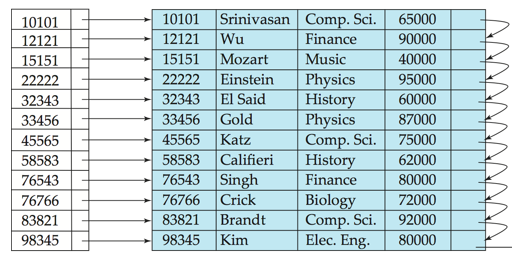

### 2.2 Sparse Index Files(稀疏索引文件)
Sparse Index：仅包含某些搜索键值的索引条目。（通常，一个数据块给出一个索引条目，一个块包含多个有序数据记录）
>仅当数据文件记录按搜索键顺序排序时才适用

* 搜索方法:
    To locate a record with search-key value K ,
    1. Step1：查找搜索小于 $K$ 的键值最大的索引记录
    2. Step2：从索引入口指向的记录开始按顺序搜索文件

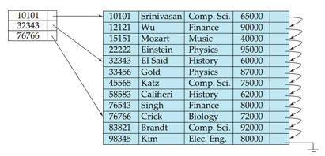

Sparse index只能用于顺序文件, 而dense index可以用于顺序和非顺序文件，如构成索引无序文件，且只能建立在primary index上

## 3.B+ Tree Index Files
### 3.1 B+-Tree Node Structure
B+树索引是索引顺序文件的替代方法。

* 索引顺序文件的缺点：
    性能会随着文件的增长而下降，因为会创建许多溢出块。 
    需要定期重组整个文件。
* B+树索引文件的优点： 
    面对插入和删除，通过微小的局部更改自动重组自身。 
    不需要重组整个文件来保持性能。
* B+树的缺点：
    额外的插入和删除开销;空间开销。

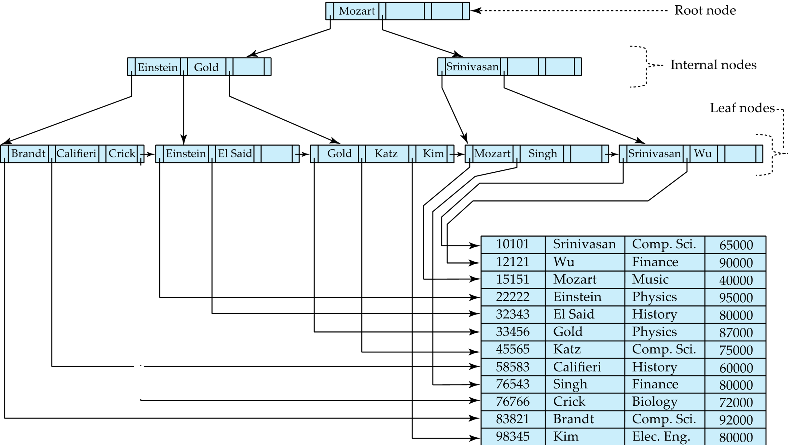

!!! abstract "B+树的性质"
    B+树是满足以下属性的根树：

    1. 从根到叶的所有路径都具有相同的长度（平衡的树）  
    2. 每个不是根或叶的节点都具有介于 $\large\lceil n/2 \rceil$ 和 $n$ 个子节点之间。  
    3. 叶节点的值介于 $\large \lceil (n–1)/2 \rceil$ 和 $n–1$ 之间。  
    4. 特殊情况：  
        1. 如果根不是叶子，它至少有 2 个孩子。  
        2. 如果根是叶子（即树中没有其他节点），则它的值可以介于 $0$ 和 $(n–1)$ 之间。

<!-- 如果有 K 个索引项，则树高度不会超过 $\large\lceil log_{\lceil n/2 \rceil}(K/2) \rceil + 1$ -->

### 3.2 Updates on B+ Trees: Insertion
Insertion 流程：

1. 查找会显示搜索键值的叶节点
2. 如果叶节点中已存在搜索键值
    1. 将记录添加到文件
    2. 如有必要，请添加指向存储桶的指针。
3. 如果搜索键值不存在，则
    1. 将记录添加到主文件（如有必要，请创建存储桶）
    2. 如果叶节点中有空间，在叶节点中插入（键值、指针）对
    3. 否则，Split节点。

>Split的具体操作请看ads第二章的笔记捏。

### 3.3 Updates on B+ Trees: Deletion
Deletion 流程：

1. 找到要删除的记录，并将其从主文件和存储桶（如果存在）中删除
2. 如果没有存储桶或存储桶变为空，请从叶节点中删除（搜索键值、指针）
3. 如果由于删除，节点的条目太少，并且节点和同级中的条目适合单个节点，**则合并同级**：
    1. 将两个节点中的所有搜索键值插入到单个节点（左侧的节点）中，然后删除另一个节点。
    2. 使用上述过程以递归方式从其父节点中删除对 $(K_{i–1}， P_i)$ ，其中 $P_i$ 是指向已删除节点的指针。
4. 否则，如果由于删除而导致节点的条目太少，但节点中的条目和同级节点不适合单个节点，则重新分发指针：
    1. 在节点和同级节点之间重新分配指针，使两者的条目数都超过最小数。
    2. 更新节点父节点中相应的搜索键值。
5. 节点删除可能会向上级联，直到找到具有 $\lceil n/2 \rceil$ 或更多指针的节点。 
6. 如果根节点在删除后只有一个指针，则该指针将被删除，唯一的子节点将成为根节点。

!!! success "如何理解"
    流程看起来比较复杂呀，但其实还是比较好理解的。用通俗的语言来说，就是每次删除后，去判断能不能更加“简化”这颗B+树，尽可能地让它恢复到没插入这个删除的元素时的状态。  
    这其中就要涉及到“借”（类似于减法中的借位）的艺术了，请看 ~~VCR~~ ：  

    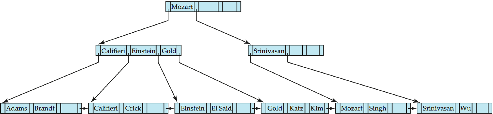  

    中间点如果不够，从另外一边借一个过来。但是不能直接借，需要把它顶上去。（Before and after deleting “Srinivasan”）

    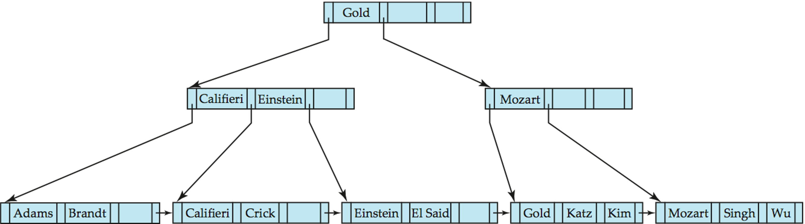  

    Deletion of “Singh” and “Wu” from result of previous example.
    
    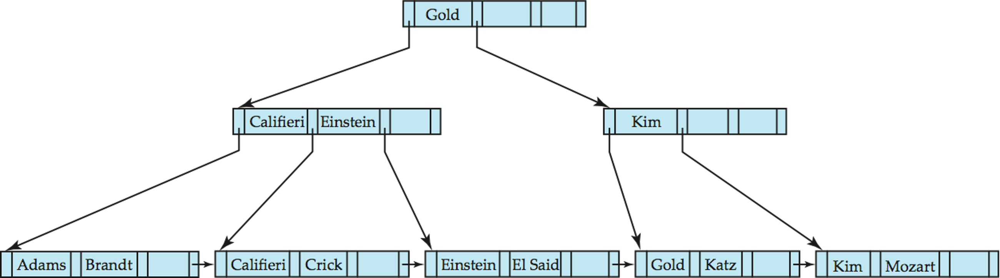

### 3.4 B+ Tree:height and size estimation
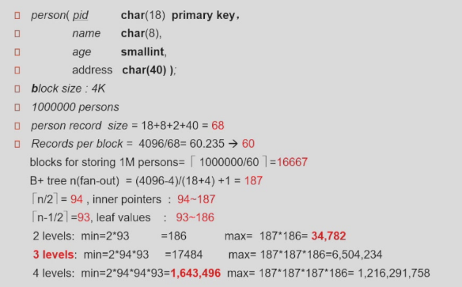 

一个person的size是68。  
每一个block可以放 $\lceil 4096/68\rceil = 60$ 个records。  
一百万个person至少需要 $\lceil 1000000/60\rceil = 16667$ 个块来放。
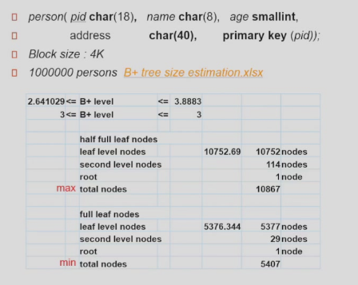  

### 3.5 B+ Tree File Organization

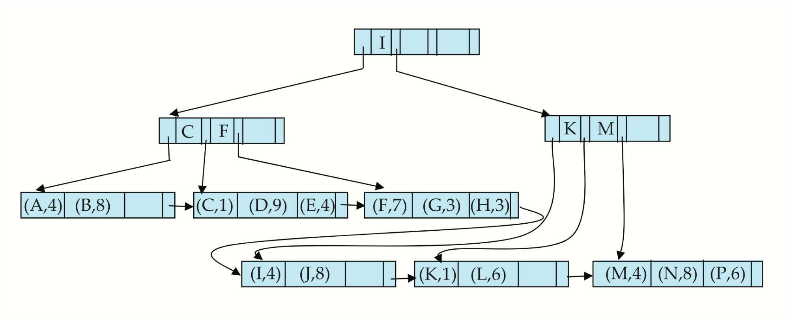

* Leaf nodes in a B+-tree file organization store records, instead of pointers. 叶子节点不再放索引项，放记录本身。
* Helps keep data records clustered even when there are insertions/deletions/updates. 即使在插入/删除/更新时，也有助于保持数据记录的集群。
* 我们可以改变半满的要求以提高空间利用率。
>为了提高空间利用率，请在Split和Merge期间让更多的同级节点参与重新分发,在重新分发中采用 2 个同级（以尽可能避免Split/Merge）这样就使得每个节点至少有 $\lfloor 2n/3 \rfloor$ 条目。

## 4.Bulk Loading and Bottom-Up Build

* 将一个条目一次插入到 B+ 树中需要 $≥ 1$ 个 IO
    假设叶级别不适合内存
    一次加载大量条目（**批量加载**）的效率可能非常低
* 有效的替代方案 1：
    1. 首先对条目进行排序（使用第 12.4 节后面讨论的高效外部内存排序算法）
    2. 按排序顺序插入
        * 插入将转到现有页面（或导致拆分）
        * 大大提高了 IO 性能，但大多数叶节点半满
* 有效的替代方案 2：**自下而上的 B+ 树结构**
    1. 和以前一样，对条目进行排序
    2. 然后逐层创建树，从叶级别开始
    3. 由大多数数据库系统作为大容量加载实用程序的一部分实现
    
    * 流程：
        1. 首先对索引条目进行排序
        2. 然后逐层创建 B+ tree，从叶级别开始
        3. 然后，使用顺序 I/O 操作将 B+ 树写入磁盘
    !!! example "一个例子🌰"
        假设 B+ 树的扇出 （n） 为 4，为以下 16 个条目构建一个 B+ 树：  

        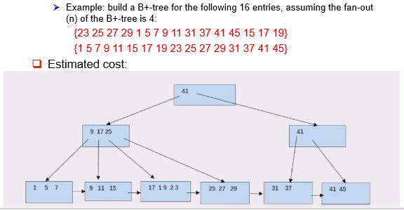  

        * Estimated cost:1 seek + 9 block transfers 
   
        如果要排序的内容较大，无法放下内存，可以使用外部排序。  
        fanout 可以计算出来。  
        可以用 level-order 写到磁盘里，便于顺序访问所有索引，此时块是连续的。（便于顺序访问所有数据项）  
        这里的代价就是建好后，一次 seek 后全部写出去 (9 blocks)
    !!! example "一个例子🌰"

        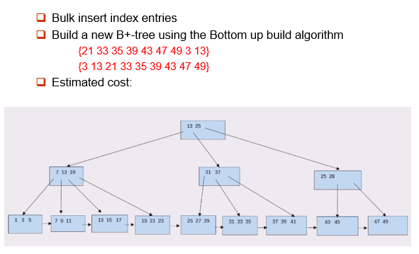

        * Estimated cost:2 seek + 19 block transfers   
  
        把刚刚那棵 B+ 树叶子节点（即遍历所有数据）需要 1seek+6blocks. 随后和上面的数据合并后，写回磁盘时需要 1seek+13blocks.

## 5.Write-optimized Indices

### 5.1 Log Structured Merge (LSM) Tree
* 现在只考虑插入/查询  
    1. 首先插入到内存中树（ $L_0$ 树）的记录  
    2. 当内存中树已满时，记录移动到磁盘（ $L_1$ 树）  
        通过将现有的 $L_1$ 树与 $L_0$ 树中的记录合并，使用自下而上的构建构建的 B+ 树
    3. 当 $L_1$ 树超过某个阈值时，合并到 $L_2$ 树中  
        以此类推，获得更多级别
        $L_{i+1}$ 树的尺寸阈值是 $L_i$ 树的尺寸阈值的 $k$ 倍

    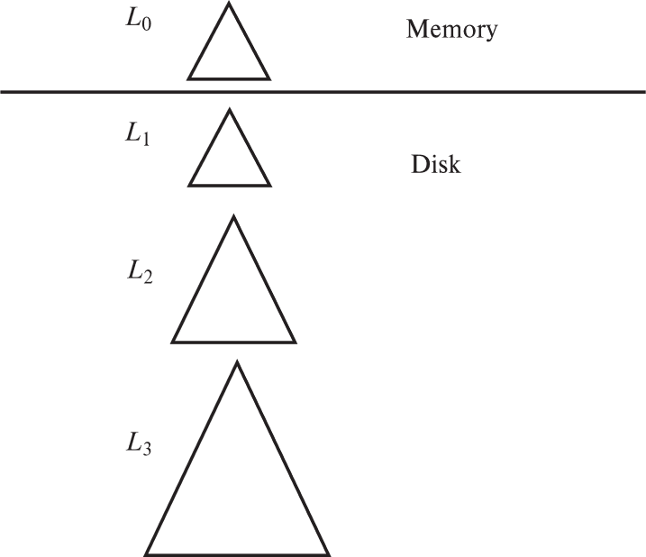{width="400"}

* LSM 方法的优点:
    1. 仅使用顺序 I/O 操作完成插入
    2. 叶子饱满，避免空间浪费
    3. 与普通 B+ 树相比，每条记录插入的 I/O 操作数减少（最多一些大小）
* LSM方法的缺点:
    1. 查询必须搜索多个树
    2. 每个关卡的全部内容被复制了多次
* Stepped-merge index（步进合并索引）:
    1. LSM 树的变体，每个级别都有多个树
    2. 与 LSM 树相比，降低了写入成本
    3. 但查询甚至更昂贵

### 5.2 Buffer Tree
它是 LSM 树的替代品
* 关键思想：B+树的每个内部节点都有一个缓冲区来存储插入  
    当缓冲区已满时，插入物被移动到较低的水平  
    使用较大的缓冲区时，每次都会将许多记录移动到较低级别  
    每条记录的 I/O 会相应减少  
* 优点：
    1. 减少查询开销
    2. 可与任何树索引结构一起使用
    3. 用于 PostgreSQL 通用搜索树 （GiST） 索引
* 缺点：
    1. 比 LSM 树更随机的 I/O

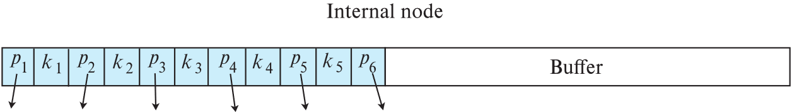

!!! tip "复习时的一些补充"
    * 稀疏（sparse）索引与稠密（dense）索引
        1. 稠密索引：  
            在稠密索引中，文件中的每个搜索码值都对应一个索引值。也就是说，稠密索引为数据记录文件的每一条记录都设一个键-指针对。

            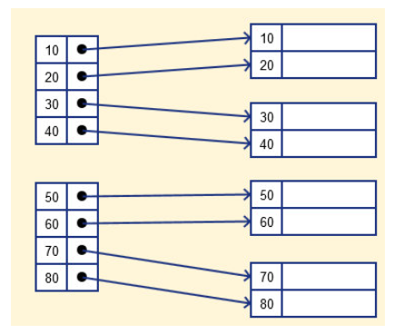

        2. 稀疏索引:    
            在稀疏索引中，只为搜索码的某些值建立索引项。也就是说，稀疏索引为数据记录文件的每个存储块设一个键-指针对，存储块意味着块内存储单元连续。

            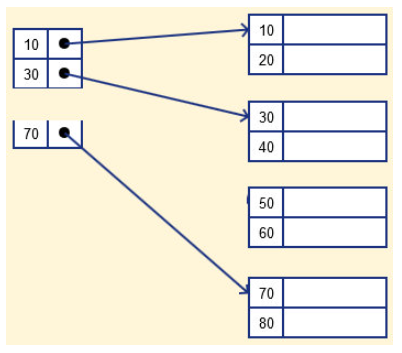

    * 时间效率和空间效率的衡量索引技术最主要的指标，也是数据库系统组织和管理技术的关注的焦点之一。
    * Deletion of a tuple can be expensive if there are many duplicates on search key (why?)   
        因为删除操作可能会查找很多项，从而找出和被删记录相对应的项，该搜索有可能遍历多个叶节点

