---

title: Chap 9 | Query Processing

hide:
  #  - navigation # 显示右
  #  - toc #显示左
  #  - footer
  #  - feedback  
comments: true  #默认不开启评论

---
<h1 id="欢迎">Chap 9 | Query Processing </h1>
!!! note "章节启示录"
    在本章中，我们将学习： 

    1. 如何衡量查询成本 
    2. 计算关系代数运算的算法：选择、连接  
    3. 如何组合单个运算的算法以计算完整的表达式   
   
    在下一章中，我们研究如何优化查询，即如何找到估算成本最低的评估计划 

## 1.Basic Steps in Query Processing
1.	Parsing and translation
2.	Optimization
3.	Evaluation
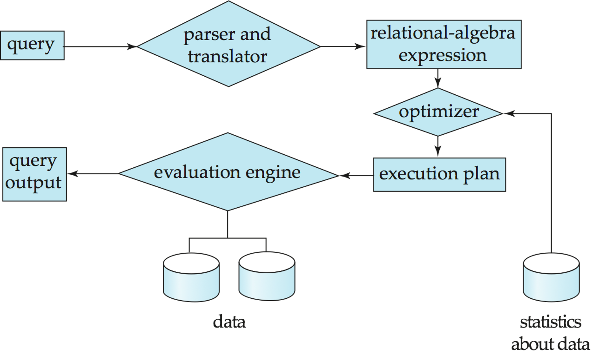

经过语法分析、语义检查翻译成关系表达式，经过查询优化转化成执行计划（目标代码），由求值引擎得到输出。（具体过程可以参阅minisql的part5，如果写过应该会印象比较深刻）

* 优化的过程：  
    1. 找出各种等效关系代数表达式。（下一章）
    2. 指定详细评估策略的一系列原始操作称为查询执行计划或查询评估计划。
    3. 查询优化：在所有等效的评估方案中，选择成本最低的方案。cost考虑了两个因素：  
    cost取决于执行的算法。  
    cost也使用数据库目录中的统计信息进行估算。  
    >例如，每个关系中的元组数、元组的大小等。

  
## 2.Measures of Query Cost

* Three Points：
    1. CPU 无法直接操作磁盘中的数据。
    2. 磁盘数据读/写（transer）速度的增长速度远慢于磁盘大小的增长速度。
    3. 磁盘寻道速度的增长速度远慢于磁盘数据传输速度的增长速度。
  
cost通常以回答查询的总时间来衡量。  
许多因素都会造成时间成本：  
Disk access + CPU + network communication  
在这里我们主要研究Disk access。

!!! abstract "定义"
    $t_T$ – time to transfer one block.  (≈ 0.1ms)  
    $t_S$ – time for one seek.  (≈ 4ms)  
    Cost for $b$ block transfers plus $S$ seeks: $b * t_T + S * t_S$ 
  
## 3.Selection Operation 

### 3.1 File scan 
查找和检索满足选择条件的记录的搜索算法,不使用索引。

***算法 $A1$（线性搜索）,扫描每个文件块并测试所有记录，以查看它们是否满足选择条件。***

* Cost estimate = $\large b_r * t_T + t_S$  
$b_r$ 表示包含关系 $R$ 中记录的块数
* If selection is on a key attribute, can stop on finding record:  
average cost = $\large (b_r /2)t_T+t_S$ (平均来讲，查到的概率大概是1/2，严格来讲是 $\frac{1+b_r}{2}$)

***算法 $A2$ （二进制搜索）。如果选择是对文件排序的属性的相等比较，则适用。***

* Cost = $\lceil log_2(b_r)\rceil t_T + \lceil log_2(b_r)\rceil t_S $
### 3.2 Index scan
索引扫描 – 使用索引的搜索算法。选择条件必须位于索引的搜索键上。  

***算法A3 (primary B+-tree index / clustering B+-tree index, equality on key).***

* Cost = $(h_i + 1) * (t_T + t_S)$，其中 $h_i$ 为索引树高。（因为搜索到叶子后，是搜索到了代表该条记录的指针，还要再加一次搜索以找到记录）
>e.g:  
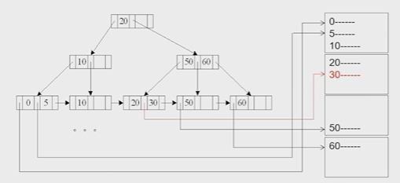

***算法A4 (primary B+-tree index/ clustering B+-tree index, equality on nonkey).索引的值不是主键***

* Cost = $h_i * (t_T + t_S) + t_S + t_T * b$ 其中， $b$ 代表搜索码对应的记录数量。
>e.g:  
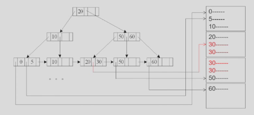

***算法A5 (secondary B+-tree index , equality on key).辅助索引***

1. 如果 search-key 是候选键，则检索单条记录：
      * Cost = $(h_i + 1) * (t_T + t_S)$
      >e.g:  
      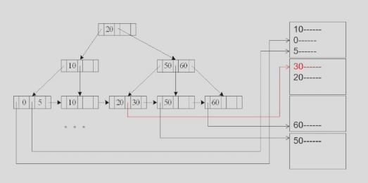
2. 如果 search-key 不是候选键，则检索多条记录。（最坏情况：$n$ 条匹配记录中的每一条都可能位于不同的块上） 
      * Cost =  $(h_i + m + n) * (t_T + t_S)$ 其中，m 表示放指针的块的数量, n 表示对应磁盘里的记录的数量。
      >e.g:  
      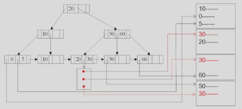

### 3.3 Selections Involving Comparisons
比较符：>, >=, <, <=, <>, 与等值比较的不同之处在于选择范围大。  
可以通过以下方法实现 $\sigma_{A≤V}(r)$ 或 $\sigma_{A≥V}(r)$形式的选择： 

1. 线性文件扫描;
2. 二进制搜索（如A2）;
3. 以下列方式使用索引：

***算法A6 (primary B+-index / clustering B+-index index, comparison). (Relation is sorted on A).≥：首先找到第一个≥V的值，然后把后面的块顺序读入; ≤：一直读入，找到第一个≥V的值时停止***

* Cost = $h_i * (t_T + t_S) + t_S + t_T * b$ （同A4）
>e.g:  
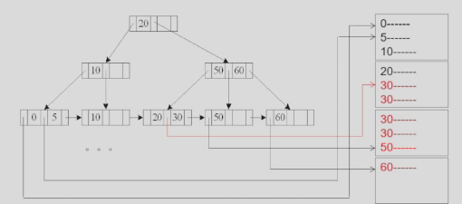

***算法A7 (secondary B+-tree index, comparison).***

与A5类似  

>e.g:
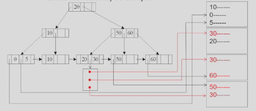

### 3.4 Implementation of Complex Selections
Conjunction $\large \sigma_{\theta_1}\wedge … \wedge _{\theta_n}(r)$

***算法A8 (conjunctive selection using one index).***
第一步从n个条件 $\theta_1 … \theta_n$ 中选择代价最小的 $\theta_i$ 先执行，返回元组放内存，然后第二步对这些元组施行其他 $\theta_i$ .） 

***算法A9 (conjunctive selection using composite index).***  

Use appropriate composite (multiple-key) index if available.
利用复合索引

***算法A10 (conjunctive selection by intersection of identifiers).***  

对每个索引都进行查询，将结果拼起来

### 3.5 Algorithms for Complex Selections
* Disjunction: $\large \sigma_{\theta_1}\vee … \vee _{\theta_n}(r)$  
适用于所有条件都有索引的情况。   
否则，请使用线性扫描。  
对每个条件使用相应的索引，并联合所有获得的记录指针集。  
然后从文件中获取记录。

* Negation: $\large \sigma_{\neg\theta}(r)$
对文件使用线性扫描。  
如果满足 $\neg \theta$ 的记录很少，并且索引适用于 $\theta$  
使用索引和从文件中提取查找令人满意的记录

### 3.6 Bitmap Index Scan
!!! abstract "稀烂的翻译"
    PostgreSQL的位图索引扫描算法  
  
    * 在执行前不知道匹配记录数时，弥合二级索引扫描和线性文件扫描之间的差距  
  
    * 每页 1 位的位图  

    * 步骤：  
        1. 索引扫描用于查找记录ID，并在位图中设置相应页面的位 
        2. 线性文件扫描仅获取位设置为 1 的页面  
   
    * 性能  
        1. 类似于仅设置几位时的索引扫描  
        2. 类似于设置了大多数位时的线性文件扫描  
        3. 与最佳选择相比，从来没有表现得很糟糕

## 4.Sorting
我想直接从一个例子出发，如果这个例子懂了，sorting的算子也就明白了。
!!! example "一个例子🌰"
    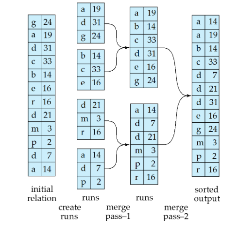  

    初始内存放不下，只能放 $M$ pages，一次性读 $M$ 块，在内存排序好后写回，形成一个归并段。再读入第二段到内存中，排序后写回，这样就得到了 $\large\frac{b_r}{M}$ 个归并段，然后把这些归并段利用归并排序的方式进行归并。  

### 4.1 Procedure 
设 $N$ 为当前的归并段数量， $M$ 为内存页数量。  

* 如果 $N<M$ :
    直接merge all N runs  
* 如果 $N≥M$ :
    merge $M-1$ runs
>e.g:  
If br= 1000 blocks, M = 11, and one pass reduces the number of runs to 91, each 10 times the size of the initial runs      
    Pass 0: $N0 = \lceil 1000/11 \rceil = 91$ runs;  
    Pass 1: $N1 = \lceil 91/10 \rceil = 10$ runs;  
    Pass 2: $N2 = \lceil 10/10 \rceil = 1$ runs.

### 4.2 Cost analysis
transfers：

* Total number of runs : $\lceil b_r/M \rceil$  
* Total number of merge passes required: $\lceil log_{M–1}(br /M) \rceil$.
* Block transfers for initial run creation as well as in each pass is $2b_r$ （读和写都需要 $b_r$）
* Total number of block transfers:   
    $2b_r\lceil log_{M-1}(b_r/M) \rceil + b_r = b_r(2\lceil log_{M-1}(b_r/M) \rceil + 1)$（最后一次只有读磁盘没有写磁盘）

seeks：

* 在运行生成期间：一个seek有读有写：$2\lceil b_r/M \rceil$  
* 在合并阶段:   
    1. 缓冲区大小：$b_b$（一次读/写 $b_b$ 块）  
    2. 每个合并传递需要 2 个 $\lceil b_r / b_b \rceil$ 个 seek  
    >除了最后一个不需要写入
* Total number of seeks:  
    $2\lceil b_r/M \rceil + \lceil b_r / b_b \rceil(2\lceil log_{M-1}(b_r/M) \rceil - 1)$

!!! warning "关于$b_b$"
    在transfer的讨论中，我们默认缓冲区的大小是1，也就是 $b_b = 1$ ,但在seeks中，我们引入了 $b_b$ 作为缓冲区的大小。

    * 这里我们产生了一个 trade-off：
        缓冲区 $b_b$ 如果大于一，也就是为每一个归并段分配多个缓冲区。这样我们定位一次之后可以读入多块进入缓冲区。  
        减少了 seek 次数，但这样轮次可能会增加。
    * Total number of block transfers:  
          $\large b_r(2\lceil log_{\lfloor M/b_b\rfloor -1}(b_r/M) \rceil + 1)$\
  
## 5.Join Operation

### 5.1 Nested-Loop Join(嵌套循环连接) 
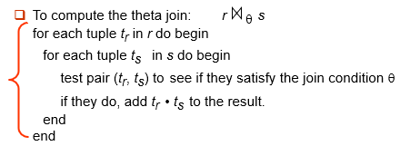  
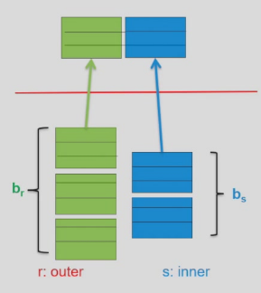

我们假设外层循环有 $b_r$ 个数据块，内层循环有 $b_s$ 个数据块，外层循环有 $n_r$ 个元组，内层循环有 $n_s$ 个元组。     

外循环的每一个数据块只需要被读进去一次，但内循环在每次外循环的tuple改变了时，都要被重新读一次，因此：  

* Cost = $n_r*b_s + b_r$ block transfers
* Cost = $n_r + b_r$ seeks （这里注意, $n_r$ 其实统计的是内循环块 $b_s$ 被读进去的次数,因为是连续排列的，每次 $n_i$ 改变后，就要重新seek一遍内层的tuple）

如果内存能容纳所有的关系，那么:

* Total Cost = $b_r+b_s$ block transfers and 2 seeks.

### 5.2 Block Nested-Loop Join
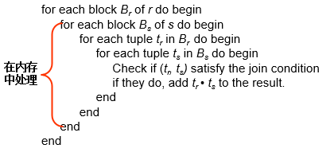  

这个方法，先把两个块都读进去，再比较两者的元组。

* Worst case(设内存中只有3个block) : Cost = $b_r*b_s+b_r$ transfers + $2*b_r$ seeks   
    （transfer：外关系都只要进去一次，内关系要进去 $b_r$ 次；seek：外关系每个都seek一次，内关系随着外关系seek一次）
* Best case（s全部且始终在内存）: Cost = $b_r+b_s$ transfers + $2$ seeks

**Improvements** :  

* when $M > 3$,  but $M < b_s$ and $M < b_r$       
    充分利用内存buffer, 增大buffer中外层关系的block数（从而减少内层关系读入批数），有利于减少代价（减少约M-2倍）。  
    假设内存有 M 块，有一块作为 output 的缓冲，剩下 M-1 块中 M-2 块均给外关系，内关系给一块。 
    1. Transfers Cost = $\lceil b_r/(M-2)\rceil * bs + br$ 
    2. Seeks Cost= $2\lceil b_r / (M-2)\rceil$ 
* 如果 equi-join（等值连接） 属性在内部关系上形成键，则在第一次匹配时停止内部循环
* 向前和向后交替扫描内部循环，以利用缓冲区中剩余的块（当使用LRU替换策略时）
* 如果可用，请在内部关系上使用索引（下一部分）

### 5.3 Indexed Nested-Loop Join
如果内循环有索引，我们就没必要扫描内循环所有块了。  
对于外部关系 $r$ 中的每个元组 $t_r$，使用索引查找 $s$ 中满足元组 $t_r$ 连接条件的元组。  
最坏的情况：缓冲区只有一页 $r$ 的空间，对于 $r$ 中的每个元组，我们对 $s$ 执行索引查找。  

* Cost = $b_r(t_T + t_S) + n_r * c$ 其中 $c$ 表示遍历索引并取出所有匹配的元组的时间（简单来说，就是搜索 b+ 树的成本）。
>c 可以被估算为 s 上单个选择的成本。

### 5.4 Merge-Join (sort-merge join, 排序归并连接)
假设两个关系已经基于连接属性排好序，我们可以用归并的思想连接。  

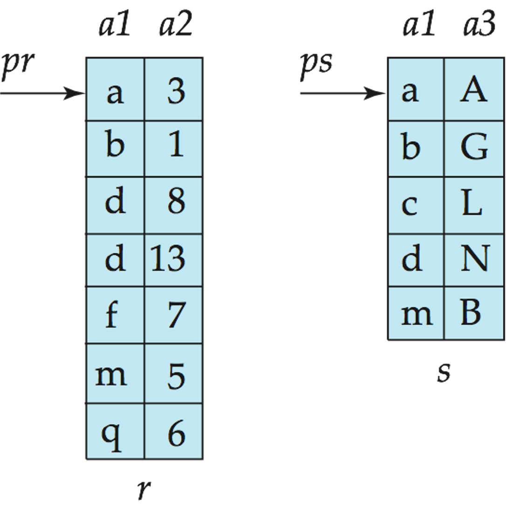{width="270"}

* 根据两个关系的连接属性对两个关系进行排序（如果尚未对连接属性进行排序）。
* 合并排序的关系以联接它们
    1. 联接步骤类似于排序-合并算法的合并阶段。 
    2. 主要区别在于对连接属性中重复值的处理——连接属性上具有相同值的每对都必须匹配(多个值的情况)
    3. 书中的详细算法
  
* Cost = $b_r + b_s$  block transfers  + $\lceil b_r / b_b\rceil + \lceil bs / bb \rceil$ seeks (+ the cost of sorting if relations are unsorted).

!!! question "如果缓冲区内存大小为 M 页，为了最小化合并连接的成本，如何分别将 M 块分配给 r 和 s？"
    * Cost = $\large b_r+b_s$ block transfers + $\large \lceil b_r/x_r \rceil + \lceil b_s/x_s \rceil$ seeks ($x_r+x_s = M$)
    * answer:   
        $\large x_r = \sqrt{b_r}*M/(\sqrt{b_r}+\sqrt{b_s})$  
        $\large x_s = \sqrt{b_s}*M/(\sqrt{b_r}+\sqrt{b_s})$
### 5.5 Hash-Join (哈希连接)
分片：  
用一个 Hash 函数把两个关系进行分片。能够连接上的记录，一定处于同一个 partition 里面（反之不一定）  
这样大关系变成了小关系。  
我们要求其中某个的小关系要能一次放到内存中！！！($n≥\lceil b_s / M \rceil$)  
Typically $n$ is chosen as $\lceil b_s / M \rceil * f$ (f叫做修正因子)

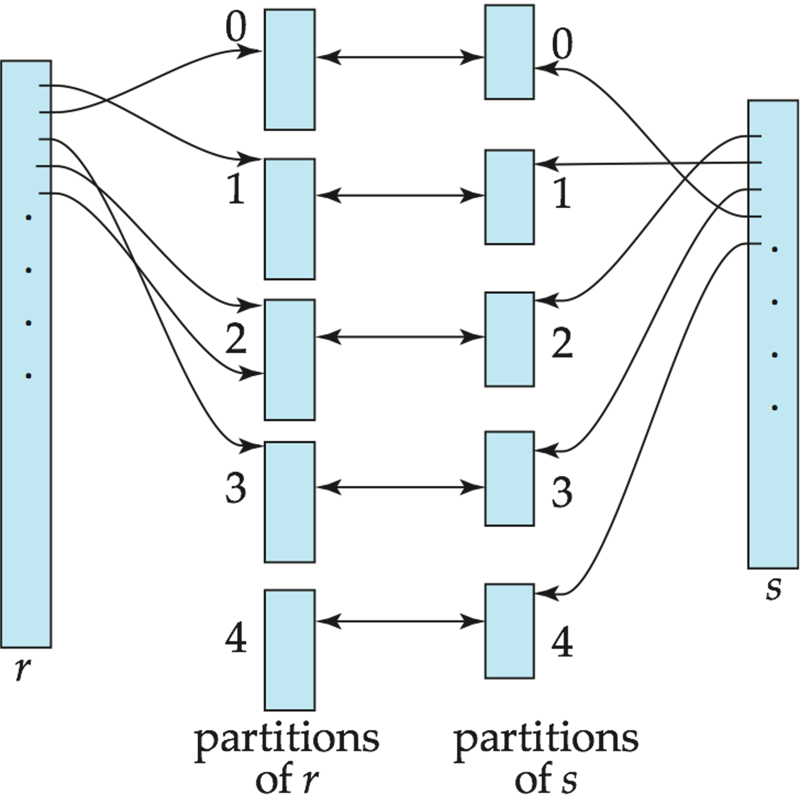{width="300"}

* 如果分区的数量n大于内存的页数M，则需要递归分区。   
    1. 使用M–1分区代替n种方式进行分区  
    2. 使用不同的哈希函数进一步划分M–1个分区  
    3. 对r使用相同的分区方法
    4. 很少需要：
   
        >例如，块大小为4KB，内存大小为2MB且<1GB的关系不需要递归分区，或者内存大小为12MB且<36GB的关系也不需要递归划分

    !!! success "证明"
        * 块大小为4KB，内存大小为2MB：  
            1. $M = 2MB / 4KB = 0.5K$
            2. 当 $M = N$ 时不需要递归，$N = 0.5K$
            3. 由 $N = \lceil b_s/M \rceil *f$ 得，$b_s≈0.5K*0.5K=0.25M$
            4. $b_s*block size = 0.25M * 4KB = 1GB$ 
        * 块大小为4KB，内存大小为12MB
            1. $M = 2MB / 4KB = 0.5K$
            2. 当 $M = N$ 时不需要递归，$N = 3K$
            3. 由 $N = \lceil b_s/M \rceil *f$ 得，$b_s≈3K*3K=9M$
            4. $b_s*block size = 9M * 4KB = 36GB$ 

* 如果不需要递归分区：  
Transfer Cost = $3(b_r+b_s)+4*n_h$ transfers,其中分区代价 $2(b_r+b_s)$ , 连接代价 $b_r+b_s$ , 连接不考虑写操作。考虑到每个分区块不满，多算一块，从而每个表读写多 $2n_h$ ，共 $4n_h$( $n_h$是桶（partition）的数量 )  
Seek Cost = $2(\lceil b_r/b_b \rceil + \lceil b_s/b_b \rceil) + 2n_h$ + seeks

* 如果需要递归分区：  
划分构建关系所需的通过次数为$\lceil log_{M–1}(b_s)–1 \rceil$。    
最好选择较小的关系作为构建关系。  
Total cost = $2(br+bs)\lceil log_{M–1}(bs)–1 \rceil + b_r+b_s$ block transfers + $2(\lceil b_r/b_b \rceil + \lceil b_s/b_b \rceil) \lceil log_{M–1}(b_s)–1\rceil + 2 n_h$ seeks    
如果整个构建输入可以保存在主内存中，则不需要分区成本估算降至 $b_r+b_s$ （最佳情况）。
