---

title: Chap 10 | Query Optimization

hide:
  #  - navigation # 显示右
  #  - toc #显示左
  #  - footer
  #  - feedback  
comments: true  #默认不开启评论

---
<h1 id="欢迎">Chap 10 | Query Optimization </h1>
!!! note "章节启示录"
    摆烂了……  
    后面有一部分是打星号的，于是就没写笔记了，不知道会不会考。

## 1.Introduction 
* 评估给定查询的替代方法
    1. 等效表达式
    2. 每个操作的不同算法
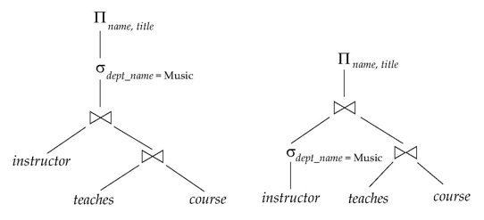

## 2.Transformation of Relational Expressions

### 2.1 Equivalence Rules

* selection
  
    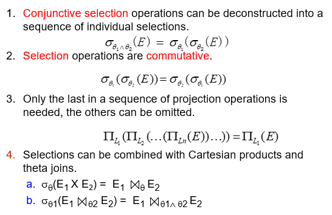

    1. 算子可拆分  
        如果某些属性有索引，那么可以先拆分，在索引 select 之后再执行其他算子，否则不如不拆分。
    2. 算子可交换  
        先执行有索引的算子。
    3. 投影的属性可以只保留最后一次的
    4. 选择算子可以和合并结合

* join

    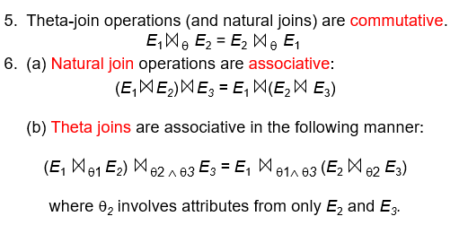

    1. 算子可交换  
    2. 自然连接可结合  
        先连接中间结果小的

    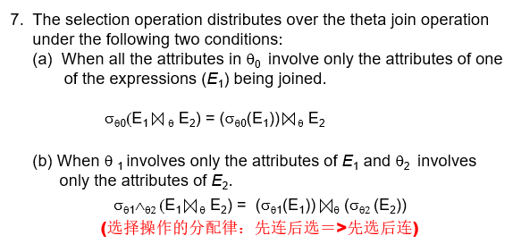

    3. 如果选择算子只和一个关系有关，那么我们可以先执行选择。（选择算子要早进行，推到叶子上）

* projection
    
    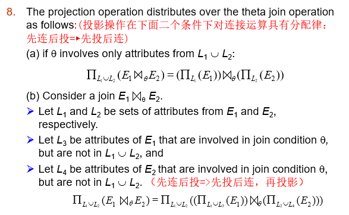

    1. 先投影后连接

* set operation

    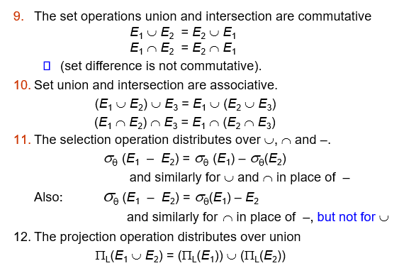

    1. 几个交换律
    2. 减法中第二个关系不用做选择（多减没关系）

    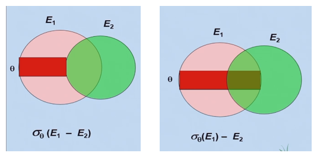

### 2.2 Enumeration of Equivalent Expressions(等效表达式的枚举)
查询优化器使用等效规则系统地生成与给定表达式等效的表达式。   
可以通过以下方法生成所有等效表达式： 

* repeat（重复）  
    1. 对已经找到的每个等价表达式的每个子表达式应用等价规则    
    2. 将新生成的表达式添加到等效表达式集中   
    3. 直到上面没有生成新的等效表达式

上述方法在空间和时间上都非常昂贵。  
另外两种方法：  

* 基于转换规则的优化计划生成  
* 仅包含选择、投影和联接的查询的特殊情况方法

一些优化：

* 通过共享公共子表达式减少空间需求：  
    当 E1 通过等价规则从 E2 生成时，两者通常只有顶层不同，下面的子树相同，可以使用指针共享。  
    
    >例如，当应用连接交换性时  
    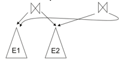 

    同一子表达式可能会多次生成,检测重复的子表达式并共享一个副本。  

* 通过不生成所有表达式来减少时间要求:  
    动态规划：我们将只研究用于连接顺序优化的动态规划的特殊情况

## 3.Statistics for Cost Estimation
!!! abstract "前置定义"

    * $n_r$：关系 $r$ 中的元组数。  
    * $b_r$：包含 $r$ 元组的块数。  
    * $l_r$：$r$ 元组的大小。  
    * $f_r$：$r$ 的 blocking factor — 即一个块中 $R$ 的元组数。  
    * 如果 $r$ 的元组在物理上一起存储在一个文件中，则：$\Large b_r=\lceil \frac{n_r}{f_r} \rceil$   
    * $V(A， r)$：属性 $A$ 出现在 $r$ 中的非重复值的数量; 与 $\prod_A(r)$ 的大小相同。  
    * $SC(A， r)$：关系 $r$ 的属性 $A$ 的选择基数;满足 $A$ 相等性的平均记录数。  

### 3.1 Selection Size Estimation
* $\sigma_A=v(r)$  
    1. $n_r / V(A， r)$：满足选择的记录数
    2. 键属性的相等条件：size estimate  = 1

* $\sigma_{A≤V}(r)$（ $\sigma_{A≥V}(r)$ 的情况是对称的）  
    设 c 表示满足条件的元组的估计数。  
    如果 catalog 中有 $min(A， r)$ 和 $max(A， r)$ 可用
    1. $c = 0$ 如果 $v < min(A， r)$
    2. $\large c = n_r*\frac{v-min(A,r)}{max(A,r)-min(A,r)}$   
    如果直方图可用，可以细化高于估计值  
    在没有统计信息的情况下，假设 $c$ 为 $n_r / 2$。

* Size Estimation of Complex Selections:
    
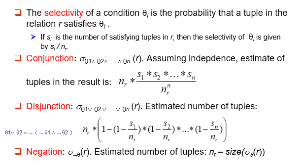

### 3.2 Estimation of the Size of Joins
笛卡尔积 $\large r × s$ 包含 $\large n_r * n_s$  个元组;每个元组占用 $\large s_r + s_s$ 字节。  

* 如果 $R \cap S = \varnothing$，则 $\large r \bowtie s$ 等价于 $\large r × s$ 相同。
* 如果 $R \cap S$ 是 $R$ 的键，则 $s$ 的元组最多会与 $r$ 中的一个元组连接。   
    因此，$r \bowtie s$ 中的元组数不大于 $s$ 中的元组数。
* 如果 $S$ 中的 $R \cap S$ 是 $S$ 中引用 $R$ 的外键，则 $\large r \bowtie s$ 中的元组数与 $\large s$ 中的元组数完全相同。   
    引用 $S$ 的外键的情况是对称的。
>在学生执行的示例查询中($student  \bowtie takes$)，$ID$ in $take$ is a foreign key referencing $student$。因此，结果正好有 $n_{takes}$ 元组，即 10000

* 如果 $R \cap S = \{A\}$ 不是 $R$ 或 $S$ 的键。
    1. 如果我们假设 $R$ 中的每个元组 $t$ 在 $R\bowtie S$ 中产生元组，则 $R\bowtie S$ 中的元组数估计为：
        $$
        \frac{n_r*n_s}{V(A,s)}
        $$
    2. 如果反之亦然，则获得的估计值为：
        $$
        \frac{n_r*n_s}{V(A,r)}
        $$
    这两个估计中较低的可能更准确。

    >e.g:  
    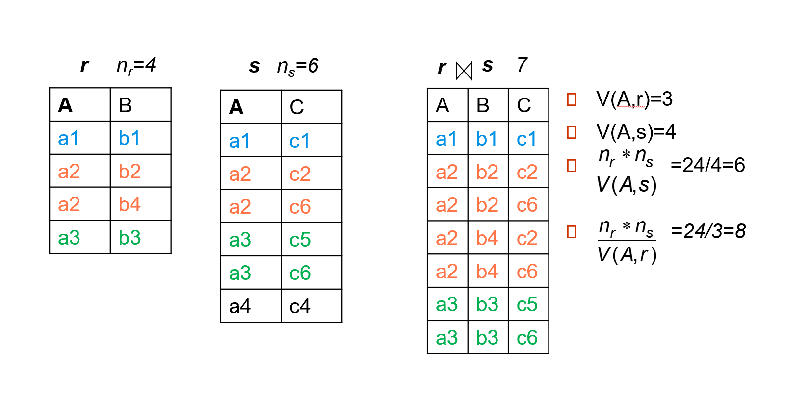{width="550"}

### 3.3 Size Estimation for Other Operations

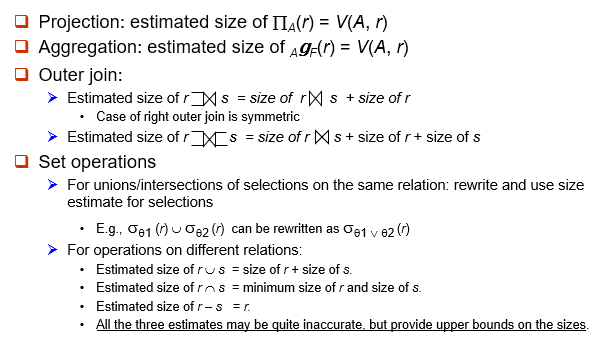

### 3.4 Estimation of Number of Distinct Values
#### Selections: $\large \sigma_\theta(r)$

* 如果 $\theta$ 强制 $A$ 取指定值：$(A，\sigma_theta (r)) = 1$。
  
    >e.g. A = 3

* 如果 $\theta$ 强制 $A$ 采用一组指定的值之一：$V(A，\sigma_\theta (r)) = $ 指定值的数量。
    
    >e.g. $(A = 1 \vee A = 3 \vee A = 4 )$

* 如果选择条件 $\theta$ 的形式为 $A\;\;op\;\; r$	
    估计 $\large V(A, \sigma_\theta (r)) = V(A,r) * s$  
    其中 s 是选择率。

* 在所有其他情况下：使用 $\large min(V(A，r)， n_{\sigma\theta (r)})$ 作为估计
    
使用概率论可以得到更准确的估计，但这些基本可以正常工作。

#### Joins: $\large r \bowtie s$

* 如果 $A$ 中的所有属性都来自 $r$     
    估计 $V(A, r\bowtie s) = min (V(A, r), n_{r \bowtie s})$
* 如果 $A$ 包含来自 $r$ 的属性 $A1$ 和来自 $s$ 的 $A2$，则估计 
    $\large V(A, r\bowtie s) = min(V(A1, r)*V(A2 – A1, s),V(A1 – A2， r)*V(A2， s), n_{r\bowtie s})$

使用概率论可以得到更准确的估计，但这些基本可以正常工作。

### 3.5 Choice of Evaluation Plans
在选择评估计划时，必须考虑评估技术的相互作用。为每个操作单独选择最便宜的算法可能不会产生最佳的整体算法。
>例如，  
  1. 合并-联接可能比哈希联接成本更高，但可以提供排序输出，从而降低外部级聚合的成本。    
  2. 嵌套循环联接可能为流水线提供机会。

实用的查询优化器包含以下两种广泛方法的元素：

1. 搜索所有计划并以基于成本的方式选择最佳计划。
2. 使用启发式方法来选择计划。

  
    