---

title: Chap 11 | Transactions 

hide:
  #  - navigation # 显示右
  #  - toc #显示左
  #  - footer
  #  - feedback  
comments: true  #默认不开启评论

---
<h1 id="欢迎">Chap 11 | Transactions</h1>
!!! note "章节启示录"
    摆烂了……  
    
## 1.Transaction Concept 
事务是程序执行的单元，用于访问并可能更新各种数据项。  
A transaction is a unit of program execution that accesses and  possibly updates various data items.

### 1.1 ACID Properties
* Atomicity（原子性）:事务的所有操作都正确反映在数据库中，或者没有。
* Consistency （一致性）:单独执行事务可保持数据库的一致性。
* Isolation（隔离性）:尽管多个事务可以同时执行，但每个事务必须不知道其他并发执行的事务。中间事务结果必须对其他并发执行的事务隐藏。 
也就是说，对于每一对 Ti 和 Tj 事务，在 Ti 看来，要么是 Tj 在 Ti 开始之前完成执行，要么是 Tj 在 Ti 完成之后开始执行。
* Durability（持久性）:事务成功完成后，即使出现系统故障，它对数据库所做的更改也会保留。

>
1. 原子性和持久性是由数据库系统的灾备功能保证
2. 隔离性是由数据库的并发控制保证
3. 一致性是由用户和系统共同保证

## 2.Transaction State
* Active – 初始状态;事务在执行时保持此状态。
* Partially committed  – 在执行最终语句之后。（此时要输出的结果数据可能还在内存缓冲中）
* Failed -- 在发现正常执行无法再继续之后。
* Aborted – 在事务回滚并将数据库恢复到事务开始前的状态之后。 中止后的两个选项：
    1. 重新启动事务
        
        >只有在没有内部逻辑错误的情况下才能完成

    2. 终止事务
   
* Committed – 成功完成后。

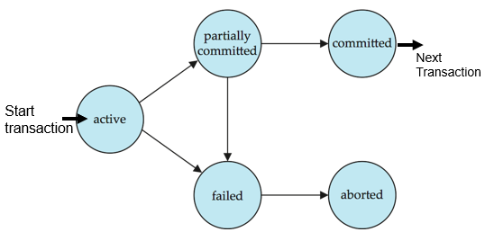

## 3.Implementation of Atomicity and Durability
数据库系统的恢复管理组件实现了对原子性和持久性的支持。

* 影子数据库方案---一种简单但效率低下的方案：名为 db_pointer 的指针始终指向数据库的当前一致副本。
    所有更新都是在新创建的数据库副本上进行的。
    1. 如果中止：只需删除新副本即可。
    2. 如果提交：
        1. 将新副本的所有页面内存到磁盘（在unix中，flush命令）。    
        2. db_pointer更改为指向新副本---成为当前副本，同时删除旧副本。

## 4.Concurrent Executions

### 4.1 Schedules
* 调度：指示并发事务指令执行的时间顺序的序列
    1. 一组事务的时间表必须包含事务的所有指令
    2. 必须保留指令在每个事务中的显示顺序。
    3. 
>e.g:  
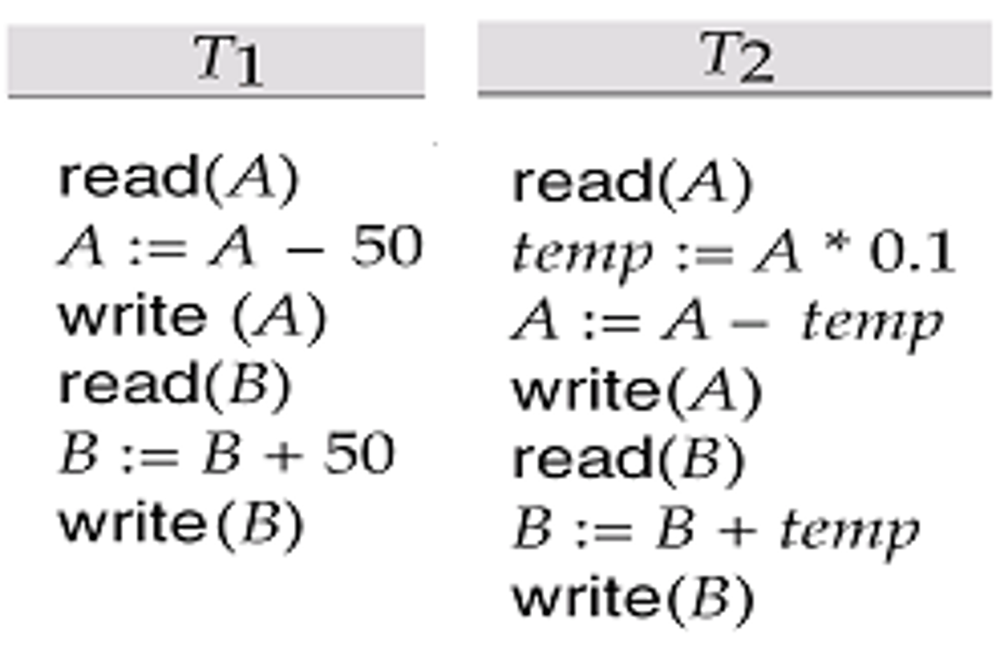{width="300"}

!!! example "一种调度的例子：串行调度"
    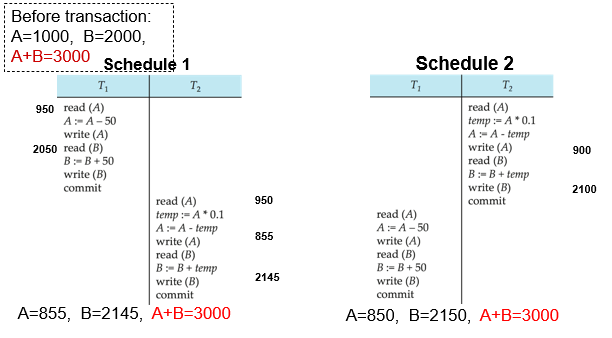
    
    * Both schedule1 and schedule2 are serial（串行的）  
    * N个并行事务有n!种可选择的串行调度 (如<t1,t2,t3,…>, <t2,t1,t3,…>,<t3,t1,t2,…>, …)
    * 串行的调度必能保持一致性， 但低效。

!!! example "一种调度的例子：并行调度"
    

    * In both Schedule 1, 2, and 3, the sum A + B is preserved.--- consistency 
    * But Schedule 4 does not preserve the value of the the sum A + B. --- not consistent.    --- a bad schedule!

## 5.Serializability
基本假设 – 每个事务都保留数据库一致性。
因此，一组事务的串行执行可以保持数据库的一致性。  
如果（可能是并发）计划等同于串行计划，则该计划是可序列化的。不同形式的调度等价性产生了以下概念：  

1. Conflict serializability 冲突序列化  
2. View serializability 视图序列化

## 5.1 Conflict serializability
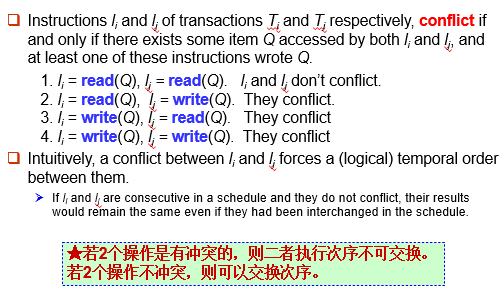

如果可以通过一系列非冲突指令的交换将调度 $S$ 转换为调度 $S^{\prime}$，则我们说 $S$ 和 $S^{\prime}$ 是冲突等价的。  
我们说，如果调度 $S$ 与串行调度冲突等价，则它是conflict serializable (可序列化的冲突)。

* 例子1：  
    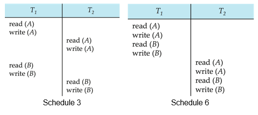

    Schedule 3 可以通过一系列不冲突指令的交换转换为Schedule 6，即 先 T1 后 T2 的串行调度。因此，Schedule 3 是可序列化的冲突(conflict serializable)。
 
* 例子2：
    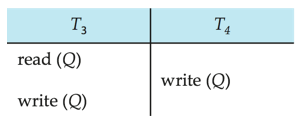

    We are unable to swap instructions in the above schedule to obtain either the serial schedule < T3, T4 >, or the serial schedule < T4, T3 >.   
    因为写的交换会引起冲突。

## 5.2 View Serializability
设 $S$ 和 $S^{\prime}$ 是具有同一组事务的两个调度。如果满足以下三个条件，则 $S$ 和 $S^{\prime}$ 是视图等效的，对于每个数据项 Q:

* 首读：如果在调度 $S$ 中，事务 $T_i$ 读取 $Q$ 的初始值，则在调度 $S^{\prime}$ 中，事务 $T_i$ 也必须读取 Q 的初始值。

* 写读：如果在表 $S$ 事务 $T_i$ 中执行 read（$Q$），并且该值是由事务 $T_j$（如果有）生成的，则在表 $S^{\prime}$ 中，事务 $T_i$ 也必须读取由事务 $T_j$ 的相同 write（$Q$） 操作产生的 $Q$ 值。

* 末写：如果在调度 $S$ 中最后一步执行 write（$Q$） 调度 $S^{\prime}$ 中最后一步也需要执行 write（$Q$） 操作。

如果调度 $S$ 的视图等效于串行计划，则调度 $S$ 是 view serializable (视图可序列化)。

* 例子1：  
    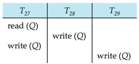
    
    is a schedule which is view-serializable but not conflict serializable

* 例子2：  
    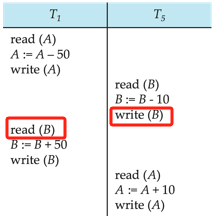

    存在“写读”，改为串行后变成“读写”，所以不行。  
    is not conflict equivalent or view equivalent to it.  
    但它是可串行化的。

## 6.Recoverability
### 6.1 Recoverable Schedules
可恢复调度 — 如果事务 Tj 读取事务 Ti 之前写入的数据项，则 Ti 的提交操作出现在 Tj 的提交操作之前。

>e.g:  
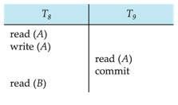    
如果 T8 后续回滚, 但 T9 已经基于脏数据做了后续操作，而且已经提交了，不可恢复。
    
### 6.2 Cascading Rollbacks
级联回滚 – 单个事务失败会导致一系列事务回滚。请考虑以下计划，其中尚未提交任何事务（因此计划是可恢复的）:  

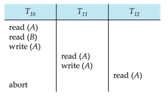  

如果 T10 失败，则还必须回滚 T11 和 T12。
可能导致大量工作的撤消,因此我们更希望用非级联的恢复，否则开销太大。

### 6.3 Cascadeless Schedules
无级联调度 — 不会发生级联回滚;对于每对事务 Ti 和 Tj，若 Tj 读取 Ti 之前写入的数据项，Ti 的提交操作需要出现在 Tj 的读取操作之前。   
每个 Cascadeless Schedules 也是可恢复的。  
最好将计划限制为 Cascadeless Schedules。

## 7.Testing for Serializability
考虑一组事务 T1、T2、...、Tn 的一些调度 

* Precedence graph (优先级图) — 一个有向图，其中顶点是事务。  
    1. 如果两个事务发生冲突，我们从 Ti 到 Tj 画一条弧线，并且 Ti 访问了之前发生冲突的数据项。
    2. 我们可以通过访问的项目来标记弧线。

>e.g:   
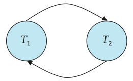

* 当且仅当调度优先级图是非循环的时，调度才是conflict serializable （冲突可序列化的）。

* 存在Cycle-detection（周期检测算法），其顺序为 $n^2$ 时间，其中 $n$ 是图中的顶点数。 
>（更好的算法采用 $n + e$ 的顺序，其中 $e$ 是边的数量。

* 如果优先级图是非循环的，则可以通过图的拓扑排序来获得可序列化顺序。

>例如:  
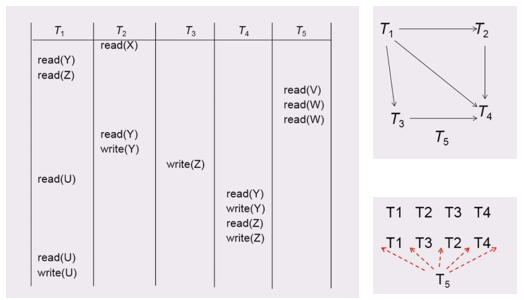

### Levels of Consistency in SQL-92

* Serializable — 默认
* Repeatable read  — 仅读取要读取的已提交记录。
    1. 重复读取同一记录必须返回相同的值。
    2. 但是，事务可能无法序列化 - 它可能会找到事务插入的某些记录，但找不到其他记录。
* Read committed  — 只能读取已提交的记录。
    连续读取记录可能会返回不同（但已提交）的值。
* Read uncommitted — 甚至可以读取未提交的记录。
* Warning：默认情况下，某些数据库系统不确保可序列化计划

    

