---

title: Chap 12 | Concurrency Control 

hide:
  #  - navigation # 显示右
  #  - toc #显示左
  #  - footer
  #  - feedback  
comments: true  #默认不开启评论

---
<h1 id="欢迎">Chap 12 | Concurrency Control</h1>
!!! note "章节启示录"
    摆烂了……  

## 1.Lock-Based Protocols
锁是一种控制对数据项的并发访问的机制

* 数据项可以在两种模式下锁定：
    1. 独占（X）模式。数据项既可以读取，也可以读取  
         写。使用 lock-X 指令请求 X-lock。
    2. 共享（S）模式。只能读取数据项。S-lock 是         
         使用 lock-S 指令请求。
向并发控制管理器发出锁定请求。只有在请求获得批准后，交易才能继续进行。

* 要写一个数据，先申请获得 X 锁；要读一个数据，先申请获得 S 锁。
* 访问结束后释放这个锁。
* 访问数据之前必须获得对应的锁，否则需要等待。
* 相容矩阵：  
  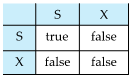

### 1.1 The Two-Phase Locking Protocol
这是一种确保冲突可序列化计划的协议。(每个事务放锁后不加锁)

* 第 1 阶段：生长阶段 (Growing Phase)
    1. 交易可能获得锁
    2. 交易可能无法释放锁
* 第 2 阶段：收缩阶段 (Shrinking Phase)
    1. 交易可能会释放锁
    2. 交易可能无法获得锁
   
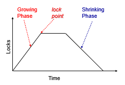
```sql
lock-S(A);
read (A);
lock-S(B); <-- lock point
read (B); 
unlock(A);
unlock(B);
display(A+B)
```
两阶段锁定协议确保了可序列化性。   
可以证明，交易可以按照其锁定点的顺序（即交易获得其最终锁定的点）进行序列化。

需要基本两阶段封锁，以确保从级联回滚中的可恢复性。

* Strict two-phase locking（严格两阶段封锁）:事务必须持有其所有独占锁，直到它提交/中止。（排他锁最后释放）
>确保可恢复性并避免级联回滚
* Rigorous two-phase locking（强两阶段封锁）：事务必须保持所有锁，直到提交/中止。
>事务可以按其提交的顺序序列化
### 1.2 2PL - Proof
* 2PL - Proof by Contradiction 
    引理：如果有 Ti->Tj 的有向边，那 Ti 的 lockpoint 一定小于 Tj。
    因为 Ti->Tj 肯定有一个冲突的访问（对同一个数据）那 Tj 在获得锁的时候 Ti 已经放锁了(LP(Ti)< LP(Tj))。   
    所以，如果不保证可序列化，那么会存在 Ti 到 Tj 的环，根据引理 LP(Ti)< LP(Tj) 且 LP(Tj)< LP(Ti) ，矛盾！  

    >LP,i.e,Lock Point，是一个时间

    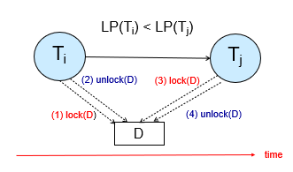

* 2PL  - Proof by Induction     
    只需证明: Lock point 最小的事务，可以无障碍地交换到调度最前。
    使用反证法：如果另一个事务 Tj 的操作 OPj 阻止了 Ti 的操作 OPi ,在Tj 和 Ti 之间有一次解锁，所以有一个Lock Point，与 Ti 的 Lock Point 最小矛盾。得证。

    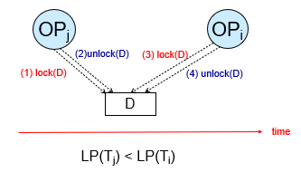

### 1.3 Lock Conversions
带锁转换的两相锁定：

* 第一阶段：       
    可以获取数据项上的lock-S或lock-X  
    可以将 lock-S 转换为 lock-X  
    （lock-upgrade）
* 第二阶段：  
    可以释放锁-S或锁-X  
    可以将 lock-X 转换为 lock-S   
    （lock-downgrade）

该协议确保了可序列化性。 

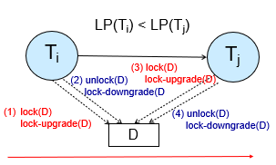

申请哪个锁是由数据库内部管理决定，不是由程序员显示调用。（自动加锁）

## 2.Implementation of Locking
锁管理器可以作为一个单独的进程来实现，事务向该进程发送锁定和解锁请求。  
锁管理器通过发送锁授予消息（或在死锁的情况下要求事务回滚的消息）来回复锁请求。  
请求事务将等待，直到其请求得到响应。  
锁管理器维护一个称为锁表的数据结构，以记录已授予的锁和待处理的请求。  
锁定表通常作为内存中的哈希表实现，该哈希表根据被锁定的数据项的名称编制索引。  

### 2.1 Lock Table

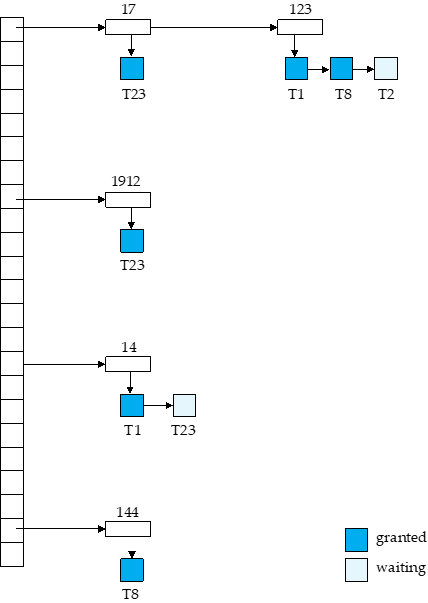  

每个记录的 id 可以放进哈希表。
如这里记录 123, T1、T8 获得了 S 锁，但 T2 在等待获得 X 锁。

T1: lock-X(D) 通过 D 的 id 找到哈希表上的项，在对应项上增加。根据是否相容决定是获得锁还是等待。
unlock 类似，先找到对应的数据，拿掉对应的项。同时看后续的项是否可以获得锁。

如果一个事务 commit, 需要放掉所有的锁，我们需要去找。因此我们还需要一个额外的事务的表，标明每个事务所用的锁。

### 2.2 Deadlock Handling
如果存在一组事务，使得集合中的每个事务都在等待集合中的另一个事务，则系统将陷入死锁。
两相锁定不能确保无死锁:  

{width="450"}

* Deadlock prevention protocols:可确保系统永远不会进入死锁状态。   
    一些预防策略：  
    1. 要求每个事务在开始执行之前锁定其所有数据项（预声明，一次性获得所有的锁（在数据库中不太现实，但在其他并发程序中或许有用武之地））。
    2. 对所有数据项实施部分排序，并要求事务只能按部分顺序（基于图的协议）指定的顺序锁定数据项。
* Timeout-Based Schemes:  
    1. 事务仅在指定的时间内等待锁定。之后，等待超时，事务将回滚。因此，死锁是不可能的
    2. 易于实施;但“饿死”是可能的。也很难确定超时间隔的良好值。
   
    >饿死：得不到满足。如果一个锁要写，但其他锁总是要读这个数据，那么就会一直饿着。

### 2.3 Deadlock Detection
死锁可以描述为等待图（wait-for graph）$ G = (V，E)$  
$V$ 是一组顶点（系统中的所有事务）  
$E$ 是一组边;每个元素都是一对有序的 Ti->Tj。  

如果 Ti -> Tj 在 E 中，则从 Ti 到 Tj 有一条有向边，这意味着 Ti 正在等待 Tj 释放数据项。  

当 Ti 请求当前由 Tj 持有的数据项时，边 Ti Tj 将插入到等待图中。仅当 Tj 不再保存 Ti 所需的数据项时，才会删除此边。

当且仅当等待图具有环时，系统才处于死锁状态。 必须定期调用死锁检测算法来查找周期。

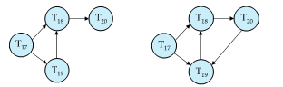

这里的箭头表示在等待锁。如 T17->T18 表示 T17 在等待 T18 的锁。   

### 2.4 Deadlock Recovery
检测到死锁时：    
某些事务将不得不回滚（成为受害者）以打破僵局。 选择该交易作为受害者，这将产生最低成本。

* Rollback -- 确定回滚事务的程度
    * Total rollback：中止事务，然后重新启动它。
    * 仅在必要时回滚事务以打破僵局更有效。

如果总是选择相同的交易作为受害者，就会发生饥饿。在成本系数中考虑回滚次数以避免饥饿。

### 2.5 Graph-Based Protocols

假设我们知道数据是按偏序访问的，可以有更高级的协议。  
数据按照某种偏序关系访问。

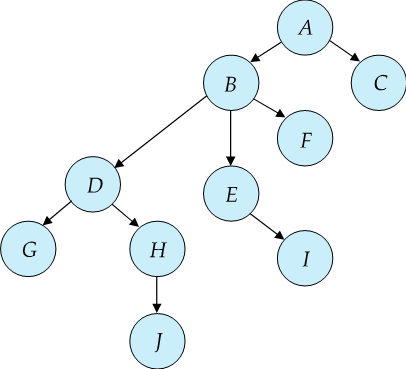{width="300"}

* Tree Protocol:
    1. 只允许使用X锁。
    2. Ti 的第一个锁可以位于任何数据项上。随后，只有当 Q 的父级当前被 Ti 锁定时，数据 Q 才能被 Ti 锁定。
    3. 数据项可以随时解锁。
    4. 被 Ti 锁定和解锁的数据项随后无法被 Ti 重新锁定(放锁后不能再加锁)

树协议确保了冲突的可序列化性以及免于死锁。

* Advantages：  
    1. 树锁定协议中的解锁可能比两阶段锁定协议中的解锁更早发生。
    2. 更短的等待时间，并发性增加
    3. 协议无死锁
    4. 无需回滚
* Disadvantages：   
    1. 协议不保证可恢复性或级联自由度

        >需要引入提交依赖项以确保可恢复性

    2. 事务可能必须锁定比所需更多的数据项。
        * 增加锁定开销和额外的等待时间
        * 并发性的潜在降低
  
在两阶段锁定下不可能的时间表在树协议下是可能的，反之亦然。

## 3.Multiple Granularity(多粒度)
允许数据项具有各种大小，并定义数据粒度的层次结构，其中小粒度嵌套在大粒度中。   
可以图形化地表示为树（但不要与树锁定协议混淆）。  
当事务显式锁定树中的节点时，它会以相同的模式隐式锁定节点的所有后代。   

* 锁定粒度（在完成锁定的树中的级别）：     
    1. fine granularity（细粒度）（树中较低）：高并发，高锁定开销
    2. coarse granularity（粗粒度）（树中较高）：低锁定开销，低并发

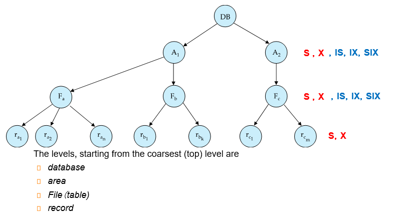{width="500"}

### 3.1 Intention Lock Modes

* 除了 S 和 X 锁定模式之外，还有三种具有多个粒度的其他锁定模式：
    1. 意向共享 （IS）：表示在树的较低级别显式锁定，但仅使用共享锁。（下面有S）
    2. 意向独占 （IX）：表示使用独占锁或共享锁在较低级别显式锁定。（下面有X）
    3. 共享和意向独占 （SIX）：该节点根植的子树在共享模式下显式锁定，并且使用独占模式锁在较低级别进行显式锁定。（都可以读了，但是要写还得在具体的记录上加锁）

意向锁允许在 S 或 X 模式下锁定更高级别的节点，而无需检查所有后代节点。这样当我们想向一个表上 S 锁时，发现表上有 IX 锁，这样我们很快就发现了冲突，需要等待。IS 和 IX 是不冲突的。在表上是不冲突的，可能在记录上冲突（即对一个记录又读又写，冲突发生在记录层面而非表）。

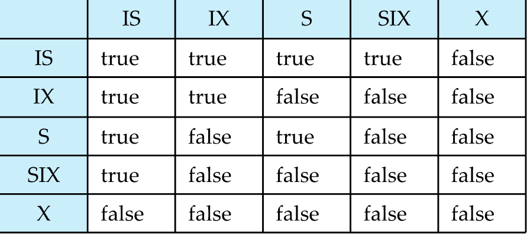{width="500"}

* 要符合相容矩阵。从最粗的粒度开始访问。要加锁的时候注意，对父亲的锁有要求。  

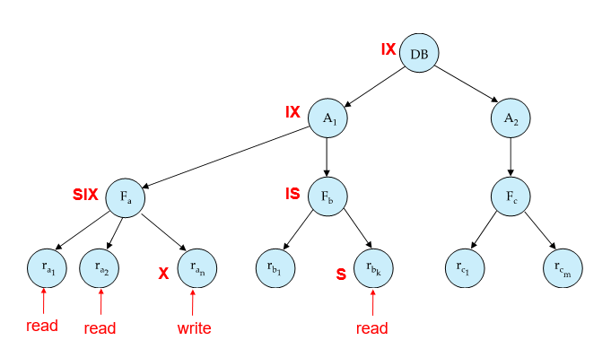{width="500"}

加锁是从上往下，放锁是从下往上。
先对 DB 加 IX, 对 A1 加 IX, 对 Fa 加 SIX, 对某些记录加 X. 其他记录就不用再加 S 锁了(因为表是 SIX).

## 4.Insert and Delete Operations
* 如果使用两阶段锁定：  
    1. 仅当删除元组的事务在要删除的元组上具有 X 模式锁时，才能执行删除操作。
    2. 在数据库中插入新元组的事务在元组上具有 X 模式锁
* 确保  
    1. 读取/写入与删除冲突
    2. 插入的元组不能被其他事务访问，直到插入元组的事务提交
* 插入和删除会导致幽灵现象。  
    1. 如果仅使用元组锁，则可能导致不可序列化的计划
    
    >例如，扫描事务看不到新帐户，但读取更新事务写入的其他一些元组

### 4.1 Index Locking Protocol To Prevent Phantoms
其实插入/删除操作隐含地修改了信息，只是没有被表示出来。我们可以这个信息显示化，加锁。
如果表上有索引，我们在扫描索引的时候会在叶子修改，我们在这里进行检测。  

* Index locking protocol:：
    1. 每个关系必须至少有一个索引。
    2. 事务只有在通过关系上的一个或多个索引找到元组后才能访问元组
    3. 执行查找的事务 Ti 必须在 S 模式下锁定它访问的所有索引叶节点
   
        >即使叶节点不包含任何满足索引查找的元组（例如，对于范围查询，叶中没有元组在范围中）
    
    4. 在关系 r 中插入、更新或删除元组 ti 的事务 Ti
        1. 必须将所有索引更新为 R
        2. 必须在受插入/更新/删除影响的所有索引叶节点上获取独占锁
    5. 必须遵守两相锁定协议的规则

这样就保证了不会发生幽灵现象

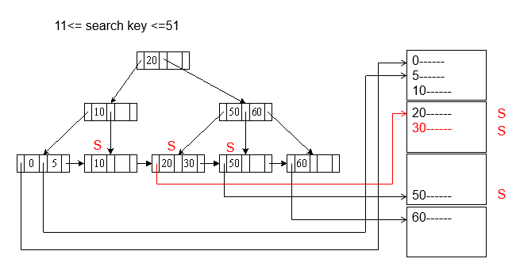  

先把要走的路径走一遍，在满足范围的记录上加上锁。   
先在叶子页加锁，再在记录上加锁。   
如果我们要插入，比如 18. 这时插入到了 10 这页，发现这页被锁住了，无法插入，这样就确保了这个范围内无法被插入，不会有幽灵问题。

### 4.2 Next-Key Locking To Prevent Phantoms
Index-locking protocol防止幽灵现象需要锁定整个叶子。如果插入很多，可能会导致并发性差。  

* Next-key locking protocol：提供更高的并发性  
    1. 锁定满足索引查找的所有值（匹配查找值，或落在查找范围内，而不是锁叶子了）
    2. 同时锁定索引中的下一个键值
        甚至对于插入/删除
    3. 锁定模式：S 表示查找，X 表示插入/删除/更新

* 确保范围查询将与插入/删除/更新冲突。无论哪个先发生，只要两者是并发的

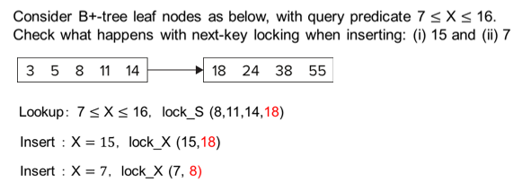  

查询 7 到 16, 我们把索引项锁起来，把下一个索引值 18 也锁起来（其实相当于封锁了这个区间）。  
插入的时候要申请这个锁和比插入值大的下一个值的锁，这里插入 15 时就要申请 15 和 18 的锁，冲突无法插入。插入 7 同理。