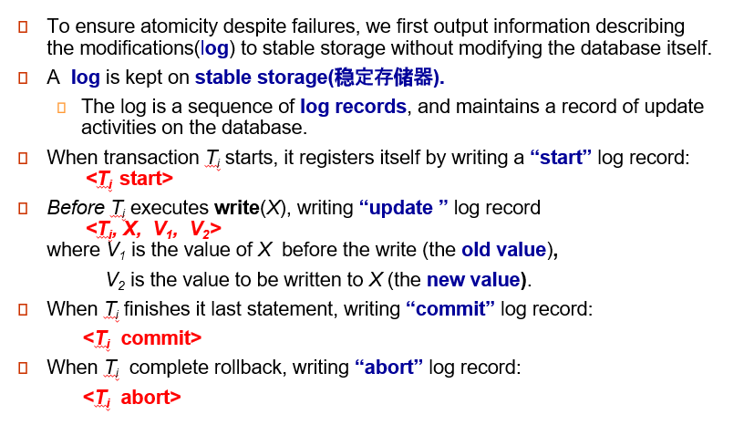
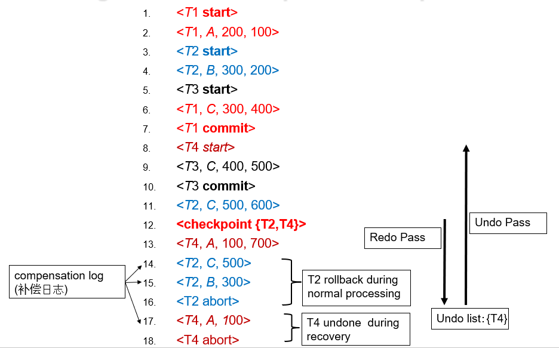
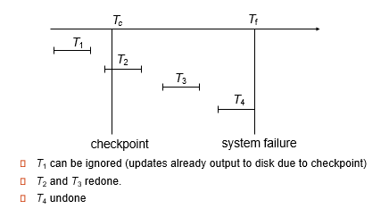
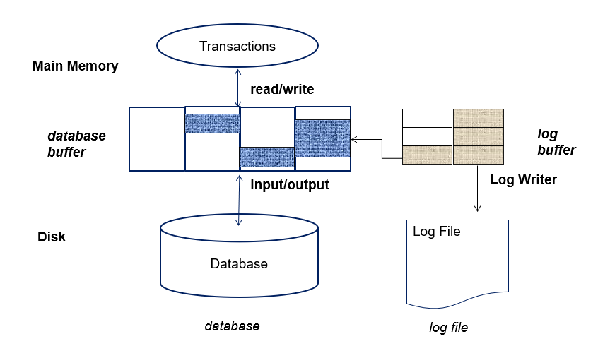
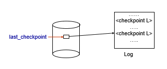
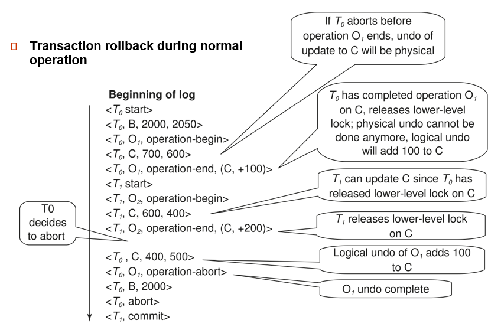
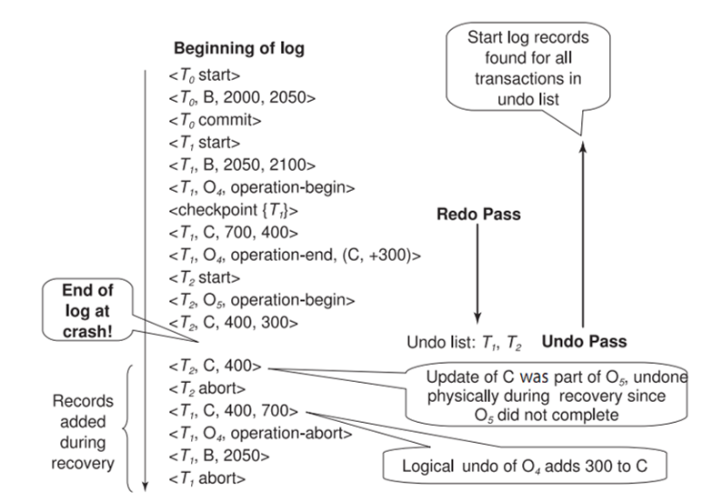

---

title: Chap 13 | Recovery System 

hide:
  #  - navigation # 显示右
  #  - toc #显示左
  #  - footer
  #  - feedback  
comments: true  #默认不开启评论

---
<h1 id="欢迎">Chap 13 | Recovery System</h1>
!!! note "章节启示录"
    摆烂了……  

## 1.Failure Classification

* 事务失败 Transaction failure：
    1. 逻辑错误：由于某些内部错误情况，事务无法完成
    2. 系统错误：数据库系统必须由于错误情况（例如，死锁）而终止活动事务
* 系统崩溃 System crash：电源故障或其他硬件或软件故障导致系统崩溃。
    1. 故障停止假设：假定非易失性存储内容不会因系统崩溃而损坏
    2. 数据库系统具有大量完整性检查，以防止磁盘数据损坏
* 磁盘故障 Disk failure：磁头崩溃或类似的磁盘故障会破坏全部或部分磁盘存储
    1. 假定破坏是可检测到的：磁盘驱动器使用校验和来检测故障

## 2.Storage Structure

### 2.1 分类

* 易失性储存：
    无法在系统崩溃后存活
    
    >示例：主内存、缓存内存

* 非易失性存储：
    1. 在系统崩溃中幸存下来
    
    >示例：磁盘、磁带、闪存、非易失性（备用电池）RAM
    
    2. 但可能仍然会失败，丢失数据
   
* 稳定储存：
    1. 一种神话般的存储形式，可在所有故障中幸存下来
    2. 通过在不同的非易失性介质上维护多个拷贝来近似

### 2.2 Database Recovery
恢复算法是在发生故障时确保数据库一致性以及事务原子性和持久性的技术。  

* 恢复算法由两部分组成:
    1. 在正常事务处理期间为确保存在足够的信息以从故障中恢复而采取的操作
    2. 在无法将数据库内容恢复到确保原子性、一致性和持久性的状态时执行的操作

我们假设严格的两相锁定可确保没有脏读。

* Idempotent（幂等性） ：如果多次执行恢复算法与执行一次结果相同，则称为幂等。

## 3.Log-Based Recovery

### 3.1 Log Records

### 3.2 Write-Ahead Logging (先写日志原则)
在将主内存中的数据输出到数据库之前，必须将与数据相关的日志记录输出到稳定存储中。

### 3.3 Transaction Commit

* 当事务的提交日志记录输出到稳定存储时，称为已提交：   
    日志已经记录 commit, 说明事务已经提交。（因为后续可以根据这个恢复状态了）  
    但此时数据不一定已经写回到数据库里（不一定高效）
* 事务的所有先前日志记录必须已输出   
* 当事务提交时，事务执行的写入可能仍在缓冲区中，并且可能在以后输出:不一定在磁盘。如果立刻将 block 写回磁盘可能引起大量 I/O 操作。

### 3.4 Undo(撤销) and Redo（重做） Operations
撤消日志记录<Ti、X、V1、V2>将旧值 V1 写入 X   
重做日志记录<Ti、X、V1、V2>将新值 V2 写入 X   

* 撤消和重做事务：
    1. undo（Ti）：将 Ti 更新的所有数据项的值恢复到其旧值，从 Ti 的最后一个日志记录向后倒退
    每当数据项 X 恢复到其旧值 V 时，都会写出一条特殊的日志记录<Ti、X、V> – compensation log（补偿日志）  
    当事务撤消完成时，将写出日志记录<Ti abort>。
    2. redo（Ti）：从 Ti 的第一个日志记录开始，将 Ti 更新的所有数据项的值设置为新值，
    在这种情况下，不执行日志记录。

### 3.5 Checkpoints
重做/撤消日志中记录的所有事务可能非常缓慢  

* Output all log records currently residing in main memory onto stable storage.  
    日志不是生成就往内存写，而是有一个日志缓冲区。
    确保把日志项写到日志中去了。

* Output all modified buffer blocks to the disk.
把 buffer 里所有数据都刷写一遍。

* Write a log record $\large <checkpoint\;\;L>$ onto stable storage where L is a list of all transactions active at the time of checkpoint.  
    写一个日志的标记（新的日志类型）. L 是当前正在工作的事务的表。（用来做 undo list 的初始化列表）

* All updates are stopped while doing checkpointing!!! 做 checkpoint 的时候其他活跃事务都要停下来。 

checkpoint 是确认之前的操作都已经反映到数据库里去了，这样重演的时候就可以直接从 checkpoint 开始。

!!! example "Example"
      

    重演历史从最近的 checkpoint 重演. {T2 T4} 作为 undo list 的初始化值。

这张图比较形象地展示了把哪些事务放入 undo ，哪些事务放入 redo 。

### 3.6 Log Record Buffering

{width="500"}

数据库维护数据块的内存缓冲区  
当需要新块时，如果缓冲区已满，则需要从缓冲区中删除现有块  
如果选择删除的块已更新，则必须将其输出到磁盘  

* 恢复算法支持无强制策略（non-force policy）：即在事务提交时，更新的块不需要写入磁盘  
    force policy（强制）：要求在提交时写入更新的块
    更昂贵的提交      
    好的恢复算法：我事务 commit 了但不强制日志刷写出去。

* 恢复算法支持窃取策略（steal strategy）：即包含未提交事务更新的块可以写入磁盘，甚至在事务提交之前

### 3.7 Fuzzy Checkpointing
为避免在检查点期间长时间中断正常处理，允许在检查点期间进行更新

* 模糊检查点的完成方式如下：
    1. 暂时停止按事务进行的所有更新
    2. 写入<checkpoint L>日志记录并强制日志到稳定存储
    3. 标记已修改缓冲区块的列表 M
    4. 现在允许事务继续其操作
    5. 输出到磁盘列表 M 中所有修改的缓冲区块
        1. 块在输出时不应更新
        2. 遵循 WAL：在输出块之前，必须输出与块相关的所有日志记录
    6. 将指向检查点记录的指针存储在磁盘上的固定位置last_checkpoint

* 使用模糊检查点恢复时，请从last_checkpoint指向的检查点记录开始扫描    
* last_checkpoint之前的日志记录的更新将反映在磁盘上的数据库中，无需重做(因为只有内容写到磁盘中后，才改变last_checkpoint指向的位置（之前日志已经写出去了，但last_checkpoint指针指向的位置还没有改变）)。   

## 4. Recovery with Early Lock Release and Logical Undo Operations

### 4.1 Logical Undo Logging
如果早放锁，后续恢复为 old value 可能没有意义。比如存款 100, 转入 100. 那么我们恢复为 100(物理撤销) 就没有意义。这个时候应该采用逻辑撤销，即如果 a+=100, 恢复时就应该 a-=100.

先从checkpoint redo 到 crash 处（恢复案发现场），但数据库不能用，还需要 undo 。undo list 是 {T1，T2}，按照日志顺序依次 undo 。