---

title: Note 

hide:
  #  - navigation # 显示右
  #  - toc #显示左
  #  - footer
  #  - feedback  
comments: true  #默认不开启评论

---
<h1 id="欢迎">Note</h1>

## IS 0 Introduction

* 超过 80% 的攻击来自内部人员（内部）

!!! quesiton "What is Insiders"
    * 对环境或系统的某些方面具有合法访问权限或关联的人员。  
    * 与外部入侵者相比，内部人员的机会和知识更多。
    * 内部人士通常有明确的动机（报复、经济利益、信息等）

* 中国历史上第一个密码是什么？  
  太公兵法
* 谁发明了中共的第一个密码  
  豪密
* 凯撒密码
  将每个字母替换为它**位移**3
  密钥个数：25
* 棍子密码（Scytale Cipher）
  密钥是棍子的直径/周长
* 隐写术  
  连城诀的取诗中的第几个字  
  水浒传的藏头诗 卢俊义反  
  写进头皮、蜡烛里、鸡蛋里、微点（microdot）与电影、培根密码  
* 密码学的演变
  信息隐藏≠加密
  >一般来说，密码学的主要目标是保密。历史上列出的保守秘密的方式是人类智慧的精髓。但是，密码学的真正科学化应该归功于克尔克霍夫原理的出现及其后来的发展。
    * 第一次演变：Kerckhoffs 原理 
    * 第二次演变：计算机 
    * 第三次演变：公钥密码 
    * 第四次演变：互联网？手机互联网

* 科托夫原则（kerckhoff principle）
  Kerckhoffs原理意味着密码学从史前时期演变到经典时期：
    * 增强安全性：假设任何不变的东西都会被披露 
    * 加密算法本身不能保密,需要公开 
    * 保密性只取决于密钥 
    * 它使密码机的大规模生产成为可能

* 电子计算机（Electronic Compute）
    * 计算机出现在二战中，为了破解 ENIGMA
    * 计算机加速加密和解密
    * 理论依据——香农的信息论： 《通信的数学理论》，1948年 和《保密系统的通信理论》，1949 年
    * 现代密码的出现：DES

* 公钥密码学（Public Key Cipher）  
    公钥密码使得交换大量秘密消息成为可能，而无需在发送方和接收方之间共享任何密钥。

*  互联网（: (Mobile) Internet? AI?）
    * 密码学内涵的扩展：  
        不仅是“秘密”，还有其他问题;  
    * 扩展密码学的扩展：  
        应用：军事领域->民用领域->人员领域 
        保护：简单的 PTP 协议 - >复杂的 PTP 协议 - >各种互联网协议和应用 - > 5G、区块链、物联网和人工智能 
    * 硬件和软件开发的挑战：   
         提升硬件性能和容量并降低成本;  
         海量分布式计算、云计算、密码分析等;

!!! abstract "computer VS paper"
    * 我们可以分辨纸质文档的原件和副本之间的区别。但是，对于数字文档，我们无法区分原件和副本。
    * 纸上的改动会留下物理痕迹。但是，数字纸上的改动不会留下任何东西。
    * 纸质文档相对难以销毁。但是，数字文档确实很容易删除。
    * 根据其物理特性验证手写签名和印章。但是，数字信息仅依赖于二进制信息。

* 计算机安全的特征  
    全面性（comprehensive）：一个系统安全取决于最弱的一环。  
    过程性（procedural）：不断来会上升的螺旋式上升安全模型。  
    动态性（dynamic）：整个安全系统处在不断的进步、更新过程。  
    层次性（hierarchy）：必须使用多层安全技术去解决安全风险。  
    相对性（relative）：安全是相对的，没有绝对安全。

!!! abstract "计算机安全的三元素（3 elements）"
     
    保密性（confidential）：别人能看到我们的数据吗  
    完整性（integrity）：我们的数据会被非法修改吗  
    可用性（available）：资源可用吗  
    真实性（authentic）：信息的来源真的是声明的来源吗

* 计算机安全概念  
    资产(asset):人员、财产和信息。资产是我们试图保护的东西。  
    威胁（threats）：是否有可能造成损害的情况。    
    漏洞(vulnerability):安全程序中的弱点或漏洞，威胁可以利用这些漏洞或漏洞来获得对资产的未经授权的访问。漏洞是我们保护工作中的弱点或差距。  
    风险 （Risk）:由于利用漏洞的威胁而导致资产损失、损坏或破坏的可能性。风险是资产、威胁和漏洞的交集。

* 安全威胁类型：
    自然威胁：地震火灾洪水闪电
    物理威胁：错误使用、不小心损坏
    硬件/软件威胁：不合适的设计、后门、逻辑炸弹、系统冲突
    介质威胁：硬盘（HDD）损坏、不小心删除、不小心退磁
    泄露（leak）威胁：电磁泄露，屏幕监视
    通信威胁：抓包、通信过程中的修改和伪造
    个人威胁：不小心删除，故意破坏和泄露

!!! danger "安全攻击类型：" 
    中断（interrupt）、 截取（interception）、修改（modification）、伪装（fabrication）
    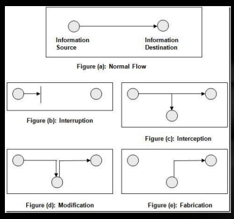  

    * 中断： 
        硬件损坏、物理通信链损坏、引入噪音、删除例程、删除程序或文件、拒绝服务攻击（DOS）。
        * 攻击可用性
    * 截取：
        窃听、链路监控、数据包捕获、系统黑客攻击和破坏
        * 攻击保密性
    * 修改：
        修改数据库中的记录、系统黑客攻击、通信延迟、修改硬战。
        * 攻击完整性
    * 伪装：
        在数据库中插入记录、插入数据包（使用伪造的 IP 地址）、使用伪造的电子邮件或网址钓鱼。
        * 攻击真实性

    !!! danger "replay" 
        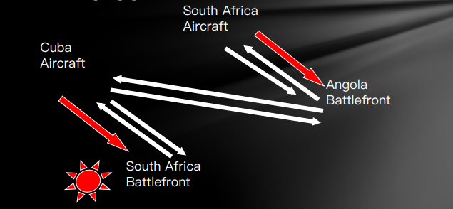
* 对抗安全威胁的目标:   
    预防:防止攻击者违反安全策略。  
    检测:检测攻击者违反安全策略的行为。  
    恢复:攻击已停止，系统已修复，操作已恢复。  
        （高级版）即使攻击成功，也能继续正常工作。

* 对抗安全威胁的安全服务：
    * 身份验证:
        确保通信实体是它们声明的实体，包括对等实体身份验证和数据源身份验证。
    * 访问控制:
        防止未经授权访问资源 
    * 数据机密性:
        防止数据泄露，包括链接机密性、未链接机密性、选定字段机密性和流机密性。
    * 数据完整性: 
        确保接收到的数据是从授权实体发送的，并且无需修改即可插入、删除和重放。
    * 不可否认性:
        防止任何实体的通信中断。 
    * 可用性:
        确保服务的可用性。
* 对抗安全威胁三成靠技术七成靠管理，人的问题是迄今为止安全问题的主要来源。

## IS 1.1 Fundamentals of Cryptography

### 密码学基础
* 术语  
    明文（plaintext，P）   
    密文（ciphertext，C）  
    加密（encryption method，E（））   
    解密方法（Decryption，D（））  
    Key（key，K）  
    $C = E_K(P)$   
    $P = D_K(C)$

* 加密算法：  
    * 置换、替换：（Substitution）  
        Plaintext: A B C D E F G H I J K L M N O P R S T U V W X Y  
        Ciphertext: Q T U G N H Z M U R B S A O W I D Y E C P F K X
    * 位移：（Transposition）  
        Plaintext： 信息安全导论  
        Ciphertext： 信全息导论安

* 密码分析：
    * 攻击者可用的信息量：  
        仅密文：密码分析人员只能访问密文集合。  
        已知明文：攻击者拥有一组他知道相应明文的密文。  
        选择明文（chosen-ciphertext）：攻击者可以获取与他选择的任意一组明文（密文）相对应的密文（明文）。    
        自适应选择明文：与选择明文攻击类似，攻击者可以根据从先前加密中学到的信息选择后续明文。    
        相关密钥攻击：与选择明文攻击类似，但攻击者可以获取使用两个不同密钥加密的密文。    
        密钥未知，但它们的关系是已知的;例如，两个键在一个位上不同。
    * 攻击/分析的结果：  
        完全中断 ― 攻击者推断出密钥。  
        全局演绎 — 攻击者在不学习密钥的情况下发现了功能等效的加密和解密算法。  
        实例（本地）推导 — 攻击者发现以前未知的明文（或密文）。  
        信息推导 — 攻击者获得一些以前未知的有关明文（或密文）的香农信息。  
        区分算法 — 攻击者可以将密码与随机排列区分开来

### 密码学历史
古典密码：第一次世界大战之前、手工艺密码。  
机器密码：出现在第一次世界大战中、在第二次世界大战中广泛使用、机械或电子密码机。  
计算机密码：第二次世界大战后、计算机算法。 

* 古典密码：
    * 例子：  
        棍子密码、
        古希腊密码（二维密码表 字母->二维坐标）、
        凯撒密码、
        女皇玛丽密码 （字母->符号）
    * 破解：  
        频率分析法
    * 进阶：
        维吉尼亚密码（vigenere square）、书密码

    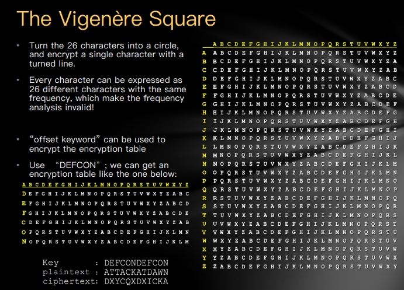

    密钥是DEFCONDEFCON  
    明文对照密钥，通过右边的表转为密文

!!! example "破解Vigenere"
    找相同单词出现的间隔，然后对这些数取最大公约数，一般就是密钥的长度。然后根据密钥的长度（若为3），则每隔这么长（3）统计每个字母出现的次数，然后做频率分析。出现最多的一般为e，寻找对应密钥。 

    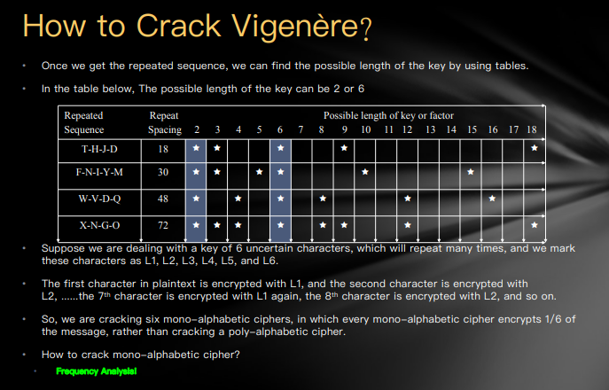  
    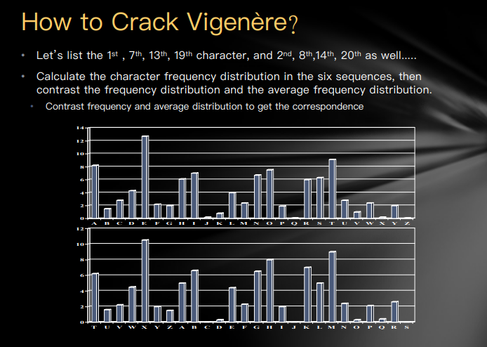

* 机械密码： 
    * 齿轮机：ENIGMA  
        加密算法：整个机器、物理结构、齿轮  
        密钥：齿轮的初始位置、齿轮的顺序、插板  

        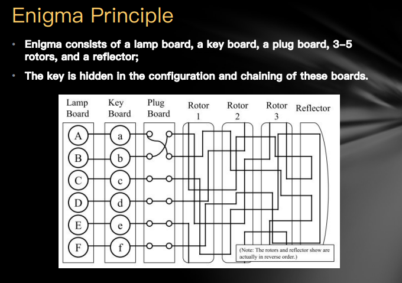

        密钥个数：  

        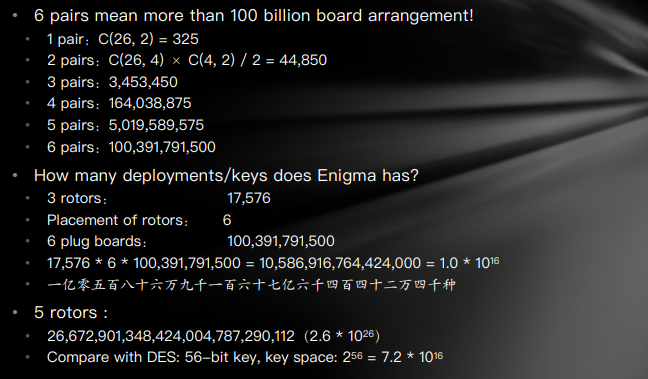

        符合科托夫原则

    * 破解ENIGMA：  
        Step1：间谍  
        Step2：误用  
        Step3：数学破解  

        数学方法：Marian Rejewski证明，link长度取决于齿轮的配置，但不取决于插板的配置。  
        Bombe机

    * ENIGMA带来的启示：  
    Enigma 是一种加密算法。  
    密钥是“转子的初始设置”和“插线板布置”。  
    被破解的原因：误用、“重复”导致“模式”、“插板布置”提供了最多的关键空间，但对许多攻击很弱。  
    破解加密算法的方法：搜索“模式”、降低“复杂性”/“维度”、 蛮力。  
    （当然，你需要一个强大的“数学背景”和一点“运气”）

* 计算机密码：    
    Symmetric key ciphers（对称密钥密码学）  
    Asymmetric key ciphers（非对称密钥密码学）

## IS 1.2  Symmetric key ciphers & Asymmetric key ciphers

### 对称密钥加密算法
又叫做共享密钥加密算法/保密密钥加密算法。  
对称密钥算法是密码学中的一种加密算法。     
对称密钥算法是加密算法，它使用相同的加密密钥进行明文加密和密文解密。  
密钥可能相同，或者两个密钥之间可能有简单的转换。实际上，密钥表示两方或多方之间的共享密钥，可用于维护私有信息链接。要求双方都有权访问密钥是对称密钥加密的主要缺点之一。  
符合Kerckhoffs原则。

* 块加密：  
将输入位流划分为 n 位段，并仅加密该段。段之间没有依赖关系/历史记录。  
在一个好的分组密码中，每个输出位都是所有 n 个输入位和所有 k 个密钥位的函数。
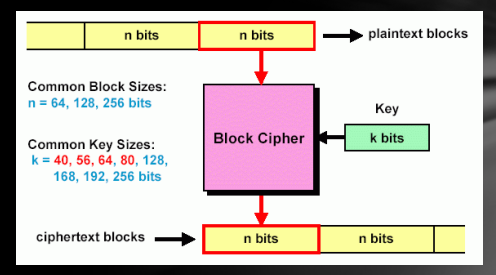

* 费斯托密码（Feistel Cipher）:  
    1973 年由 IBM Feistel 提出,几乎所有现代对称加密算法都基于这种结构。  
    使用块加密，并增加块大小。如果采用理想的块加密（完全随机映射）可能会导致密钥长度过长 $(n*2^n)$，则 $n = 64$ 需要密钥的 $2^{70}$ 位长度。  
    因此，它需要近似于理想的分组密码。  
    设计：Feistel 利用乘积密码的概念来解决这个问题。
    用两种方法来引起雪崩效应：
     * 扩散:使得密文的统计特性与明文之间的关系尽量复杂。
     * 混淆/扰乱:使得密文的统计特性与加密密钥之间的关系尽量复杂

    !!! examlple "Feistel cipher encryption"
            
        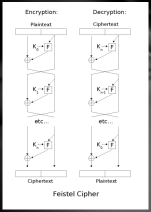

        * 扩散:迭代交换左半部分。
        * 扰乱：循环函数 F  
            块大小：块大小越大，安全性越高;典型大小为 64 位或 128 位。   
            密钥长度：密钥大小越大，安全性越高;典型大小为 128 位。  
            循环数：循环次数越多，安全性越高，标准大小为 16。  
            子密钥生成算法：该算法的复杂性越高，密码分析的难度就越大。   
            循环函数 F：复杂度越高，对密码分析的抵抗力越强

* DES算法：
    * 块大小 64bits，密钥长度 56bits
    * 特点：  
        强烈的雪崩效应  
        很强的反破解能力，只能爆破  
        目前 56bits 密钥太垃圾了  

        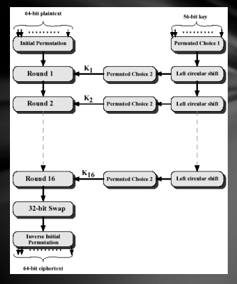

        !!! example "Single Round of DES Algorithm"
            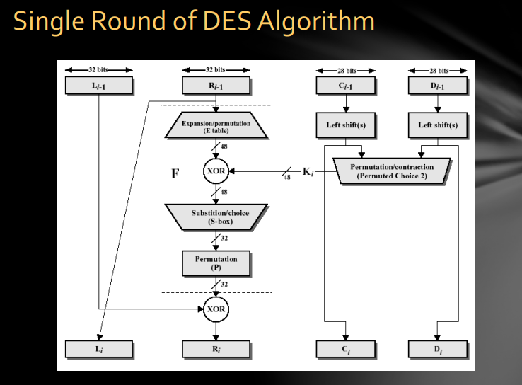

    * 三重DES：  
        $C = E_{k3}[D_{k2}[E_{k1}[P]]]$  
        C为密文、P为明文。  
        用EDE的方式是因为当 $K1=K2/K2=K3$ 时，等价于DES算法，兼容旧设备。
        密钥长度：56*3=168  
        PGP 和 S/MIME 采用的算法

* AES算法：  
    替换 DES 和 三重DES 以克服三重DES的以下缺点：  
    三重DES在软件上实现缓慢   
    块大小仅为 64 位   
    * AES的特点：  
    块大小：128bits   
    密钥大小：128/192/256 位   
    免疫所有已知攻击    
    在每个平台上执行速度快，代码紧凑  
    设计简单  

* ECB：用于长数字序列的块密码  
    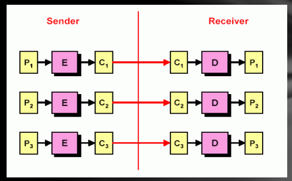  
    如果攻击者认为区块 C2 对应于 $ 金额，则替换另一个 Ck（仅密文攻击）攻击者还可以构建一个 <Ck、猜测的 Pk\>对（选择明文攻击）的密码本。
    question:重放攻击能攻击吗?

* CBC：  
    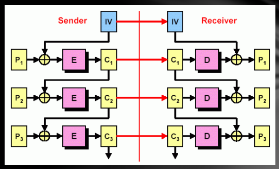  
    抑制重放攻击和密码本构建：由于是基于内存的链接，相同的明文 $P_i = P_k$ 不会产生相同的输出代码。     
    IV = 初始化向量（仅使用一次）

* 两者的区别：  
    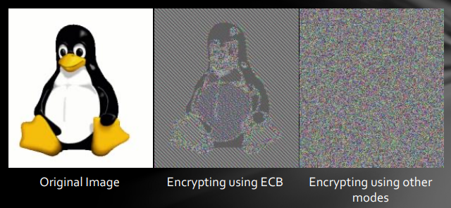  
    ECB 对于同样的明文块会被加密成相同的密文块；因此，它不能很好的隐藏数据模式。   
    CBC 上一个块的结果会影响下一个块。

* 块加密之外：流加密（Stream Cipher）：  
    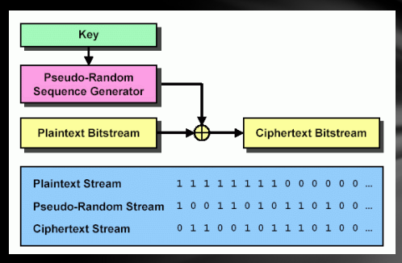    
    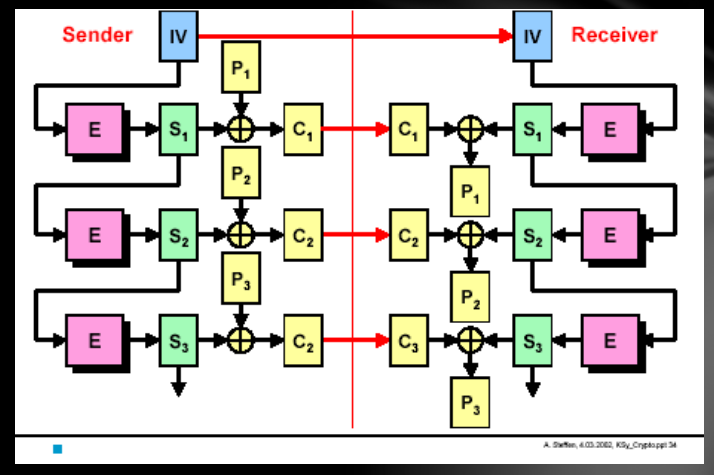  
    不像块密码那样将比特流划分为离散块，而是将明文连续流的每个比特与伪随机序列中的比特进行异或。再次使用相同的对称密钥 XOR 在接收器处提取明文。

* 密钥分发问题:    
    根据 Kerckhoffs 的原理，密钥是最重要的！  
    对于对称加密，密钥应该共享，那么应该如何共享密钥才能保证安全呢？   
    * 对于对称加密，密钥分配有以下几种方式：  
    1.A 可以选择一个密钥并将其物理交付给 B。  
    2.第三方选择密钥并将其物理返回给 A 和 B。   
    3.如果 A 和 B 以前和最近使用过密钥，一方可以将新密钥传输给另一方， 使用旧密钥加密。  
    4.如果 A 和 B 与第三方 C 有加密连接，则 C 可以在加密链接上向 A 和 B 提供密钥。典型解决方案—— 密钥分发中心（KDC）。  
    **这能保证机密性吗**？

### 公钥密码学
* 密钥加密的问题： 
   
    >Alice 通过电子邮件向 Bob 发送了一篇未发表的论文:  
    问题 1：Alice 不希望除了 Bob 之外的其他人阅读她的论文 Alice 需要加密她的论文，但她如何告诉 Bob 密码？  
    如果她通过电子邮件发送密码，任何捕获 Alice 和 Bob 之间所有电子邮件的人都可以阅读未发表的论文。  
    问题 2：如果 Bob 剽窃并发表了论文，Alice 应该能够证明 Bob 的剽窃吗？

!!! abstract "公钥密码学"  
    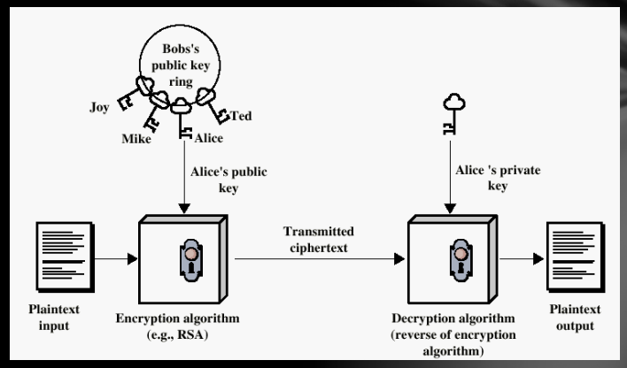 

    * 六要素：明文、公钥 KU 、私钥 KR 、加密算法 、密文 、解密算法
    * 一个成功的公钥系统的关键是找到一个单向函数（计算函数的结果很容易，但逆向计算是不可行的）
    * 公钥密码学的要求：
        * B方在计算上很容易生成一对（公钥$KU_b$，私钥$KR_b$）。  
            确保：密钥生成简单。
        * 发送方 A 在计算上很容易加密。  
            确保：及时加密是可以接受的。 
        * 接收方 B 在计算上很容易解密  
            确保：及时解密是可以接受的。 
        * 对于知道公钥 $KU_b$ 的攻击者来说，确定私钥 $KR_b$ 在计算上是不可行的。 
        * 仅知道公钥 $KU_b$ 和密文 $C$ ，攻击者在计算上仍然无法恢复原始消息 $M$ 。 
        * 可以交换密码对。
            确保：既可用于加密，也可用于签名。

* DH算法:  
    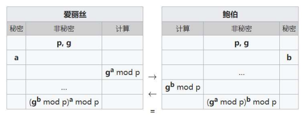  
    g 是 p 的原根（primitive root），a 叫做 A 的离散对数，**是唯一的**。  
    $\large A=g^a \;mod \;p$  
    * DH 算法寻找到的单向函数是，计算大整数的整数次幂求模是很容易的，但反向求出离散对数是十分难的。
    * a,b,p 的选择对于 DH 算法有很大的影响：  
        如果 p 很小的话，结果很容易爆破  
        一般我们用三百位的 p，一百位的 a 和 b  
        g 一般 2 3 5 都可以
    
    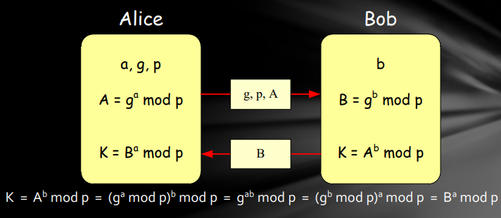  
    Alice的密钥：a，Bob的密钥：b  
    Alice的公钥：A，Bob的公钥：B  
    共享的信息（公钥）：g，p  
    连接密钥：K  

    >e.g:  
    选择一个素数 p = 353，原根 g = 3   
    选择私钥：a = 97，b = 233    
    计算公钥：  
    $\large A = 3^{97} \;mod \;353 \;= \;40$   
    $\large B = 3^{233} \;mod \;353 \;= \;248$   
    每个交换的计算机密钥：   
    $\large A：K = B^a \;mod \;353 \;= \;(248)^{97} \;mod \;353 \;= \;160$    
    $\large B：K = A^b \;mod \;353 \;= \;(40)^{233} \;mod \;353 \;= \;160$

    * DH算法没有认证环节，很容易受到中间人攻击。
  
    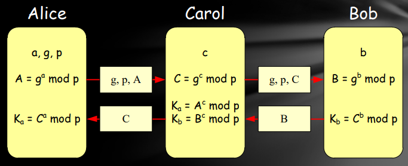

* RSA算法：  
    * 单向函数：大质数乘法很容易，但是大合数的质因子分解十分困难
    !!! abstract "RSA算法过程："
        * Step1:选择两个素数 p 和 q（至少 100 位），将 p 和 q相乘：$n = p * q$ 
        * Step2:找出两个数字 e 和 d，使得:
        e和(p-1)(q-1)互质，而且1 < e & d < (p-1)(q-1)  
        $\large e*d \equiv 1 \;(mod(p-1)(q-1))$（应该是这步操作防范了中间人攻击）
        * Step3:（e，n） 作为公钥，d 作为私钥。

        >e.g:  
        Alice 将明文 m（m 必须小于 n）加密到 c 并发送给 Bob：     
        首先，找到 Bob 的公钥 （e， n），并计算：$\large c = m^e \;mod \;n$    
        向 Bob 发送密码 c   
        Bob 接收密码 c，解密并获取明文 m  
        使用私钥 d 计算：$\large m = c^d \;mod \;n$

        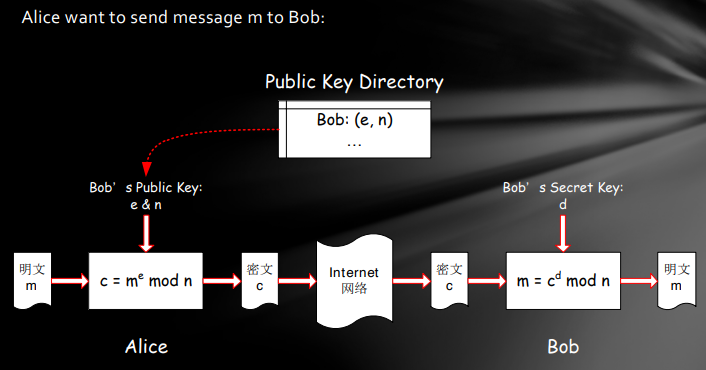

        !!! example "两个例子🌰"
            **例子1**：

            * Bob 选择两个素数 p = 5， q = 11， 求出 $n = p*q = 55$   
                （p-1）（q-1）= 4*10 = 40   
                求两个数字： e = 3， d = 27 和：3 * 27 ≡ 1 （mod 40）   
                Bob 的公钥是： （3， 55），私钥是：27 
            * Alice 向 Bob 发送消息 m = 13： 
                接收 Bob 的公钥 （3,55），并计算：  $\large c = m^e \;mod \;n \;= \;13^3 \;mod \;55 \;= \;2197 \;mod \;55 \;= \;52$   
                Alice向 Bob 发送密码 c = 52。
            * Bob 收到消息 c = 52： 
                使用私钥 27，计算：$\large m \;= \;c^d \;mod \;n \;= \;52^{27} \;mod \;55 \;= \;13$

            **例子2**：

            * Bob 选择两个素数 p = 101， q = 113， 求出 $n = p*q = 11413$   
                （p-1）（q-1）= 100*112 = 11200   
                求两个数字： e = 3533， d = 6597 和：3533 * 6597 ≡ 1 （mod 11200）   
                Bob 的公钥是： （3533， 11413），私钥是：6597 
            * Alice 向 Bob 发送消息 m = 9726： 
                接收 Bob 的公钥 （3533,11413），并计算：  
                $\large c = m^e \;mod \;n \;= \;9726^{3533} \;mod \;11413 \;= \;5761$   
                Alice向 Bob 发送密码 c = 5761。
            * Bob 收到消息 c = 7612： 
                使用私钥 6597，计算：$\large m \;= \;c^d \;mod \;n \;= \;5761^{6597} \;mod \;11413 \;= \;9726$  
    * RSA算法安全吗？  
        * 攻击者可以得到c和（e，n），想获得m有以下途径：  
            1.得到 B 的私钥 d 

            >B保护的很好！  

            2.m 是 1 到 n 的数字，爆破。  

            >但 n 太大（如前所述，p 和 q 通常是 100 位素数）

            3.尝试从（e，n）计算出私钥 d  
            已知$e*d\equiv 1 \;(mod \;(p-1)(q-1))$ 

            * 攻击者发现了一种称为“扩展 EUCLID 算法”的有效算法来解决以下问题：给定两个数字 （r， s），计算 x 使得：  
                $r*x \equiv 1 (mod s)$  
            
            一旦 n 可以分解为 p 和 q，就可以很容易地找到 d！
        
        攻击者在方法 3 中攻击所花费的时间基本上是分解的时间：  
        因此，我们说 RSA 基于因式分解问题：虽然将大素数相乘很容易，但将大复合分解或拆分为其素因数在计算上是不可行的！单向性！

        !!! warning "不死心的攻击者——第4种攻击方法！"
            * 攻击者冒充 B 告诉 A 自己的新公钥，此后攻击者就可以用自己的私钥解密了！
            * 在 A 发密文给 B 前，核对 B 的公钥对不对，A 必须确认拿到的是 B 的公钥，除了 B 没人能给 A 发验证。

* 对称密码学和非对称密码学的比较：  
    * 对称密码：  
    优点：便宜又快; 提供低成本VLSI芯片。  
    缺点：密钥分配是个问题！   
    * 非对称密码：   
    优点：密钥分发不是问题！  
    缺点：相对昂贵且速度慢;VLSI芯片不可用或相对昂贵。  
    * 在实践中：   
    使用公钥密码（如 RSA）分发密钥   
    使用私钥密码（如 AES）加密和解密消息  
    !!! warning "两个误解"
        * 公开密钥加密在防范密码攻击上比常规加密更安全。  
            实际上，两者都依赖于密钥长度和解密的计算工作量，从抗密码分析的角度分析，互相之间都不比对方优越。
        * 公开密钥加密使得常规加密过时。  
            实际上，公开密钥加密在计算上相对的巨大开销，使得公开密钥加密更多地用于密钥管理和数字签名应用。

## IS 2.1 Digital Signature,One-Way Hash & MAC

### Digital Signature
* 密码学能做什么和不能做什么：  
    密码学实现了 A 和 B 之间的秘密通信。  
    但是无法进行身份认证： 
    如果 Alice 向 Bob 发送了一条消息，他们之间的争议可能是：   
    Bob 捏造了一条不同的消息，并宣称他收到了 Alice 的消息;Alice 可以拒绝发送消息，而 Bob 无法证明 Alice 已发送消息。
* 手写/数字签名的特点：    
  签名是可信的  
  签名不能伪造   
  签名不能重复使用   
  签名文档不能更改   
  签名是不可否认的   
  在某些情况下，签名和时间是有约束力的   
  签名可以是法律证据，可以被证明  

* 数字签名的需求：  
    * 可以与签名文档绑定  
    * 数字签名必须使用发件人的唯一信息，以防止捏造和拒绝。（只有发件人知道，所以不能伪造，发件人也不能否认）  
    * 数字签名的生成、识别和身份验证必须相对简单。  
    * 在计算中伪造数字签名是不可行的  
    * 保留数字签名的备份是可行的  

* 数字签名算法：  
    * 公钥密码学可以支持数字签名：  
        DSS/DSA   
        RSA   
        Elliptic curve   
    * 公钥密码学签名过程：
        A 用私钥签名文档，发送给 B，B 用 A 的公钥验证签名  
        
    !!! question "一个问题"
        在前面的例子中，文档 m 必须是 [0 .. n-1] 的整数。   
        **如果文档很长，该如何签名？**  
        对于很长的文档，签名需要使用单向哈希算法。
        我们不签署文件而是获取文档的哈希值，然后对哈希值进行签名。

### One-way hash algorithm
单向哈希算法将输入文档哈希为大约 $100$ 位输出。   
给定单向哈希算法 $H(.)$ ,我们有：   
输入：$m$ —— 任意长度的二进制字符串   
输出：$H(m)$ —— 大小为 L 的二进制字符串  

* tips:给定 $H(.)$ ,L 是固定的：  
在 MD5 中，L=128   
在 SHA-1 中，L=160

* 单向哈希函数的特点：  
    * 易计算，给定一个文件，可以很快算出来哈希值
    * 难反向计算，给定哈希值，算不出源文件
    * 难以寻找碰撞，很难寻找到两个哈希值相同的文件

* MD5算法（两个步骤Padding and Hashing）：  
    * Padding：   
        MD5 处理长度为 512 位的段，因此输入字符串应填充到多个 512 大小的段（16 个 32 位小端整数）。  
        Padding程序：   
        * 填充位 '1' 
        * 填充“0”，直到 512 减去 64 位的倍数 
        * 将原始字符串的位长度填充到最后 64 位 
    * Hash：   
        MD5 递归处理 128 位字符串。        
        将 128 位字符串分成四个 32 位长度的整数（A、B、C、D） 使用四个不同的非线性函数，F 循环 16 次。
        * 加法 （ mod $\large 2^{32}$ ） 
        * 左移 $\large s$ 位 
        * $M_i$：512 位字符串中的 32 位子字符串 
        * $K_i$：每个循环中的变体常量
  
    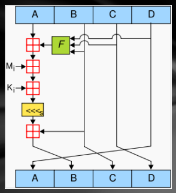

* 单向哈希函数安全  
    * 原象（Preimage）：最难的攻击  
        给定哈希值，找到原文件。    
    * 第二原象（second- Preimage）：  
        给定文件，找出另一个与原文件哈希值相同的文件。    
    * 碰撞（collision）：  
        寻找两个哈希值相同的文件，制造碰撞。  

* 大文件的签名过程
    * 源文件通过单项哈希函数得到哈希值  
    * 哈希值通过 A 的私钥加密  
    * 哈希值和明文文件传送给 B   
    * B 用 A 的公钥解密签名得到哈希值 1   
    * B 用同样的哈希函数算出传来的明文文件的哈希值 2   
    * 对比哈希值 1 和 2 是否相同  

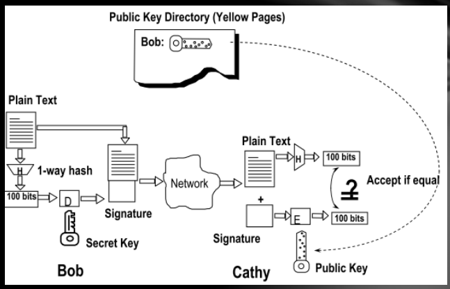

### MAC（message authentication code）消息验证码，带密钥的哈希函数
消息完整性服务，用来确认信息传输过程中是否被修改过
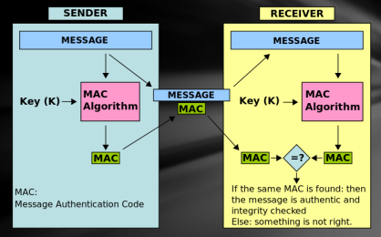

!!! abstract "MAV vs. Digital Signature"

    * MAC：  
        收发双方需要共享密钥。  
        MAC只可以被特定接收者接收。  
        MAC 不提供不可否认服务：所有可以验证消息保密性的人都能生成一个 MAC。
    * 数字签名：  
        收发双方不需要共享密钥。   
        数字签名可以被有公钥的任何接收者接受。  
        数字签名提供不可否认服务。  

### PGP
* PGP 被广泛使用在数字签名、完整性校验、信息加密、数据压缩、邮件格式兼容、
* 多平台兼容
* 基于密码安全算法

## IS 2.2 Authentication and Access Control

### Authentication
* 认证：  
    你是谁？  
    如何证明您是他人或计算机系统声明的人？  
    任何需要访问控制的系统都必须首先解决这个问题。  
* 如何进行认证？  
    * 你有什么？（身份证、护照、钥匙、智能卡、USB卡、手机） 
    * 你知道什么？（密码、生日、ID、预设问题的答案） 
    * 你在哪里？（IP 地址） 
    * 你是什么？  
        生物特征：指纹、掌纹、虹膜、面部轮廓、DNA 等）。 
        行为特征：笔迹、声纹、中风、走路等。 

我们将主要讨论以下身份验证服务：   
身份验证技术：密码和生物识别身份验证。   
身份验证协议：质询-响应身份验证和 KERBEROS。  

* 基于密码的认证：  
    最广泛应用——系统保存认证用户和密码
    * 存在的缺陷：  
        密码在用户和系统间传递时很容易发生窃听漏洞    
        密码文件很难保密    
        容易记忆的密码很容易猜出来    
    * 影响密码系统安全性的因素和机制：  
        输入密码的频率/次数限制  
        储存密码的方式，哈希后较为安全  
        网络传输过程的内容形式，哈希后较为安全  
        校验密码的过程  
        密码的生命周期  
        使用*代替密码，不在屏幕显示  
        定义密码的长度和格式  
        一段时间后重新输入密码  
        多次错误后禁止登陆  
 
* 传统字典攻击：    
    密码文件 /etc/passwd 是全局可读的。   
    包含许多系统程序使用的用户 ID 和组 ID 字典攻击是可能的，因为许多密码来自一个小字典。   
    攻击者可以计算字典中每个单词的 H（单词），并查看结果是否在密码文件中。   
    使用 1000000 字词典，假设每秒 10 次猜测，暴力在线攻击平均需要 50000 秒（14 小时）。   
    这是非常保守的。离线攻击速度快多了！

* 改进方法1——加盐：    
    向用户密码添加随机的盐，再做哈希储存起来。  
    * 没加盐时候，一轮字典就能搞定所有密码条目。  
    * 加盐后，一轮字典只能搞定一个密码条目。 
 
    攻击者必须对一个密码条目尝试全部的盐。(使用 $12$ 位随机盐，相同的密码可以散列为 $2^{12}$ 个不同的散列值。)   

    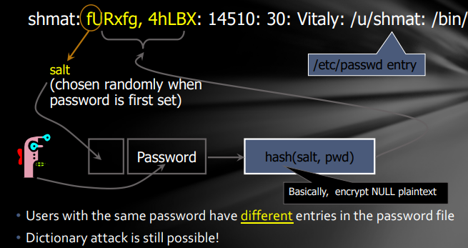

*  改进方法 2——隐密码:
    哈希密码不储存在之前的文件里，在 etc/shadow 文件里，只有root 用户可以访问。  
    添加了密码的有效日期。

* 保护密码的方法
    * 采用数字+字符，使用随机密码
    * 密码安全性检查
    * 防止特洛伊，使用安全登陆工具
    * 不同的网站上使用不同的站点
    * 可以同类网站使用相同的密码
    * 不要相信任何第三方的记住密码软件
    * 不要在公共场所和不可信的网路环境下登陆重要账号

* 生物认证
    * 通过物理特征进行认证：  
      手写识别、指纹认证、面部识别、DNA 
      * 优点：不会被偷窃、丢失或遗忘
      * 缺点：
          设备花费高、对比算法的安全性、政策问题、伪造问题
    * 生物认证的评价体系
        * False AC rate：接收了未授权用户。
        * False RJ rate：拒绝了授权用户。
        增加接受阈值会增加错误接受率并降低错误拒绝率。
        如果错误接受率和错误拒绝率相等，叫做等错误率。
        不同的情况下对二者的概率有不同的要求。
    * 生物信息的风险:
        信息记录时可能不符合要求。
        可以通过使用留存的记录进行攻击，比如别处搞来的旧指纹。

* KERBEROS
    * 安全：您无法获得足够的信息来伪造其他用户。
    * 可靠性：无法获得 Kerberos 的服务意味着无法获得所需的服务。因此，需要高可靠性。
    * 透明度：用户不必知道身份验证服务的存在。
    * 可扩展性：系统可支持海量用户和服务器。
* 实现 KERBEROS：    
    * 提供身份验证服务器来识别服务器和用户。
    * 基于正常加密，不使用公钥加密。

* KERBEROS V4：   
    引入身份验证服务器 （AS），该服务器知道所有用户的密码并将其存储在中央数据库中。AS 与每个服务器共享一个密钥。
    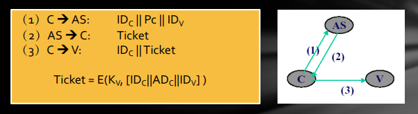
    * 存在的问题：   
    要求用户不断输入密码。   
    在不同时间需要相同的服务器将需要新的票证。   
    需要其他服务器将需要新票证。  
    密码以明文形式传输，可能会被盗。一旦偷了票，攻击者就可以伪造 C 进行重播攻击
    * 改进：
    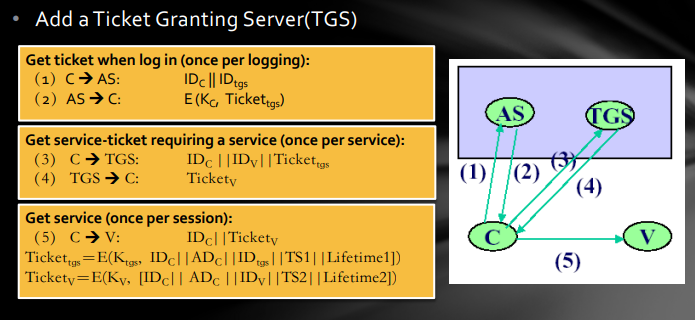
    不在互联网上传输明文。  
    降低密码输入频率。  
    通过设置生存期来减少重放攻击的威胁。
    * 仍然存在的问题：   
    生命周期设置：短 - 增加密码输入的频率;长 – 增加重播攻击的风险。   
    如何证明票务使用者是票务申请者？  
    V 如何向客户证明自己？  
    * 最终版本：  
    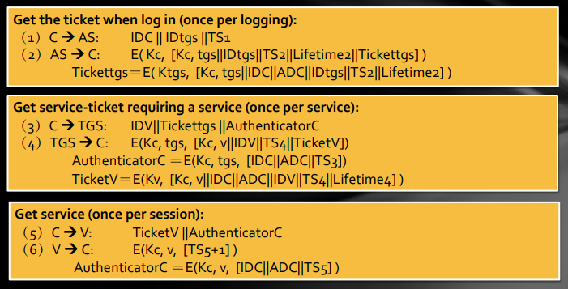
    * 依旧存在的问题：  
    时间依赖性：实现时间同步总是很困难的。攻击者可以误导系统时间并进行重放攻击。  
    猜测攻击：很容易因为弱密码而受到攻击。该协议不为密码提供进一步的保护。  
    密钥存储问题：密码和会话密钥无法存储在典型的计算机系统中。
* V4 和 V5 的区别：  
    * 加密系统的依赖关系。V4 依赖于 DES，而 V5 允许选择其他加密算法。
    * 互联网协议的依赖性。V4 仅对 IP 协议有效，而 V5 允许使用其他网络地址。
    * 电报序列的依赖性。
    * Ticket的有效期。V4 的最长生命周期为 1280 分钟，而 V5 没有生命周期限制。
    * 传输身份验证。V5 允许传输身份验证，而 V4 不允许。
    * 不同字段之间的身份验证。减少密钥的交换。

### Authorization  
* 概念  
    授权和访问控制（access control）基本是一个意思。  
    授权 —— 您可以做您正在尝试做的事情：身份验证提供基本的访问控制;身份验证提供验证用户身份的基本功能;需要授权才能进行更深入的控制。
    * 访问控制的三个要素：   
        主体：可以访问对象的实体，例如用户或应用程序进程等。   
        对象：正在访问的对象，例如文件、程序、数据等。   
        权限：主体使用对象的权限，如读、写、删除、执行、授权等。  
    * 安全访问控制：   
        三个主要功能：授权、撤销、检查。   
        两个阶段：制定策略、执行策略。  

* 安全访问控制模型：  
    
    * DAC discretionary access control 自动访问控制
    
    
    * MAC mandatory access control 强制访问控制 
    
     
    * RBAC role-based access control 基于角色的访问控制
    

* DAC(Discretionary Access Control)
    * 特性：
        根据主体的身份和访问权限做出决定。    
        自主选择意味着具有某种特权的主体可以自动将其访问权的子集授予其他主体。
    * 缺陷：  
        访问允许可能会在信息传输过程中发生改变。
    * 访问控制矩阵:
        访问控制表：每个对象都添加了一个详细列表以访问其主体（access control list）。  
        能力表：每个主体添加一个详细列表以访问其对象（capability list）。  
    * 例子：  
        Unix Os

* MAC:  
    * Bell-LaPadula 模型：确保机密性     
        No Read Up（不向上读）：主体只能读取相同或更低安全级别的对象。  
        No Write Down（不向下写）：使用者只能写入高级或相同的安全级别对象。  
    * Biba 模型：确保完整性     
        与 Bell-LaPadula 模型相反：不向下读，不向上写

!!! danger "Trojan Horse & MAC"
      
    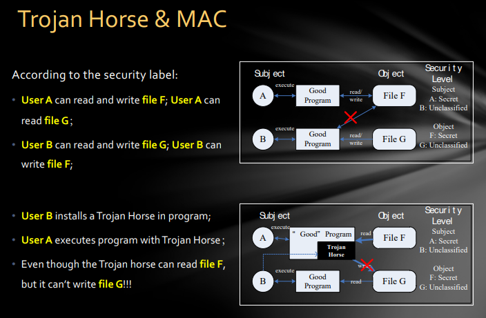

* 隐通道：   
    隐通道是在不注意主体（进程）的情况下使用系统资源进行通信的信道。  
    维基百科：隐通道是一种计算机安全攻击，它创建了一种在计算机安全策略不允许通信的进程之间传输信息对象的能力。

    * 资源耗尽型隐通道（Resource Exhaustion Channel）：
        用低级别进程申请资源成功与否来判断高层进程是否运行。 

        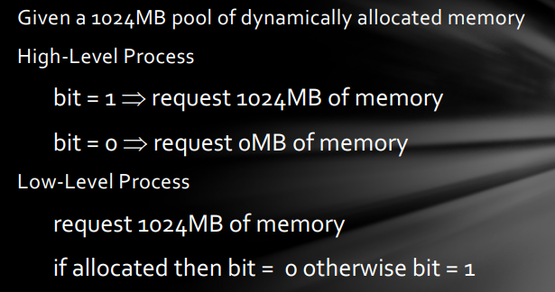

    * 负载感应型隐通道（Load Sensing Channel）：
        低级别进程执行一个需要高级别进程所需的资源的任务，观察其完成速度确定高级别进程的运行情况。 

        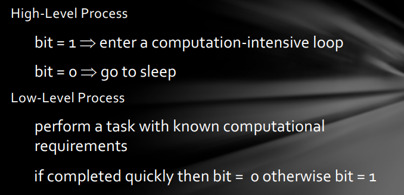

* 应对隐通道的方法：
    * 识别隐通道后：
        关闭频道或减慢速度。   
        检测使用频道的进程。  
        容忍它的存在。   
    * 隐通道无法完全被避免：   
        1.限制共享资源（如磁盘、CPU、内存、打印机、进程ID等）
        
        >例如，资源共享仅发生在相同的安全级别之间。  
        
        2.限制带宽。
        
        >例如，引入噪音、干扰等。
    
* MAC的标准——orange book  

    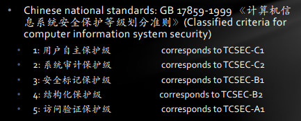

* DAC 和 MAC 的缺点
    * 安全性：  
        DAC 太弱了，无法满足需求。  
        MAC 太强了，不够灵活。  
    * 管理工作量：都很大。

* RBAC   
    * 包含五个基本数据元素：  
        users 用户    
        roles 角色    
        objects 客体    
        operations 操作    
        permissions 许可 
    * 核心概念：
        * 角色：
            一组用户的每个角色都与相关操作相关，用户所属角色有权执行这些操作
            * 角色和组的区别  
                组——一系列用户  
                角色——一群用户+一群操作许可
        * 关系：
            多对多，用户被赋予特定的角色，角色被赋予特定的许可
        * 许可： sessions 
            匹配用户和激活的角色

    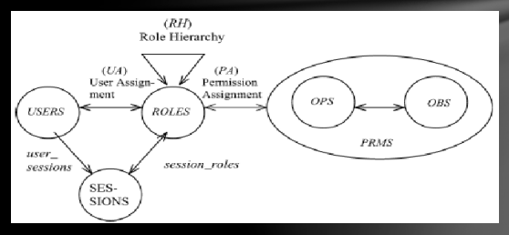

    * 优势：
        * 易于授权管理：根据工作需要进行分类，例如获得公司财务部门和非财务部门员工的公司财务许可，可以通过财务人员的角色来区分。
        * 易于实现最低权限：即使用户被分配了高级身份，并且只能在必要时拥有特权以防止事故发生。
        * 易于任务共享：不同角色执行不同的任务 
        * 易于分层文件管理：文档本身可以划分为不同的角色，如信件、账单等，由不同角色的用户拥有 
        * RBAC 可用于实现 DAC 和 MAC！
  
* 安全访问控制的原则：
    模型是死的，但是策略是活的，适当的安全策略是安全的核心
    授权管理
    * MAC：允许访问完全基于主体和对象的安全层级。  
        * 主体的安全级别由安全系统管理员赋予
        * 客体的安全级别由创造他的主体所决定
    * DAC：多种授权管理方法
        * 集中管理，管理员授权和删除访问控制授权。Centralized 
        * 分级管理，中央管理员将管理职责分配给实际进行集中
        管理的其他管理员。
        * 所有权管理，对象的所有者授权和未经授权的对象访问
        者。
        * 协同管理，特殊资源的访问不是由单个用户决定的，而
        是由共享用户的合作授权决定的。Collaborative 
        分布式管理，在分布式管理中，对象的所有者可以授权
        其他用户进行管理的权限。

    * RBAC：提供许多类似于自我管理策略的访问控制。但是，管理权限的授权是 RBAC 的一个重要特性，DAC 和 MAC 中不存在。
    * 缩小用户权限——参照权力分立，将超级用户原有的权利分配给三种特权用户（基本约束是，在一类用户眼中，其他类用户拥有的权限与普通用户完全相同。没有特别的权利）：
        * 系统管理员 - 负责系统维护，用户管理，软件安装等功能。
        * 安全管理员 - 负责安全规则配置，安全策略管理和其他功能。
        * 审计管理员 - 负责检查审计记录，监视系统安全性和其他功能。

## IS 3.1 IP Security

### TCP/IP Protocol Stack
*  网络结构  
    使用 TCP/IP 协议栈进行路由和连接。   
    使用 BGP（边界网关协议）进行路由器发现。   
    使用 DNS（域名系统）查找 IP 地址。  

* TCP 协议栈  

    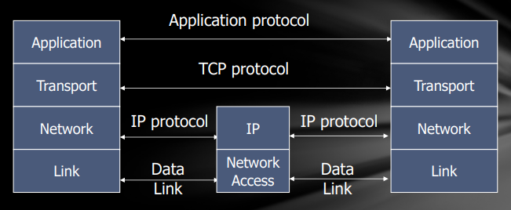

    |**数据链路层**|**网络层**|**传输层**|**应用层**|
    | ----------- | ----------- | ---------- |---------- |
    | 帧   | 包 | 段 | 信息 |
    |  ARP, RARP, Ethernet, HDLC, PPP   |  IP, ICMP, BGP, OSPF, IGMP |  TCP, UDP | HTTP, SMTP, FTP, TELNET, DNS |

* 数据形式  
    * 不断地增加头部字段。

    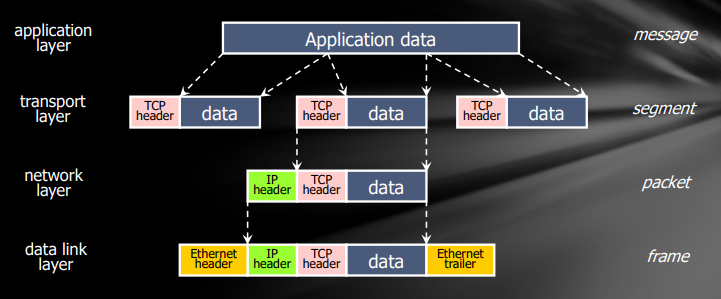

* ICMP（Control Message Protocol）
    * 提供有关网络操作的反馈：  
        1.IP 数据包中携带的“带外”消息。  
        2.错误报告、拥塞控制、可访问性等。
    * 示例消息：   
        1.无法到达目的地   
        2.超出时间   
        3.参数问题   
        4.重定向到更好的网关   
        5.可达性测试（回显/回显回复）   
        6.消息传输延迟（时间戳请求/回复） 

* IP & TCP/UDP  
    * **IP 是“尽力而为”（说明其实能力不够qwq）的交付。**  
    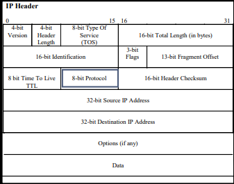  
    IP 数据包具有“协议”字段，用于指定传输层分段是 TCP 还是 UDP。

    * UDP：
        * UDP 按端口分隔流量   
            目标端口号获取特定应用程序进程的 UDP 数据  报，例如 128.3.23.3、53。   
            源端口号提供返回目的地。   
        * 最低保证 （...老鼠和大象）   
            无确认   
            无流量控制   
            无消息延续  
    * TCP：
        * 发送方：将数据分解为多个段，序列号附加到每个数据包。
        * 接收方：按正确的顺序重新组合段 确认收到;丢失的数据包被重新发送。 
        * 两端保持连接状态

        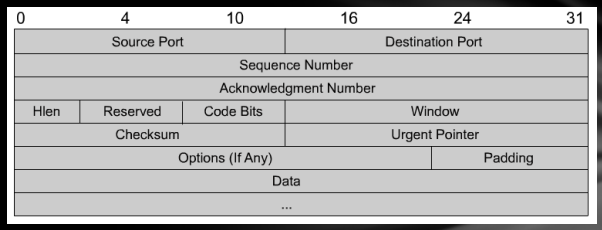

        * **TCP是面向连接的可靠协议**，负责从源到目标的可靠性和流量控制。  
        通过以下方法实现：   
            1.滑动窗口（流量控制）   
            2.序号和确认（可靠性）   
            3.同步（建立虚拟电路） 

        * TCP 重新发送任何未接收的内容，并在最终用户应用程序之间提供虚拟电路。
        * TCP 的优点是它提供了有保证的段的交付。
  
        注意：虽然TCP的操作很简单，但其操作中可能是一个非常复杂的协议。有关TCP的大多数细节都超出了本课程的范围。

        * 三次握手：  
    
        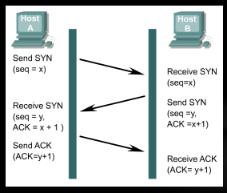

        两端必须在彼此的初始 TCP 序列号 （ISN）上同步才能建立连接。  
        序列号(seq)用于跟踪数据包的顺序，并确保在传输过程中不会丢失数据包。  
        初始序列号是建立 TCP 连接时使用的起始序列号。  
        在连接序列期间交换起始序列号可确保可以恢复丢失的数据。

    * TCP和UDP常见的端口号： 
   
    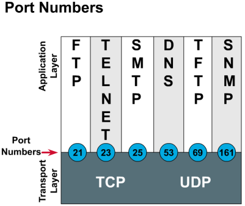

* DNS  

    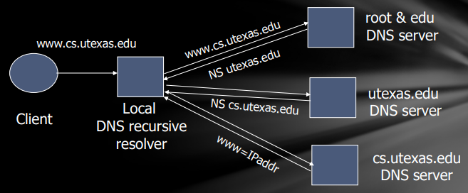  
    DNS根服务器，负责最高级别的域名解析。  
    当本地域名服务器（local server）不知道如何解析域名时，会询问权威服务器（authoritative server），然后级联询问，直到根服务器（root server）。

### Security Issues of TCP/IP
* Sniffing（嗅探）：  
    * 许多传输的数据未加密。  
        FTP 和 Telnet 以明文形式发送密码。   
        许多 Web 应用程序使用没有加密的 HTTP 协议。  
    * 混杂模式网络接口卡可以读取所有数据。
    
    * 嗅探工具：Tcpdump / libpcap，Wireshark,Commview

* ARP Spoofing（ARP 欺骗/病毒）
    * ARP 是无状态的：ARP：IP -> MAC，RARP：MAC -> IP。操作系统通过 ARP Cache 来实现 ARP。
    * 原理：伪造ICMP报文，让受害机器发起ARP请求。紧接着，向受害机器发送伪造的 ARP 响应数据包，ARP Cache将被投毒。
    * 可以使用 ARP 欺骗发起：   
        1.拦截攻击   
        2.中间人攻击   
        3.拒绝服务攻击
* IP Spoofing（IP 欺骗）
    IP 欺骗是指带有假的源 IP 地址的 IP 协议分组（数据报），目的是隐藏发送方或冒充另一个计算系统身份。

    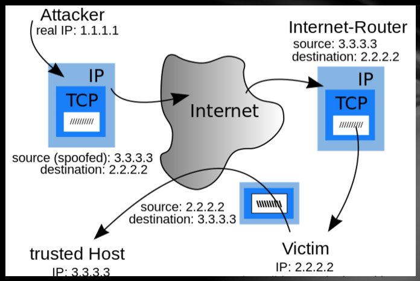{width="500"}

* TCP SYN flooding（洪水/泛洪攻击）  
    在TCP协议中，我们需要通过三次握手来建立连接，但如果第二次握手后发送方不对接受方进行回复，那么这个连接将会进入到等待阶段，然后产生一个生存时间。那么如果发送方大量发送请求，就会导致接收方过载崩溃。
    * SYN 泛洪原理：  
        攻击者在伪造 IP 地址的同时发送大量请求。   
        被攻击的主机为每个请求分配资源，创建新线程，连接状态的新内存，直到超时。     
        一旦资源耗尽，客户端就无法正常连接。   
    * 大多数经典的 DOS 攻击：   
        发起者不消耗资源。  
        接收者必须为每个请求创建一个线程。不对称！

    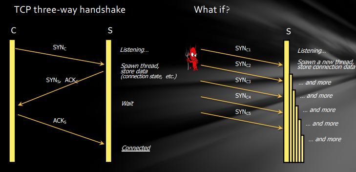{width="600"}

!!! success "防止泛洪攻击："  
    * 方式一：随机删除   
        如果SYN队列已满，随机删除一个。  
        正常连接可以完成，泛洪连接最终会被删除。  
        优点：易于实施！
    * 方式 2：SYN Cookie
        我们可以思考，为什么 SYN Flooding 可以成功？ 因为资源分配不对称！   
        SYN Cookie 确保服务器不会存储状态，除非它从客户端收到至少两条消息。
        * 服务器（接收方）将套接字信息（服务器和客户端的 IP 和端口）存储在 cookie 中，并将 cookie 发送给客户端。
        * 客户端（发送方）必须将 cookie 与第二个请求一起发送，服务器将重新计算 cookie 并将其与客户端发送的 cookie 进行比较。

* TCP SYN 预测攻击  
    TCP协议中的每个数据包都有一个序列号SYN;接收方将根据 SYN 对数据包进行排序和重组。  
    * 一旦攻击者能够预测 SYN，他就可以向接收方发送“伪造”的数据包，并使其重新组织数据包以服务于攻击者的目的。  
    * TCP SYN 预测攻击是许多其他攻击的来源，包括： 
    TCP 欺骗、TCP 连接劫持、TCP 重置
    * 对抗方法：选择一个随机的 ISN 去抵抗预测。

* TCP 拥塞控制  

    >例如多个人使用一条带宽时，可能产生网络拥塞。

    * TCP 协议要求发送方：将速度减半，并继续减半，直到没有丢包或速度为 0 。如果丢包停止（不再拥塞），传输速度将**缓慢**增加。
    * 攻击场景：Alice 是好用户，而 Bob 是恶意用户 • Alice 和 Bob 同时丢失数据包。Alice 降低速度;但是，Bob 违反了协议并实现了更好的速度。

    >例如迅雷等下载器在早期利用了这个bug，抢网络带宽。（上课说的）

    * 解决方案：添加 ack nonces，并在 ack 处返回 nonces 以证明它不是作弊。

* DNS Spoofing（DNS 欺骗）
    修改DNS服务器或本地DNS服务（经常修改DNS缓存数据库，使其成为DNS缓存中毒攻击），将所需的页面重定向到错误的IP，从而将流量发送到另一台服务器（通常是攻击者的机器）  
    文字描述有点抽象，那就用一个更抽象的图看一下。   

    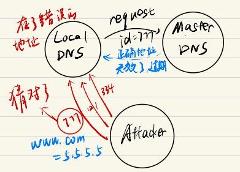

    攻击者问 Local DNS www.com 的地址，然后Local DNS 去问 Master DNS 。在 Master DNS回复猜测Id范围，狂发，一定有一个能猜中，然后把错误的地址发给 Local DNS，于是 Local DNS 存储了错误的地址，而真正的 Master DNS发送给 Local DNS 的地址则被忽略了（因为 Local DNS 已经收到了地址）如果下次真正的用户问Local DNS，那么就会得到错误的地址。

### IPSEC
* 概述:
    * IPSEC 支持在 IP 层的所有网络传输的加密和认证
    * IPV6 必须支持 IPSEC，IPV4 是可以选择的
    * 三个核心:  
        1.AH:验证头  
        2.ESP:载荷安全性封装   
        3.AS:安全关联 

* Authentication Headers(AH)
    为IP数据包提供数据完整性和认证服务,可选提供防重放。  

    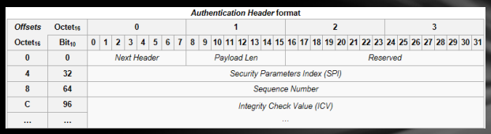  

    * Next Header（8bit）：AH 之后的下一个标头类型。   
    * Payload Len（8 位）：AH 的长度（32 位减去 2）。    
        对于 AH 数据长度 = 96 位（3 个字），加上 3 个字固定磁头。• ，有效载荷长度字段将为 4。
    * Reserved (16bit): 备份。  
    * Security Parameters Index (32bit):与这些 IP 数据包相关的 SA 索引。 
    * Sequence Number (32bit): 单调递增的计数器，以防止重放攻击。  
    * Integrity Check Value, ICV: 包含 MAC 或完整性检查值（ICV）。

* Encapsulating security payload format（ESP）  
    提供安全性、机密性和身份验证服务（可选）

    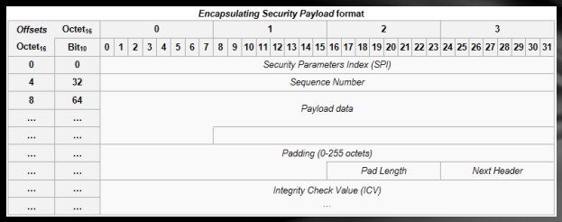

    * Security Parameters Index, SPI (32bit):与数据包相关的SA索引。    
    * Sequence Number(32bit):单调递增的计数器，以防止重放攻击。    
    * Payload data：原始 IP 包。   
    * Padding（0-255 bit）/Pad Length（8 bit）：有关填充的信息。   
    * Next Header（8bit）：ESP 之后的下一个 Header 类型描述。   
    * Integrity Check Value，ICV：包含完整性检查值 （ICV）。 
 
* Security association（SA）
    * IPSec使用安全关联（SA）集成安全服务 
    * SA为单向发送者-接收者流定义了一系列算法和参数（密钥等），用于加密和身份验证。
    * 如果需要安全的双向通信，则需要创建两个 SA。
    * 一个 SA 有三个常量唯一确定：  
        1.安全参数索引 （SPI）：与 SA 关联的位字符串。   
        2.IP 目标地址：SA 的目标地址。   
        3.安全协议标识符：指定 AH 或 ESP 简而言之，SA 是一组安全参数，支持与另一个实体共享信息。

* IPSec 操作模式  
    IPSec 可用于 P2P（点对点）或网络隧道传输。  
    * 传输模式：    
        传输模式 IPSec 仅保护 IP 数据包内容，不保护 IP 报头。  
        由于 IP 报头未被修改，因此路由过程不会受到影响。传输层和应用层的数据都受到保护。  
        通常用于两台主机之间的对等通信。   
    * 隧道模式：  
        隧道模式 IPSec 将对整个 IP 数据包进行加密或身份验证。原来的IP报文会隐藏到新的IP报文中，并附加新的IP报头。  
        通常用于保护网络与网络之间的 VPN、主机到网络通信和对等通信。

* IPSEC 的优势
    * IPSEC可以在防火墙/路由器中实施和强制执行   
        所有通过边界的数据包都将得到增强的安全性。   
        受防火墙保护的主机不需要处理安全问题。   
    * IPSEC对最终用户是透明的   
        在IPSEC网络上构建的应用程序不需要做任何特殊的事情。    
        自动确保机密性和完整性。 

### SSL/TLS
* 概述：
    * SSL Connection（连接）：   
        连接是提供合适服务类型（OSI 层定义）的传输。  
        SSL 连接是一种点对点关系。连接是临时的，每个连接都与一个会话相关联。
    * SSL session（会话）：   
        SSL 会话是客户端和服务器之间的关联。握手协议创建一个会话。会话定义一组连接共享的密码安全参数。   
        避免为提供每个连接安全参数而支付昂贵的协商价格。

* SSL/TLS 协议栈  
    * SSL/TLS协议介于传输层和应用层之间，分为两层：   
        1.握手层，定义了三个子协议：握手子协议、更改密码规范子协议、警报子协议。   
        2.记录层，从应用层接收和加密信息，并将其发送到传输层。接收消息、阻止、压缩/解压缩（可选）、计算 MAC/HMAC、加密。  

    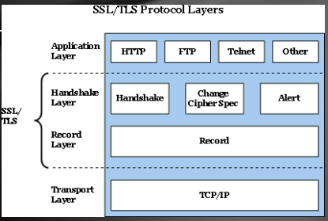

    * 握手层（SSL中最复杂的部分）：  
        * 使服务器和客户端相互验证。  
        * 协商加密算法，MAC 算法和加密密钥。  
        * 在应用程序数据传输之前执行握手协议。  
        * 过程：  
            1.Establish safety negotiation（建立安全谈判）  
            2.Server authentication and key exchange（服务器认证和密钥交换）  
            3.Client authentication and key exchange（客户端认证和密钥交换）  
            4.end（结束）
        
    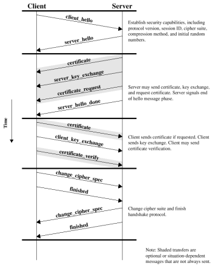

    * 记录层： 
        * 过程：  
            1.fragmentation（分段）：消息数据分段为 214 （16384） 字节块大小或更小。    
            2.compression (optional)（压缩（可选））：它必须是无损压缩;如果数据增加，则增加的长度不超过 1024 字节。    
            3.MAC calculation（MAC 计算）：使用共享密钥MAC_write_secret。   
            4.Encryption（加密）：使用所选算法进行加密。    
            5.add an SSL record header（添加 SSL 记录标头）：   
                内容类型（8 位）：高级协议描述   
                主要版本（8 位）：主版本号   
                次要版本（8 位）：次要版本号   
                压缩长度（16 位）：明文数据片（或压缩片）

        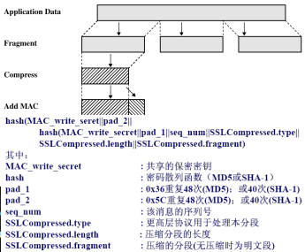      

## IS 3.2 Malicious Code

* 概述：恶意代码是什么？  
    导致违反网站安全策略的一组指令

### Trojans Horse（木马）

* 概述：
    具有公开目的（用户已知）和隐蔽目的（用户未知）的程序  
    通常伪装成游戏程序或合二为一充当服务器，接受和执行远程管理员的命令：   
    * 包括拦截击键和鼠标动作并将其发送给攻击者。  
    * 它还允许攻击者上传和下载文件

* Replicating（复制）：难以被检测

!!! example "一个例子🌰：Thompson's Compiler"
    1.修改编译器，以便在编译登录名时，登录名接受用户的正确密码或固定密码（所有用户的密码相同）。      
    2.然后再次修改编译器，以便在编译新版本的编译器时，自动插入执行第一步的额外代码。      
    3.重新编译编译器。   
    4.删除包含修改的源代码，并将未修改的源代码放回原处。

### Computer Virus（病毒）

* 概述：  
    将自身插入到一个或多个文件中并执行某些操作的程序。  
        1.插入阶段是插入自身到一个文件中。   
        2.执行操作是做一些操作，当然可能也不进行任何操作。  
    * 插入阶段必须存在   
        不需要总是执行   
        只有启动文件未被感染时，病毒才会将其自身插入启动文件

* 类型：  
    Boot sector infectors 引导扇区感染器  
    Executable infectors 可执行感染器  
    Multipartite viruses 多方病毒  
    TSR viruses TSR 病毒  
    Stealth viruses 隐形病毒  
    Encrypted viruses 加密病毒  
    Polymorphic viruses 多态病毒  
    Macro viruses 宏病毒 

    * Boot sector infectors 引导扇区感染器：
        * 将自身插入磁盘引导扇区的病毒 
            * 包含代码的磁盘部分 
            * 在系统首次“看到”磁盘时执行（包括在引导时......）  
        * 示例：Brain virus（脑病毒）   
            1.将磁盘中断向量从 13H 移动到 6DH。   
            2.设置新的中断向量以调用脑病毒。   
            3.当看到新的软盘时，检查位置 4 的 1234H，如果不存在，它会在保存原始引导块后将自身复制到磁盘上。 
    * Executable infectors 可执行感染器：
        感染可执行程序的病毒   
        它可以感染 PC 上的.EXE或.COM • 它可以预先加载自己（如图所示）或将自己放在任何地方，修复二进制文件，以便在某个时候执行。

        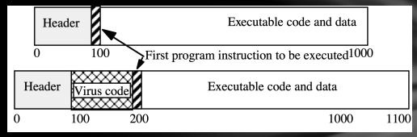
        
        !!! abstract "Means of attaching（吸附方式（我自己取的名字））"
            === "overwriting"

                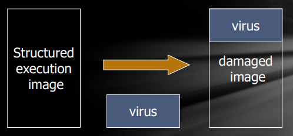

                病毒覆盖可执行文件,这是最简单的机制。  
                由于原始程序已损坏，因此很容易被发现。
            
            === "at the beginning"

                

                改进了隐身性，因为原始程序完好无损。  
                如果原始程序很大，复制它可能会很慢。  
                如果发生多次感染，文件大小会增加。  

            === "beginning and end"

                

                附加病毒的属性 + 能够清理和避免检测   
                示例：附加到构建具有大小的文件列表的程序;程序结束后修改。

            === "intersperse (穿插)"

                

            === "companions (同伴)"

                

    * Multipartite viruses 多方病毒:   
        可以感染引导扇区或可执行文件的病毒,通常分为两部分:  
        * 一部分是引导扇区感染器 
        * 另一部分是可执行感染器
  
    * TSR viruses TSR 病毒:  
        在应用程序（或引导或磁盘挂载）完成后在内存中保持活动状态的病毒（“终止并保持驻留”）,即程序或磁盘挂载完成后保留在内存中。  

        >示例：大脑、耶路撒冷病毒  

    * Stealth viruses 隐形病毒：
        隐藏文件感染的病毒  

        >示例：IDF 病毒修改 DOS 服务中断处理程序，如下所示：   
        • 文件长度请求：返回未感染文件的大小。   
        • 请求打开文件：暂时清除文件，关闭时重新感染。   
        • 请求加载文件以供执行：加载受感染的文件。  

    * Encrypted viruses 加密病毒：
        通过签名检测病毒现在要困难得多，因为大多数病毒都是加密的（而且你不知道加密了几次，所以杀毒很难）。

    * Polymorphic viruses 多态病毒：
        多态 ，即 “多种形式”。  
        一种病毒，每次复制时都会改变其形式，通过更改用于破译的“签名”或指令来阻止签名检测。   
        在指令层面：替代指令    
        在算法层面：不同的算法实现相同的目的  

        >给定两个代码段，评估它们的语义等价性是一个无法确定的问题！
    
### Worm （蠕虫）

!!! info "蠕虫、木马和病毒之间的区别："
    * 病毒：    
        • 存在：通常插入到主机代码中（不是独立程序）   
        • 传播：通过感染其他程序进行传播   

    * 木马：    
        • 存在：它是一个独立的可执行程序   
        • 传播：不用自我复制  

    * 蠕虫：   
        • 存在：它是一个独立的可执行程序   
        • 传播：通过将自身复制到目标系统来自动传播  
    
### Defenses of Mal.Code
* 没有算法可以检测全部的恶意代码

* 防御手段:
    * 区分数据、指令 
    * 限制进程可访问的对象:Guardians / Watchdogs
 / Sandbox / Virtual Machin
    * 禁止共享 
    * 检测文件的更改 
    * 检测超出规范的操作 
    * 分析统计特征
  
### Botnets,DDoS and SPAM

* Botnets（僵尸网络）:  
    能够按照指令行事的自主程序网络
    * 通常有大型（多达数十万）组的远程控制“僵尸”系统 
    * 机器所有者不知道他们已经受到威胁 
    * 通过 IRC 或 P2P 进行控制和升级  
   
    用作各种攻击的平台：

    * 分布式拒绝服务 （DDoS）  
    * 垃圾邮件和点击欺诈 spam and click fraud 
    * 新漏洞利用/蠕虫的启动板

    

* DOS:  
    目标：使受害计算机不堪重负并拒绝为其合法客户端提供服务。   
    DoS 经常利用网络协议  
    * Smurf：ICMP 回显请求以欺骗受害者的地址为源广播地址
    * Ping of death：有效负载大于 64K 的 ICMP 数据包崩溃旧版本的 Windows 
    * SYN flood：来自欺骗地址的“打开 TCP 连接”请求 
    * UDP flood： 通过发送数千个虚假的 UDP 数据包来耗尽带宽

* DDOS:
    * 建立一个僵尸的僵尸网络  
        多层架构：使用一些僵尸作为“主人”来控制其他僵尸
    * 命令僵尸对受害者发起协同攻击  
        * 不需要欺骗（为什么？）因为没有必要为了保护一台僵
        尸机器来使用欺骗，比起伪造 IP 地址，可能获取一台新
        的僵尸机要快得多。
        * 即使在发生 SYN 泛滥的情况下，SYN cookies 也无济于事（为什么？）DDOS 引发的 SYN flood 不同于 DOS，每台僵尸机都是在正常访问服务器的，不会被 SYN cookie 影响。
    * 通过来自不同来源的数千台机器的流量抵达受害者
    
    

* Detecting Botnets（僵尸网络的检测）：
    * 今天的僵尸网络通过 IRC 和 DNS 进行控制 
        * IRC （聊天室） 用于向僵尸发出命令 
        * 僵尸使用 DNS 来查找主服务器，并由主服务器查看僵尸是否已被列入黑名单 
    * IRC/DNS 活动在网络中非常明显 
        * 寻找执行扫描的主机和此类主机比例高的 IRC 频道。
        >在波特兰州立大学成功使用 
        * 寻找请求多次 DNS 查询的主机，但几乎不会收到有关他们自己的查询。
    * 不过它们通过使用加密和 P2P 可以轻松规避检测。

* Email Spoofing:
    * 邮件通过 SMTP 协议发送 
        * 无内置身份验证 
    * 发件人设置 MAIL FROM 字段 
        * 输入验证不正确的典型示例 
    * 收件人的邮件服务器只能看到接收消息的直接对等方的 IP 地址。

* 为什么要隐藏垃圾邮件的源:
    * 许多电子邮件提供商将产生大量垃圾邮件的服务器和 ISP 列入黑名单 
    * 实时黑名单在 SMTP 连接时阻止 15-25% 的垃圾邮件 
    * 垃圾邮件发送者的目标：逃避黑名单 
        * 僵尸网络在垃圾邮件的发送中非常方便！

* 垃圾邮件是从哪里来的：
    * 垃圾邮件源的IP地址在互联网上广泛分布 
    >在跟踪实验中，大多数IP地址出现一两次;60-80% 无法通过 traceroute 到达，绝大多数垃圾邮件来自一小部分 IP 地址空间。

    * 垃圾邮件制造者使用基础路由设备，创建与邮件中继的短暂连接，然后消失。
    
    * 劫持一大块未分配的“暗”空间
  
* 垃圾邮件的对抗：
    * by techniques（科技型）：无法真正解决  
        * 过滤器 
        >关键字过滤、黑名单和白名单、HASH过滤、基于规则的过滤、贝叶斯过滤 
        * 发件人验证
        >SMTP验证、反向查找、DKIM、SenderID、FairUCE、电子邮件指纹 
        * 质询认证
    * by the law（法律手段）