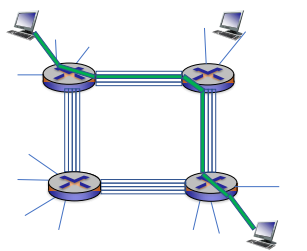

---

title: Chap 1 | Introduction

hide:
  #  - navigation # 显示右
  #  - toc #显示左
  #  - footer
  #  - feedback  
comments: true  #默认不开启评论

---
<h1 id="欢迎">Chap 1 | Introduction</h1>
!!! note "章节启示录"
    <!-- === "Tab 1" -->
        <!-- Markdown **content**. -->
    <!-- === "Tab 2"
        More Markdown **content**. -->
    本章节是计算机网络的第一章。
    
## 1.网络基本介绍
### 1.1 初识网络
网络的基本功能：信息传递  
  
* 服务用什么区分？
    功能、延迟、带宽、丢失率      
    端节点数目、服务接口   
    可靠性、实时/非实时等外特性   
### 1.2 网络实例
* 网络分类（按地域规模）     
    个域网PAN(Personal Area Network)：能在便携式消费电器与通信设备之间进行短距离通信的网络。   
    局域网LAN(Local Area Network)：局部地区形成的区域网络，如企业网络。      
    城域网MAN(Metropolitan Area Network)：范围覆盖一个城市的网络。     
    广域网WAN(Wide Area Network)：覆盖很大地理区域，乃至覆盖地区和国家。       

??? tip "网络的网络:Internet 与 internet"
    {width="500"}

* 网络边缘       
    1. 端系统：位于互联网边缘与互联网相连的计算机和其他设备    
    2. 端系统由各类主机(host)构成：桌面计算机、移动计算机、服务器、其他智能终端设备
* 网络核心    
    1. 由互联端系统的分组交换设备和通信链路构成的网状网络，目标是将海量的端系统互联起来
        * 分组交换：路由器、链路层交换机     
            1. 主机将数据分成分组，发送到网络    
            2. 网络将数据分组从一个路由器转发到下一个路由器，通过从源到目标的路径上的链路，逐跳传输抵达目的地
        * 通信链路：光纤、铜缆、无线电、激光链路
    2. 网络核心的两大功能：
        1. 路由：全局操作：确定数据分组从源到目标所使用的路径。需要路由协议和路由算法，产生路由表。   
        2. 转发：本地操作：路由器或交换机将接收到的数据分组转发出去（即移动到该设备的某个输出接口）   
            确定转发出去的接口/链路：根据从“入接口”收到分组头中的目的地址，查找本地路由表，确定“出接口”   
        {width="300"}
 
#### 路由器转发模型
1. 电路交换(circuit switching):有保障，灵活性不强，资源利用率低
    * 电路交换通常采用面向连接方式,先呼叫建立连接，实现端到端的资源预留
    * 预留的资源包括：链路带宽资源、交换机的交换能力
    * 电路交换连接建立后，物理通路被通信双方独占，资源专用，即使空闲也不与其他连接共享
    * 由于建立连接并预留资源，因此传输性能好；但如果传输中发生设备故障，则传输被中断
    {width="300"}

2. 报文交换
    * 存储&转发：路由器需要接收到完整的整个数据报文后，才能开始向下一跳发送
    * 存储转发带来报文的传输延迟：将L位数据报文，以R bps的速率，发送到链路中： 需要L/R秒
    {width="400"}

3. 分组交换(packet switching):时延小，灵活性高   
    * 将大报文拆分成多个小分组   
    * 通信双方以分组为单位、使用存储-转发机制，实现数据交互的通信方式   
    * 以分组作为数据传输单元    
    * 每个分组的首部都含有地址（目的地址和源地址）等控制信息  
    * 每个分组在互联网中独立地选择传输路径   
    * 支持灵活的统计多路复用  
    {width="300"}
    
    资源利用率很高，在每一跳决定下一跳去哪里，每一个包都是独立的，路径由自己决定（每次都选尽可能快的），但会导致一个问题，包之间到达的顺序可能与发送端不同，接收端需要做额外的处理。    
    {width="500"}

{width="400"}

### 1.3 协议与分层结构
#### 协议设计目的
要考虑的要素：可靠性、资源分配、拥塞问题、自适应性、安全问题  

* 网络协议
    1. 为进行网络中的数据交换而建立的规则、标准或约定，即网络协(network protocol)   
    2. 通信双方需要共同遵守，互相理解

* 三要素
    1. 语法：规定传输数据的格式（如何讲）
    2. 语义：规定所要完成的功能（讲什么）
    3. 时序：规定各种操作的顺序（双方讲话的顺序）

#### 协议分层结构
1. 层次栈 (a stack of layers)  
    为降低网络设计的复杂性，网络使用层次结构的协议栈，每一层都使用其下一层所提供的服务，并为上层提供自己的服务。
2. 对等实体 (peers)   
    不同机器上构成相应层次的实体成为对等实体
3. 接口 (interface)
    在每一对相邻层次之间的是接口；接口定义了下层向上层提供哪些服务原语。
4. 网络体系结构 (network architecture)
    层和协议的集合为网络体系结构，一个特定的系统所使用的一组协议，即每层的协议，称为协议栈。    
{width="300"}

* 发送端：层层封装；接收端：层层解封装   
    不同层对应协议数据单元（PDU Protocol Data Unit）   
{width="500"}
####  服务原语
* 面向连接：按照电话系统模型建立的（一个常见的例子）   
    面向连接的服务每个“请求”或“响应”后，都在对方产生一个“指示”或“确认”动作。
    * 六个核心服务原语    
        {width="400"}
* 无连接：按照邮政系统模型建立的（一个常见的例子）  
    邮件携带了完整的目标地址，传输过程不需要应答。
#### 服务与协议的关系
协议是“水平”的，服务是“垂直”的
实体使用协议来实现其定义的服务    
上层实体通过接口使用下层实体的服务   
{width="500"}

??? question "思考题"
    * A protocol is an agreement between the ________ on how communication is to proceed.   
        A. network layers on the same machine   
        B. network nodes  
        C. adjacent entities   
        D. peers on different nodes   
    选D，因为协议是水平的

### 1.4 参考模型
#### OSI参考模型
OSI 7层模型  
{width="150"}  

1. 物理层(Physical Layer):定义如何在信道上传输0、1：Bits on the wire
2. 数据链路层(Data Link Layer):实现相邻（Neighboring）网络实体间的数据传输。成帧（Framing）：从物理层的比特流中提取出完整的帧。
    * 物理地址（MAC address）：48位，理论上唯一网络标识，烧录在网卡，不便更改。
    * 流量控制，避免“淹没”（overwhelming）:当快速的发送端遇上慢速的接收端，接收端缓存溢出。
    * 共享信道上的访问控制（MAC）：同一个信道，同时传输信号。例如：同一间教室内，多人同时发言，需要纪律来控制
3. 网络层(Network Layer):将数据包跨越网络从源设备发送到目的设备（host to host）。
    * 路由（Routing）：在网络中选取从源端到目的端转发路径，常常会根据网络可达性动态选取最佳路径，也可以使用静态路由。
    * 服务质量（QoS）控制：处理网络拥塞、负载均衡、准入控制、保障延迟。
    ??? question "思考题"
        为何在唯一的MAC地址之外，还需要唯一的IP地址？  
        MAC是为了标识设备（网卡），只考虑了唯一性，IP地址考虑的是全球范围内的寻址。路由器不可能存下所有MAC的地址，而且网卡时常会存在交易，不可能每次交易都更新路由器。简单来说，MAC地址更像是身份证，而不是一个用于寻址的地址。
4. 传输层(Transport Layer):将数据从源端口发送到目的端口(进程到进程)
    * 网络层的控制主要面向运营商，传输层为终端用户提供端到端的数据传输控制
    * 可靠传输：可靠的端到端数据传输，适合于对通信质量有要求的应用场景，如文件传输等。
    * 不可靠传输：更快捷、更轻量的端到端数据传输，适合于对通信质量要求不高，对通信响应速度要求高的应用场景，如语音对话、视频会议等。
5. 会话层(Session Layer)
6. 表示层(Presentation Layer)
7. 应用层(Application Layer)

#### TCP/IP参考模型
先有TCP/IP协议栈，然后有TCP/IP参考模型。参考模型只是用来描述协议栈的。    
     

TCP/IP参考模型：ARPANET所采用
>以其中最主要的两个协议TCP/IP命名,Vint Cerf和Bob Kahn于1974年提出。

* 链路层(Link Layer)   
    描述了为满足无连接的互联网络层需求，链路必须具备的功能。 
* 互联网层(Internet Layer)   
    允许主机将数据包注入网络，让这些数据包独立的传输至目的地，并定义了数据包格式和协议（IPv4协议和IPv6协议）
* 传输层(Transport Layer)   
    允许源主机与目标主机上的对等实体，进行端到端的数据传输：TCP，UDP
* 应用层(Application Layer)   
    传输层之上的所有高层协议：DNS、HTTP、FTP、SMTP...

{width="150"}   
摒弃电话系统中“笨终端&聪明网络”的设计思路。    
端对端原则：采用聪明终端&简单网络，由端系统负责丢失恢复等，简单的网络大大提升了可扩展性。实现了建立在简单的、不可靠部件上的可靠系统。
#### OSI模型TCCP/IP模型对比
   

* 基本设计思想：通用性与实用性   
    1. OSI：先有模型后设计协议，不局限于特定协议，明确了服务、协议、接口等概念，更具通用性。
    2. TCP/IP模型：仅仅是对已有协议的描述。

* 无连接与面向连接   
    1. OSI模型网络层能够支持无连接和面向连接通信
    2. TCP/IP模型的网络层仅支持无连接通信（IP）

### 1.5 计算机网络度量单位
* 比特率(bit rate)：主机在数字信道上传送数据的速率，也称数据率。    
    比特率的单位是b/s(比特每秒)，也可以写为bps，(bit per second)，或 kbit/s、Mbit/s、 Gbit/s等
* 带宽    
    网络中某通道传送数据的能力，即单位时间内网络中的某信道所能通过的“最高数据率”。    
    单位是 bit/s，即 “比特每秒”
* 包转发率(PPS)      
    全称是Packet Per Second(包/秒)，表示交换机或路由器等网络设备以包为单位的转发速率    
    线速转发（一种状态）：交换机端口在满负载的情况下，对帧进行转发时能够达到该端口线路的最高速度   

    ??? question "思考题"
        * 在交换机上：大包和小包，哪个更容易实现线速？   
            小包容易实现，因为单位是包/秒。      
        * 但为什么实际中存在很多大包呢？       
            小包的劣势：包越小，Header占比越高，有效信息占比低。
* 时延(Delay)   
    时延 (delay 或 latency) 是指数据（一个报文或分组）从网络（或链路）的一端传送到另一端所需的时间，也称为延迟
    1. 传输时延(transmission delay)：数据从结点进入到传输媒体所需要的时间，传输时延又称为发送时延
    2. 传播时延(propagation delay)：电磁波在信道中需要传播一定距离而花费的时间
    3. 处理时延(processing delay)：主机或路由器在收到分组时，为处理分组（例如分析首部、提取数据、差错检验或查找路由）所花费的时间
    4. 排队时延(queueing delay)：分组在路由器输入输出队列中排队等待处理所经历的时延
    {width="400"}

    {width="550"}

* 往返时延RTT(Round-Trip Time)    
    从发送方发送数据开始，到发送方收到来自接收方的确认，经历的总时间   
    可用于判断网络的通断性、测试网络时延、计算数据包丢失率等

* 时延带宽积   
    时延带宽积 = 传播时延 × 带宽，即按比特计数的链路长度   
    若发送端连续发送数据，则在发送的第一个bit即将达到终点时，发送端就已经发送了时延带宽积个bit ，而这些bit都在链路上向前移动     
    {width="500"} 

* 吞吐量 (throughput)      
    单位时间内通过某个网络(或信道、接口)的数据量，单位是 b/s   
* 有效吞吐量(goodput)  
    单位时间内，目的地正确接收到的有用信息的数目（以 bit 为单位）  
* 利用率     
    信道利用率指出某信道有百分之几的时间是被利用的  
    网络利用率则是全网络的信道利用率的加权平均值  
* 丢包率     
    所丢失数据包的数量占所发送数据包的比率 
* 时延抖动  
    变化的时延称为抖动（Jitter）,类似于方差，衡量稳定性
* 延迟丢包  
    在多媒体应用中，由于数据包延迟到达，在接收端需要丢弃失去使用价值的包

### 1.6 网络安全与威胁
1. 恶意软件：
    1. 病毒
    2. 蠕虫
2. 拒绝服务攻击
3. 僵尸网络
4. 数据包嗅探
5. IP欺骗