---

title: Chap 2 | 物理层

hide:
  #  - navigation # 显示右
  #  - toc #显示左
  #  - footer
  #  - feedback  
comments: true  #默认不开启评论

---
<h1 id="欢迎">Chap 2 | 物理层</h1>
!!! note "章节启示录"
    <!-- === "Tab 1" -->
        <!-- Markdown **content**. -->
    <!-- === "Tab 2"
        More Markdown **content**. -->
    本章节是计算机网络的第二章。有些内容可能不重要，后续应该会标注。

## 1.物理层基本概念
* 位置：物理层是网络体系结构中的最底层
!!! warning "物理层？"
    * 是连接计算机的具体物理设备吗？×不是
    * 是负责信号传输的具体物理媒体吗？×不是

* 功能：在连接各计算机的传输媒体上传输数据比特流
    1. 数据链路层将数据比特流传送给物理层
    2. 物理层将比特流按照传输媒体的需要进行编码
    3. 然后将信号通过传输媒体传输到下一个节点的物理层

* 作用：尽可能地屏蔽掉不同传输媒体和通信手段的差异，为数据链路层提供一个统一的数据传输服务。

* 物理层常用标准：
    1. 点对点通信线路用于直接连接两个结点
    2. 广播通信线路：一条公共通信线路连接多个结点

## 2.数据通信基础
### 2.1 数据通信基础理论
#### 2.1.1 傅里叶分析
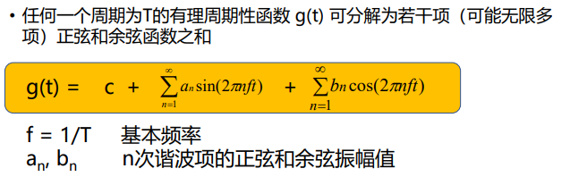{width="500"}   

$g(t)$ 的变化会引起 $c,a_n,b_n$ 变化。   

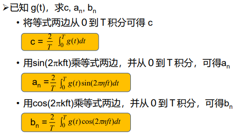{width="400"}

根据傅立叶分析，任何电磁信号可以由若干具有不同振幅、频率和相位的周期模拟信号（正弦波）组成。

反过来，只要有足够的具有适当振幅、频率和相位的正弦波，就可以构造任何一个信号。

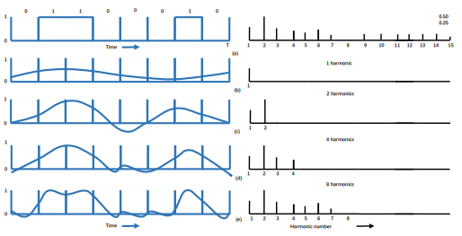{width="400"}

图右的横坐标为谐波(Harmonics sent)

#### 2.1.2 有限带宽信号
* 频谱（spectrum）:是一个信号所包含的频率的范围   

许多信号的带宽是无限的，然而信号的主要能量集中在相对窄的频带内，这个频带被称为有效带宽，或带宽（bandwidth）

* 信号在信道上传输时的特性：
    1. 对不同傅立叶分量的衰减不同，引起输出失真
    2. 信道有截止频率 $f_c$ , 0 ~ $f_c$的振幅衰减较弱， $f_c$ 以上的振幅衰减厉害，这主要由信道的物理特性决定， 0 ~ $f_c$ 是信道的有限带宽
    3. 实际使用时，可以接入滤波器，限制用户的带宽
    4. 通过信道的**谐波**次数越多，信号越逼真

!!! example "一个例子🌰"
    对于比特率为Ｂbps的信道，发送8位所需的时间为 8/B秒，若8位为一个周期Ｔ，则一次谐波的频率是：f1 = B/8 Hz

    能通过信道的最高次谐波(Harmonics sent)目为：N = fc / f1 （谐波通俗来讲就是：fc里面能放几个f1）   

    若音频线路的截止频率为3000Hz，则    
    N = fc / f1 = 3000/(B/8) = 24000/B

    * 结论：比特率越高（传输速度越快），N越小，越失真，也就是你要传输的比特率越大时，你的传输结果越失真。

    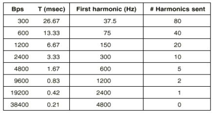{width="400"}

#### 2.1.3 信道的最大数据传输速率（奈魁斯特定理与香农定理）
1924年，奈魁斯特(H. Nyquist)推导出**无噪声**有限带宽信道的最大数据传输率公式

* 奈魁斯特定理：最大数据传输率为：   

    $$2Hlog_2V (bps)$$

    任意信号通过一个带宽为H的低通滤波器，则每秒采样2H次就能完整地重现该信号，信号电平分为V级。

??? warning "注意"
    这个公式无法约定上限，理论上V可以无限大（无限细分），这个公式相当于在给定V的前提下，约束最大数据传输率。

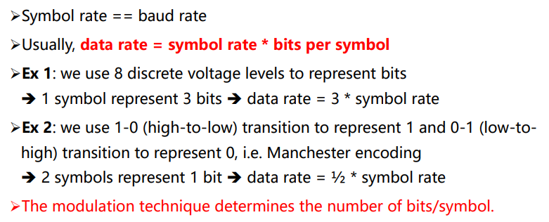{width="450"}

1948年，香农(C. Shannon)把奈魁斯特的工作扩大到信道受到随机（热）噪声干扰的情况

* 信噪比：
    随机噪声出现的大小用信噪比（信号功率S
    与噪声功率N之比）来衡量，$10log_10S/N$          
    单位：分贝

    >电话系统的典型信噪比为30db

* 香农定理：带宽为 H 赫兹，信噪比为S/N的任意信道的最大数据传输率为：   

    $$Hlog2(1 + S/N) (bps)$$

    >此式仅是上限，难以达到

#### 2.1.4 信息量

* 信息量:根据香农理论，一条消息包含信息的多少称为信息量    
    信息量的大小与消息所描述事件的出现概率有关(例如：明天太阳不会出来，信息量就比较大；明天地球不会毁灭，信息量为0，不可能发生)    
    一条消息所荷载的信息量等于它所表示的事件发生的概率p的倒数的对数    
    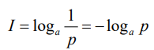   
    a表示进制，p为概率

    !!! example "一个例子🌰"   
        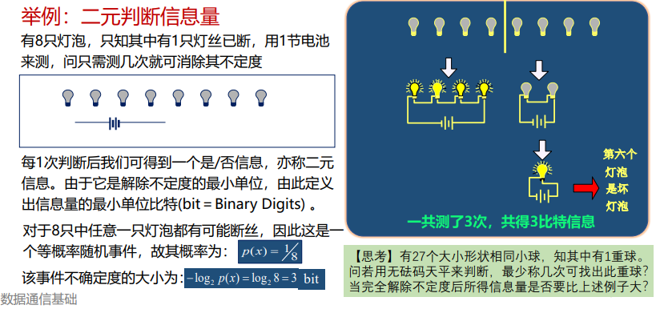{width="600"}

### 2.2 基本概念与术语
数据通信系统模型：   
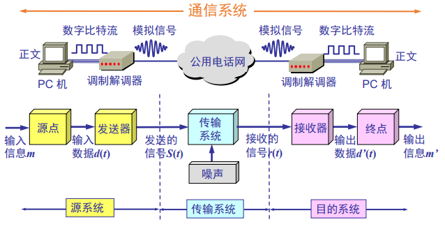{width="400"}

* 通信：在源点与终点之间传递消息或者信息，但信息和消息有着不同的概念。
* 消息：指能向人们表达客观物质运动和主观思维活动的文字、符号、数据、语音和图像等。
* 信息：指包含在消息中对通信者有意义的那部分内容。
* 数据：是对某一事实的不经解释并赋予一定含义的数字、字母、文字等符号及其组合的原始表达。
* 信号：是消息的载体（比如电信号、光信号等）。

### 2.3 传输方式
数字通信：以数字信号来传送消息的通信方式称为数字通信，而传输数字信号的通信方式称为数字通信系统。   
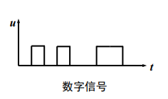   

模拟通信： 以模拟信号来传送消息的通信方式称为模拟通信，而传输模拟信号的通信系统称为模拟通信系统。   
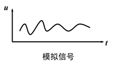

串行传输：指数据在一个信道上按位依次传输的方式。    
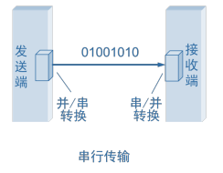      
并行传输：指数据在多个信道上同时传输的方式。   
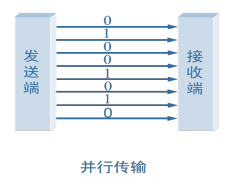     

点到点传输/点到多点传输：   
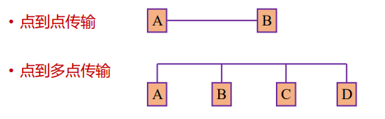{width="450"}   

单工：指两个站之间只能沿一个指定的方向传送数据信号。    
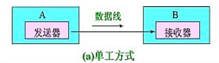      

半双工：指两个站之间可以在两个方向上传送数据信号，但不能同时进行，又称“双向交替”模式，发/收之间的转向时间为20～50ms。       
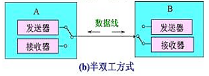       
全双工：指两个站之间可以在两个方向上同时传送数据信号。      
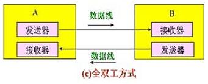   

基带传输：指未对载波调制的待传信号称为基带信号，它所占的频带称为基带。基带传输，指一种不搬移基带信号频谱的传输方式。   
频带传输：指利用调制解调器搬移信号频谱的传输体制。   
!!! tip "频带传输"   
    * 三种调制技术：载波 Asin(ωt + ϕ)的三个特性幅度、频率、相位   
        1. 幅移键控法（调幅） Amplitude-shift keying (ASK)   
            幅移就是把频率、相位作为常量，而把振幅作为变量    
        2. 频移键控法 （调频）Frequency-shift keying (FSK)    
            频移就是把振幅、相位作为常量，而把频率作为变量
        3. 相移键控法（调相） Phase-shift keying (PSK) 
            相移就是把振幅、频率作为常量，而把相位作为变量   
        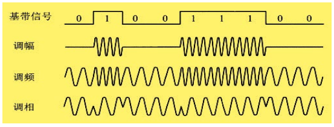{width=:450}
### 2.4 数据编码技术
* 归零编码：总共有3个电平，高电平、低电平、0电平   
    高电平变0：1  
    低电平变0：0   

* 不归零编码（NRZ：Non-Return to Zero）
    1. 原理：用两种不同的电平分别表示二进制信息“0”和“1”，低电平表示“0”，高电平表示“1”。
    2. 缺点：
        1. 难以分辨一位的结束和另一位的开始
        2. 发送方和接收方必须有时钟同步
        3. 若信号中“0”或“1”连续出现，信号直流分量将累加
    3. 结论：效率高，但容易产生传播错误

* 曼彻斯特码（Manchester），也称相位编码   
    1. 原理：每一位中间都有一个跳变，从低跳到高表示“0”，从高跳到低表示“1”
    2. 优点：克服了NRZ码的不足。每位中间的跳变即可作为数据，又可作为时钟，能够自同步。

* 差分曼彻斯特码（Differential Manchester）    
    1. 原理：每一位中间都有一个跳变，每位开始时有跳变表示“0”，无跳变表示“1”。位中间跳变表示时钟，位前跳变表示数据
    2. 优点：时钟、数据分离，便于提取

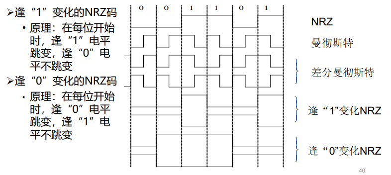{width="500"}

### 3.传输介质

