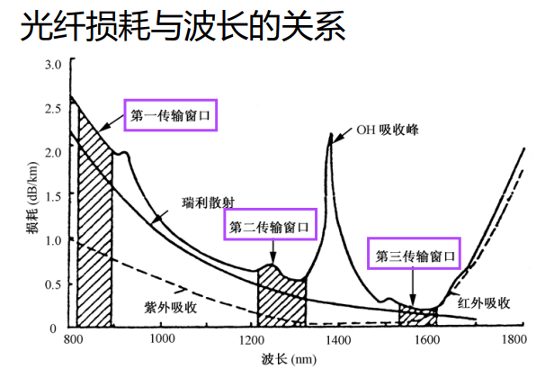
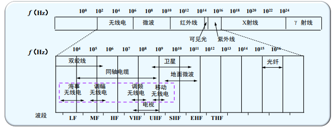
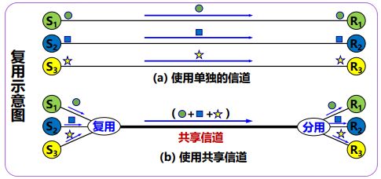
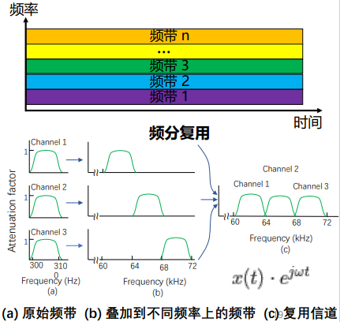
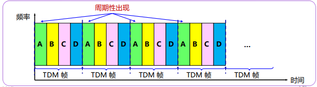
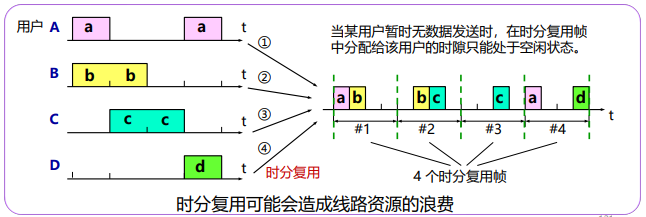
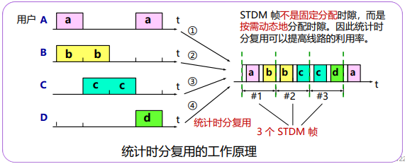
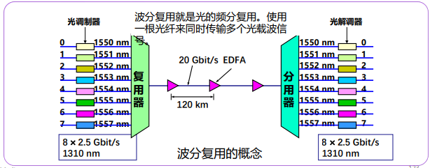
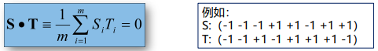
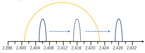

---

title: Chap 2 | 物理层

hide:
  #  - navigation # 显示右
  #  - toc #显示左
  #  - footer
  #  - feedback  
comments: true  #默认不开启评论

---
<h1 id="欢迎">Chap 2 | 物理层</h1>
!!! note "章节启示录"
    <!-- === "Tab 1" -->
        <!-- Markdown **content**. -->
    <!-- === "Tab 2"
        More Markdown **content**. -->
    本章节是计算机网络的第二章。有些内容可能不重要，后续应该会标注。

## 1.物理层基本概念
* 位置：物理层是网络体系结构中的最底层
!!! warning "物理层？"
    * 是连接计算机的具体物理设备吗？×不是
    * 是负责信号传输的具体物理媒体吗？×不是

* 功能：在连接各计算机的传输媒体上传输数据比特流
    1. 数据链路层将数据比特流传送给物理层
    2. 物理层将比特流按照传输媒体的需要进行编码
    3. 然后将信号通过传输媒体传输到下一个节点的物理层

* 作用：尽可能地屏蔽掉不同传输媒体和通信手段的差异，为数据链路层提供一个统一的数据传输服务。

* 物理层常用标准：
    1. 点对点通信线路用于直接连接两个结点
    2. 广播通信线路：一条公共通信线路连接多个结点

## 2.数据通信基础
### 2.0 概念集合
* 数据、信号与码元：
    1. 数据是指传送信息的实体
    2. 信号是数据的电气或电磁表现，是数据在传输过程中的形式
    3. 码元是代表不同离散数值的基本波形
   
* 速率、波特与带宽：
    1. 速率是指数据传输速率，表示单位时间内传输的数据量，常有两种描述形式：
        1. 码元传输速率，又称波特率，表示单位时间内数字通信系统所传输的码元数（也称调制速率或符号速率），单位是波特（Baud）。     
            码元既可以是多进制的，又可以是二进制的，码元速率与进制数无关。
        2. 信息传输速率，又称比特率，表示单位时间内数字通信系统传输的二进制码元数（即比特数），单位是比特/秒。
    2. 带宽（又称频率带宽）用来表示某个信道所能传输信号的频率范围，即最高频率与最低频率之差，单位是赫兹（Hz）。 
        在计算机网络中，带宽用来表示网络的通信线路所能传输数据的能力，即**最高数据率**，此时单位不再是 Hz ,而是 b/s 。

!!! warning "波特与比特"
    波特和比特是两个不同的概念，但波特率与比特率在数量上又有一定的关系。若一个码元携带 $n$ 比特的信息量，则波特率 $M\;Baud$ 对应的比特率为 $Mn\;\;b/s$
### 2.1 数据通信基础理论
#### 2.1.1 傅里叶分析
{width="500"}   

$g(t)$ 的变化会引起 $c,a_n,b_n$ 变化。   

{width="400"}

根据傅立叶分析，任何电磁信号可以由若干具有不同振幅、频率和相位的周期模拟信号（正弦波）组成。

反过来，只要有足够的具有适当振幅、频率和相位的正弦波，就可以构造任何一个信号。

{width="400"}

图右的横坐标为谐波(Harmonics sent)

#### 2.1.2 有限带宽信号
* 频谱（spectrum）:是一个信号所包含的频率的范围   

许多信号的带宽是无限的，然而信号的主要能量集中在相对窄的频带内，这个频带被称为有效带宽，或带宽（bandwidth）

* 信号在信道上传输时的特性：
    1. 对不同傅立叶分量的衰减不同，引起输出失真
    2. 信道有截止频率 $f_c$ , 0 ~ $f_c$的振幅衰减较弱， $f_c$ 以上的振幅衰减厉害，这主要由信道的物理特性决定， 0 ~ $f_c$ 是信道的有限带宽
    3. 实际使用时，可以接入滤波器，限制用户的带宽
    4. 通过信道的**谐波**次数越多，信号越逼真

!!! example "一个例子🌰"
    对于比特率为Ｂbps的信道，发送8位所需的时间为 8/B秒，若8位为一个周期Ｔ，则一次谐波的频率是：f1 = B/8 Hz

    能通过信道的最高次谐波(Harmonics sent)目为：N = fc / f1 （谐波通俗来讲就是：fc里面能放几个f1）   

    若音频线路的截止频率为3000Hz，则    
    N = fc / f1 = 3000/(B/8) = 24000/B

    * 结论：比特率越高（传输速度越快），N越小，越失真，也就是你要传输的比特率越大时，你的传输结果越失真。

    {width="400"}

#### 2.1.3 信道的最大数据传输速率（奈魁斯特定理与香农定理）
1924年，奈魁斯特(H. Nyquist)推导出**低通（无噪声、带宽有限）**信道的最大数据传输率公式

* 奈魁斯特定理：最大数据传输率为：   

    $$2Hlog_2V (bps)$$

    任意信号通过一个带宽为H的低通滤波器，则每秒采样2H次就能完整地重现该信号，信号电平分为V级。

!!! tip "奈氏准则的结论"
    1. 在任何信道中，码元传输速率是有上限的。
    2. 信道的频带越宽，就越可用更高的速率有效地传输码元。
    3. 奈氏准则给出了码元传输速率地限制，但并未限制信息传输速率，即未对一个码元对应多少个二进制位给出限制。

    >因为码元传输速率受奈氏准则制约，所以要提高数据传输速率，就要设法使每个码元携带更多比特的信息量，此时需要采用多元制的调制方法。

{width="450"}

1948年，香农(C. Shannon)把奈魁斯特的工作扩大到信道受到随机（热）噪声干扰的情况

* 信噪比：
    随机噪声出现的大小用信噪比（信号功率S
    与噪声功率N之比）来衡量，$10log_{10}S/N$          
    单位：分贝

    >电话系统的典型信噪比为30db

* 香农定理：带宽为 H 赫兹，信噪比为S/N的任意信道的最大数据传输率为：   

    $$Hlog2(1 + S/N) (bps)$$

    >此式仅是上限，难以达到

!!! tip "香农定理的结论"
    1. 信道的带宽或信道中的信噪比越大，信息的极限传输速率越高。
    2. 只要信息传输速率低于信道的极限传输速率，就能找到某种方法实现无差错的传输。
    3. 香农定理得出的是极限信息传输速率，实际信道能达到的传输速率要比它低不少。

#### 2.1.4 信息量

* 信息量:根据香农理论，一条消息包含信息的多少称为信息量    
    信息量的大小与消息所描述事件的出现概率有关(例如：明天太阳不会出来，信息量就比较大；明天地球不会毁灭，信息量为0，不可能发生)    
    一条消息所荷载的信息量等于它所表示的事件发生的概率p的倒数的对数    
       
    a表示进制，p为概率

    !!! example "一个例子🌰"   
        {width="600"}

### 2.2 基本概念与术语
数据通信系统模型：   
{width="400"}

* 通信：在源点与终点之间传递消息或者信息，但信息和消息有着不同的概念。
* 消息：指能向人们表达客观物质运动和主观思维活动的文字、符号、数据、语音和图像等。
* 信息：指包含在消息中对通信者有意义的那部分内容。
* 数据：是对某一事实的不经解释并赋予一定含义的数字、字母、文字等符号及其组合的原始表达。
* 信号：是消息的载体（比如电信号、光信号等）。

### 2.3 传输方式
数字通信：以数字信号来传送消息的通信方式称为数字通信，而传输数字信号的通信方式称为数字通信系统。（离散的）   
   

模拟通信： 以模拟信号来传送消息的通信方式称为模拟通信，而传输模拟信号的通信系统称为模拟通信系统。（连续的）   

串行传输：指数据在一个信道上按位依次传输的方式。    
      
并行传输：指数据在多个信道上同时传输的方式。   
     

点到点传输/点到多点传输：   
{width="450"}   

单工：指两个站之间只能沿一个指定的方向传送数据信号。    
      

半双工：指两个站之间可以在两个方向上传送数据信号，但不能同时进行，又称“双向交替”模式，发/收之间的转向时间为20～50ms。       
       
全双工：指两个站之间可以在两个方向上同时传送数据信号。      
   

基带传输：指未对载波调制的待传信号称为基带信号，它所占的频带称为基带。基带传输，指一种不搬移基带信号频谱的传输方式。   
频带传输：指利用调制解调器搬移信号频谱的传输体制。   
 
### 2.4 编码与调制
#### 1.数字数据编码为数字信号
* 归零编码：总共有3个电平，高电平、低电平、0电平   
    高电平变0：1  
    低电平变0：0   

* 不归零编码（NRZ：Non-Return to Zero）
    1. 原理：用两种不同的电平分别表示二进制信息“0”和“1”，低电平表示“0”，高电平表示“1”。
    2. 缺点：
        1. 难以分辨一位的结束和另一位的开始
        2. 发送方和接收方必须有时钟同步
        3. 若信号中“0”或“1”连续出现，信号直流分量将累加
    3. 结论：效率高，但容易产生传播错误

* 曼彻斯特码（Manchester），也称相位编码   
    1. 原理：每一位中间都有一个跳变，从低跳到高表示“0”，从高跳到低表示“1”
    2. 优点：克服了NRZ码的不足。每位中间的跳变即可作为数据，又可作为时钟，能够自同步。

* 差分曼彻斯特码（Differential Manchester）    
    1. 原理：每一位中间都有一个跳变，每位开始时有跳变表示“0”，无跳变表示“1”。位中间跳变表示时钟，位前跳变表示数据
    2. 优点：时钟、数据分离，便于提取

{width="500"}

#### 2.模拟数据编码为数字信号
* 采样、量化、编码：
    1. 采样是指对模拟信号进行周期性扫描，将时间上连续的信号变成时间上离散的信号。
    2. 量化是指将采样得到的电平幅值按照一定的分级标度转换为对应的数值并取证。采样和量化的实质就是分割和转换。
    3. 编码是指将量化得到的离散整数转换为与之对应的二进制编码。

#### 3.数字数据调制为模拟信号
* 三种调制技术：载波 Asin(ωt + ϕ)的三个特性幅度、频率、相位   
    1. 幅移键控法（调幅AM） Amplitude-shift keying (ASK)   
        幅移就是把频率、相位作为常量，而把振幅作为变量    
    2. 频移键控法 （调频FM）Frequency-shift keying (FSK)    
        频移就是把振幅、相位作为常量，而把频率作为变量
    3. 相移键控法（调相PM） Phase-shift keying (PSK) 
        相移就是把振幅、频率作为常量，而把相位作为变量   
    4. 正交幅度调制（QAM）：将 AM 与 PM 结合起来，形成叠加信号，设波特率为 $B$ ，采用 $m$ 个相位，每个相位有 $n$ 种振幅，则该 QAM 的数据传输速率 $R$ 为 $R=Blog_2(mn)$ 

    {width=:450}

## 3.传输介质
传输介质是指发送器与接收器之间的物理通路

* 两类：
    1. 导引型传输介质：指电磁波被导向沿着某一媒体传播

        >1. 磁介质：Never underestimate the bandwidth of station wagon full of tapes hurtling down the highway     
        2. 双绞线：适用于模拟传输或数据传输，通信距离一般为几到几十公里    
        3. 同轴电缆：寿命长、容量大、传输稳定、外界干扰小、维护方便   
        4. 光纤：
            1. 多模突变光纤的带宽较窄，适用于小容量短距离通信 
            2. 单模光纤的带宽极宽，适用于大容量远距离通信  
        5. 电力载波(power line)：是电力系统特有的通信方式，投资少、连接方便、传输速率高、安全性好和使用范围广；无法提供高质量的数据传输业务，如家庭电器产生的电磁波干扰

        ??? tip "光纤损耗与波长的关系"
            在光纤通信中常用的三个波段的中心分别位于0.85 µm 、1.30 µm和1.55 µm传输介质。这三个波段具有25000-30000GHz的带宽     

            {width="450"}
    

    2. 非导引型传输介质：指电磁波在大气层、外层空间或海洋中进行的无线传播

        >1. 短波传输（无线电波）:    
            1. 多径传播：短波电波通过若干条路径或者不同的传播模式由发信点到达收信点的长度不同，而引起由发信点到达收信点的时间不同的现象
            2. 多径时散：指不同路径的时延差；与路径长度、工作频率、昼夜、季节等因素有关
        2. 散射传输（无线电波）
        3. 地面微波:以波长为1m～1mm（或频率为300MHz～300GHz）的电磁波进行信息传输
        4. 光波传输：光波的波长在3×102～60×104μm ，频率在3×1012～5×1016Hz
            1. 光源特性:分为激光通信和非激光通信
            2. 传输媒体:分为大气激光通信和光纤通信
            3. 传输波段:分为可见光通信、红外线（光）通信和紫外线（光）通信
        
        ??? tip "自然环境对微波通信的影响"
            * 地形对电波传播的影响：主要表现在电波的反射、绕射和地面散射等方面
                1. 反射的影响是指光滑地面或水面可将天线发射的部分信号能量反射到接收天线处，对主波信号产生干涉
                2. 绕射的影响是指地面障碍物（山峰、森林、建筑物等）可能阻挡一部分电波射线，使收信点的接收电平降低
                3. 地面散射通常呈乱反射状，这对主波信号影响较小，可以忽略不计
            * 大气对电波传播的影响：   
                对流层对电波传播的影响，主要表现在气体分子对电波的共振吸收、雨雾中水滴对电波的散射损耗，以及对流层结构的不均匀性使电波产生折射、反射、散射等现象，其中尤以大气折射的影响最为显著

* 导引/非导引介质（电磁波）的频谱(一图流)： 
  
    

## 4.无线与卫星通信

### 4.1 无线信号传输

* 无线传输：可以在自由空间利用电磁波发送和接收信号进行通信
* 无线电波：指在自由空间（包括空气和真空）传播的射频频段的电磁波
* 电磁波传输特点：
    1. 传输环境复杂
    2. 传输环境不断变化
    3. 环境被电磁噪声污染

### 4.2 卫星通信
卫星通信是指利用人造地球卫星作为中继站，转发或反射无线电波，在两个或多个地球站之间进行的通信。

* 三种形式：    
    1. 宇宙站与地球站之间通信；
    2. 宇宙站之间通信；
    3. 通过宇宙站转发/反射进行地球站间通信

* 卫星移动通信系统分类:
    1. 静止轨道卫星移动通信系统
    2. 中轨道卫星移动通信系统
    3. 低轨道卫星移动通信系统

## 5.多路复用技术
复用 (multiplexing) 技术的目的是：允许用户使用一个共享信道进行通信，避免相互干扰，降低成本，提高利用率。    
{width="400"}

### 5.1 频分复用(FDM)
频分复用（Frequency-division multiplexing, FDM），是一种将多路基带信号调制到不同频率载波上，再进行叠加形成一个复合信号的多路复用技术b  

频分复用将整个带宽分为多份，用户在分配到一定的频带后，在通信过程中自始至终都占用这个频带   

频分复用的所有用户在同样的时间占用不同的带宽资源（请注意，这里的“带宽”是**频率带宽**而不是数据的**发送速率**）

{width="300"}

### 5.2 时分复用(TDM)
时分复用(Time Division Multiplexing, TDM) 将时间划分为一段段等长的时分复用帧（TDM帧）

每一个用户所占用的时隙是周期性地出现（其周期就是TDM帧的长度）的。

TDM 信号也称为**等时** (isochronous) 信号。

时分复用的所有用户在不同的时间占用同样的频带宽度

{width="500"}

* 存在的不足：使用时分复用系统传送计算机数据时，由于计算机数据的突发性质，用户对分配到的子信道的利用率一般是不高的。

    {width="500"}

### 5.3 统计时分复用(STDM)
统计时分复用（statistical time division multiplexing，STDM）是指动态地按需分配共用信道的时隙，只将需要传送数据的终端接入共用信道，以提高信道利用率的多路复用技术。   

如果预测不准确，也会造成问题！

{width="500"}

### 5.4 波分复用(WDM)
波分复用（Wavelength Division Multiplexing，WDM）是利用多个激光器在单条光纤上同时发送多束不同波长激光的技术

{width="500"}

### 5.5 码分复用(CDMA)
码分多址 (Code Division Multiple Access，CDMA)是指利用码序列相关性实现的多址通信 , 基本思想是靠不同的地址码来区分的地址

1. 每一个比特时间划分为 m 个短的间隔，称为码片 (chip)。
2. 每个站被指派一个唯一的 m bit 码片序列。
    1. 如发送比特 1，则发送自己的 m bit 码片序列。
    2. 如发送比特 0，则发送该码片序列的二进制反码。

>例如，S 站的 8 bit 码片序列是 00011011。     
1. 发送比特 1 时，就发送序列 00011011    
2. 发送比特 0 时，就发送序列 11100100

* 码片序列的正交关系：
    1. 每个站分配的码片序列不仅必须各不相同，并且还必须互相正交 (orthogonal)
    2. 在实用的系统中是使用伪随机码序列
    3. 令向量 S 表示站 S 的码片向量，令 T 表示其他任何站的码片向量
    4. 两个不同站的码片序列正交，就是向量 S 和T 的规格化内积 (inner product) 等于 0

    {width="400"}

    5. 任何一个码片向量和该码片向量自己的规格化内积都是 1
    6. 一个码片向量和该码片反码的向量的规格化内积值是 –1

!!! question "思考题"
    * 共有四个站进行码分多址CDMA通信。四个站的码片分别为:
        1. A:(-1 -1 -1 +1 +1 -1 +1 +1) 
        2. B:(-1 -1 +1 -1 +1 +1 +1 -1)
        3. C:(-1 +1 -1 +1 +1 +1 -1 -1)
        4. D:(-1 +1 -1 -1 -1 -1 +1 -1)

    * 问题:现收到这样的码片序列：M=（-1 +1 -3 +1 -1 -3 +1 +1）   
        1. 哪个站发送数据了？
        2. 发送数据的站发送的1还是0？

    * 求解:    
        1. A*M=1/8*(1-1+3+1-1+3+1+1)=1因此A发送了1
        2. 同理，B*M=-1，C*M=0，D*M=1        
        即A、D发送了1，B发送了0，C未发数据

* 码片序列实现了扩频:
    假定S站要发送信息的数据率为 b bit/s。由于每一个比特要转换成 m 个比特的码片,因此 S 站实际上发送的数据率提高到 mb bit/s，同时 S 站所占用的频带宽度也提高到原来数值的 m 倍

    ??? tip "扩频通信的两大类"   
        1.直接序列扩频DSSS (Direct Sequence Spread Spectrum)，如码片序列   
        2.跳频扩频FHSS

        {width="200"}

### 5.6 正交频分复用(OFDM)[不做要求]
* 正交频分复用:
    1. 将信道分成若干正交子信道；
    2. 将高速数据信号转换成并行的低速子数据流，调制到在每个子信道上进行传输