---

title: Chap 3 | 数据链路层

hide:
  #  - navigation # 显示右
  #  - toc #显示左
  #  - footer
  #  - feedback  
comments: true  #默认不开启评论

---
<h1 id="欢迎">Chap 3 | 数据链路层</h1>
!!! note "章节启示录"
    <!-- === "Tab 1" -->
        <!-- Markdown **content**. -->
    <!-- === "Tab 2"
        More Markdown **content**. -->
    本章节是计算机网络的第三章。有些内容可能不重要，后续应该会标注。

## 1.数据链路层的设计问题
向下：利用物理层提供的位流服务    
向上：向网络层提供明确的 (well-defined) 服务接口

* 功能：
    1. 成帧 （Framing）：将比特流划分成“帧”的主要目的是为了检测和纠正物理层在比特传输中可能出现的错误，数据链路层功能需借助“帧”的各个域来实现
    2. 差错控制 （Error Control）：处理传输中出现的差错，如位错误、丢失等
    3. 流量控制 （Flow Control）[不做要求]：确保发送方的发送速率，不大于接收方的处理速率。避免接收缓冲区溢出

* 提供的服务：
    1. 无确认 无连接 服务(Unacknowledged connectionless)
        1. 接收方不对收到的帧进行确认
        2. 适用场景：误码率低的可靠信道；实时通信；
        3. 网络实例：以太网
    2. 有确认 无连接 服务(Acknowledged connectionless)
        1. 每一帧都得到单独的确认
        2. 适用场景：不可靠的信道（无线信道）
        3. 网络实例：802.11
    3. 有确认 有连接 服务(Acknowledged connection-oriented)   
        1. 适用场景：长延迟的不可靠信道

### 1.1 成帧(framing)
接收方必须能从物理层接收的比特流中明确区分出一帧的开始和结束，这个问题被称为帧同步或帧定界

关键：选择何种定界符？定界符出现在数据部分如何处理？     

* 成帧的方式：
    1. 字节计数法(Byte count)
    2. 带字节填充的定界符法(Flag bytes with byte stuffing)
    3. 带比特填充的定界符法(Flag bits with bit stuffing)
    4. 物理层编码违例(Physical layer coding violations)

* 字节计数法：无差错传输的情形    
    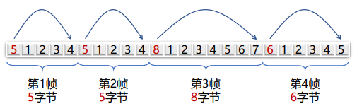

    如果出现一处错误，后续都会错误，因此实际中基本没有被使用。

* 带字节填充的定界符法：   
    定界符（FLAG）：一个特殊的字节，比如 01111110，即 0x7E，用于区分前后两个不同的帧
    
    {width="500"}

    * 发送方：检查有效载荷，进行字节填充 
        如果在数据中存在"FLAG"，需要在前面加一个转义字符，来进行区分。进而，如果数据中存在"ESC",则需要在前面再加一个转义字符

        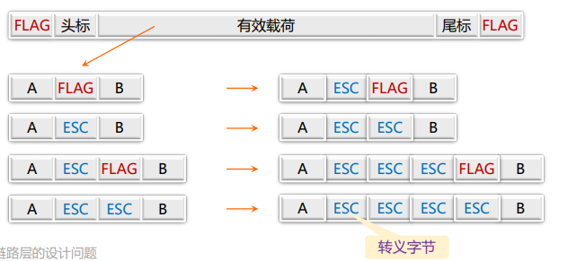{width="500"}

    * 接收方的处理：
        1. 逐个检查收到的每一个字节
        2. 收到ESC：则后一字节无条件成为有效载荷，不予检查
        3. 收到FLAG：则为帧的边界

    * 问题：有什么不足？    
        Overhead 较大，不是数据本身的内容占据的太多

* 带比特填充的定界符法：    
    定界符：两个0比特之间，连续6个1比特，即01111110，0x7E

    * 发送方：检查有效载荷   
        若在有效载荷中出现连续5个1比特，则直接插入1个0比特,意味着数据中不会出现连续6个1，即不会出现定界符   
        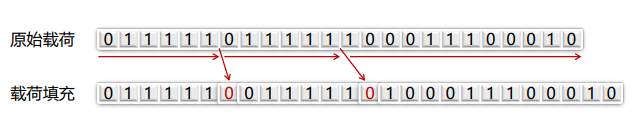
    
    * 接收方：若出现连续5个1比特    
        1. 若下一比特为0，则为有效载荷，直接丢弃0比特
        2. 若下一比特为1，则连同后一比特的0，构成定界符，一帧结束   
        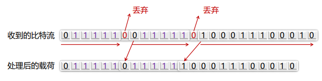

## 2.差错检测和纠正

### 2.1 前置概念
* 检错码（error-detecting code）
    1. 在被发送的数据块中，包含一些冗余信息，但这些信息只能使接收方推断是否发生错误，但不能推断哪位发生错误，接收方可以请求发送方重传数据
    2. 主要用在高可靠、误码率较低的信道上，例如光纤链路
    3. 偶尔发生的差错，可以通过重传解决差错问题

* 纠错码（error-correcting code）
    1. 发送方在每个数据块中加入足够的冗余信息，使得接收方能够判断接收到的数据是否有错，并能纠正错误（定位出错的位置）
    2. 主要用于错误发生比较频繁的信道上，如无线链路
    3. 也经常用于物理层，以及更高层（例如，实时流媒体应用和内容分发）
    4. 使用纠错码的技术通常称为前向纠错（FEC，Forward Error Correction）

* 码字 (code word)：一个包含m个数据位和r个校验位的n位单元
    * 描述为 (n, m) 码，n=m+r

* 码率 (code rate)：码字中不含冗余部分所占的比例，可以用m/n表示


* 海明距离 (Hamming distance)
    1. 两个码字的海明距离：两个码字之间不同对应比特的数目
          * 如果两个码字的海明距离为d，则需要d个单比特错就可以把一个码字转换成另一个码字
   
        >例：0000000000 与0000011111的海明距离为5

    2. 一种编码方案（code）的海明距离
        * 该编码方案中任意两个合法码字的最小海明距离

!!! tip "To detect d errors"
    need $d+1$ Hamming distance code    
    任意两个合法码字的最小海明距离为 $d+1$    
    因此一个码字错 $d$ 位无法变成另一个合法码字

!!! tip "To use Hamming distance to correct d errors"
    need $2d+1$ Hamming distance code   
    任意两个合法码字的最小海明距离为 $2d+1$ 
    纠错算法是找一个最近的，若一个码字偏出 $d$ 位，但它离另一个最近的合法码字的距离是 $d+1$，距离为 $2d+1$ 时因此能够纠正 $d$ 位的错误  

### 2.2 典型检错码

* 1位奇偶校验：增加1位校验位，可以检查<font color = "red">奇数位</font>错误
    1. 偶校验：保证1的个数为偶数个，例如：  
        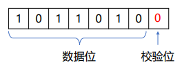
    2. 奇校验：保证1的个数为奇数个，例如：    
        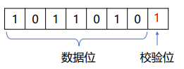

* 校验和：运气好的话可以检查出所有错误，运气不好时可能检测不出错误
    1. 发送方：进行 16 位二进制补码求和运算，计算结果取反，随数据一同发送
    2. 接收方：进行 16 位二进制补码求和运算（包含校验和），结果非全1，则检测到错误

    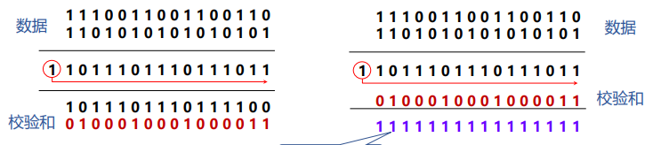{width="500"}  
    把多出来的 $1$ 加到最后

* 循环冗余校验CRC
    1. 设原始数据 $D$ 为k位二进制位模式
    2. 如果要产生 $n$ 位CRC校验码，事先选定一个 $n+1$ 位二进制位模式 $G$ (称为生成多项式，收发双方提前商定)， $G$ 的最高位为1
    3. 将原始数据 $D$ 乘以 $2^n$ （相当于在 $D $后面添加  $n$ 个0），产生 $k+n$ 位二进制位模式，用 $G$ 对该位模式做模2除，得到余数 $R$（ $n$ 位，不足 $n$ 位前面用0补齐）即为CRC校验码

    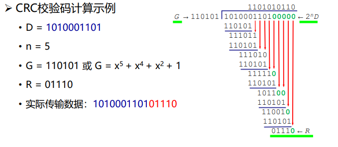{width="500"}      
    除法中的每两项做异或，相当于十进制中做减法（得到的商没什么用）        
    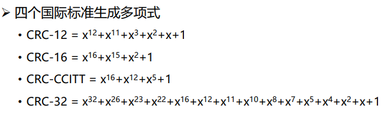{width="500"}


### 2.3 典型纠错码

* 设计纠错码
    1. 要求：m个信息位，r个校验位，纠正单比特错
    2. 对2m个有效信息中任何一个，有n个与其距离为1的无效码字：   
        可以考虑将该信息对应的合法码字的n位逐个取反，得到n个距离为1的非法码字，需要n+1个位模式来标识
    3. 因此有：$(n + 1) 2^m ≤ 2^n$
    4. 利用 $n = m + r$ ，得到 $(m + r + 1) ≤ 2^r$
    5. 在给定m的情况下，利用该式可以得出纠正单比特错误校验位数的下界


* 海明码：以奇偶校验为基础，如何找到出错位置，提供1位纠错能力

    !!! example "一个例子🌰"
        * 11比特的数据01011001101   
            1. 11比特数据按顺序放入数据位   
            2. 校验位：2的幂次方位（记为p1, p2, p4, p8）    
            3. 每个校验位对数据位的子集做校验，缩小定位错误的范围   
            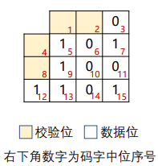{width="150"}       
            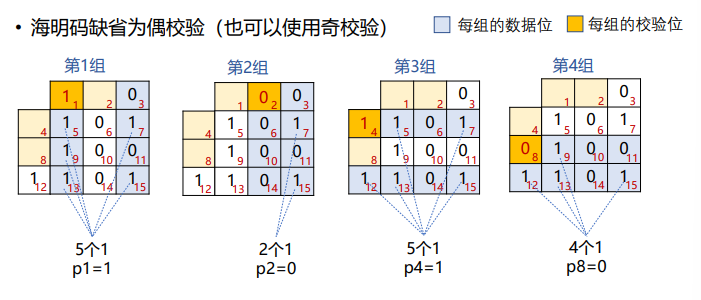{width="500"}

    <font color = "red">出错的位置编号正好是检验出错的组的位置编号之和</font>

    * 使用海明码纠正突发错误
        1. 可采用k个码字（n = m + r）组成 k × n 矩阵，<font color = "red">按列发送</font>，接收方恢复成 k × n 矩阵
        2. kr个校验位，km个数据位，可纠正最多为k个的突发性连续比特错误
        
        因为如果一个突发性错误长度是k位，则在k个码字中，至多只有一位受到影响，正好可用海明码纠错改位后恢复

* Reed-Solomon code（不要求）
* Convolutional Code    
    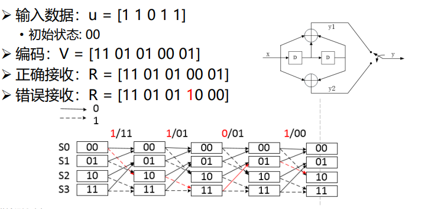{width="400"}


!!! example "思考题"
    给定接收数据: R = [00 10 01 01] 
    初始状态: 00   

    * 问：原始数据是多少  
    * 答：
        初始状态L：00   
        接收数据R第一个为：00，因此第一位为0    
        状态转移到L1：00    
        接收数据R第二个为：10，此时因为00状态只能得到00或者11的结果，因此发生了错误  

        (i)假设第二位为1     
        正确接收数据应该为11    
        状态转移到L2：10    
        接收数据R第三个为：01，因此第三位为1    
        状态转移到L3：01    
        接收数据R第四个为：01，因此第四位为0    

        (ii)假设第二位为0   
        正确接收数据应该为00    
        状态转移到L2：00    
        接收数据R第三个为：01，此时因为00状态只能得到00或者11的结果，因此又发生了错误，相比第一种错误更多，舍去 

        因此最终结果为 0110 ，且接收数据R第二个发生了错误，正确接收数据 R = [00 11 01 01] 

## 3. 基本的数据链路层协议

### 3.1 乌托邦式单工协议
* 假设
    1. 单工（Simplex）协议：数据单向传输
    2. 完美信道：帧不会丢失或受损
    3. 始终就绪：发送方/接收方的网络层始终处于就绪状态
    4. 瞬间完成：发送方/接收方能够生成/处理无穷多的数据
* 乌托邦：完美但不现实的协议
    1. 不处理任何流量控制或纠错工作
    2. 接近于无确认的无连接服务，必须依赖更高层次解决上述问题

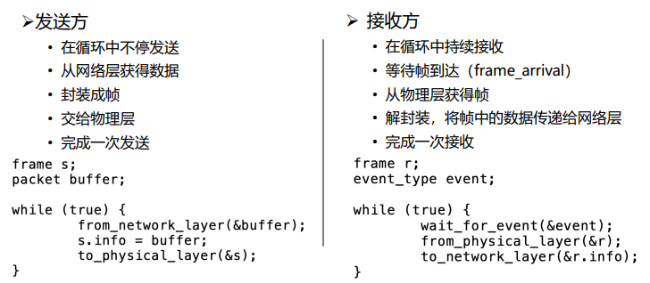
### 3.2 无错信道上的停等式协议
* 不再假设
    1. 接收方能够处理以无限高速进来的数据
    2. 发送方以高于接收方能处理到达帧的速度发送帧，导致接收方被“淹没”(overwhelming)
* 仍然假设
    1. 通信信道不会出错（Error-Free）
    2. 数据传输保持单向, 但是需要双向传输链路（半双工物理信道）


* 停-等式协议（stop-and-wait）:
    1. 发送方发送一帧后暂停，等待确认（Acknowldgement）到达后发送下一帧
    2. 接收方完成接收后，回复确认接收.
    3. 确认帧的内容是不重要的：哑帧（dummy frame）

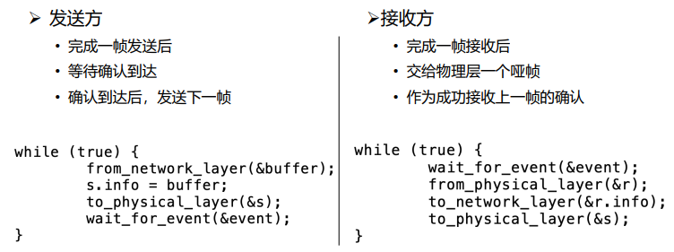

### 3.3 有错信道上的单工停等式协议
* 假设
    1. 通信信道可能会出错，导致：
        1. 帧在传输过程中可能会被损坏，接收方能够检测出来
        2. 帧在传输过程中可能会丢失永远不可能到达接收方
* 一个简单的解决方案
    1. 发送方增加一个计时器(timer)，如果经过一段时间没有收到确认，发送方将超时，于是再次发送该帧

* 考虑一个特别场景
    1. A发送帧A1
    2. B收到了A1
    3. B生成确认ACK
    4. ACK在传输中丢失
    5. A超时，重发A1
    6. B收到A1的另一个副本（并把它交给网络层）

* 其他的场景    
    另一个导致副本产生的场景是过长的延时 (long delay)

* 序号（SEQ：sequence number）:为了判断发送过来的是不是副本
    1. 接收方需要区分到达的帧是第一次发来的新帧
    2. 让发送方在发送的帧的头部放一个序号，接收方可以检查它所收到的帧序号，由此判断这是个新帧还是应该被丢弃的重复帧。
!!! question "序号所需要的最小位数（bits）"
    * 在这个协议中，唯一不明确的地方出现在当前帧（序号m）和它的直接后续帧（序号m+1）
    * 1 bit序号(0或1)就足以满足要求。

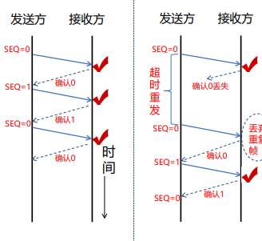{width="200"}

* 自动重复请求，或带有重传的肯定确认:
    1. ARQ(Automatic Repeat reQuest)
    2. PAR(Positive Acknowledgement with Retransmission)

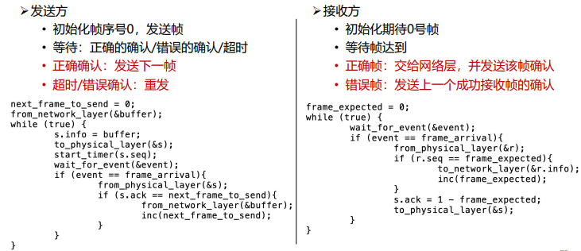

* 效率的评估
    1. 每帧发送时间 (Time to transmit a single frame) = F/R
    2. 总延迟 (Total Delay) = D =2I
    3. 停止等待协议的发送工作时间是F/C，空闲时间是D
    4. 当 F<D 时：信道利用率 (line utilization)=F/(F+R·D) < 50%

    >1. F = frame size (bits)   
    2. R = channel capacity (Bandwidth in bits/second)  
    3. I = propagation delay + processor service time (second)

!!! warning "问题"
    * 信道利用率很低：
        1. 每一帧的发送时间是 1毫秒 ( 1000 bits/(1,000,000 bits/sec)) . 由于传播延迟较长，发送者在541毫秒之后才能收到确认，信道利用率1/541
    * 一种提高效率的方法：使用更大的帧
        1. 可以使用更大的帧，但是帧的最大长度受到信道比特错误率（BER，BitError Ratio）的限制，帧越大，在传输中出错的概率越高，将导致更多的重传

## 4.滑动窗口协议

### 4.1 停等协议的性能问题
* 停止-等待机制降低了信道利用率
    1. 设数据速率记为R，帧长度记为F，往返延迟记为D，则采用停-等协议的线路效率为：F/(F+R·D)
    2. 假如将链路看成是一根管道，数据是管道中流动的水，那么在传输延迟较长的信道上，停-等协议无法使数据充满管道，因而信道利用率很低
* 解决办法      
    流水线协议或管道协议：允许发送方在没收到确认前连续发送多个帧

### 4.2 滑动窗口协议


* 目的:对可以连续发出的最多帧数（已发出但未确认的帧）作限制
* 序号使用:循环重复使用有限的帧序号
* 流量控制：接收窗口驱动发送窗口的转动
* 发送窗口：其大小记作 $W_T$ ，表示在收到对方确认的信息之前，可以连续发出的最多数据帧数
* 接收窗口：其大小记作 $W_R$ ，为可以连续接收的最多数据帧数
* 累计确认：不必对收到的分组逐个发送确认，而是对按序到达的最后一个
分组发送确认

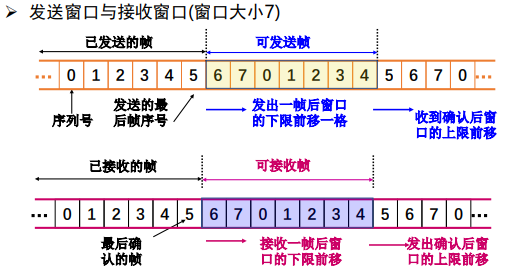{width="400"}

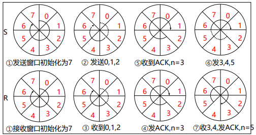{width="400"}

#### 协议的实现分析
* 发送方
    1. 初始化：ack_expected = frame_expected = next_frame_to_send = 0
    2. 从网络层接收分组，放入相应的缓冲区，构造帧，物理层发送，开启计时。
    3. 等待确认帧到达，从物理层接收一个帧，判断确认号是否正确，正确则停止计时器，并从网络层接收新分组。
    4. 发送新的帧，跳转至3
```c++
while(1){
    wait_for_event(&event);
    if(event==frame_arrival) {
        from_physical_layer(&r);
        if(r.ack==next_frame_to_send) {
            from_network_layer(&buffer);
            inc(next_frame_to_send);
            }
    }
    s.info=buffer;
    s.seq=next_frame_to_send;
    s.ack=1-frame_expected;
    to_physical_layer(&s);
    start_timer(s.seq);
}
```

* 接收方（ WT=WR=1，序号空间0和1）
    1. 初始化：ack_expected = frame_expected = next_frame_to_send = 0
    2. 等待帧到达，从物理层接收一个帧，校验和计算，并判断收到的帧序号是否正确，正确则交给网络层处理，期待帧号增加。
    3. 返回确认帧，跳转至2。
```c++
while(1){
    wait_for_event(&event);
    if(event==frame_arrival){
        from_physical_layer(&r);
        if(r.seq==frame_expected){
            to_network_layer(&r.info);
            inc(frame_expected);
        }
    }
    s.info=buffer;
    s.seq=next_frame_to_send;
    s.ack=1-frame_expected;
    to_physical_layer(&s);
    start_timer(s.seq);
}
```
### 4.3 回退N协议(GBN)
#### 协议设计思想
* 出错全部重发:
    1. 当接收端收到一个出错帧或乱序帧时，丢弃所有的后继帧，并且不为这些帧发送确认
    2. 发送端超时后，重传所有未被确认的帧
* 适用场景:该策略对应接收窗口为1的情况，即只能按顺序接收帧
* 优缺点
    1. 优点：连续发送提高了信道利用率
    2. 缺点：按序接收，出错后即便有正确帧到达也丢弃重传

#### 协议原理分析
* 基本原理  
    当发送方发送了N个帧后，若发现该N帧的前一个帧在计时器超时后仍未返回其确认信息，则该帧被判为出错或丢失，此时发送方就重新发送出错帧及其后的N帧

* 滑动窗口长度  
    出错全部重发时，若帧序号为 $n$ 位，接收窗口 $W_R=1$ ，发送窗口 $W_T ≤ 2^n－1$

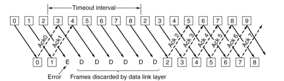


#### 协议的实现分析
* 实现要点  
    必须增加序号范围、发送方需要缓存多个分组
* 两个窗口
    1. 发送窗口：发送方维持一组连续允许发送的帧序号
    2. 接收窗口：接收方维持一组连续的允许接收帧序号
* 发送方必须响应的三件事
    1. 上层的调用：检测有没有可以使用的序号，如果有就发送
    2. 收到ACK：对n号帧的确认采用累积确认的方式
    3. 超时事件：如果出现超时，就重传所有已发送未确认的分组


!!! tip "发送方"
    1. 窗口尺寸：$1<W_T≤2^n-1$，最多连续发送窗口中的 $W_T$ 个PDU,否则会在同一个时间段中发出两个零号包。
    2. 窗口滑动：收到期望的ACK(k)：窗口底部移到PDU(k)，窗口顶部向前移动，始终保持窗口里有WT个PDU未确认。
    3. 窗口滑动后，发送新进入窗口的PDU
    4. 超时重发： 超过T未收到期望的ACK，重发窗口中的PDU（回退整个窗口）
    5. 超次数失败：超过最大重发次数Nmax仍无正确应答

!!! tip "接收方"
    1. 窗口尺寸：$W_R=1$
    2. 按序接收：按照PDU编号依序接收，出错、乱序PDU一律丢弃
    3. 确认含义：ACK(k)表示对k-1及以前各编号的PDU的确认，同时期望接收第k号PDU
    4. 确认策略：按序到达的PDU可立即确认，也可延迟确认(收到多帧后一起确认)，但出错或乱序的PDU，确认ACK(k)（期望接收k号PDU）或不应答

```c++
while(1) {
    wait_for_event(&event);
    switch(event){
        case network_layer_ready:
            from_network_layer(&buffer[next_frame_to_send]);
            nbuffered=nbuffered+1;
            send_data(next_frame_to_send, frame_expected, 
            buffer);
            inc(next_frame_to_send);
            break;
        case frame_arrival:
            from_physical_layer(&r);
            if(r.seq==frame_expected) {
            to_network_layer(&r.info);
            inc(frame_expected);
            }
            while(between(ack_expected, r.ack, net_frame_to_send)){
                nbuffered=nbuffered-1;
                stop_timer(ack_expected);
                inc(ack_expected);
            }
            break;
        case cksum_err: ；
            break;
        case timeout:
            next_frame_to_send=ack_expected;
            for(i=1; i<=nbuffered; i++){
                send_data(next_frame_to_send, frame_expected, buffer);
                inc(next_frame_to_send);
            }
    }
    if(nbuffered<MAX_SEQ) 
        enable_network_layer();
    else 
        disable_network_layer();
}
```

当信道误码率较大时，回退N协议不一定优于停止--等待协议。

### 4.4 选择重传协议
#### 协议原理分析
1. 在发送过程中，如果一个数据帧计时器超时，就认为该帧丢失或者被破坏；接收端只把出错的的帧丢弃，其后面的数据帧保存在缓存中，并向发送端回复NAK；发送端接收到NAK时，只重传出错的帧
2. 如果落在窗口内的帧从未接受过，那么存储起来，等比它序列号小的所有帧都正确接收后，按次序交付给网络层
3. 接收端收到的数据包的顺序可能和发送的数据包顺序不一样，因此在数据包里必须含有顺序号来帮助接收端进行排序。

#### 协议实现分析

!!! tip "发送方"
    1. 窗口尺寸：$1<W_T≤2^{n-1}$，最多连续发送窗口中的WT个PDU
    2. 窗口滑动：与回退N帧协议相同
    3. 选择重发：收到NAK (k)，重发PDU (k)
    4. 超时重发：超过T未收到期望的ACK，重发当前超时未应答的PDU
    5. 超次数失败：超过最大重发次数Nmax仍无正确应答，报告上层失败

!!! tip "接收方"
    1. 窗口尺寸：$1<W_R≤2^{n-1}$
    2. 窗口滑动：窗口底部数据上交，窗口向前滑动一步
    3. 窗口内接收：窗口内的PDU全部接收，存储出错的后续PDU，按序交付；窗口外的PDU一律丢弃
    4. 确认策略：按序到达的PDU可立即确认，也可延迟确认(收到多帧后一起确认)ACK (k)；出错用否定性确认NAK(k)（期望重发k号PDU）

1. 初始化。ack_expected = 0 (此时处于发送窗口的下沿)；next_frame_to_send = 0，frame_expected = 0（初始化正在发送的帧和期待的帧序号）；nbuffered = 0（进行发送窗口大小初始化）；
1. 等待事件发生（网络层准备好，帧到达，收到坏帧，超时，确认超时）。
2. 如果事件为网络层准备好，则执行以下步骤。从网络层接收一个分组，放入相应的缓冲区；发送窗口大小加1；使用缓冲区中的数据分组、next_frame_to_send和frame_expected构造帧，继续发送；next_frame_to_send加1；跳转（8）；
1. 如果事件为帧到达，则从物理层接收一个帧，则执行以下步骤。首先检查帧的kind域，若是数据包，再检查seq域，若不是期待接收的帧（seq ！= frame_expected）并且不是nak，则发送nak，否则开启定时器；如果seq落入接收窗口之内并且没有被接收，则接收帧，将帧中携带的分组交给网络层，frame_expected、too_far加1,开启确认定时器；若kind为nak则重新发送数据。最后检查帧的ack域，若ack落于发送窗口内，表明该序号及其之前所有序号的帧均已正确收到，因此终止这些帧的计时器，修改发送窗口大小及发送窗口下沿值将这些帧去掉，继续执行步骤（8）；
2. 如果事件是收到坏帧，如果no_nak为真，则发送nak帧，然后继续执行步骤（8）。
3. 如果事件是发送超时，即：next_frame_to_send = oldest_frame，则重发超时帧，然后继续执行步骤（8）。
4. 如果事件是确认超时，则重发超时的确认帧，然后继续执行步（8）。
5. 若发送窗口大小小于所允许的最大值（MAX_SEQ），则可继续向网络层发送，否则则暂停继续向网络层发送，同时返回互步骤（2）等待


!!! tip "总结"
    停止--等待协议：发送窗口 $W_T=1$ , 接收窗口 $W_R=1$     
    回退N协议：发送窗口 $W_T>1$ , 接收窗口 $W_R = 1$        
    选择重传协议：发送窗口 $W_T>1$ , 接收窗口  $W_R>1$      
    若采用 $n$ 比特对帧编号，则后两种滑动窗口协议还需满足 $W_T+W_R≤2^n$

## 5.数据链路协议实例
### 5.1 点到点链路层协议PPP
PPP 协议只能检错不能纠错

* 实现的功能：
    1. 利用帧定界符封装成帧
    2. 填充技术实现透明数据传输：字节填充、零比特填充
    3. 帧的差错检测
    4. 实时监测链路工作状态
    5. 设置链路最大传输单元（MTU）
    6. 网络层地址协商机制
    7. 数据压缩协商机制

* 未实现的功能：
    1. 帧数据的纠错功能 
        数据链路层的PPP协议只进行检错，PPP协议是不可靠传输协议
    2. 流量控制功能 
        PPP协议未实现点到点的流量控制
    3. 可靠传输功能 
        PPP为不可靠协议，不使用帧的序号。不可靠网络中可能使用有序号的工作方式。
    4. 多点连接功能 
        PPP协议不支持多点线路，只支持点对点的链路通信。
    5. 单工和半双工链路 
        PPP协议支持全双工链路

* PPP协议中的透明传输
    1. 当 PPP 用在异步传输时，使用一种特殊的字符填充法
    2. 当 PPP 用在同步传输链路时，协议规定采用硬件来完成比特填充（与 HDLC 的做法类似）

* 字节填充（异步传输时采用）
    1. 避免在信息字段中出现和标志字段一样的比特组合（0X7E）
    2. 当PPP使用异步传输时，定义转义字符0X7D，并使用字节填充
        1. 将信息字段中出现的0x7E 字节转变成为2字节序列(0x7D, 0x5E)
        2. 若信息字段中出现一个0x7D 字节, 则将其转变成为2字节序列(0x7D, 0x5D)

* 比特填充（同步传输时采用）
    1. 信息字段中出现了和标志字段 F 完全一样的 8 比特组合
    2. 发送端在 5 个连 1  之后填入 0 比特再发送出去
    3. 在接收端把 5 个连 1 之后的 0 比特删除

### 5.2 PPPoE
Ethernet优点：原理简单，应用非常广，设备成本低  
Ethernet缺点：安全性较低、不宜管理（使用广播信道，造成了安全性较低，无认证功能）    

* PPP优点：
    1. 原理简单
    2. 安全性高：点对点信道，提供认证机制
    3. 提供良好的访问控制和计费功能

* PPPoE（Point-to-Point Protocol over Ethernet）
    1. 提供在以太网链路上的PPP连接
    2. 实现了传统以太网不能提供的身份验证、加密，以及压缩等功能
    3. 实现基于用户的访问控制、计费、业务类型分类等，运营商广泛支持
    4. PPPoE使用Client/Server模型，服务器通常是接入服务器

    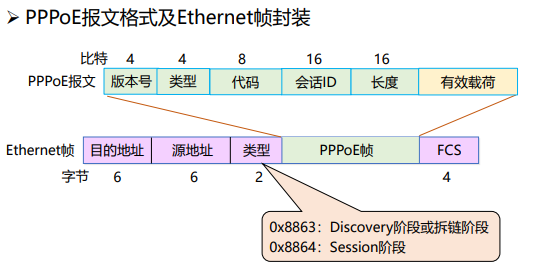{width="450"}