---

title: Chap 4 | 介质访问子层

hide:
  #  - navigation # 显示右
  #  - toc #显示左
  #  - footer
  #  - feedback  
comments: true  #默认不开启评论

---
<h1 id="欢迎">Chap 4 | 介质访问子层</h1>
!!! note "章节启示录"
    <!-- === "Tab 1" -->
        <!-- Markdown **content**. -->
    <!-- === "Tab 2"
        More Markdown **content**. -->
    本章节是计算机网络的第四章。有些内容可能不重要，后续应该会标注。注意，介质访问子层的结构位于数据链路层之下！！！
    这章内容好混乱qwq

## 1.信道分配问题

### 静态分配的性能分析
* 子信道的平均延迟：信道N等分后每个子信道的平均延迟时间：
    $T_{FDM}=NT$

## 2.多路访问协议
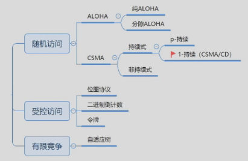
### 2.1 随机访问协议

* 特点：冲突不可避免

#### ALOHA协议
* 原理：想发就发

* 定义：帧时：发送一个标准长的帧所需的时间
* 服从泊松分布
    1. 一个帧时内用户产生新帧：均值 $N$ 个
    2. 一个帧时内信道中产生的帧（包括重传）：均值 $G$ 个

* 分析：
    1. $0<N<1$，轻载N接近0，重载N接近1
    2. $G>=N$，轻载 $G=N$ （无冲突）， 重载 $G>N$ （冲突/重传）

* 概率：    
    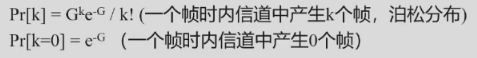

* 性能分析：
    1. 吞吐量 $S$ ： $S=1$ 时分组一个接一个地发送出去，帧之间没有空隙。一般用 $S$ 接近于1的程度来衡量信道的利用率
    2. 运载负载 $G$ ,又称网络负载
    3. $P_0$ ：是一帧发送成功的概率，就是发送成功的分组再已发送分组的总数中所占的比例： $S=G * P_0$

!!! question "如何计算传输成功的概率 $P_0$"
    * 单向传播延迟Delay: $D$
    * 冲突危险期：$2D$
        1. 生成帧均值：$2G$
        2. 不遭受冲突的概率 $P_0 = e^{-2G}$

!!! warning "P[0] 和 $P_0$ 完全不同"

??? question "性能计算？"
    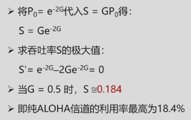

* 分隙ALOHA工作原理：
    1. 帧的发送必须在时隙的起点
    2. 冲突只发生在时隙的起点

    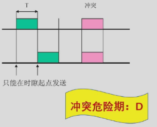

??? question "性能计算？"
    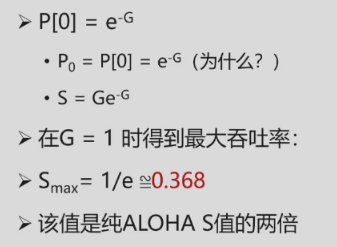

#### CSMA
* 特点：“先听后发”

非持续式CSMA

* 特点
    1. 经侦听，如果介质空闲，开始发送
    2. 如果介质忙，则等待一个随机分布的时间，然后重复步骤1

* 好处：等待一个随机时间可以减少再次碰撞冲突的可能性

* 缺点：等待时间内介质上如果没有数据传送，这段时间是浪费的

持续式（指1-持续式）CSMA

* 特点
    1. 经侦听，如介质空闲，则发送
    2. 如介质忙，持续侦听，一旦空闲立即发送
    3. 如果发生冲突，等待一个随机分布的时间再重复步骤1
* 好处：持续式的延迟时间要少于非持续式
* 主要问题：如果两个以上的站等待发送，一旦介质空闲就一定会发生冲突

p-持续式CSMA

* 特点
    1. 经侦听，如介质空闲，那么以 p的概率 发送，以(1–p)的概率延迟一个时间单元发送
    2. 如介质忙，持续侦听，一旦空闲重复①
    3. 如果发送已推迟一个时间单元，再重复步骤1
* 注意：1-持续式是p-持续式的特例

!!! question "先听再发，避免了冲突吗？"
    CSMA：如侦听到介质上无数据发送才发送，发送后还会发生冲突吗？

    * 肯定会！
    * 两种情形: 
        1. 同时传送
        2. 传播延迟时间

        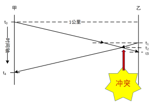

* 冲突窗口：即发送站发出帧后能检测到冲突（碰撞）的最长时间。        
    数值上：等于最远两站传播时间的两倍，即2D（D是单边延迟）

CSMA/CD （1-持续）

* 原理：“先听后发、边发边听”
* 过程
    1. 经侦听，如介质空闲，则发送。
    2. 如介质忙，持续侦听，一旦空闲立即发送。
    3. 如果发生冲突，等待一个随机分布的时间再重复步骤1

!!! question "边发边听：是否发生了冲突？"
    * 一旦冲突，发送Jam（强化）信号
        1. t4时刻：甲检测到冲突，发送Jam
        2. t3时刻：乙检测到冲突，是否发送？

    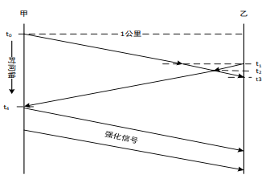

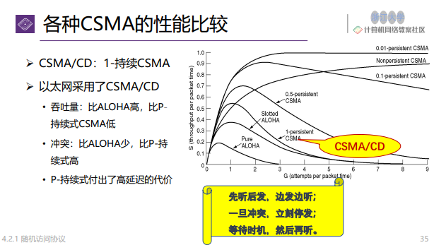{width="500"}

* 二进制指数后退( Binary exponential backoff )：
    1. 确定基本退避时间槽，其长度为以太介质上往返传播时间(2𝜏) ，以太网中设为512比特时间
    2. 定义重传次数k，k ≤10，即 
        k = min[ 重传次数, 10 ]
    3. 从整数集合[0,1,…, (2k −1)]中随机地取出一个数，记为r ；
    4. 重传所需的时延就是 r 倍的时间槽2𝜏；
    5. 当重传达 16 次仍不能成功时即丢弃该帧，并向高层报告。

* 性能：    
    传送一帧平均需要P秒，某个站获得信道的概率为A，2𝜏为时间槽。  
    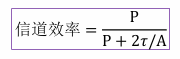

    P=F/B，F为帧长，B为带宽；L为电缆长度，c为信号传播速度；假设每帧e个竞争时间槽。
    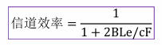
### 2.2 受控访问协议

* 特点：克服了冲突

#### 位图协议
* 竞争期：在自己的时槽内发送竞争比特
    1. 举手示意
    2. 资源预留
* 传输期：按序发送
    1. 明确的使用权，避免了冲突

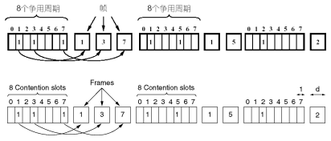

* 信道利用率分析:
    1. 假设：有N个用户，需N个时隙，每帧d比特
    2. 信道利用率：
        1. 在低负荷条件下：d/(d+N) （N越大，站点越多，利用率越低）
        2. 在高负荷条件下：d/(d+1)，接近100%
    3. 缺点：位图协议无法考虑优先级

#### 令牌传递：（不太重要）
1. 令牌：发送权限
2. 令牌的运行：发送工作站去抓取，获得发送权
    除了环，令牌也可以运行在其它拓扑上，如令牌总线
3. 发送的帧需要目的站或发送站将其从共享信道上去除；防止无限循环
4. 缺点：令牌的维护代价

#### 二进制倒计数协议
* 站点：编序号，序号长度相同
* 竞争期：有数据发送的站点从高序号到低序号排队，高者得到发送权
* 特点：高序号站点优先

* 信道效率分析
    1. N个站的二进制编码所需位数是 $log_2N$ 位
    2. 信道的利用率为：d/(d+log2N) （低负载时）
    3. 如果规定每个帧的帧头为发送地址，即竞争的同时也在发送。则效率为100%

### 2.3 有限竞争协议

* 特点：利用上述二者的优势

低负荷时用随机访问（想发就发），高负荷时用受控访问（需要竞争）
#### 自适应树搜索协议
1. 在一次成功传输后的第一个竞争时隙，所有站点同时竞争。
2. 如果只有一个站点申请，则获得信道。
3. 否则在下一竞争时隙，有一半站点参与竞争（递归），下一时隙由另一半站点参与竞争
4. 即所有站点构成一棵完全二叉树

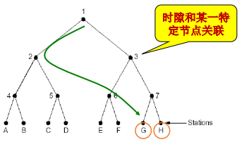

## 3.以太网

### 3.1 经典以太网

硬件地址又称为物理地址，或 MAC 地址 

MAC地址长6字节，一般用由连字符（或冒号）分隔的12个十六进制表示，例如02-60-8c-e4-b1-21。高24位为厂商代码，低24位为厂商自行分配的适配器序列号。   

当路由器通过适配器连接到局域网时，适配器上的MAC地址就用来标志路由器的某个接口，路由器若同时连接到两个网络上，则它需要两个适配器和两个MAC地址。

* 经典以太网的物理层：
    1. 最高速率10Mbps  
    2. 使用曼彻斯特编码    
    3. 使用同轴电缆和中继器连接    

* MAC子层协议：
    1. 主机运行CSMA/CD协议
        使用CSMA/CD的经典以太网检测到冲突后，会立即中止传输，并发出一个短冲突加强信号，在等待一段随机时间后重发。     

        !!! tip "二进制指数后退( Binary exponential backoff )的CSMA/CD"
            1. 确定基本退避时间槽，其长度为以太介质上往返传播时间(2𝜏) ，以太网中设为512比特时间
            2. 定义重传次数k，k ≤10，即 
                k = min[ 重传次数, 10 ]
            3. 从整数集合[0,1,…, (2k −1)]中随机地取出一个数，记为r；
            4. 重传所需的时延就是r倍的时间槽2𝜏；
            5. 当重传达16次仍不能成功时即丢弃该帧，并向高层报告。
   
    2. 常用的以太网MAC帧格式有两种标准：
        1. DIX Ethernet V2 标准（最常用的）
        2. IEEE 的 802.3 标准   
   
        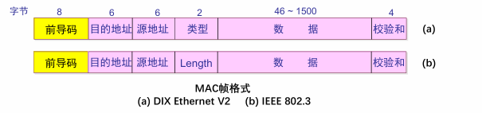{width="450"}     

        * 数据字段：46 ~ 1500字节
            1. 最小帧长= 46+18 = 64B
            2. 最大帧长= 1500+18 = 1518B （MTU：1500B）
        * 校验和
            1. FCS, Frame Check Sequence
            2. 使用CRC32计算除了校验和以外的其他字段

物理地址（实际上讲的是MAC地址）在数据链路层

以太网规定最短有效帧长为64 字节，凡长度小于64 字节的帧都是由于冲突而异常中止的无效帧。      
如果发生冲突，就一定是在发送的前64 字节之内。由于一检测到冲突就立即中止发送，这时已经发送出去的数据一定小于64 字节。    

### 3.2 以太网性能

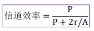  
传送一帧平均需要P秒，某个站获得信道的概率为A，2𝜏为时间槽。  
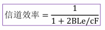  
P=F/B，F为帧长，B为带宽；L为电缆长度，c为信号传播速度；假设每帧e个竞争时间槽

* 增加带宽或距离会降低网络效率。

### 3.3 交换式以太网：
1. 集线器（HUB）:用集线器组成更大的局域网都在一个冲突域中
2. 交换机（Switch）：检查 MAC 帧的目的地址对收到的帧进行转发，不在一个冲突域中
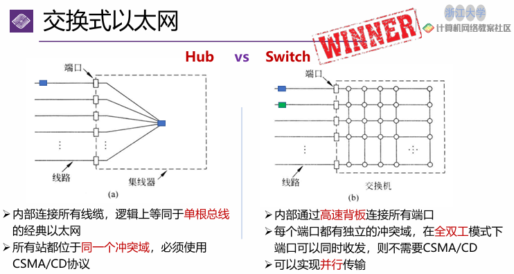{width="500"}

### 3.4 以太网的类型

* 快速以太网（百兆以太网）：
    1. 带宽10Mbps -> 100Mbps
    2. 比特时间100ns -> 10ns
    3. 保留原来的工作方式（帧格式、接口、过程规则）

* 千兆以太网：
    1. 100Mbps -> 1000Mbps（1Gbps） 
    2. 保留原来的工作方式（帧格式、接口、过程规则）
    3. 全双工和半双工两种方式工作。
        1. 在半双工方式下使用CSMA/CD （为了向后兼容），增加载波扩充和帧突发
        2. 全双工方式不需要使用CSMA/CD（缺省方式）

* 万兆以太网：
    1. 1Gbps -> 10Gbps
    2. 只支持全双工，不再使用CSMA/CD
    3. 保持兼容性

* 40G-100G以太网"
    1. 10Gbps -> 40Gbps & 100Gbps
    2. 只支持全双工
    3. 保留以太网帧格式和MAC方法
    4. 保留当前802.3标准的最小帧和最大帧大小
    5. 联网设备可以通过可插拔模块支持不同的物理层类型

## 4.数据链路层交换
* 问题：如何让三个独立的冲突域实现互联互通？  
    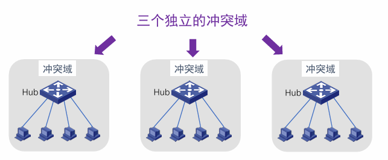{width="400"}   

* 解决：
    1. 物理层设备扩充网络   
        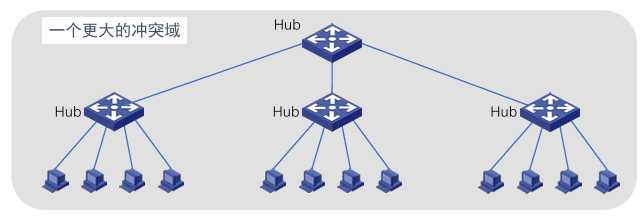{width="400"}
    2. 数据链路层设备扩充网络       
        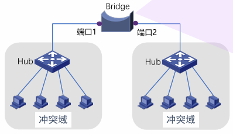{width="300"}

### 4.1 数据链路层交换原理

* 理想的网桥是透明的：
    1. 即插即用，无需任何配置
    2. 网络中的站点无需感知网桥的存在与否

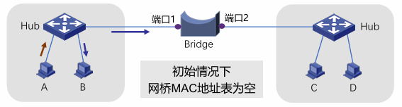   
如何让交换机知道A/B/C/D的存在？  

从A发送数据帧，集线器会把数据帧发送给所有与之联通的线路，也就是同时发到B和交换机，之后交换机收到了来自于A的帧（目的地是B），因此交换机知道了A的存在（虽然这时候它还不知道B是哪里），未来如果别人要发送给A，则通过端口1进行发送。

从A再次发送数据帧，网桥发现MAC_A已在表中！更新该表项的帧达到时间，重置老化时间。

全部学习后得到以下的这张表：    
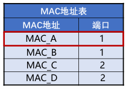   

* MAC地址表的构建
    1. 增加表项：帧的源地址对应的项不在表中
    2. 删除表项：老化时间到期
    3. 更新表项：帧的源地址在表中，更新时间戳

* Forwarding（转发）

* Filtering（过滤）：找到匹配项！入境口=出境口，丢弃！

* Flooding（泛洪）：找不到匹配表项！从所有端口（除了入境口）发送出去
    1. 广播帧：目的地址为FF-FF-FF-FF-FF-FF的数据帧
    2. 未知单播帧：目的地址不在MAC地址转发表中的单播数据帧

### 4.2 链路层交换机

* 交换方式：从带宽的角度
    1. 对称交换：出和入的带宽相同

        >例如：交换机上全为1000Mb/s速率端口

    2. 非对称交换：出和入的带宽不同

        >例如：交换机上有100Mb/s、1000Mb/s等多种速率端口

* 交换方式：从转发时机的角度
    1. 存储转发模式（Store and Forward）
        1. 特点：转发前必须接收整个帧、执行CRC校验
        2. 缺点：延迟大
        3. 优点：不转发出错帧、支持非对称交换
    2. 直通模式（Cut-through）
        1. 特点：一旦接收到帧的目的地址，就开始转发
        2. 缺点：可能转发错误帧、不支持非对称交换
        3. 优点：延迟非常小，可以边入边出
    3. 无碎片模式（Fragment-free）
        1. 特点：接收到帧的前64字节，即开始转发（小于64字节的帧一定是发生冲突的，即碎片帧）
        2. 缺点：仍可能转发错误帧，不支持非对称交换
        3. 优点：过滤了冲突碎片，延迟和转发错帧介于存储转发和直通交换之间
   
### 4.3 生成树协议（STP）
可靠传输：冗余拓扑  
付出的代价：导致物理环路    

* 物理环路引发的问题：
    1. 广播风暴
    2. 重复帧
    3. MAC地址表不稳定

* 怎么得到一棵无环的生成树呢？
    1. 参与的交换机（网桥）：收发桥协议数据单元BPDU
    2. 选举产生根桥、根端口、指定端口，形成生成树

* 桥协议数据单元BPDU包含的四个关键信息
    1. 根桥ID（Root ID）: 被选为根的桥ID。  
        桥ID共8字节，由2字节的优先级和6字节的MAC地址组成的。    
    2. 根路径开销（Root Path Cost）: 到根桥的最小路径开销。
    3. 指定桥ID（Designated Bridge ID）: 生成和转发BPDU的桥ID
    4. 指定端口ID（Designated Port ID）: 发送BPDU的端口ID。

* 生成树的三个选举过程
    1. 选举根桥(Root Bridge) 。
    2. 为每个非根桥选出一个根端口（Root Port）。
    3. 为每个网段确定一个指定端口（Designated Port）。
   
* 选举根桥
    1. 同一广播域中的所有交换机均参与选举；
    2. 桥ID最小的交换机（网桥）成为生成树的根；
    3. 在给定广播域内只有一个根桥，其它均为非根桥。
    4. 根桥的所有端口都处在转发状态。   
    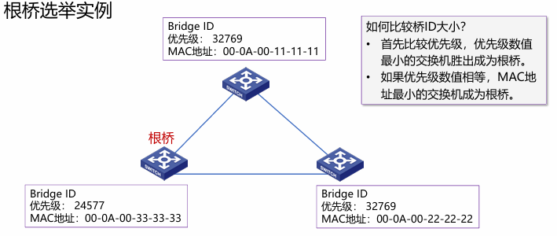{width="450"}

* 为每个非根桥选出一个根端口
    1. 每个非根桥，通过比较其每个端口到根桥的根路径开销，选出根端口；
    2. 具有最小根路径开销的端口被选作根端口；
    3. 如果多个端口的根路径开销相同，则端口ID最小的端口被选作根端口；
    4. 非根桥只能有一个根端口，根端口处于转发状态。
    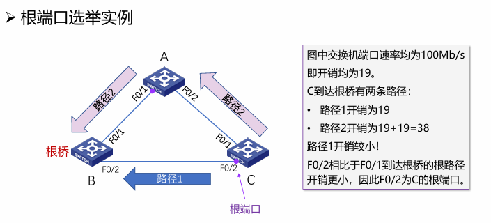{width="450"}

??? question "什么是根路径开销？"
    * 根桥的根路径开销为0
    * 非根桥的根路径开销为到根桥的路径上所有端口（链路）开销之和。
    * 端口（链路）开销值由IEEE定义（如下表），也可通过手工配置改变。
    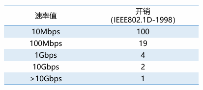

* 为每个网段确定一个指定端口
    1. 对于每一个网段，在所有连接到它的交换机（网桥）端口中进行选择；
    2. 一个具有最小根路径开销的端口，作为该网段的指定端口；
    3. 指定端口处于转发状态，负责该网段的数据转发；
    4. 连接该网段的其他端口，若既不是指定端口，也不是根端口，则阻塞。
    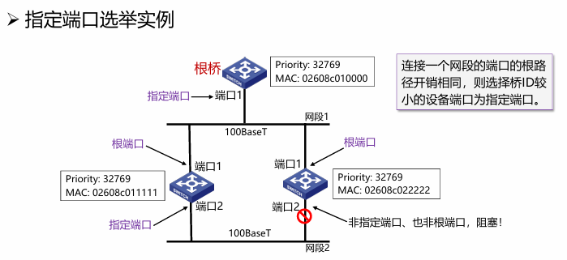{width="450"}

??? question "一个小判断题"
    根桥的所有连接端口都是指定端口？对。

* 生成树的某“枝”断掉了，怎么办？当由交换机（网桥）或链路故障导致网络拓扑改变时，重新构造生成树。

* 重新构建生成树太慢了，怎么办？使用快速生成树协议（Rapid Spanning Tree Protocol, RSTP）

* RSTP的改进（不要求）    
    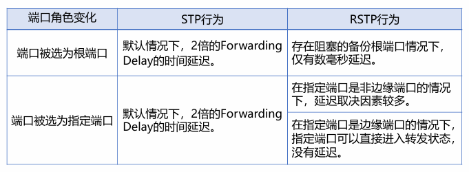{width="450"}   
    “边缘端口”是指那些直接和终端设备相连，不再连接任何交换机的端口。不能阻塞！

### 4.4 虚拟局域网
* 广播域（Broadcasting Domain）
    1. 广播域是广播帧能够到达的范围；
    2. 缺省情况下，交换机所有端口同属于一个广播域，无法隔离广播域；
    3. 广播帧在广播域中传播，占用资源，降低性能，且具有安全隐患
   
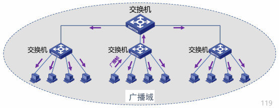{width="450"}       
12个冲突域（一个发其他的都能收到的才可以合并为一个冲突域）

VLAN是一个在物理网络上根据用途，工作组、应用等来逻辑划分的局域网络，与用户的物理位置没有关系。

不同VLAN的成员，不能直接进行二层通信。（可以在三层网络层及以上的层次可以通信）

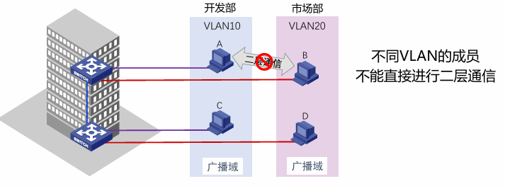{width="450"}

* VLAN类型
    1. 基于端口的VLAN（最常见）
    2. 基于MAC地址的VLAN 
    3. 基于协议的VLAN
    4. 基于子网的VLAN

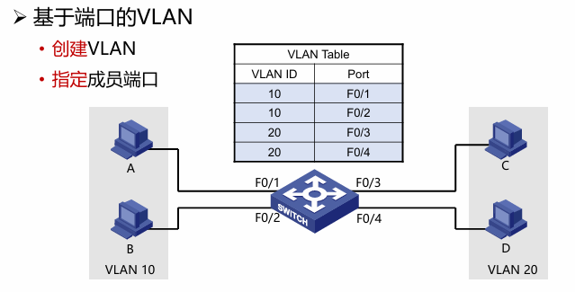{width="450"}      
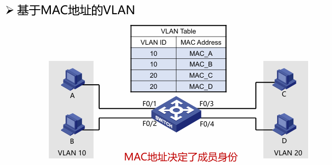{width="450"}      
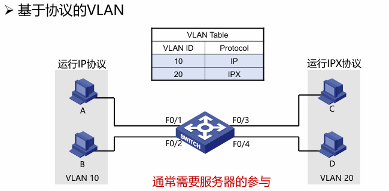{width="450"}      
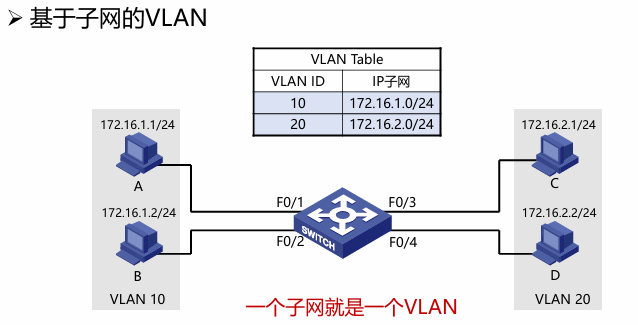{width="450"}   

* 如何区分不同VLAN的数据帧？
    1. 在数据帧中携带VLAN标记；
    2. VLAN 标记由交换机添加/剥除，对终端站点透明；

* 帧标记标准：IEEE802.1Q
    1. 带VLAN标记的帧称为标记帧（Tagged Frame）
    2. 不携带VLAN标记的普通以太网帧称为无标记帧（Untagged Frame）

    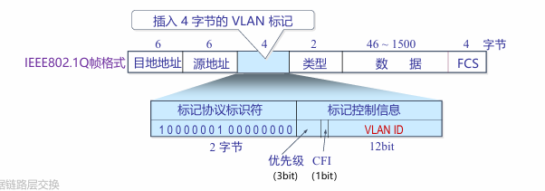{width="450"}     
    VLAN标签的前两个字节总是置0x8100，表示这是一个802.1Q帧。在VLAN标签的后两个字节中，前四位没什么用，后12位是该VLAN的标识符VID，它唯一地标识该802.1Q帧属于哪个VLAN。12位地VID可识别4096个不同地VLAN。

* 端口类型：
    1. Access链路类型端口：
        1.  一般用于连接用户设备（无需识别802.1Q帧的设备）；
        2. 如何采用基于端口的VLAN划分,Access端口只能加入一个VLAN；
        3. 一旦Access端口加入了特定的VLAN，连接在该端口的设备被视为属于该VLAN。
    2. Trunk链路类型端口与Trunk链路
        1. Trunk端口一般用于交换机之间连接；
        2. 干道链路允许多个VLAN的流量通过。

* VLAN优点
    1. 有效控制广播域范围
    2. 增强网络的安全性
    3. 灵活构建虚拟工作组
    4. 提高网络的可管理性

## 5.无线局域网

无限局域网指以无线信道作为传输介质的计算机局域网。

### 5.1 无线局域网组网模式
(大概知道原理即可)
* 基础架构模式
    1. 分布式系统（DS）
    2. 访问点（AP）
    3. 站点（STA）
    4. 基本服务集（BSS）
    5. 扩展服务集（ESS）
    6. 站点之间通信通过AP转发

* 自组织模式（Ad hoc）
    1. 站点（STA）
    2. 独立基本服务集（IBSS）
    3. 站点之间直接通信
    4. 共享同一无线信道

### 5.2 IEEE 802.11物理层
* 频段：2.4GHz、5GHz（ISM频段，无需授权；限制发送功率，例如：≤1瓦）
* 调制技术：DPSK → QPSK → CCK → 64-QAM → 256-QAM → 1024-QAM
* 直接序列扩频（DSSS）→ 正交频分多路复用（OFDM）→正交频分多址（OFDMA）
* 单天线→ 单用户多入多出（SU-MIMO）→ 多用户多入多出（MU-MIMO）
* 目标：提升传输速率、增强可靠性、支持高密度接入

### 5.3 IEEE 802.11介质访问控制
能否直接将CSMA/CD用于无线局域网？   
存在以下问题：  

* 冲突检测困难
    1. 在接收端，发送功率和接收功率相差太大
    2. 站点在发送时关闭接收功能，无法在发送时同时检测冲突
* 在同一BSS中，不是所有站点都能互相感知到对方发送的信号
    1. 载波侦听失败，但在接收站点处发生冲突
    2. 被称为隐藏终端问题
* 暴露终端问题，降低网络的吞吐量
* 信号衰落随时间发生变化，使问题变得更加复杂

* CSMA/CA:先听后发
    1. 当信道空闲时间大于IFS（帧间隙），立即传输
    2. 当信道忙时，延迟直到当前传输结束+IFS时间
    3. 开始随机退后过程
        1. 从（0，CWindow）中选择一个随机数作为退后计数器（backoff counter）
        2. 通过侦听确定每个时间槽是否活动
        3. 如果没有活动，则减少退后时间
    4. 退后过程中如果信道忙，则挂起退后过程（解决站点之间的公平问题）
    5. 在当前帧传输结束后恢复退后过程

* 差错检测与确认重传
    1. 差错检测：32位CRC校验（与以太网相同）
    2. 采用停等机制：发送数据，等待确认，超时重传（重传定时器）
    3. 如果达到最大重传限制，该帧被丢弃，并告知上层协议

    !!! question "采用停等机制的原因？为什么不采用流水线机制？"
        停等协议在卫星通信时非常低效    
        因为通信距离非常远，延迟大，网络速度高，效率低  
        但Wifi范围小（局域网），距离短，使用stop-wait效率高。（水管中的水往往能塞满）

* 不同帧间隙控制优先级（只需要知道使用不同帧间隙，来实现不同帧的优先级控制）      
    1. SIFS（Short IFS）：最高优先级，用于Ack, CTS, 轮询响应等
    2. PIFS（PCF IFS）：中等优先级（SIFS+1槽口时间），轮询服务
    3. DIFS（DCF  IFS）：最低优先级（SIFS+2槽口时间），异步数据服务

* RTS-CTS机制（可选机制）
    目的：通过信道预约，避免长帧冲突
    1. 发送端发送RTS（request to send）
    2. 接收端回送CTS（clear to send）

    3. RTS和CTS中的持续时间（Duration）中指明传输所需时间（数据+控制）
    4. 其他相关站点能够收到RTS或（和）CTS，维护NAV

    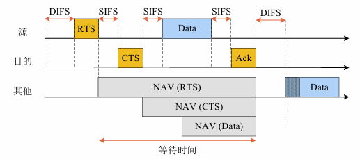{width="450"}

* 如何应对无线链路较高的出错率？
    1. 解决方法：采用较小的帧（将用户数据帧分段的机制对用户透明）
    2. $F_i$ 帧中携带 $F_{i+1}$ 的传输时间

### 5.4 IEEE 802.11帧格式
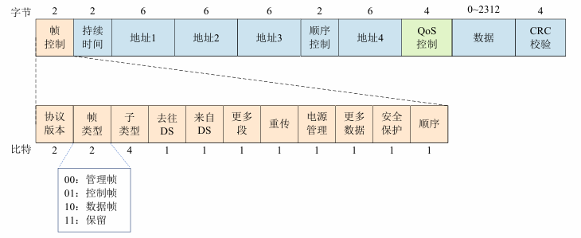{width="550"}      

* 帧控制：具有多种用途（关联请求、响应，探测请求、响应，解除关联，信标帧，认证，解除认证等）    
* 持续时间：下一个要发送帧可能持续的时间（NAV）或关联ID（AID） 
* 地址1~地址4：每个地址的含义基于“去往DS”和“来自DS”域段确定    
* 顺序控制：过滤掉重复帧，或用于分片组合   
* QoS控制域段：存放数据流的QoS信息（802.11e中扩展）    
* 数据：包含任意长度的数据（0-2312字节）   
* CRC校验：802.11采用4个字节的校验码   

### 5.5 无线局域网的构建与管理
通过AP接入有线网络（互联网络）  

* 关键：如何关联到AP？
    1. BSSID：AP的MAC地址，标识AP管理的基本服务集
    2. SSID：32字节网名，标识一个扩展服务集（ESS），包含一个或多个基本服务集

* 关联到AP的三个阶段
    1. 扫描（Scan）
        1. 被动扫描：AP周期性发送Beacon帧，站点在每个可用的通道上扫描Beacon帧
        2. 主动扫描：站点依次在每个可用的通道上发出包含SSID的Probe Request 帧，具有被请求SSID的AP返回Probe Response帧
    2. 认证（Authentication）：当站点找到与其有相同SSID 的AP，在SSID 匹配的AP 中，根据收到的AP 信号强度，选择一个信号最强的AP，然后进入认证阶段
    3. 关联（Association）：AP维护站点关联表，并记录站点的能力