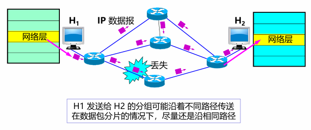
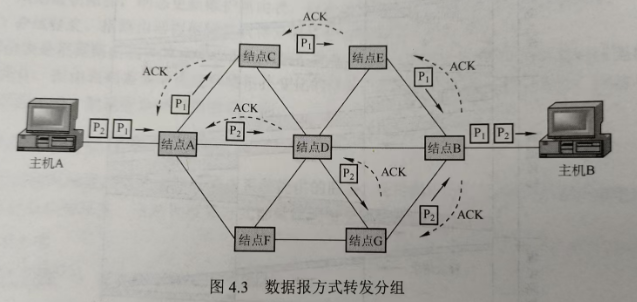
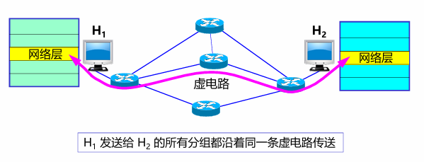
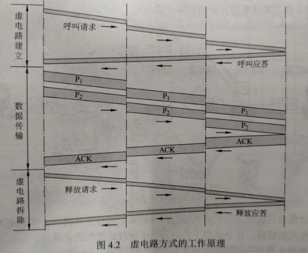
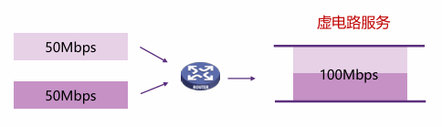
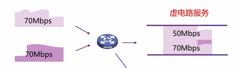
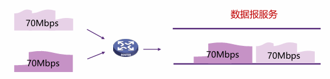
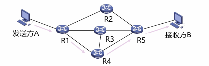

---

title: Chap 5 | 网络层

hide:
  #  - navigation # 显示右
  #  - toc #显示左
  #  - footer
  #  - feedback  
comments: true  #默认不开启评论

---
<h1 id="欢迎">Chap 5 | 网络层</h1>
!!! note "章节启示录"
    <!-- === "Tab 1" -->
        <!-- Markdown **content**. -->
    <!-- === "Tab 2"
        More Markdown **content**. -->
    本章节是计算机网络的第五章。有些内容可能不重要，后续应该会标注。

## 1.网络层服务
### 1.1 网络层服务概述
网络层提供主机到主机的通信服务，主要任务是将分组从源主机经过多个网络和多段链路传输到目的主机。

* 发送端：将传输层数据单元封装在数据包中
* 接收端：解析接收的数据包中，取出传输层数据单元，交付给传输层
* 路由器：检查数据包首部，转发数据包

* 网络层关键功能：
    1. 路由（控制面）
        1. 选择数据报从源端到目的端的路径
        2. 核心：路由算法与协议
    2. 转发（数据面）
        1. 将数据报从路由器的输入接口传送到正确的输出接口
### 1.2 无连接服务的实现（TCP/IP体系）
* 数据报：无连接的方法。网络在发送分组前不需要先建立连接。

* 数据报服务
    1. 网络层向上只提供简单灵活无连接的、尽最大努力交付的数据报服务
    2. 发送分组时不需要先建立连接，每个分组独立发送
    3. 数据报独立转发，相同源-目的的数据报可能经过不同的路径
    4. 网络层不提供服务质量的承诺
* 尽力而为交付
    1. 传输网络不提供端到端的可靠传输服务：丢包、乱序、错误
    2. 优点：网络的造价大大降低，运行方式灵活，能够适应多种应用

{width="400"}

* 服务过程：
    1. 主机A先将分组逐个发往与它直接相连的交换结点A，交换结点A缓存收到的分组 
    2. 然后查找自己的转发表。因为不同时刻的网络状态不同，所以转发表的内容可能不完全相同，所以有的分组转发给交换节点C，有的分组转发给交换结点D。
    3. 网络中的其他结点收到分组后，类似地转发分组，直到分组最终到达主机B。   

{width="450"}

### 1.3 面向连接服务的实现（OSI参考模型）
* 虚电路：逻辑上的连接，分组都沿着这条逻辑连接按照存储转发方式传送，而并不是真正建立了一条物理连接。    

{width="400"}

!!! warning "注意"
    面向连接的方法也不一定能完全保证数据的可靠传输，链路中的任何一个组成环节仍有可能失效，而这种失效是严重的，可能导致所有数据丢失。

* 服务过程：每次建立虚电路时，将一个未用过的虚电路号（VCID）分配给该虚电路，以区别于本系统中其他的虚电路
    1. 数据传输前：主机A和主机B建立连接，主机A发出“呼叫请求”分组，该分组通过中间结点送往主机B，若主机B统一连接，则发送“呼叫应答”分组予以确认。
    2. 虚电路建立后：AB可以相互发送数据分组
    3. 传送结束后：主机A通过发送“释放请求”分组来拆除虚电路，逐段断开整个连接   
 
{width="450"}
### 1.4 虚电路与数据报网络的比较

| | **虚电路服务**| **数据报服务** |
| ----------- | ----------- | ---------- | 
| 可靠传输的保证   |可靠通信由网络保证|可靠通信由主机保证| 
| 连接的建立   | 必须要  |不需要 |
| 地址   | 每个分组含有一个短的虚电路号  | 每个分组需要有源地址和目的地址| 
| 状态信息   | 建立好的虚电路要占用子网表空间 |子网不存储状态信息| 
| 路由选择   | 分组必须经过建立好的路由发送|每个分组独立选择路由| 
| 分组顺序| 总是按序到达| 可能乱序| 
| 路由器失效   | 所有经过失效路由器的虚电路都要终止 | 失效结点可能丢失分组| 
| 差错处理和流量控制   | 网络或用户主机负责 | 用户主机负责| 
| 拥塞控制   | 容易控制|难控制| 

#### 性能角度
* 假设总带宽100Mbps，有2个数据源共享带宽
    1. 如果每个数据源按50Mbps的恒定速率发送数据，使用**虚电路服务**：带宽不浪费每个数据源发送数据的带宽都可被保证。     
        {width="400"} 
    2. 如果每个数据源都是突发流量，且最高可达70Mbps，使用**虚电路服务**：
        1. 丢掉一部分数据
        2. 按预留带宽提供服务，若频繁流量突发，必定导致频繁过载。
        {width="400"}
    3. 如果每个数据源都是突发流量，且最高可达70Mbps，使用**数据报服务**：性能完全不受影响，也不会过载。
        {width="400"}

#### 效率角度
{width="450"} 

* 假设不考虑A的发送时延和链路传播时延，在上图3个转接节点的情况下，链路上的数据传输速率 $B$  bps，每个分组的长度 $P$  bit，每个分组的开销 $H$  bit，虚电路分组交换的呼叫建立时间 $S$ s，每个转接点的转接延迟时间 $D$ s，则：
    1. 虚电路分组交换总时延 $T=S+3[D+(P+H)/B]$ 
    2. 数据报分组交换总时延 $T=3[D+(P+H)/B]$

## 2.Internet网际协议
### 2.1 IPv4协议

  
1. 版本：4bit，表示采用的IP协议版本     
2. 首部长度：4bit，表示整个IP数据报首部的长度       
3. 区分服务：8bit，该字段一般情况下不使用       
4. 总长度： 16bit ，表示整个IP报文的长度,能表示的最大字节为2^16-1=65535字节     
5. 标识： 16bit ， IP软件通过计数器自动产生，每产生1个数据报计数器加1；在ip分片以后，用来标识同一片分片      
6. 标志：3bit，目前只有两位有意义；MF，置1表示后面还有分片，置0表示这是数据报片的最后1个；DF，不能分片标志，置0时表示允许分片       
7. 片偏移： 13bit，表示IP分片后，相应的IP片在总的IP片的相对位置     
8. 生存时间TTL：8bit,表示数据报在网络中的生命周期，用通过路由器的数量来计量，即跳数（每经过一个路由器会减1）     
9. 协议：8bit，标识上层协议（TCP/UDP/ICMP…）    
10. 首部校验和：16bit，对数据报首部进行校验，不包括数据部   
11. 源地址：32bit，标识IP片的发送源IP地址   
12. 目的地址：32bit，标识IP片的目的地IP地址 
13. 选项：可扩充部分，具有可变长度，定义了安全性、严格源路 由、松散源路由、记录路由、时间戳等选项       
14. 填充：用全0的填充字段补齐为4字节的整数倍    

* 数据报分片：一个链路层数据帧能承载的最大数据量称为最大传输单元（MTU）
    * MTU
        1. 链路MTU
        2. 路径MTU
    * 分片策略
        1. 允许途中分片：根据下一跳链路的MTU实施分片
        2. 不允许途中分片：发出的数据报长度小于路径MTU（路径MTU发现机制）

{WIDTH="450"}

### 2.2 IP地址
* IP地址，网络上的每一台主机（或路由器）的每一个接口都会分配一个全球唯一的32位的标识符    

* 将IP地址划分为固定的类，每一类都由两个字段组成      

* 网络号相同的这块连续IP地址空间称为地址的前缀，或网络前缀    

注意区分网络地址和主机地址  
{width="550"}

* 分类的IP地址:
    1. IP地址共分为A、B、C、D、E五类，A类、B类、C类为单播地址
    2. IP地址的书写采用点分十进制记法，其中每一段取值范围为0到255
    {width="400"}

|**网络类别** | **最大可用网络数**| **第一个可用的网络号** |**最后一个可用的网络号** |**每个网络中的最大主机数** |
| ----------- | ----------- | ---------- | ---------- | ---------- | 
|A|$2^7-2$|1|126|$2^{24}-2$| 
|B|$2^{14}$ |128.0|191.255|$2^{16}-2$|
|C|$2^{21}$|192.0.0|223.255.255|$2^8-2$| 

表格中A类地址可用的网络数为$2^7-2$，原因是：网络号字段全为0的IP地址是保留地址；网络号为127的IP地址是环回自检地址。

* 子网划分：
    1. 子网划分(subnetting)，在网络内部将一个网络块进行划分以供多个内部网络使用，对外仍是一个网络
    2. 子网(subnet)，一个网络进行子网划分后得到的一系列结果网络称为子网
    3. 子网掩码(subnet mask)，与 IP 地址一一对应，是32 bit 的二进制数，置1表示网络位，置0表示主机位

!!! example "一个例子🌰"
    {width="450"}  

* 最长前缀匹配：    
    IP地址与IP前缀匹配时，总是选取子网掩码最长的匹配项  
    {width="450"}

* IPv4地址如何获取：
    1. 静态设定：申请固定IP地址，手工设定，如路由器、服务器
    2. 动态获取
        1. 使用DHCP协议或其他动态配置协议
        2. 当主机加入IP网络，允许主机从DHCP服务器动态获取IP地址
        3. 可以有效利用IP地址，方便移动主机的地址获取
### 2.3 DHCP 
* DHCP：动态主机配置协议
    1. 当主机加入IP网络，允许主机从DHCP服务器动态获取IP地址
    2. 可以有效利用IP地址，方便移动主机的地址获取

* 工作模式：客服/服务器模式(C/S)
    * 基于UDP 工作，服务器运行在67 号端口，客户端运行在68 号端口
    {width="400"}

* 工作过程：
    1. DHCP 客户从UDP端口68以广播形式向服务器发送发现报文（DHCPDISCOVER）
    2. DHCP 服务器单播发出提供报文（DHCPOFFER）
    3. DHCP 客户从多个DHCP服务器中选择一个，并向其以广播形式发送DHCP请求报文（DHCPREQUEST）
    4. 被选择的DHCP服务器单播发送确认报文（DHCPACK）    
    {width="400"}

!!! question "IP 与 MAC地址"
     IP数据报经过不同链路时，IP 数据报中封装的IP地址不发生改变，而Mac帧中的硬件地址是发生改变的。   
     * 问题：给定B的IP地址，如何获取B的MAC地址？
     * 需要ARP协议

### 2.4 ARP
A已知B的IP地址，需要获得B的MAC地址（物理地址）

* 如果A的ARP表中缓存有B的IP地址与MAC地址的映射关系，则直接从ARP表获取
* 如果A的ARP表中未缓存有B的IP地址与MAC地址的映射关系，则A广播包含B的IP地址的ARP query分组
    * 在局域网上的所有节点都可以接收到ARP query
* B接收到ARP query分组后，将自己的MAC地址发送给A
* A在ARP表中缓存B的IP地址和MAC地址的映射关系
    * 超时时删除

{width="450"}
### 2.5 NAT
### 2.6 Internet控制报文协议