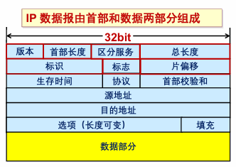
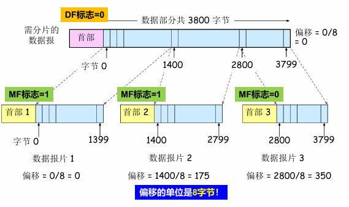
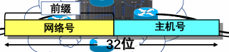
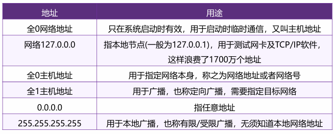
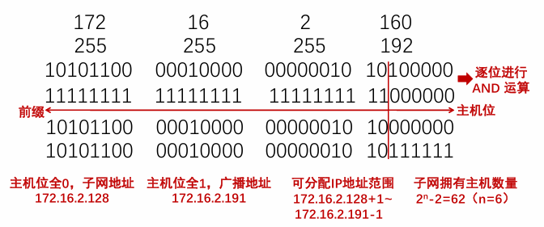
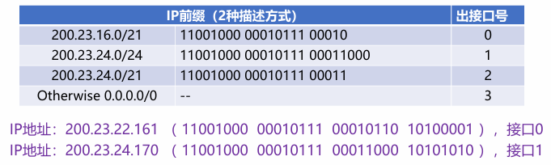
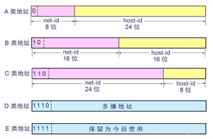
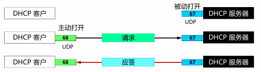
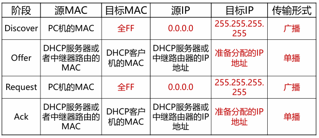
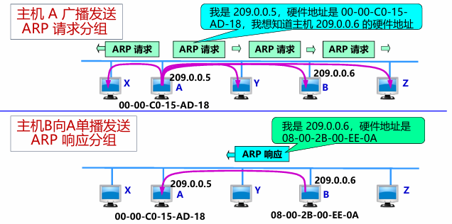

---

title: Chap 5 | 网络层

hide:
  #  - navigation # 显示右
  #  - toc #显示左
  #  - footer
  #  - feedback  
comments: true  #默认不开启评论

---
<h1 id="欢迎">Chap 5 | 网络层</h1>
!!! note "章节启示录"
    <!-- === "Tab 1" -->
        <!-- Markdown **content**. -->
    <!-- === "Tab 2"
        More Markdown **content**. -->
    本章节是计算机网络的第五章。有些内容可能不重要，后续应该会标注。

## 1.网络层服务
### 1.1 无连接服务的实现
* 数据报：无连接的方法

### 1.2 面向连接服务的实现
* 虚电路：逻辑上的连接，分组都沿着这条逻辑连接按照存储转发方式传送，而并不是真正建立了一条物理连接。

### 1.3 虚电路与数据报网络的比较

## 2.Internet网际协议
### 2.1 IPv4协议

  
1. 版本：4bit，表示采用的IP协议版本     
2. 首部长度：4bit，表示整个IP数据报首部的长度       
3. 区分服务：8bit，该字段一般情况下不使用       
4. 总长度： 16bit ，表示整个IP报文的长度,能表示的最大字节为2^16-1=65535字节     
5. 标识： 16bit ， IP软件通过计数器自动产生，每产生1个数据报计数器加1；在ip分片以后，用来标识同一片分片      
6. 标志：3bit，目前只有两位有意义；MF，置1表示后面还有分片，置0表示这是数据报片的最后1个；DF，不能分片标志，置0时表示允许分片       
7. 片偏移： 13bit，表示IP分片后，相应的IP片在总的IP片的相对位置     
8. 生存时间TTL：8bit,表示数据报在网络中的生命周期，用通过路由器的数量来计量，即跳数（每经过一个路由器会减1）     
9. 协议：8bit，标识上层协议（TCP/UDP/ICMP…）    
10. 首部校验和：16bit，对数据报首部进行校验，不包括数据部   
11. 源地址：32bit，标识IP片的发送源IP地址   
12. 目的地址：32bit，标识IP片的目的地IP地址 
13. 选项：可扩充部分，具有可变长度，定义了安全性、严格源路 由、松散源路由、记录路由、时间戳等选项       
14. 填充：用全0的填充字段补齐为4字节的整数倍    

* 数据报分片：
    * MTU（Maximum Transmission Unit）, 最大传输单元
        1. 链路MTU
        2. 路径MTU
    * 分片策略
        1. 允许途中分片：根据下一跳链路的MTU实施分片
        2. 不允许途中分片：发出的数据报长度小于路径MTU（路径MTU发现机制）

{WIDTH="450"}

### 2.2 IP地址
IP地址，网络上的每一台主机（或路由器）的每一个接口都会分配一个全球唯一的32位的标识符    

将IP地址划分为固定的类，每一类都由两个字段组成      

网络号相同的这块连续IP地址空间称为地址的前缀，或网络前缀    

注意区分网络地址和主机地址  
{width="550"}

* 子网划分：
    1. 子网划分(subnetting)，在网络内部将一个网络块进行划分以供多个内部网络使用，对外仍是一个网络
    2. 子网(subnet)，一个网络进行子网划分后得到的一系列结果网络称为子网
    3. 子网掩码(subnet mask)，与 IP 地址一一对应，是32 bit 的二进制数，置1表示网络位，置0表示主机位

!!! example "一个例子🌰"
    {width="450"}  

* 最长前缀匹配：    
    IP地址与IP前缀匹配时，总是选取子网掩码最长的匹配项  
    {width="450"}

* 分类的IP地址:
    1. IP地址共分为A、B、C、D、E五类，A类、B类、C类为单播地址
    2. IP地址的书写采用点分十进制记法，其中每一段取值范围为0到255
    {width="400"}
* IPv4地址如何获取：
    1. 静态设定：申请固定IP地址，手工设定，如路由器、服务器
    2. 动态获取
        1. 使用DHCP协议或其他动态配置协议
        2. 当主机加入IP网络，允许主机从DHCP服务器动态获取IP地址
        3. 可以有效利用IP地址，方便移动主机的地址获取
### 2.3 DHCP 
* DHCP：动态主机配置协议
    1. 当主机加入IP网络，允许主机从DHCP服务器动态获取IP地址
    2. 可以有效利用IP地址，方便移动主机的地址获取

* 工作模式：客服/服务器模式(C/S)
    * 基于UDP 工作，服务器运行在67 号端口，客户端运行在68 号端口
    {width="400"}

* 工作过程：
    1. DHCP 客户从UDP端口68以广播形式向服务器发送发现报文（DHCPDISCOVER）
    2. DHCP 服务器单播发出提供报文（DHCPOFFER）
    3. DHCP 客户从多个DHCP服务器中选择一个，并向其以广播形式发送DHCP请求报文（DHCPREQUEST）
    4. 被选择的DHCP服务器单播发送确认报文（DHCPACK）    
    {width="400"}

!!! question "IP 与 MAC地址"
     IP数据报经过不同链路时，IP 数据报中封装的IP地址不发生改变，而Mac帧中的硬件地址是发生改变的。   
     * 问题：给定B的IP地址，如何获取B的MAC地址？
     * 需要ARP协议

### 2.4 ARP
A已知B的IP地址，需要获得B的MAC地址（物理地址）

* 如果A的ARP表中缓存有B的IP地址与MAC地址的映射关系，则直接从ARP表获取
* 如果A的ARP表中未缓存有B的IP地址与MAC地址的映射关系，则A广播包含B的IP地址的ARP query分组
    * 在局域网上的所有节点都可以接收到ARP query
* B接收到ARP query分组后，将自己的MAC地址发送给A
* A在ARP表中缓存B的IP地址和MAC地址的映射关系
    * 超时时删除

{width="450"}
### 2.5 NAT
### 2.6 Internet控制报文协议