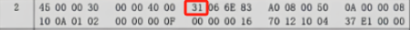

---

title: Chap 5 | 网络层

hide:
  #  - navigation # 显示右
  #  - toc #显示左
  #  - footer
  #  - feedback  
comments: true  #默认不开启评论

---
<h1 id="欢迎">Chap 5 | 网络层</h1>
!!! note "章节启示录"
    <!-- === "Tab 1" -->
        <!-- Markdown **content**. -->
    <!-- === "Tab 2"
        More Markdown **content**. -->
    本章节是计算机网络的第五章。有些内容可能不重要，后续应该会标注。

## 1.网络层服务
### 1.1 网络层服务概述
网络层提供主机到主机的通信服务，主要任务是将分组从源主机经过多个网络和多段链路传输到目的主机。

* 发送端：将传输层数据单元封装在数据包中
* 接收端：解析接收的数据包中，取出传输层数据单元，交付给传输层
* 路由器：检查数据包首部，转发数据包

* 网络层关键功能：
    1. 路由（控制面）
        1. 选择数据报从源端到目的端的路径
        2. 核心：路由算法与协议
    2. 转发（数据面）
        1. 将数据报从路由器的输入接口传送到正确的输出接口
### 1.2 无连接服务的实现（TCP/IP体系）
* 数据报：无连接的方法。网络在发送分组前不需要先建立连接。

* 数据报服务
    1. 网络层向上只提供简单灵活无连接的、尽最大努力交付的数据报服务
    2. 发送分组时不需要先建立连接，每个分组独立发送
    3. 数据报独立转发，相同源-目的的数据报可能经过不同的路径
    4. 网络层不提供服务质量的承诺
* 尽力而为交付
    1. 传输网络不提供端到端的可靠传输服务：丢包、乱序、错误
    2. 优点：网络的造价大大降低，运行方式灵活，能够适应多种应用

{width="400"}

* 服务过程：
    1. 主机A先将分组逐个发往与它直接相连的交换结点A，交换结点A缓存收到的分组 
    2. 然后查找自己的转发表。因为不同时刻的网络状态不同，所以转发表的内容可能不完全相同，所以有的分组转发给交换节点C，有的分组转发给交换结点D。
    3. 网络中的其他结点收到分组后，类似地转发分组，直到分组最终到达主机B。   

{width="450"}

### 1.3 面向连接服务的实现（OSI参考模型）
* 虚电路：逻辑上的连接，分组都沿着这条逻辑连接按照存储转发方式传送，而并不是真正建立了一条物理连接。    

{width="400"}

!!! warning "注意"
    面向连接的方法也不一定能完全保证数据的可靠传输，链路中的任何一个组成环节仍有可能失效，而这种失效是严重的，可能导致所有数据丢失。

* 服务过程：每次建立虚电路时，将一个未用过的虚电路号（VCID）分配给该虚电路，以区别于本系统中其他的虚电路
    1. 数据传输前：主机A和主机B建立连接，主机A发出“呼叫请求”分组，该分组通过中间结点送往主机B，若主机B统一连接，则发送“呼叫应答”分组予以确认。
    2. 虚电路建立后：AB可以相互发送数据分组
    3. 传送结束后：主机A通过发送“释放请求”分组来拆除虚电路，逐段断开整个连接   
 
{width="450"}
### 1.4 虚电路与数据报网络的比较

| | **虚电路服务**| **数据报服务** |
| ----------- | ----------- | ---------- | 
| 可靠传输的保证   |可靠通信由网络保证|可靠通信由主机保证| 
| 连接的建立   | 必须要  |不需要 |
| 地址   | 每个分组含有一个短的虚电路号  | 每个分组需要有源地址和目的地址| 
| 状态信息   | 建立好的虚电路要占用子网表空间 |子网不存储状态信息| 
| 路由选择   | 分组必须经过建立好的路由发送|每个分组独立选择路由| 
| 分组顺序| 总是按序到达| 可能乱序| 
| 路由器失效   | 所有经过失效路由器的虚电路都要终止 | 失效结点可能丢失分组| 
| 差错处理和流量控制   | 网络或用户主机负责 | 用户主机负责| 
| 拥塞控制   | 容易控制|难控制| 

#### 性能角度
* 假设总带宽100Mbps，有2个数据源共享带宽
    1. 如果每个数据源按50Mbps的恒定速率发送数据，使用**虚电路服务**：带宽不浪费每个数据源发送数据的带宽都可被保证。     
        {width="400"} 
    2. 如果每个数据源都是突发流量，且最高可达70Mbps，使用**虚电路服务**：
        1. 丢掉一部分数据
        2. 按预留带宽提供服务，若频繁流量突发，必定导致频繁过载。
        {width="400"}
    3. 如果每个数据源都是突发流量，且最高可达70Mbps，使用**数据报服务**：性能完全不受影响，也不会过载。
        {width="400"}

#### 效率角度
{width="450"} 

* 假设不考虑A的发送时延和链路传播时延，在上图3个转接节点的情况下，链路上的数据传输速率 $B$  bps，每个分组的长度 $P$  bit，每个分组的开销 $H$  bit，虚电路分组交换的呼叫建立时间 $S$ s，每个转接点的转接延迟时间 $D$ s，则：
    1. 虚电路分组交换总时延 $T=S+3[D+(P+H)/B]$ 
    2. 数据报分组交换总时延 $T=3[D+(P+H)/B]$

## 2.Internet网际协议
### 2.1 IPv4协议

  
1. 版本：4bit，表示采用的IP协议版本     
2. 首部长度：4bit，表示整个IP数据报首部的长度       
3. 区分服务：8bit，该字段一般情况下不使用       
4. 总长度： 16bit ，表示整个IP报文的长度,能表示的最大字节为2^16-1=65535字节     
5. 标识： 16bit ， IP软件通过计数器自动产生，每产生1个数据报计数器加1；在ip分片以后，用来标识同一片分片      
6. 标志：3bit，目前只有两位有意义；MF，置1表示后面还有分片，置0表示这是数据报片的最后1个；DF，不能分片标志，置0时表示允许分片       
7. 片偏移： 13bit，表示IP分片后，相应的IP片在总的IP片的相对位置     
8. 生存时间TTL：8bit,表示数据报在网络中的生命周期，用通过路由器的数量来计量，即跳数（每经过一个路由器会减1）     
9. 协议：8bit，标识上层协议（TCP/UDP/ICMP…）    
10. 首部校验和：16bit，对数据报首部进行校验，不包括数据部   
11. 源地址：32bit，标识IP片的发送源IP地址   
12. 目的地址：32bit，标识IP片的目的地IP地址 
13. 选项：可扩充部分，具有可变长度，定义了安全性、严格源路 由、松散源路由、记录路由、时间戳等选项       
14. 填充：用全0的填充字段补齐为4字节的整数倍    

* 数据报分片：一个链路层数据帧能承载的最大数据量称为最大传输单元（MTU）
    * MTU
        1. 链路MTU
        2. 路径MTU
    * 分片策略
        1. 允许途中分片：根据下一跳链路的MTU实施分片
        2. 不允许途中分片：发出的数据报长度小于路径MTU（路径MTU发现机制）

{WIDTH="450"}

### 2.2 IP地址
* IP地址，网络上的每一台主机（或路由器）的每一个接口都会分配一个全球唯一的32位的标识符    

* 将IP地址划分为固定的类，每一类都由两个字段组成      

* 网络号相同的这块连续IP地址空间称为地址的前缀，或网络前缀    

注意区分网络地址和主机地址  
{width="550"}

* 分类的IP地址:
    1. IP地址共分为A、B、C、D、E五类，A类、B类、C类为单播地址
    2. IP地址的书写采用点分十进制记法，其中每一段取值范围为0到255
    {width="400"}

|**网络类别** | **最大可用网络数**| **第一个可用的网络号** |**最后一个可用的网络号** |**每个网络中的最大主机数** |
| ----------- | ----------- | ---------- | ---------- | ---------- | 
|A|$2^7-2$|1|126|$2^{24}-2$| 
|B|$2^{14}$ |128.0|191.255|$2^{16}-2$|
|C|$2^{21}$|192.0.0|223.255.255|$2^8-2$| 

表格中A类地址可用的网络数为$2^7-2$，原因是：网络号字段全为0的IP地址是保留地址；网络号为127的IP地址是环回自检地址。

* 子网划分：
    1. 子网划分(subnetting)，在网络内部将一个网络块进行划分以供多个内部网络使用，对外仍是一个网络
    2. 子网(subnet)，一个网络进行子网划分后得到的一系列结果网络称为子网
    3. 子网掩码(subnet mask)，与 IP 地址一一对应，是32 bit 的二进制数，置1表示网络位，置0表示主机位

!!! example "一个例子🌰"
    {width="450"}  

* CIDR（无类域间路由）：是在变长子网掩码的基础上，提出的一种消除传统A、B、C类地址及划分子网的概念。     
    * 将32位的IP地址划分为前后两个部分，并采用斜线记法，即在IP地址后加上“/”，然后再写上网络前缀所占位数。         
    {width="400"}

??? question "一个题目"
    * A large number of consecutive IP addresses are available starting at 202.101.0.0. Suppose that five organizations, A, B, C, D, and E, request 1024, 2000, 2000, 4096 and 512 addresses (including special IPs), respectively, and in that order. Please assign the IP address and the mask in the w.x.y.z/s notation (following the order of allocating the minimum address segment firstly).

    * A:1024 <= 2^10，需要10bits，网络前缀位数为 32-10 = 22位，CIDR:202.101.00000000.00000000/22 = 202.101.0.0/22 ，倒数第二位中只能从倒数第三个0开始赋值，范围0，4，8，12
    * B:2000 <= 2^11，需要11bits，网络前缀位数为 32-11 = 21位，CIDR:202.101.00001000.00000000/21 = 202.101.8.0/21，倒数第二位中只能从倒数第四个0开始赋值，范围0，8，16，32
    * C:2000 <= 2^11，需要11bits，网络前缀位数为 32-11 = 21位，CIDR:202.101.00001000.00000000/21 = 202.101.16.0/21，倒数第二位中只能从倒数第四个0开始赋值，范围0，8，16，32
    * D:4096 <= 2^12，需要12bits，网络前缀位数为 32-12 = 20位，CIDR:202.101.00010000.00000000/21 = 202.101.32.0/20，倒数第二位中只能从倒数第五个0开始赋值范围0，16，32，64
    * E:512 <= 2^9，需要9bits，网络前缀位数为 32-9 = 23位，CIDR:202.101.00010000.00000000/21 = 202.101.4.0/23，倒数第二位中只能从倒数第二个0开始赋值范围0，2，4，6

* 最长前缀匹配：    
    IP地址与IP前缀匹配时，总是选取子网掩码最长的匹配项  
    {width="450"}

* IPv4地址如何获取：
    1. 静态设定：申请固定IP地址，手工设定，如路由器、服务器
    2. 动态获取
        1. 使用DHCP协议或其他动态配置协议
        2. 当主机加入IP网络，允许主机从DHCP服务器动态获取IP地址
        3. 可以有效利用IP地址，方便移动主机的地址获取
### 2.3 DHCP 
* DHCP：动态主机配置协议
    1. 当主机加入IP网络，允许主机从DHCP服务器动态获取IP地址
    2. 可以有效利用IP地址，方便移动主机的地址获取

* 工作模式：客服/服务器模式(C/S)
    * 基于UDP 工作，服务器运行在67 号端口，客户端运行在68 号端口
    {width="400"}

* 工作过程：
    1. DHCP 客户从UDP端口68以广播形式向服务器发送发现报文（DHCPDISCOVER）
    2. DHCP 服务器单播发出提供报文（DHCPOFFER）
    3. DHCP 客户从多个DHCP服务器中选择一个，并向其以广播形式发送DHCP请求报文（DHCPREQUEST）
    4. 被选择的DHCP服务器单播发送确认报文（DHCPACK）    
    {width="400"}

!!! question "IP 与 MAC地址"
    IP数据报经过不同链路时，IP 数据报中封装的IP地址不发生改变，而Mac帧中的硬件地址是发生改变的。   
     
    * 问题：给定B的IP地址，如何获取B的MAC地址？
    * 需要ARP协议

### 2.4 ARP
A已知B的IP地址，需要获得B的MAC地址（物理地址）

* 如果A的ARP表中缓存有B的IP地址与MAC地址的映射关系，则直接从ARP表获取
* 如果A的ARP表中未缓存有B的IP地址与MAC地址的映射关系，则A广播包含B的IP地址的ARP query分组
    * 在局域网上的所有节点都可以接收到ARP query
* B接收到ARP query分组后，将自己的MAC地址发送给A
* A在ARP表中缓存B的IP地址和MAC地址的映射关系
    * 超时时删除

{width="450"}

### 2.5 NAT
网络地址转换(NAT)用于解决IPv4地址不足的问题，是一种将私有（保留）地址转化为公有IP地址的转换技术。

*  私有IP地址：
    1. A类地址：10.0.0.0--10.255.255.255 
    2. B类地址：172.16.0.0--172.31.255.555
    3. C类地址：192.168.0.0--192.168.255.255

内网内部的地址可以有很多，但要发到外网只有1个出口地址。

{width="400"}

!!! question "同一主机不同应用，或者不同主机的同一端口，NAT转换如何处理？"      
    需要区分到每一个主机的每一个应用    

    * 同一主机不同应用：在出口地址处使用不同的端口号
    * 不同主机的同一端口：在出口地址处使用不同的端口号

* 网络地址转换：传输层TCP/UDP拥有16-bit 端口号字段

* 优点：
    1. 节省合法地址，减少地址冲突
    2. 灵活连接Internet
    3. 保护局域网的私密性
* 缺点：
    1. 违反了IP的结构模型，路由器处理传输层协议（路由器是三层的设备，而传输层在第四层）
    2. 违反了端到端的原则
    3. 违反了最基本的协议分层规则
    4. 不能处理IP报头加密
    5. 新型网络应用的设计者必须要考虑NAT场景，如P2P应用程序

!!! warning "注意"
    普通路由器在转发IP分组时，其源IP地址和目的IP地址都不会改变，而NAT路由器转发IP分组时，一定要更换其IP地址（转换源IP地址或目的IP地址）。普通路由器仅工作在网络层，而NAT路由器转发数据报时需要查看和转换传输层的端口号。     

### 2.6 Internet控制报文协议

* ICMP: 互联网控制报文协议
  
* ICMP报文类型：
    1. ICMP 差错报告报文
        * 终点不可达：不可达主机、不可达网络，无效端口、协议
    2. ICMP 询问报文
        * 回送请求/回答(ping使用)

* PING (Packet InterNet Groper) 
    1. PING 用来测试两个主机之间的连通性
    2. PING 使用了ICMP 回送请求与回送回答报文

* Traceroute和ICMP：如何知道整个路径上路由器的地址？ 使用TraceRT命令
    1. 源向目的地发送一系列UDP段(不可能的端口号)
        1. 第一个TTL =1
        2. 第二个TTL=2, 等
    2. 当第n个数据报到达第n和路由器:
        1. 路由器丢弃数据报
        2.  并向源发送一个ICMP报文(类型11, 编码0)
        3. 报文的源IP地址就是该路由器的IP地址

以上做法不一定准确/正确。

??? question "一道思考题"
      
    
    这道题是一道综合题，首先需要了解IPv4包字段的具体组成。

    * TTL字段位于第9个字节，因此p2的TTL = 0x31 = 49 
          
    * 同第一题，可以找到p6的TTL = 0x40 = 64,同时可以通过标识号来确定唯一的包，标识号位于第5个字节，因此p6的标识号为0x68，可以发现p5的标识号与p6相同，所以p5和p6为一个包传输的不同过程。可以找到p5的TTL = 0X31 = 49,那么从p6到p6经过了64 - 49 = 15跳，所以答案为15。 
    * 源地址和目标地址分别位于13-16字节和17-20字节，因此寻找源地址不为10.0.0.8的packet即可，从图中可以看出是p2。    
        
        对于第三题的第二问，对应的知识点是MAC帧的最小长度，回忆一下，数据字段的最小长度是46：   
        {width="350"}
        而在IPv4字段中，标识长度的字段位于第四个字节，从图中可得p3的总长度为0x28 = 40 < 46，因此需要进行额外的填充。    
        
    * 第四题需要找出B的公网IP，可以从图中寻找发送给B的数据包（不能找从B发的，因为发的地址是内网地址，但目的地址是公网地址），从图中可以看得出p1/p3/p4都是从A发到B的，因此B的公网IP为 A0.08.00.50, 即 160.8.0.80
    * 第五题同理，寻找发送给A的数据包，即p2/p6/p7，但是只有p6/p7的目的地址为公网地址（p2的目的地址虽然是A，但仍然是内网的10.0.0.8），因此通过p6/p7可得A的地址为 C0.0A.01.06, 即 192.10.1.6
    * 首先要明白这一问的问题，第六题问的是p7采用MTU800分片后两片MTU的lengh、MF以及offset值。    
        1. 首先可以较为轻易地得到MF值（1表示后面还有分片，0表示这是数据报片的最后1个），所以第一个分片的MF为1，第二个分片的MF为2。
        2. 然后计算两个分片的长度。首先从图中可以看出p7的总长度，为0x0600，即1536（包含头部的20字节和数据字段的1516字节）。已知分片最大长度为800字节，去掉作为首部的20字节，还剩780可以用于数据字段。但要注意，数据字段的长度需要是8的倍数，因为在后续的分片中，offset的值是以8个字节为单位的，所以寻找距离780最近的8的倍数，为776，因此第一个分片的长度应该等于数据字段＋首部字段，即 776 + 20 = 796字节；在第二个分片中，还需要存储剩余的数据字段1516 - 776 = 740字节。此时，因为第二个分片已经是最后一个分片，无需考虑下一个分片的offset，所以数据字段的长度不需要是8的倍数，所以第二个分片的总长度为740 + 20 = 760字节。
        3. 最后计算偏移量，第一个分片的偏移量为0；第二个分片的偏移量（也就是第二个分片中的数据字段位于原数据字段的位置/8）为 776 / 8 = 97。
## 3.路由算法
### 3.1 优化原则
所有的源节点到一个指定目标节点的最优路径的集合构成一棵以目标节点为根的树

* 一棵路由器B的汇集树（距离度量单位：步长数）   
{width="450"}

### 3.2 最短路径算法
用于计算一个节点到其他所有节点的最短路径，主要特点是以起始点为中心向外逐层扩展，直到扩展到终点为止

* Dijkstra算法

### 3.3 距离向量路由
距离向量路由的基础是Bellman-Ford算法，它用于计算单源最短路径。每个节点以自身为源点执行Bellman-Ford算法，所以全局上可以解决任意结点对之间的最短路径问题。

* Bellman-Ford 方程
    1. 假设Dx(y) 是 从x到y最小代价路径的代价值
    2. 则：Dx(y) = min {c(x,m) + Dm(y) }    
        其中m为x的邻居, c(x,m)为m到X的距离

    * 示例：
        1. 已获知Dv(z) = 5, Dx(z) = 3, Dw(z) = 3
        2. Du(z)= min { c(u,v) + Dv(z), c(u,x) + Dx(z), c(u,w) + Dw(z) }    
        = min {2 + 5,1 + 3, 5 + 3}      
        = 4         
        
* 距离向量（Distance Vector）算法基本思想: 
    1. 每个节点周期性地向邻居发送它自己到某些节点的距离向量；
    2. 当节点x接收到来自邻居的新DV估计，它使用B-F方程更新其自己的DV :   
    $D_{_x}(y)\leftarrow min_{_v}\{c(x,v)+D_{_v}(y)\}\quad for \;\;each\;\; node y\in N$

* 距离向量算法，每个结点x维护下列路由信息：
    1. 从x到每个直接相连邻居v的链路费用c(x,v)。
    2. 结点x的距离向量，即x到网络中其他结点的费用。这是一组距离，因此称为距离向量。
    3. 它收到的每个邻居的距离向量，即x的每个邻居到网络中其他结点的费用。

* 距离向量算法特点：迭代的、分布式的
    1. 每次本地迭代由下列引起: 本地链路费用改变、邻居更新报文
    2. 分布式:各节点依次计算，相互依赖

* It reacts rapidly to good news, but leisurely to bad news:
    1. 好消息传播得很快：   
    
    2. 坏消息（A突然断电）会导致迭代的计数增加，但节点们还以为路径是好的，直到数值变得很大才能发现（因此也叫count-to-infinity problem）：    
    

!!! tip "关于坏消息导致的 count-to-infinity problem 更直观的解释"
    {width="400"}     

    * 有X、Y、Z三个节点。如果Y检测到它到X的路径费用由4增加到了60。Y开始更新距离向量。注意此时Z的距离向量为 $DV_z$ 更新为：d(x) = 5 + 1 = 6, d(Y) = 1，d(z) = 0。于是Y在更新距离向量时发现Z到X的距离只有5，所以可以先到Z再到X，于是Y的距离向量 $DV_y$ 更新为：d(x) = 5 + 1 = 6, d(Y) = 0, d(z) = 1。
    * 显而易见，这个逻辑显然是错误的，因为Z到X的距离为5的前提是要经过Y，但Y更新后的路径又要经过Z，这就形成了一个选路环路（routing-loop）问题。因为Y的距离向量更新了（虽然是错误的），但它还是向Z发送了更新报文。Z收到更新报文后，比较了下邻居们到X的距离，发现经过Y的路径距离为1 + 6 = 7，小于直接到X的距离，于是Z也更新的自己的距离向量，然后又将更新后的距离向量发给Y。Y收到后又更新向量为8，然后再发给Z……这样循环往复，更新报文在Y和Z之间传来传去，直到第44次迭代后，Z算出它经由Y的路径费用大于50为止。此时，Z最终确定到X的最短路径费用是直接到达X的费用50，而Y也得到了最短路径是经Z到X的费用51。

    * 可以看出，虽然最后还是得到了正确的信息（最后的50和51是正确的！），但坏消息的传播与好消息相比实在是慢太多了！而且，如果X和Y之间的费用为10000，Z和X的费用是9999时，就会出现计数到无穷（count-to-infinity）的问题！

    !!! warning "一个解决方式？Poisoned reverse (毒性逆转, RFC 1058) "
        * 上述的选路环路问题可以通过毒性逆转的技术加以避免。    
        * 它的基本思想是：如果Z的最短路径要通过邻居Y，那么它将告诉Y自己到目的节点的距离是∞。这样，Z向Y撒了一个善意的谎言，使得只要Z经过Y选路到X，它就会一直持续讲述这个谎言，这样Y也就永远不会尝试从Z选路到X了，也就避免了环路问题。
  
        * 我们将毒性逆转技术应用于上例。Y在更新自己的距离向量时，发现Z到X的距离是∞，于是它将d(x)无奈地更新为60，并向Z发送了更新报文。Z收到报文后更新自己的d(X)为50（直接选路到X），并发给Y更新报文（此时因为Z不需要经过Y进行选路，因此将告诉Y自己到X的距离为50）。Y在接收到Z的报文后，重新将距离更新为1 + 50 = 51，并告诉Z自己到X的距离是∞（实际是51）。Z收到报文后，发现最低耗费并没有改变，因此算法进入静止状态。
        * 看上去这个解决方式似乎不错？
        * 但是，当涉及3个或更多节点（而不仅仅是两个直接相连的邻居节点）的环路将不能被毒性逆转技术检测到，如下例：   
            {width="400"}
        
        * 当C和D之间的连接断开时，依次发生如下事件：
            1. A收到来自C的坏消息，然后将选择从B到达D
            2. A向C发送更新报文
            3. C向B发送更新报文
        * 这种问题出现的原因是，A和B无法同时收到来自C的更新报文然后更新自己的距离向量。比如这里，B与A相比得到的更新报文时间要晚，这就给A造成了“错觉”，在A看来，虽然从C到不了D，但是选B也可以。然后它又把这个错误的好消息告诉了C，让C也以为自己又能和D连接了。最后，终于想到忽略了B，又发送了报文给B。这样，A、B、C都以为自己和D联系上了！但实际上D和它们已经隔离了。

### 3.4 链路状态路由

* 链路状态是指本路由器都和哪些路由器相邻，以及相应链路的代码。链路状态算法要求每个结点都具有全网拓扑结构图（这个拓扑结构图在全网范围内是一致的），它们执行下列两项任务：
    1. 主动测试所有相邻结点的状态
    2. 定期地将链路状态传播给所有其他结点

在链路状态算法中，结点每收到一个链路状态报文，便用其更新自己地网络状态“视野图”，一旦链路状态发生变化，就使用Dijkstra算法重新计算到达所有其他结点地最短路径。

* 链路状态（Link State）路由可分为五个部分：
    1. 发现邻居，了解他们的网络地址；
    2. 设置到每个邻居的成本度量；
    3. 构造一个分组，分组中包含刚收到的所有信息；
    4. 将此分组发送给其他的路由器；
    5. 计算到其他路由器的最短路径。

* 发现邻居，了解他们的网络地址：
    {width="450"}

* 2.设置到每个邻居的成本度量
    1. 开销/度量/代价：
        1. 自动发现设置或人工配置
        2. 度量：带宽、跳数、延迟、负载、可靠性等
    2. 常用度量：链路带宽（反比）
        
        >例如：1-Gbps以太网的代价为1，100-Mbps以太网的代价为10
    
    3. 可选度量：延迟
        1. 发送一个echo包，另一端立即回送一个应答
        2. 通过测量往返时间RTT，可以获得一个合理的延迟估计值

* 构造一个分组，分组中包含刚收到的所有信息
    * 构造链路状态分组（link state packet）
        1. 发送方标识
        2. 序列号
        3. 年龄
        4. 邻居列表

* 将LS分组发送给其他的路由器
    1. 每个LS分组包含一个序列号，且递增
    2. 路由器记录所收到的所有（源路由器、序列号）对
    3. 当一个新分组到达时，路由器根据记录判断：
        1. 如果是新分组，洪泛广播       
        2. 如果是重复分组，丢弃
        3. 如果是过时分组，拒绝

### 距离向量和链路状态算法比较：
* 网络状态信息交换的范围
    1. DV：邻居间交换
    2. LS：全网扩散
* 网络状态信息的可靠性
    1. DV：部分道听途说
    2. LS：自己测量
* 健壮性:
    1. DV：计算结果传递，健壮性差
    2. LS：各自计算，健壮性好
* 收敛速度：
    1. DV: 慢,可能有计数到无穷问题
    2. LS: 快
### 3.5 层次路由
* 产生原因：
    1. 地址分配往往是随机的，难以进行高效的地址聚合
    2. 每个网络的网络管理员有自己的管理方法和思路，并不希望每个路由器都干涉本网络内部的地址分配等问题

* 基本思路：
    1. 自治系统内部使用内部网关路由协议，Interior Gateway Protocols (IGP)
        1. 每个自治系统域内路由算法可不同
        2. 典型IGP协议：OSPF，RIP，IS-IS，IGRP，EIGRP……
    2. 自治系统之间之间使用外部网关路由协议，Exterior Gateway Protocols (EGP)
        1. 各自治系统域之间的路由需统一
        2. 典型EGP协议：BGP