---

title: Chap 6 | 传输层

hide:
  #  - navigation # 显示右
  #  - toc #显示左
  #  - footer
  #  - feedback  
comments: true  #默认不开启评论

---
<h1 id="欢迎">Chap 6 | 传输层</h1>
!!! note "章节启示录"
    <!-- === "Tab 1" -->
        <!-- Markdown **content**. -->
    <!-- === "Tab 2"
        More Markdown **content**. -->
    本章节是计算机网络的第六章。有些内容可能不重要，后续应该会标注。

## 1.概述和传输层服务

### 传输层的位置
* 传输层位于应用层和网络层之间：基于网络层提供的服务，向分布式应用程序提供通信服务

* 按照因特网的“端到端”设计原则：应用进程之间的通信。应用程序只运行在终端上，即不需要为网络设备编写程序

* 传输层应提供进程之间本地通信的抽象：即运行在不同终端上的应用进程仿佛是直接连在一起的

### 传输层提供什么服务？
* 因特网的网络层提供“尽力而为”的服务：
* 传输层的有所为、有所不为: 
    1. 传输层可以通过差错恢复、重排序等手段提供可靠、按序的交付服务
    2. 但传输层无法提供延迟保证、带宽保证等服务

## 2.套接字编程
* 如何创建一个网络应用：编写一个分布式程序，使其运行在不同的端系统上，并通过网络通信
* 选择一种应用程序体系结构：
    1. 传统及主流的是客户-服务器体系结构（C/S）
          1. 有一台总是在线的主机，运行一个服务器程序(server)，服务器主机具有永久的、众所周知的地址
          2. 用户终端上运行一个客户程序（client），需要时主动与服务器程序通信，请求服务
          3. 客户只与服务器通信，客户之间不通信

!!! question "进程如何标识自己?"
    * 每个进程需要一个标识，以便其它进程能够找到它
        1. 问题：可以用进程所在主机的地址来标识进程吗？
        2. 回答：不能！因为同一个主机上可能运行着许多进程
    * 端口号（port number）：端口号被用来区分同一个主机上的不同进程
    * 因此，进程标识包括：
        1. 主机地址
        2. 主机上与该进程关联的端口号

在网络中通过IP地址来标识和区别不同的主机，通过端口号来标识和区分一台主机中的不同应用进程，端口号拼接到IP地址即构成套接字（Socket）。在网络中采用发送方和接收方的套接字来识别端点。

!!! warning "以下使用的应用例子：回音服务"
    * 客户程序从键盘读入一行字符（数据），发送给服务器
    * 服务器接收数据，然后将收到的数据回送给客户
    * 客户接收回送的数据，在屏幕上显示出来

* 套接字地址：通用地址:
    1. 套接字API接口的地址类型，作为不同类型套接字地址的“虚父类”
    2. 在套接字API的定义中使用
    3. 调用时为防止编译错误需要做强制类型转换   
    ```c++
    struct sockaddr{/* struct to hold an address*/
        u_char sa_len;/*total length*/
        u_short sa_family;/*type of address*/
        char sa_data[14];/*value of address*/
    }
    ```
* 套接字地址：IPv4地址:
    1. sin_family：AF_INET(IPv4)，编程时实际使用地址类型
    2. sin_port：存放端口号(按照网络字节序存储)
    3. sin_addr：存放32位IP地址(无符号整数)
    4. sin_zero：为与sockaddr大小兼容而保留的空字节
    ```c++
    struct sockaddr_in { //struct to hold an address
        sa_family_t sin_family; //always AF_INET
        in_port_t sin_port; //protocol port number: uint16_t
        struct in_addr sin_addr; //IP address
        char sin_zero[8];//unused(set to zero)
        };
    struct in_addr {
        in_addr_t s_addr; //IPv4 address (uint32_t)
    };
    ```

* 创建套接字：socket():
    1. 客户或服务器调用socket()创建本地套接字，返回套接字描述符
    2. domain指明网络层地址类型
    3. type指明传输层协议：
        1. SOCK_STREAM代表TCP字节流
        2. SOCK_DGRAM代表UDP数据报
    ```c++
    #include <sys/socket.h>
    int socket(
        int domain, /* AF_UNIX, AF_INET, etc. */
        int type, /* SOCK_STREAM, SOCK_DGRAM */
        int protocol); /* usually zero */
    /* Returns file descriptor or-1 on error (sets errno) */
    ```
* 绑定套接字地址：bind():
    1. 用来将服务器本地套接字地址sa与描述符socket_fd绑定
    2. 客户程序不需要调用bind()，操作系统将为其在1024～5000之间分配一个端口号       
    ```c++
    int bind(
        int socket_fd,
        const struct sockaddr *sa,
        socklen_t sa_len);
        /* Returns 0 if OK or-1 on error (sets errno) */
    ```
* 关闭套接字：close()：
    1. 客户和服务器调用close()关闭一个套接字
    2. 当实参fd为TCP套接字描述符时：调用close()会引起本地进程向远程进程发送关闭连接的消息
    3. 当实参fd为UDP套接字描述符时：调用close()会引起为此描述符分配的资源被内核释放
    ```c++
    int close(int fd);
    /* Returns 0 if OK or-1 on error */s
    ```

* 基于UDP的套接字通信流程：     
    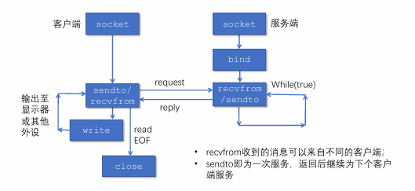{width="500"}

* 使用TCP套接字实现回音服务：使用TCP套接字编程时，可将TCP连接想像成一对套接字之间的一条封闭管道：
    1. 发送端TCP将要发送的字节序列从管道的一端（套接字）送入
    2. 接收端TCP从管道的另一端（套接字）取出字节序列
    3. 在管道中传输的字节不丢失，并保持顺序

* TCP服务器监听套接字：listen()
    1. 将主动套接字转变为被动套接字，进入监听状态
    2. backlog设定了监听队列长度
    ```c++
    int listen(
        int socket_fd;
        int backlog;) //maximum connection queue length
        /* Returns 0 if OK or-1 on error */
    ```

* TCP套接字系统调用：accept():
    1. 服务端从已建立连接的队列中出队列一个客户端
    2. 返回值是用来和客户端交换数据的套接字描述符，需要在通信完毕后调用close关闭
    3. 返回时客户端的IP地址和端口可在cliaddr中访问
    ```c++
     int accept(
        int socket_fd,
        struct sockaddre *cliaddr, /* client address */
        socklen_t *addrlen;) /* address struct length */
        /* Returns file descriptor or-1 on error */
    ```
* TCP套接字系统调用：connect()
    1. 客户端调用connect向服务器发起建立连接的请求
    2. 服务器的IP地址和端口信息在servaddr中
    3. 三次握手的过程导致connect的调用是阻塞的
    ```c++
     int connect(
        int socket_fd,
        const struct sockaddr *servaddr, /* server address */
        socklen_t *addrlen); /* address struct length */
        /* Returns 0 or-1 on error */
    ```

* 基于TCP的套接字通信流程：
    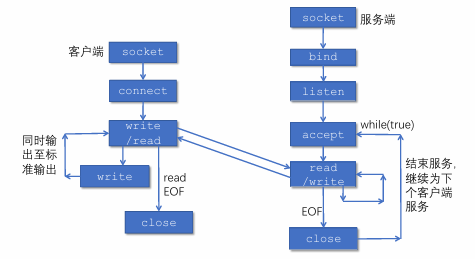{width="500"}

## 3.传输层复用和分用
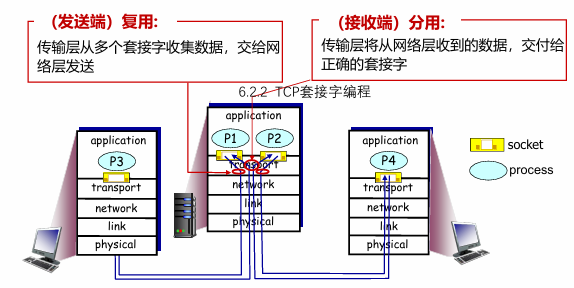{width="450"}     

复用是指发送方不同的应用进程都可以使用同一个传输层协议传送数据。分用是指接收方的传输层在剥去报文的首部后能够把这些数据正确交付到目的应用进程。      

* 套接字标识与端口号:
    1. 端口号是套接字标识的一部分：
        1. 每个套接字在本地关联一个端口号
        2. 端口号是一个16比特的数
    2. 端口号的分类：
        1. 熟知端口：0～1023，由公共域协议使用
        2. 注册端口：1024～49151，需要向IANA注册才能使用
        3. 动态和/或私有端口：49152～65535，一般程序使用
    3. 报文段中有两个字段携带端口号
        1. 源端口号：与发送进程关联的本地端口号
        2. 目的端口号：与接收进程关联的本地端口号

    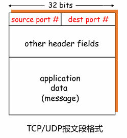{width="200"}

* 套接字标识与端口号：
    1. 服务器端使用的端口号。分为两类，一类是熟知端口号，数值为0~1023，IANA（互联网地址指派机构）把这些端口号指派给了TCP/IP最重要的一些应用程序，让所有的用户都知道。另一类称为登记端口号，数值为1024~49151，它是供没有数值端口号的应用程序使用的，使用这类端口号必须在IANA登记，以防止重复。
    2. 客户端使用的端口号，数值为49152~65535。因为这类端口号仅在客户进程运行时才动态地选择，所以又称短暂端口号。党服务器进程收到客户进程地报文时，就知道了客户进程所使用的端口号，因为可以把数据发送给客户进程。通信结束后，刚用过的客户端口号就不复存在，这个端口号就可以供其他客户进程使用。

* 套接字端口号的分配
    1. 自动分配：
        1. 创建套接字时不指定端口号
        2. 由操作系统从49152～65535中分配
        3. 客户端通常使用这种方法
    2. 使用指定端口号创建套接字：
        1. 创建套接字时指定端口号
        2. 实现公共域协议的服务器应分配众所周知的端口号（0～1023）
        3. 服务器通常采用这种方法

* UDP分用的方法：UDP套接字使用<IP地址, 端口号>二元组进行标识        
    * 接收方传输层收到一个UDP报文段后：
        1. 检查报文段中的目的端口号，将UDP报文段交付到具有该端口号的套接字
        2. <目的IP地址，目的端口号> 相同的UDP报文段被交付给同一个套接字，与<源IP地址，源端口号> 无关
        3. 报文段中的<源IP地址，源端口号> 被接收进程用来发送响应报文

* TCP服务器使用的套接字：
    1. 监听套接字：
        1. 服务器平时在监听套接字上等待客户的连接请求，该套接字具有众所周知的端口号
    2. 连接套接字：
        1. 服务器在收到客户的连接请求后，创建一个连接套接字，使用临时分配的端口号
        2. 服务器同时创建一个新的进程，在该连接套接字上服务该客户
        3. 每个连接套接字只与一个客户通信，即只接收具有以下四元组的报文段：
            * 源IP地址 = 客户IP地址，源端口号 = 客户套接字端口号
            * 目的IP地址 = 服务器IP地址，目的端口号 = 服务器监听套接字的端口号

    > 

    * <font color = "red">连接套接字需要使用<源IP地址，目的IP地址，源端口号，目的端口号>四元组进行标识</font>，服务器使用该四元组将TCP报文段交付到正确的连接套接字。

## 4.无连接传输：UDP
* 网络层提供的服务（best-effort service）：
    1. 尽最大努力将数据包交付到目的主机
    2. 不保证投递的可靠性和顺序
    3. 不保证带宽及延迟要求
* UDP提供的服务：
    1. 进程到进程之间的报文交付
    2. 报文完整性检查（可选）：检测并丢弃出错的报文
* UDP需要实现的功能：
    1. 复用和分用
    2. 报文检错

* UDP报文段结构：
    1. UDP报文：
        1. 报头：携带协议处理需要的信息
        2. 载荷（payload）：携带上层数据
    2. 用于复用和分用的字段：
        1. 源端口号
        2. 目的端口号
    3. 用于检测报文错误的字段：
        1. 报文总长度
        2. 校验和（checksum）       

    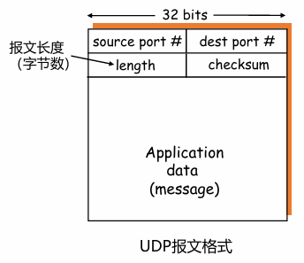{width="200"}

* UDP校验和计算：
    1. 计算UDP校验和时，要包括伪头、UDP头和数据三个部分
    2. UDP伪头信息取自IP报头，包括：
        1. 源IP地址，目的IP地址
        2. UDP的协议号
        3. UDP报文段总长度
    3. UDP校验和的使用是可选的，若不计算校验和，该字段填入0

??? question "为什么需要UDP？"
    * 应用可以尽可能快地发送报文：
        1. 无建立连接的延迟
        2. 不限制发送速率（不进行拥塞控制和流量控制）
    * 报头开销小
    * 协议处理简单

??? question "UDP适合哪些应用？"
    * 容忍丢包但对延迟敏感的应用：如流媒体
    * 以单次请求/响应为主的应用：如DNS
    * 若应用要求基于UDP进行可靠传输：由应用层实现可靠性

## 5. 面向连接的传输：TCP
### 5.1 TCP报文段结构
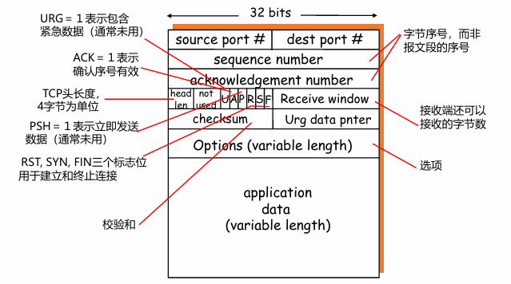{width="450"}

* 重要的TCP选项：
    1. 最大段长度(MSS):
        1. TCP段中可以携带的最大数据字节数
        2. 建立连接时，每个主机可声明自己能够接受的MSS，缺省为536字节
    2. 窗口比例因子（window scale）：
        1. 建立连接时，双方可以协商一个窗口比例因子
        2. 实际接收窗口大小= window size * 2^window scale
    3. 选择确认（SACK）：
        1. 最初的TCP协议只使用累积确认
        2. 改进的TCP协议引入选择确认，允许接收端指出缺失的数据字节

!!! example "一个例子🌰"    
    * 主机A向主机B发送仅包含一个字符‘Ｃ’的报文段：
        1. 发送序号为42
        2. 确认序号为79（以接收方的角度，对前一次数据的确认）   
    * 主机B将字符‘Ｃ’回送给主机A：
        1. 发送序号为79
        2. 确认序号为43（对收到‘Ｃ’的确认）
    * 主机A向主机B发送确认报文段（不包含数据）：
        1. 确认序号为80（对收到‘Ｃ’的确认）

* 发送序号和确认序号的含义：    
    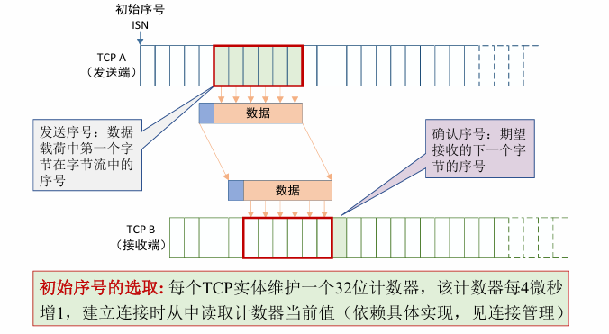{width="500"}
### 5.2 TCP可靠数据传输
* TCP 在不可靠的IP服务上建立可靠的数据传输
* 基本机制：
    1. 发送端：流水线式发送数据、等待确认、超时重传
    2. 接收端：进行差错检测，采用累积确认机制
* 乱序段处理：协议没有明确规定
    1. 接收端不缓存：可以正常工作，处理简单，但效率低
    2. 接收端缓存：效率高，但处理复杂

* 一个高度简化的TCP协议：仅考虑可靠传输机制，且数据仅在一个方向上传输
    * 接收方：
        1. 确认方式：采用累积确认，仅在正确、按序收到报文段后，更新确认序号；其余情况，重复前一次的确认序号（与GBN类似）
        2. 失序报文段处理：缓存失序的报文段（与SR类似）
    * 发送方：
        1. 发送策略：流水线式发送报文段
        2. 定时器的使用：仅对最早未确认的报文段使用一个重传定时器（与GBN类似）
        3. 重发策略：仅在超时后重发最早未确认的报文段（与SR类似，因为接收端缓存了失序的报文段）

* TCP发送方要处理的事件：
    1. 收到应用数据：
        1. 创建并发送TCP报文段
        2. 若当前没有定时器在运行（没有已发送、未确认的报文段），启动定时器
    2. 超时:
        1. 重传包含最小序号的、未确认的报文段
        2. 重启定时器
    3. 收到ACK：
        1. 如果确认序号大于基序号（已发送未确认的最小序号）：
            1. 推进发送窗口（更新基序号）
            2. 如果发送窗口中还有未确认的报文段，启动定时器，否则终止定时器

!!! example "TCP可能的重传场景"
    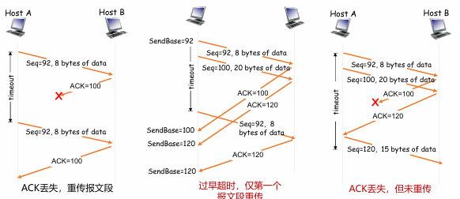

    ??? question "思考题"
        * 第二种情形，如果TCP像SR一样，每个报文段使用一个定时器，会怎么样？
        * 第三种情形，采用流水式发送和累积确认，可以避免重发哪些报文段？
        
        * TCP通过采用以下机制减少了不必要的重传：
            1. 只使用一个定时器，避免了超时设置过小时重发大量报文段
            2. 利用流水式发送和累积确认，可以避免重发某些丢失了ACK的报文段

* 如何设置超时值：
    * 为什么设置合理的超时值很重要：
        1. 若超时值太小，容易产生不必要的重传
        2. 若超时值太大，则丢包恢复的时间太长
    * 直观上，超时值应大于RTT，但RTT是变化的
    * 问题转化为如何估计RTT：
        1. RTT是变化的，需要实时测量从发出某个报文段到收到其确认报文段之间经过的时间（称SampleRTT）
        2. 由于SampleRTT波动很大，更有意义的是计算其平均值（称EstimatedRTT）
        3. 平均RTT的估算方法（指数加权移动平均）：
            * $EstimatedRTT = (1- α)*EstimatedRTT + α*SampleRTT$
            * 典型地，α=0.125
        4. 估算SampleRTT 与 EstimatedRTT的偏差（称DevRTT）：
            * $DevRTT = (1-β)*DevRTT + β*|SampleRTT - EstimatedRTT|$
            * 典型地，β= 0.25
        5. 设置重传定时器的超时值：$TimeoutInterval = EstimatedRTT + 4*DevRTT$

* TCP确认的二义性：
    1. TCP确认的二义性问题：
        1. 重传的TCP报文段使用与原报文段相同的序号
        2. 发送端收到确认后，无法得知是对哪个报文段进行的确认
    2. 二义性确认带来的问题：
        1. 对重传报文段测量的SampleRTT，可能不准确
    3. 解决方法：
        1. 忽略有二义性的确认，只对一次发送成功的报文段测量SampleRTT ，并更新EstimtedRTT
        2. 当TCP重传一个段时，停止测量SampleRT

简单忽略重传报文段的问题：重传意味着超时值可能偏小了，需要增大；若简单忽略重传报文段（不更新EstimtedRTT），则超时值也不会更新，超时设置过小的问题没有解决。

* 定时器补偿：采用定时器补偿策略，发送方每重传一个报文段，就直接将超时值增大一倍（不依赖于RTT的更新）；若连续发生超时事件，超时值呈指数增长（至一个设定的上限值）
    * Karn算法：结合使用RTT估计值和定时器补偿策略确定超时值


* TCP的接收端：
    * 为减小通信量，TCP允许接收端推迟确认：接收端可以在收到若干个报文段后，发送一个累积确认的报文段
    * 推迟确认带来的问题：若延迟太大，会导致不必要的重传；推迟确认造成RTT估计不准确
    * TCP协议规定：
        1. 推迟确认的时间最多为500ms
        2. 接收方至少每隔一个报文段使用正常方式进行确认

* TCP接收端的事件和处理：   
    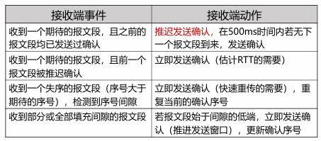

仅靠超时重发丢失的报文段，恢复太慢！    

* 快速重传：
    * 发送方可利用重复ACK检测报文段丢失：
        1. 发送方通常连续发送许多报文段
        2. 若仅有个别报文段丢失，发送方将收到多个重复序号的ACK
        3. 多数情况下IP按序交付分组，重复ACK极有可能因丢包产生
    
    >例如：TCP协议规定：        
        当发送方收到对同一序号的3次重复确认时，立即重发
    
    ```c++
    event:ACK received, with ACK field value of y 
        if (y > SendBase) { //收到更新的确认号
            SendBase= y
            if (there are currently not-yet-acknowledged segments)
                start timer 
        } 
        else { //收到重复序号的ACK
            increment count of dup ACKs received for y
            if (count of dup ACKs received for y = 3) {
                resend segment with sequence number y //快速重传
            }
        }
    ```

!!! tip "TCP与链路层中GBN/SR的对比分析"
    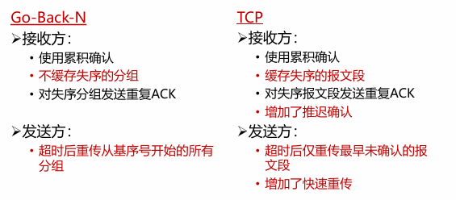{width="400"}      
    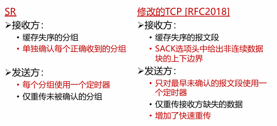{width="400"}


!!! tip "Crash Recovery"
    如果主机和路由器崩溃，或者连接持续时间较长（比如正下载一个大软件或媒体文件），这些事件的崩溃处理较为困难。          

    * 为了应对这种情况，我们首先将客户端分为以下两种状态：
        1. S0：没有未完成的段
        2. S1：发出一个段，但尚未确认

    !!! danger "注意"
        初看起来似乎很明显：当客户知道服务器崩溃时，当且仅当有一个未确认的段悬挂着时（即处于状态S1） 它才重传该段。然而，进一步探究这种天真的做法便会发现其中的困难。       

        * 例如，请考虑这样的情形：服务器的传输实体首先发送一个确认，然后在确认被发出以后再执行写操作，把数据传给应用进程。将一个段写到输出流和发送一个确认，这是两件不能同时进行的独立事件。如果在确认被发送出去之后，但是在写操作完成之前服务器崩溃了，那么客户将会接收到确认；当服务器崩溃恢复之后发出的广播消息到来的时候，该客户处于状态S0 因此客户不会重传段，因为它（不正确地）认为段己经到达服务器了。客户的这一决定将导致错失一个段。

    此刻你可能会这样想：“这个问题很容易解决，只要重新修改传输实体的程序，让它先执行写操作再发送确认即可。”你可以再试一试。请想象一下，如果写操作已经完成，但是在发送确认之前服务器崩溃了，那么，客户将处于状态S1中，因此它会重传，从而导致在服务器应用进程的数据流中出现一个未被检测出来的重复段。

    无论如何编写客户和服务器程序的代码，总是存在使协议无法正确恢复运行的情形。  

    * 服务器程序可以编成两种方式：
        1. 先发送确认
        2. 先写数据
    
    * 客户程序可以编成四种不同方法：
        1. 总是重传最后一段
        2. 永远不重传最后一段
        3. 仅当在状态S0时才重传（可以理解为收到A就重传）
        4. 仅当在状态S1时才重传（可以理解为没收到A就重传）
    
    服务器和客户两者结合起来有8种操作组合，但是正如我们将会看到的，对于每一种组合都存在一些使协议失败的事件。

    !!! tip "排列组合"
        * 服务器端可能发生 3 种事件：
            1. 发送一个确认(A)
            2. 将数据写到输出进程(W) 
            3. 崩溃(C)。
        
        * 这3种事件的发生有6种不同的顺序：AC (W) 、AWC、C(AW)、C(WA)、WAC和WC(A) , 这里的括号表示A或者W不可能发生在C的后面（即一旦崩溃那就彻底崩溃）。

        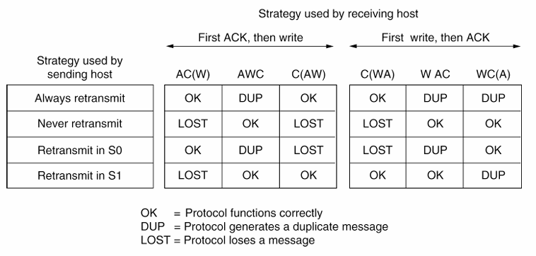
    
    !!! warning "结论"
        因为客户端没办法知道崩溃动作发生在写操作之前还是之后，所以结论是不可避免的：在事件不同步的基本规则下——即单独的事件一个接着一个发生，而不是同时发生，那么主机的崩溃和恢复就无法做到对上层透明。      

        * 简单来说，“从第N层崩溃中的恢复工作只能由第N+1层完成。并且仅当高层保留了问题发生前的足够状态信息时才有可能恢复。

### 5.3 TCP流量控制
流量控制的功能就是让发送方的发送速率不要太快，以便让接收方来得及接收，因此可以说流量控制是一个速度匹配服务（匹配发送方的发送速率与接收方的读取速率）。

* TCP的接收端：接收缓存
    1. 接收端TCP将收到的数据放入接收缓存
    2. 应用进程从接收缓存中读数据
    3. 进入接收缓存的数据不一定被立即取走、取完
    4. 如果接收缓存中的数据未及时取走，后续到达的数据可能会因缓存溢出而丢失

* 流量控制：发送端TCP通过调节发送速率，不使接收端缓存溢出

??? question "为什么GBN/SR和UDP不需要流量控制"
    * GBN和SR均假设：
        1. 正确、按序到达的分组被立即交付给上层
        2. 其占用的缓冲区被立即释放
    * 发送方根据确认序号即可知道：
        1. 哪些分组已被移出接收窗口
        2. 接收窗口还可以接受多少分组
    * 因此，GBN和SR不需要流量控制

    * UDP不保证交付：当应用进程消费数据不够快时，接收缓存溢出，报文数据丢失，UDP不负责任

* TCP如何进行流量控制：
    1. 接收缓存中的可用空间称为接收窗口：RcvWindow = RcvBuffer-[LastByteRcvd - LastByteRead]
    2. 接收方将RcvWindow放在报头中，向发送方通告接收缓存的可用空间
    3. 发送方限制未确认的字节数不超过接收窗口的大小，即：LastByteSent-LastByteAcked ≦ RcvWindow

    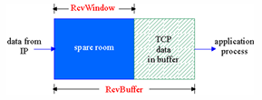

    * 特别是，当接收方通告接收窗口为0时，发送方必须停止发送

* 非零窗口通告：
    * 发送方/接收方对零窗口的处理：
        1. 发送方：当接收窗口为0时，发送方必须停止发送
        2. 接收方：当接收窗口变为非0时，接收方应通告增大的接收窗口
    * 当发送方停止发送后，接收方不再收到数据，如何触发接收端发送“非零窗口通告”呢？
    * TCP协议规定：
        1. 发送方收到“零窗口通告”后，可以发送“零窗口探测”报文段
        2. 从而接收方可以发送包含接收窗口的响应报文段

* 零窗口探测的实现：
    1. 发送端收到零窗口通告时，启动一个<font color = "red">持续计时器</font>
    2. 计时器超时后，发送端发送一个零窗口探测报文段（序号为上一个段中最后一个字节的序号）
    3. 接收端在响应的报文段中通告当前接收窗口的大小
    4. 若发送端仍收到零窗口通告，重新启动持续计时器