---

title: Chap 7 | 应用层

hide:
  #  - navigation # 显示右
  #  - toc #显示左
  #  - footer
  #  - feedback  
comments: true  #默认不开启评论

---
<h1 id="欢迎">Chap 7 | 应用层</h1>
!!! note "章节启示录"
    <!-- === "Tab 1" -->
        <!-- Markdown **content**. -->
    <!-- === "Tab 2"
        More Markdown **content**. -->
    本章节是计算机网络的第七章。有些内容可能不重要，后续应该会标注。

## 1.应用层概述
### 1.1 应用进程通信方式
* 客户/服务器（C/S, Client/Server）方式：C/S方式可以是面向连接的，也可以是无连接的
    * 面向连接时，C/S通信关系一旦建立，通信就是双向的，双方地位平等，都可发送和接收数据

* 浏览器/服务器(B/S，Browser/Server) 方式：B/S方式可以看做C/S方式的特例，即客户软件改为浏览器了
    * B/S方式通常采取3层架构实现：
        1. 数据层：由数据库服务器承担数据处理逻辑，其任务是接受Web服务器对数据库服务器提出的数据操作请求，然后由数据库服务器进行数据处理并把处理结果返回给web服务器
        2. 处理层：由Web服务器承担业务处理逻辑和页面存储管理，接受客户浏览器的任务请求，执行相应的事务处理
        3. 表现层：浏览器仅承担网页信息的浏览功能, 以超文本格式实现信息的输入和浏览
   
    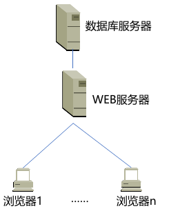{width="200"}

* 对等（P2P，Peer to Peer）方式：对等方式是指两个进程在通信时并不区分服务的请求方和服务的提供方
    * 只要两个主机都运行P2P软件，它们就可以进行平等、对等的通信
    * 双方都可以下载对方存储在硬盘中的共享文档，如果权限允许的话

## 2.域名系统
### 2.1 域名系统名字空间和层次结构
域名系统（DNS，Domain Name System）是互联网重要的基础设施
之一，向所有需要域名解析的应用提供服务，主要负责将可读性好的域名映射成IP地址。DNS系统采用客户/服务器模型，其协议运行在UDP之上，使用53号端口。
 

* 域名系统名字空间和层次结构：      
    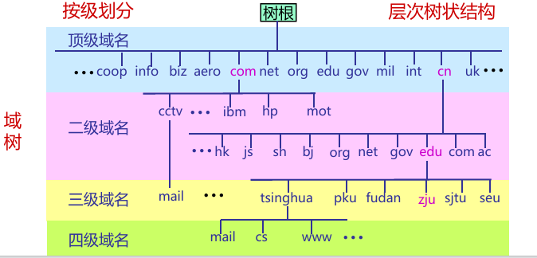{width="400"}     
    其中edu/gov既是顶级域名也是二级域名（当是美国时，edu/gov是顶级域名）

* 顶级域名TLD（TopLevel Domain）一般有三类：
    1. 国家或地区顶级域nTLD，也记为ccTLD(cc:country code)

        >例如.cn 表示中国，.us表示美国，.uk表示英国。目前有300多个

    2. 基础设施域.arpa(Address and Routing Parameter Area)

        >专用于Internet基础设施目的，目前有二级域ip6.arpa；iris.arpa；in-addr.arpa；uri.arpa；urn.arpa；home.arpa；as112.arpa；in-addr-servers.arpa；ipv4only.arpa等

    3. 通用顶级域gTLD

* 国家顶级域名.cn下的二级域名分为三类：
    1. 类别域名7个
    2. 行政区域名34个
    3. 无类别域名：例如www.google.cn、www.tianya.cn等

* 域名的管理：域名管理机构分级负责域名注册
    1. .edu.cn下三级域名注册由CERNET负责
    2. 我国的其它二级域名注册由中国互联网络信息中心(CNNIC)负责

### 2.2 域名服务器

* 域名服务器：
    * 名字服务器的管辖范围以“区”为单位，而不是以“域”为单位（一个区可能是整个域，也可能只是一部分）      
    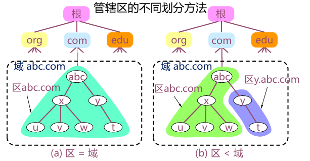{width="450"}

    * 域名系统的名字服务器分为两大类：
        1. 权威名字服务器(authoritative name server)：一种根据本地知识知道一个DNS区(zone)的内容的服务器，它可以回答有关该DNS区的查询而无需查询其他服务器
        2. 递归解析器(recursive resolver)/递归服务器： 以递归方式运行的、使用户程序联系域(domain)名字服务器的程序。

    * 根据对应域的层次，权威名字服务器又进一步分为以下类别
        1. 根名字服务器(rootnameserver) /根服务器(root server)
        2. 顶级域名字服务器(TLDnameserver)
        3. 二级域名字服务器(secondlevel domain name server)
        4. 三级域名字服务器(thirdlevel domain name server)，也成为本地域名服务器。

    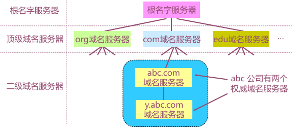{width="350"}

* 根服务器：        
    * 根服务器是最高层次的名字服务器，每个根服务器都知道所有的顶级域名服务器的域名及其IP地址（只知道顶级域名服务器在哪里）
    * 根服务器并不直接把主机用户所查的域名转换成IP地址
    * 根服务器共有13套(不是13台机器)，这些根服务器相应的域名分别是：a.rootservers.net－ m.rootservers.net。更改根服务器数据只在a.rootservers.net上进行，然后同步到另外12套中，这样既能保证数据一致性，也提高了域名服务可靠性

* 顶级域名字服务器：    
    * 顶级域(TLD)名字服务器负责管理在该顶级域名服务器注册的所有二级域名
    * 当收到DNS查询请求时就给出相应的回答（可能是最后的结果，也可能是下一步应当找的二级域名字服务器的IP地址）

* 二级域名服务器：
    * 每一个主机都必须在某个二级域名字服务器处注册登记。因此二级域名字服务器知道其管辖的主机名应当转换成什么IP地址
    * 每个区设置相应的权威名字服务器，用来保存该区中的所有主机的域名到IP地址的映射

* 递归解析器/递归服务器：（其实也就是本地域名字服务器）
    * 每一个Internet服务提供者ISP(Internet Service Provider), 都至少有一个递归服务器，距离用户主机较近

### 2.3 域名解析过程

* 域名解析过程：当某一应用进程需要进行域名解析时，该应用进程将域名放在DNS请求报文（UDP数据报, 端口号为53）发给递归服务器（使用UDP是为了减少开销）。递归服务器得到查询结果后, 将对应IP地址放在应答报文中返回给应用进程
    1. 递归查询：   
        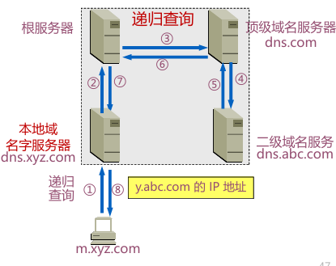{width="350"}

    2. 迭代查询：   
        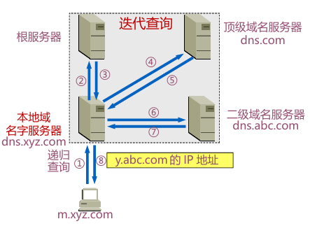{width="350"}

    >

    * 主机向递归解析器/本地域名字服务器的查询一般采用递归查询
    * 递归解析器/本地域名字服务器向根服务器可以采用递归查询，但一般优先采用迭代查询

### 2.4 域名系统查询和响应

* 常用的资源(Resource)类型：    
    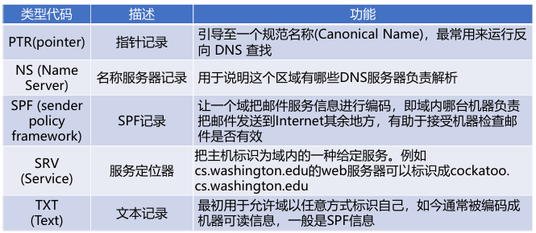{width="400"}

* DNS报文格式:
    * 分为三部分：基础结构(报文首部)、问题、资源记录(RR,ResourceRecord)
    * 报文类型分为查询请求(query)和查询响应(reply)两类，请求和响应的报文结构基本相同

    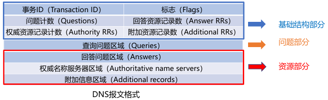

    ??? tip "报文字段的解释"
        * 事务ID：DNS报文的ID标识。对于请求报文和其对应的响应报文，该字段的值是相同的。通过它可以区分DNS 应答报文是对哪个请求进行响应的
        * 标志：        
            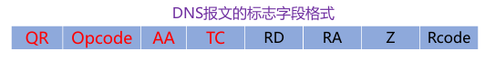           
            1. QR（Query/Response）：查询请求/响应的标志信息。查询请求时值为0；响应时值为1
            2. Opcode：操作码。其中，0表示标准查询；1表示反向查询；2表示服务器状态请求
            3. AA（Authoritative）：授权应答，该字段在响应报文中有效。值为1时表示名称服务器是权威服务器；值为0时表示不是权威服务器
            4. TC（Truncated）：表示是否被截断。值为1时，表示响应已超过512字节并已被截断，只返回前512个字节     
            5. RD（Recursion Desired）：期望递归。该字段能在一个查询中设置，并在响应中返回。该标志告诉域名服务器必须处理这个查询，这种方式被称为一个递归查询。如果该位为0，且被请求的域名服务器没有一个授权回答，它将返回一个能解答该查询的其他域名服务器列表。这种方式被称为迭代查询
            6. RA（Recursion Available）：可用递归。该字段只出现在响应报文中。当值为1时，表示服务器支持递归查询
            7. Z：保留字段，在所有的请求和响应报文中，它的值必须为0    
            8. Rcode（Reply code）：返回码字段，表示响应的差错状态。
            
        * 问题计数：DNS查询请求的数目
        * 回答资源记录数：DNS响应的数目
        * 权威资源记录数：权威资源记录的数目
        * 附加资源记录数：额外的记录数目（权威名字服务器对应IP地址的数目）

### 2.5 域名系统高速缓存
为提高DNS查询效率，并减轻根域名服务器的负荷和减少Internet上的DNS查询报文数量，域名服务器广泛使用高速缓存，用来存放最近查询过的域名以及从何处获得域名映射信息的记录。

>例如不久前已有用户查询过域名为y.abc.com的IP地址，则本地域名服务器/递归解析器就不必再向根域名服务器重新查询y.abc.com的IP地址了，而是直接把高速缓存中存放的上次查询结果（即y.abc.com的IP地址）告诉用户

??? question "What happens from opening a URL in a browser to the website being displayed?"
    * 输入一个URL，浏览器会找出域名
    * 解析域名在哪里，问本地域名服务器，先去查高速缓存，若无就去问根域名服务器（有镜像），得到顶级域名服务器地址，继续迭代查询
    * DNS是一个UDP，端口在53号，通过UDP查询，运行在IPv6上，取决于用的是Wifi/Ethernet……

## 3.电子邮件
电子邮件（E-mail）是自早期Internet出现以来最广泛的应用，是一种异步通讯媒介

* 电子邮件系统体系结构：
    1.  用户代理（user agent）——邮件客户端
    2.  传输代理（message transfer agent）——邮件服务器
    3.  简单邮件传输协议SMTP（Simple Mail Transfer  Protocol）——邮件服务器之间传递邮件使用的协议

    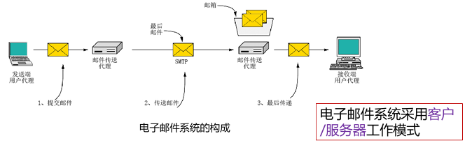{width="450"}

* 邮箱是邮件服务器中的一块内存区域，其标识即为电子邮件地址（邮箱名）

* 用户代理：是一个程序，用户通过它和电子邮件系统交互
    * 功能：
        1. 显示入境邮件信息
        2. 邮件处置
        3. 自动处理邮件
        4. 发送邮件
        5. 邮件列表

* 邮件传输：邮件传输采用的协议是SMTP。SMTP利用TCP可靠地从客户向服务器传递邮件，使用端口25。
    * 直接投递: 发送端直接到接收端
    * SMTP的3个阶段：连接建立、邮件传送、连接关闭
    * 命令/响应（以HTTP为例）
        * 命令: ASCII字符串
        * 响应: 状态码+短语
    * SMTP是一个简单的ASCII协议，邮件必须为7位ASCII

??? example "一个例子🌰"
          

    ① Alice使用用户代理撰写发送给Bob@someschool.edu的邮件       
    ② Alice的用户代理发送邮件到她的邮件服务器；邮件存放在邮件队列       
    ③ SMTP客户端打开与Bob的邮件服务器的TCP连接      
    ④ SMTP客户端通过TCP连接发送Alice的邮件      
    ⑤ Bob的邮件服务器把邮件存放在Bob的邮箱      
    ⑥ Bob调用他的用户代理来读取邮件     

* SMTP的不足
    1. 不包括认证
    2. 传输ASCII而不是二进制数据
    3. 邮件以明文形式出现

* 邮件格式：
    1. 首部（header）必须含有一个From:首部行和一个To:首部行，还可以包含Subject: 等其他可选的首部行
    2. 消息体（body）指邮件正文

    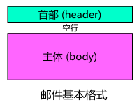{width="150"}

* RFC 5322—Internet邮件格式：
    * 相关头字段：
        1. cc：抄送
        2. bcc：密送

* MIME：MIME沿用了RFC 822格式，但是加入了消息体结构，定义了非ASCII消息编码规则。当发送端发送的邮件中包含有非ASCII码数据时，不能直接使用SMTP进行传送，而要通过MIME进行转换，将非ASCII码数据转换为ASCII码数据。

* 最后传递：邮件已经到达Bob的邮箱，接下来的工作就是将邮件的一个副本传送到Bob的用户代理以便显示
    * 最终交付（邮件访问）协议: 从邮件服务器的邮箱中获取邮件
        1. POP3：Post Office Protocol-Version 3，第三版邮局协议
        2. IMAP：Internet Message Access Protocol，Internet邮件访问协议
        3. Webmail（HTTP）：基于Web的电子邮件

    

* POP3协议：当用户代理打开一个到端口110上的TCP连接后，客户/服务器开始工作。POP3的三个阶段：
    1.  认证(Authorization)：处理用户登录的过程
    2.  事务处理(Trnsactions)：用户收取电子邮件，并将邮件标记为删除
    3.  更新(Update)：将标为删除的电子邮件删除

* IMAP：是较早使用的最终交付协议—POP3(邮局协议，版本3)的改进版。
    * IMAP服务器把每个邮件与一个文件夹联系起来，当邮件第一次到达服务器时，它与收件人的INBOX文件夹相关联。收件人能够把邮件移到一个新的、用户创建的文件夹中，阅读邮件，删除邮件等

* Webmail：基于Web的电子邮件
    *  提供电子邮件服务的IMAP和SMTP替代方案
    *  使用Web作为界面，用户代理就是普通的浏览器
    *  用户及其远程邮箱之间的通信通过HTTP进行

    

## 4.WWW
WWW=World Wide Web=万维网。HTTP服务器和客户端，以及它们之间执行的HTTP协议

* 服务器
    1. Web页面（HTML文档）：包含到多种对象或链接
    2. Web对象（包括：静态对象和动态对象）：可以是HTML文档、图像文件、视频文件、声音文件、脚本文件等
    3. 对象用URL（统一资源定位符）编址：协议类型://主机名:端口//路径和文件名
* 客户端
    1. 发出请求、接收响应、解释HTML文档并显示
    2. 有些对象需要浏览器安装插件

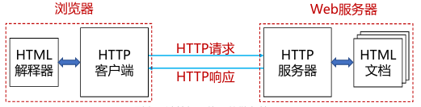{width="400"}

* 统一资源定位器URLs：  

    >例如：http://www.phdcomics.com:8000/comics.php

    * 端口不一定需要，因为浏览器会内设置一些。

    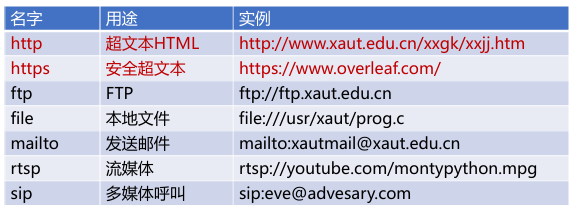{width="400"}

* Web对象：
    1. 静态对象与静态网页
    2. 动态对象与动态网页
    3. 链接

* HTML和XML：   
    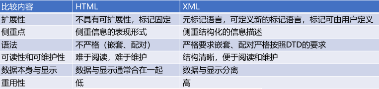