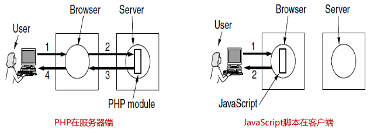
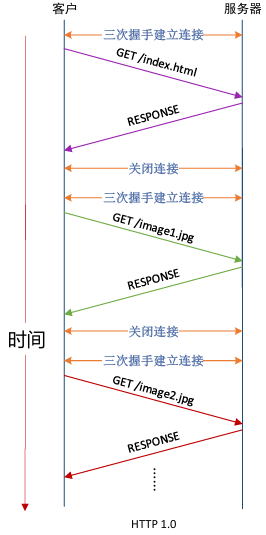
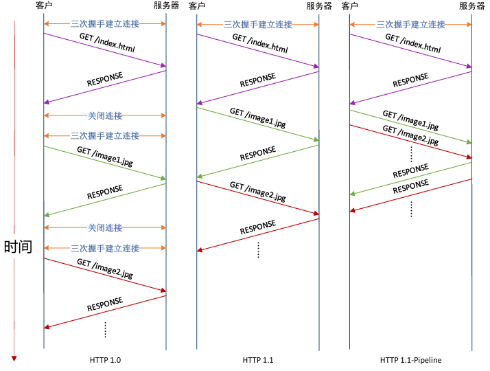
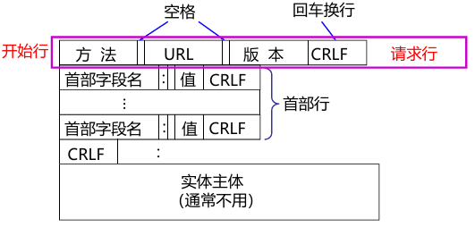
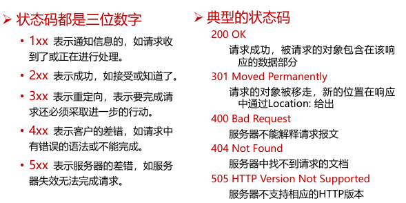
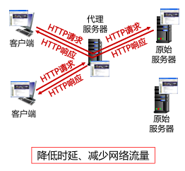
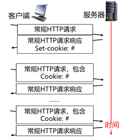
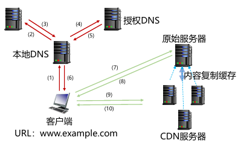

---

title: Chap 7 | 应用层

hide:
  #  - navigation # 显示右
  #  - toc #显示左
  #  - footer
  #  - feedback  
comments: true  #默认不开启评论

---
<h1 id="欢迎">Chap 7 | 应用层</h1>
!!! note "章节启示录"
    <!-- === "Tab 1" -->
        <!-- Markdown **content**. -->
    <!-- === "Tab 2"
        More Markdown **content**. -->
    本章节是计算机网络的第七章。有些内容可能不重要，后续应该会标注。

## 1.应用层概述
### 1.1 应用进程通信方式
* 客户/服务器（C/S, Client/Server）方式：C/S方式可以是面向连接的，也可以是无连接的
    * 面向连接时，C/S通信关系一旦建立，通信就是双向的，双方地位平等，都可发送和接收数据

* 浏览器/服务器(B/S，Browser/Server) 方式：B/S方式可以看做C/S方式的特例，即客户软件改为浏览器了
    * B/S方式通常采取3层架构实现：
        1. 数据层：由数据库服务器承担数据处理逻辑，其任务是接受Web服务器对数据库服务器提出的数据操作请求，然后由数据库服务器进行数据处理并把处理结果返回给web服务器
        2. 处理层：由Web服务器承担业务处理逻辑和页面存储管理，接受客户浏览器的任务请求，执行相应的事务处理
        3. 表现层：浏览器仅承担网页信息的浏览功能, 以超文本格式实现信息的输入和浏览
   
    {width="200"}

* 对等（P2P，Peer to Peer）方式：对等方式是指两个进程在通信时并不区分服务的请求方和服务的提供方
    * 只要两个主机都运行P2P软件，它们就可以进行平等、对等的通信
    * 双方都可以下载对方存储在硬盘中的共享文档，如果权限允许的话

## 2.域名系统
### 2.1 域名系统名字空间和层次结构
域名系统（DNS，Domain Name System）是互联网重要的基础设施
之一，向所有需要域名解析的应用提供服务，主要负责将可读性好的域名映射成IP地址。DNS系统采用客户/服务器模型，其协议运行在UDP之上，使用53号端口。
 

* 域名系统名字空间和层次结构：      
    {width="400"}     
    其中edu/gov既是顶级域名也是二级域名（当是美国时，edu/gov是顶级域名）

* 顶级域名TLD（TopLevel Domain）一般有三类：
    1. 国家或地区顶级域nTLD，也记为ccTLD(cc:country code)

        >例如.cn 表示中国，.us表示美国，.uk表示英国。目前有300多个

    2. 基础设施域.arpa(Address and Routing Parameter Area)

        >专用于Internet基础设施目的，目前有二级域ip6.arpa；iris.arpa；in-addr.arpa；uri.arpa；urn.arpa；home.arpa；as112.arpa；in-addr-servers.arpa；ipv4only.arpa等

    3. 通用顶级域gTLD

* 国家顶级域名.cn下的二级域名分为三类：
    1. 类别域名7个
    2. 行政区域名34个
    3. 无类别域名：例如www.google.cn、www.tianya.cn等

* 域名的管理：域名管理机构分级负责域名注册
    1. .edu.cn下三级域名注册由CERNET负责
    2. 我国的其它二级域名注册由中国互联网络信息中心(CNNIC)负责

### 2.2 域名服务器

* 域名服务器：
    * 名字服务器的管辖范围以“区”为单位，而不是以“域”为单位（一个区可能是整个域，也可能只是一部分）      
    {width="450"}

    * 域名系统的名字服务器分为两大类：
        1. 权威名字服务器(authoritative name server)：一种根据本地知识知道一个DNS区(zone)的内容的服务器，它可以回答有关该DNS区的查询而无需查询其他服务器
        2. 递归解析器(recursive resolver)/递归服务器： 以递归方式运行的、使用户程序联系域(domain)名字服务器的程序。

    * 根据对应域的层次，权威名字服务器又进一步分为以下类别
        1. 根名字服务器(rootnameserver) /根服务器(root server)
        2. 顶级域名字服务器(TLDnameserver)
        3. 二级域名字服务器(secondlevel domain name server)
        4. 三级域名字服务器(thirdlevel domain name server)，也成为本地域名服务器。

    {width="350"}

* 根服务器：        
    * 根服务器是最高层次的名字服务器，每个根服务器都知道所有的顶级域名服务器的域名及其IP地址（只知道顶级域名服务器在哪里）
    * 根服务器并不直接把主机用户所查的域名转换成IP地址
    * 根服务器共有13套(不是13台机器)，这些根服务器相应的域名分别是：a.rootservers.net－ m.rootservers.net。更改根服务器数据只在a.rootservers.net上进行，然后同步到另外12套中，这样既能保证数据一致性，也提高了域名服务可靠性

* 顶级域名字服务器：    
    * 顶级域(TLD)名字服务器负责管理在该顶级域名服务器注册的所有二级域名
    * 当收到DNS查询请求时就给出相应的回答（可能是最后的结果，也可能是下一步应当找的二级域名字服务器的IP地址）

* 二级域名服务器：
    * 每一个主机都必须在某个二级域名字服务器处注册登记。因此二级域名字服务器知道其管辖的主机名应当转换成什么IP地址
    * 每个区设置相应的权威名字服务器，用来保存该区中的所有主机的域名到IP地址的映射

* 递归解析器/递归服务器：（其实也就是本地域名字服务器）
    * 每一个Internet服务提供者ISP(Internet Service Provider), 都至少有一个递归服务器，距离用户主机较近

### 2.3 域名解析过程

* 域名解析过程：当某一应用进程需要进行域名解析时，该应用进程将域名放在DNS请求报文（UDP数据报, 端口号为53）发给递归服务器（使用UDP是为了减少开销）。递归服务器得到查询结果后, 将对应IP地址放在应答报文中返回给应用进程
    1. 递归查询：   
        {width="350"}

    2. 迭代查询：   
        {width="350"}

    >

    * 主机向递归解析器/本地域名字服务器的查询一般采用递归查询
    * 递归解析器/本地域名字服务器向根服务器可以采用递归查询，但一般优先采用迭代查询

### 2.4 域名系统查询和响应

* 常用的资源(Resource)类型：    
    {width="400"}

* DNS报文格式:
    * 分为三部分：基础结构(报文首部)、问题、资源记录(RR,ResourceRecord)
    * 报文类型分为查询请求(query)和查询响应(reply)两类，请求和响应的报文结构基本相同

    

    ??? tip "报文字段的解释"
        * 事务ID：DNS报文的ID标识。对于请求报文和其对应的响应报文，该字段的值是相同的。通过它可以区分DNS 应答报文是对哪个请求进行响应的
        * 标志：        
                       
            1. QR（Query/Response）：查询请求/响应的标志信息。查询请求时值为0；响应时值为1
            2. Opcode：操作码。其中，0表示标准查询；1表示反向查询；2表示服务器状态请求
            3. AA（Authoritative）：授权应答，该字段在响应报文中有效。值为1时表示名称服务器是权威服务器；值为0时表示不是权威服务器
            4. TC（Truncated）：表示是否被截断。值为1时，表示响应已超过512字节并已被截断，只返回前512个字节     
            5. RD（Recursion Desired）：期望递归。该字段能在一个查询中设置，并在响应中返回。该标志告诉域名服务器必须处理这个查询，这种方式被称为一个递归查询。如果该位为0，且被请求的域名服务器没有一个授权回答，它将返回一个能解答该查询的其他域名服务器列表。这种方式被称为迭代查询
            6. RA（Recursion Available）：可用递归。该字段只出现在响应报文中。当值为1时，表示服务器支持递归查询
            7. Z：保留字段，在所有的请求和响应报文中，它的值必须为0    
            8. Rcode（Reply code）：返回码字段，表示响应的差错状态。
            
        * 问题计数：DNS查询请求的数目
        * 回答资源记录数：DNS响应的数目
        * 权威资源记录数：权威资源记录的数目
        * 附加资源记录数：额外的记录数目（权威名字服务器对应IP地址的数目）

### 2.5 域名系统高速缓存
为提高DNS查询效率，并减轻根域名服务器的负荷和减少Internet上的DNS查询报文数量，域名服务器广泛使用高速缓存，用来存放最近查询过的域名以及从何处获得域名映射信息的记录。

>例如不久前已有用户查询过域名为y.abc.com的IP地址，则本地域名服务器/递归解析器就不必再向根域名服务器重新查询y.abc.com的IP地址了，而是直接把高速缓存中存放的上次查询结果（即y.abc.com的IP地址）告诉用户

??? question "What happens from opening a URL in a browser to the website being displayed?"
    * 输入一个URL，浏览器会找出域名
    * 解析域名在哪里，问本地域名服务器，先去查高速缓存，若无就去问根域名服务器（有镜像），得到顶级域名服务器地址，继续迭代查询
    * DNS是一个UDP，端口在53号，通过UDP查询，运行在IPv6上，取决于用的是Wifi/Ethernet……

## 3.电子邮件
电子邮件（E-mail）是自早期Internet出现以来最广泛的应用，是一种异步通讯媒介

* 电子邮件系统体系结构：
    1.  用户代理（user agent）——邮件客户端
    2.  传输代理（message transfer agent）——邮件服务器
    3.  简单邮件传输协议SMTP（Simple Mail Transfer  Protocol）——邮件服务器之间传递邮件使用的协议

    {width="450"}

* 邮箱是邮件服务器中的一块内存区域，其标识即为电子邮件地址（邮箱名）

* 用户代理：是一个程序，用户通过它和电子邮件系统交互
    * 功能：
        1. 显示入境邮件信息
        2. 邮件处置
        3. 自动处理邮件
        4. 发送邮件
        5. 邮件列表

* 邮件传输：邮件传输采用的协议是SMTP。SMTP利用TCP可靠地从客户向服务器传递邮件，使用端口25。
    * 直接投递: 发送端直接到接收端
    * SMTP的3个阶段：连接建立、邮件传送、连接关闭
    * 命令/响应（以HTTP为例）
        * 命令: ASCII字符串
        * 响应: 状态码+短语
    * SMTP是一个简单的ASCII协议，邮件必须为7位ASCII

??? example "一个例子🌰"
          

    ① Alice使用用户代理撰写发送给Bob@someschool.edu的邮件       
    ② Alice的用户代理发送邮件到她的邮件服务器；邮件存放在邮件队列       
    ③ SMTP客户端打开与Bob的邮件服务器的TCP连接      
    ④ SMTP客户端通过TCP连接发送Alice的邮件      
    ⑤ Bob的邮件服务器把邮件存放在Bob的邮箱      
    ⑥ Bob调用他的用户代理来读取邮件     

* SMTP的不足
    1. 不包括认证
    2. 传输ASCII而不是二进制数据
    3. 邮件以明文形式出现

* 邮件格式：
    1. 首部（header）必须含有一个From:首部行和一个To:首部行，还可以包含Subject: 等其他可选的首部行
    2. 消息体（body）指邮件正文

    {width="150"}

* RFC 5322—Internet邮件格式：
    * 相关头字段：
        1. cc：抄送
        2. bcc：密送

* MIME：MIME沿用了RFC 822格式，但是加入了消息体结构，定义了非ASCII消息编码规则。当发送端发送的邮件中包含有非ASCII码数据时，不能直接使用SMTP进行传送，而要通过MIME进行转换，将非ASCII码数据转换为ASCII码数据。

* 最后传递：邮件已经到达Bob的邮箱，接下来的工作就是将邮件的一个副本传送到Bob的用户代理以便显示
    * 最终交付（邮件访问）协议: 从邮件服务器的邮箱中获取邮件
        1. POP3：Post Office Protocol-Version 3，第三版邮局协议
        2. IMAP：Internet Message Access Protocol，Internet邮件访问协议
        3. Webmail（HTTP）：基于Web的电子邮件

    

* POP3协议：当用户代理打开一个到端口110上的TCP连接后，客户/服务器开始工作。POP3的三个阶段：
    1.  认证(Authorization)：处理用户登录的过程
    2.  事务处理(Trnsactions)：用户收取电子邮件，并将邮件标记为删除
    3.  更新(Update)：将标为删除的电子邮件删除

* IMAP：是较早使用的最终交付协议—POP3(邮局协议，版本3)的改进版。
    * IMAP服务器把每个邮件与一个文件夹联系起来，当邮件第一次到达服务器时，它与收件人的INBOX文件夹相关联。收件人能够把邮件移到一个新的、用户创建的文件夹中，阅读邮件，删除邮件等

* Webmail：基于Web的电子邮件
    *  提供电子邮件服务的IMAP和SMTP替代方案
    *  使用Web作为界面，用户代理就是普通的浏览器
    *  用户及其远程邮箱之间的通信通过HTTP进行

    

## 4.WWW
WWW=World Wide Web=万维网。HTTP服务器和客户端，以及它们之间执行的HTTP协议

* 服务器
    1. Web页面（HTML文档）：包含到多种对象或链接
    2. Web对象（包括：静态对象和动态对象）：可以是HTML文档、图像文件、视频文件、声音文件、脚本文件等
    3. 对象用URL（统一资源定位符）编址：协议类型://主机名:端口//路径和文件名
* 客户端
    1. 发出请求、接收响应、解释HTML文档并显示
    2. 有些对象需要浏览器安装插件

{width="400"}

* 统一资源定位器URLs：  

    >例如：http://www.phdcomics.com:8000/comics.php

    * 端口不一定需要，因为浏览器会内设置一些。

    {width="400"}

* Web对象：
    1. 静态对象与静态网页
    2. 动态对象与动态网页
    3. 链接

* HTML和XML：   
    

* 动态Web概述：
    * 通用网关接口CGI (*.cgi)
    * 脚本语言+数据库技术(*.php, *.asp, *.aspx)
    * 客户端动态网页（*.js）

* 通用网关接口CGI：是一种标准，是一段程序，直接运行在服务器上，连接 server 和 data base on disk

* “脚本”指的是一个程序，它被另一个程序（即解释程序，如
Web浏览器）解释执行，而不是由计算机的处理器来解释或执行

* 动态Web的执行：       
    

* HTTP概述：
    1. HTTP为无状态协议，服务器端不保留之前请求的状态信息           
        * 无状态协议：效率低、但简单
        * 有状态协议：维护状态相对复杂，需要维护历史信息，在客户端或服务器出现故障时，需要保持状态的一致性等

* HTTP1.0执行过程：
    1. 假设用户输入URL http://www.nankai.edu.cn/computer/index.html
    2. 如该页面包含2幅jpg图像
        * 需要执行三次完整的连接过程（即：连接的建立，数据传输，连接终止），包含三次TCP过程（含三次HTTP过程）
        * 每次都需要三次握手连接建立
        * Request （Get /index.html）
        * Respone
        * 关闭连接

    

    * 如果有100副图像，就特别低效

* 改进方式：非持久连接和持久连接(HTTP1.x)
    * 非持久连接：HTTP/1.0缺省为非持久连接
        * 服务器接收请求、响应、关闭TCP连接
        * 获取每个对象需要两阶段
            1. 建立TCP连接
            2. 对象请求和传输
        * 每次连接需要经历TCP慢启动阶段
    * 持久连接：HTTP/1.1缺省为持久连接
        * 在相同的TCP连接上，服务器接收请求、响应；再接收请求、响应；响应后保持连接
        * HTTP/1.1支持流水线机制
            1. 需要按序响应
        * 经历较少的慢启动过程，减少往返时间
            1. 降低响应时间

* HTTP 1.x 比较：
    {width="400"}

!!! question "思考题"
    *  Suppose within your Web browser you click on a link to obtain a Web page. Suppose that the IP address for the associated URL is not cached in your local host, so that a DNS lookup is necessary to obtain the IP address. Suppose that n DNS servers are visited before your host receives the IP address from DNS; the successive visits incur an RTT of RTT1, ..., RTTn. Further suppose that the Web page associated with the link contains exactly one object, a small amount of HTML text. Let RTT0 denote the RTT between the local host and the server containing the object. Assuming zero transmission time of the object, how much time elapses from when the client clicks on the link until the client receives the object?

        * 获取IP地址总时间为：RTT1+……+RTTn（因为这里假设是UDP，所以不需要×2）
        * 知道IP地址后，需要需要有一个RTT0的时间用来建立TCP链接，再来一个RTT0时间用来请求、接受对象，总响应时间为 2RTT0

    * Suppose the HTML file indexes three very small objects on the same server. Neglecting transmission times, how much time elapses with          
    (1) Multiple HTTP connections and sequential requests,          
    (2) persistent HTTP connection and sequential requests,         
    (3) persistent HTTP connection and pipelined requests       
        1. 每次没有并行TCP连接的每个object都得单独消耗2RTT0
        2. 如果为并行，那么三个object都可以同时发送并接受
        3. 持续HTTP就认为请求和传输同时发生，所有2RTT0的时间变为RTT0

* HTTP报文结构
    

    * 报文由三个部分组成，即开始行、首部行和实体主体
    1. 在请求报文中，开始行就是请求行
    2. 方法是对所请求的对象进行的操作，实际上也就是一些命令
        * 请求报文的类型是由它所采用的方法决定的
    3. “URL”是所请求资源的URL
    4. 在响应报文中，开始行就是状态行。状态码都是三位数字       
        {width="400"}
    
* Web缓存技术与Web代理
    * 浏览器缓存（只能缓存该用户曾经访问过的）
        1. 目标：再次访问缓存在浏览器主机中的Web页副本，不必从原始服务器读取
        2. 怎么保证Web页副本与原始服务器是一致的？
   
        
    
    * Web代理服务器缓存（可以跨用户）
        1. 目标：代理服务器缓存已访问过的Web页副本，满足用户浏览器从代理服务器提取Web页，尽量减少原始服务器参与
        2. 设置用户浏览器，通过代理服务器进行Web访问

        

    * 启发式策略：服务器响应Web页的Last-Modified头和Expires头启发，原始Web页一段时间没更改，最近一段时间也不会更改。Expires头很少用
    * 询问式策略：通过特殊的关键字头询问原始服务器，Web副本是否已更新
    
* Web安全与隐私：访问安全（不高效且麻烦）
    * 无状态：客户端需要在每个请求中携带认证信息
    * 认证方法：通常在HTTP请求中使用“用户名-密码”
    * 每个请求头中包含关键字authorization:
    * 如果请求头中无authorization: ，则服务器拒绝访问，并在响应头中包含WWW authenticate：WWW authenticate

* Web安全与隐私：Cookie。HTTP无状态协议，服务器用cookies保持用户状态
    * HTTP在响应的首部行里使用一个关键字头set-cookie：选择的cookie号具有唯一性
    * 后继的HTTP请求中使用服务器响应分配的cookie
    * Cookie文件保存在用户的主机中，内容是服务器返回的一些附加信息，由用户主机中的浏览器管理
    * Web服务器建立后端数据库，记录用户信息，cookie作为关键字

    >例如：         
    – Set-Cookie: SID=31d4d96e407aad42; Path=/;               
        Domain=example.com      
    – Cookie: SID=31d4d96e407aad42

    

## 5.流式音频和视频
* 常见的流媒体服务
    1. 点播
    2. 直播
    3. 实时交互

* 数字音视频与编码
    1. MPEG视频压缩
    2. MPEG的输出包括3类帧
        1. 帧内编码帧（I帧）：包含了压缩的静止图片（帧内编码，用JPEG来压缩静止图像）。 I帧必须周期性地出现在媒体流中
        2. 预测帧（P帧）：是与前一帧的逐块差值（帧间编码，消除跨帧的冗余度）
        3. 双向帧（B帧）：是与前一帧和后一帧的逐块差值（帧间编码）

* 直播与实时音视频
    1. 一种是信令协议，对建立的连接起控制作用，如RTSP
    2. 一种是数据分组传送协议，使音/视频能够以时延敏感属性传送，如RTP/RTCP

    >

    * 使用TCP，还是UDP？（实际流媒体系统往往先尝试UDP，如果失败则转为TCP）
        1. UDP不可靠但效率高，更适合实时类应用
        2. UDP需要自行实现流控算法，增加了成本和复杂性
        3. UDP传输音视频可能会被路由器丢弃或防火墙阻拦，而TCP可以畅通无阻

* 实时流式协议RTSP (Real-Time Streaming Protocol)控制协议
    1. RTSP本身并不传送数据，是一个多媒体播放控制协议
    2. RTSP对用户下载的实时数据的播放情况进行控制，如：暂停/继续、后退、前进等。又称为“互联网录像机遥控协议”

* 实时传输协议RTP (Real-time Transport Protocol)一般认为是传输层协议，对服务质量不作保证

* 实时传输控制协议RTCP (RTP Control Protocol) ：是RTP的补充，可以堪称是RTP的助手，做服务质量的监控和反馈

* 网页实时通信WebRTC（Web Real-Time Communication）
    1. 由Google发起的实时音视频通信开源项目
    2. 建立浏览器之间点对点的连接，实现音/视频流的传输

* 流媒体动态自适应传输
    * 视频传输优化的挑战
        1. 客户端基于当前网络状况，向服务器请求视频块
        2. 若视频块的码率>可用带宽：视频块难以及时抵达客户端，出现卡顿
        3. 若视频块的码率<可用带宽：视频质量较低，没有充分利用带宽资源
    * DASH (Dynamic Adaptive Streaming over HTTP)：动态自适应流媒体传输协议：DASH中普遍使用的自适应码率ABR（Adaptive bitrate）

## 6.内容分发
如何把众多的视频内容分发给用户？

* 服务器群和Web代理
    1. 服务器群支持大规模Web服务器
        1. 前端负责服务器请求的负载均衡
        2. 服务器访问相同的后端数据库

    2. 代理缓存帮助组织扩展Web
        1. 将服务器内容缓存到客户上以提高性能
        2. 实现组织的策略(如访问策略)

* 内容分发网络CDN
    * 问题：怎样将内容（如从百万的视频中选定的内容）分发给同时发起访问的数百万用户？单个、大型的服务器会导致单点故障、网络拥塞、远程用户的长路径（可扩展性很差）
    * 基本思想源于MIT对Web服务瞬间拥塞问题的解决
        1. 一种Web缓存系统，靠近网络边缘（用户）提供内容服务
        2. 目前提供更丰富的服务，包括静态内容、流媒体、用户上传视频等
    * 主要优点
        1. 降低响应时延，避免网络拥塞
        2. 避免原始服务器过载及防止DDoS攻击
        3. 分布式架构，具有良好的可扩展性
        4. 对用户透明，无需用户感知
    * DNS辅助实现CDN
        
* P2P网络实现内容分发：
    1. P2P文件分发协议：BitTorrent
        * 文件被划分为256Kb大小的块
        * 具有种子(torrents)的节点发送或接收文件

## 7.其它应用层协议

* Telnet：服务器进程默认监听TCP23端口

* FTP：使用C/S方式实现
    1. 控制连接：在整个会话期间一直保持，客户进程发出的文件传输请求通过控制连接发送给服务器控制进程（工作在TCP21端口），但控制连接不用来传输文件
    2. 数据连接：服务器控制进程在接收到客户进程发送来的文件传输请求后就创建数据传输进程（工作在TCP20端口）和数据连接

* TFTP
    1. TFTP的工作过程类似停止-等待协议。
    2. 开始工作时，TFTP客户进程发送一个读请求PDU或写请求PDU给TFTP服务器进程，其UDP端口号为69

* SNMP
    1. 尽可能简单：使用UDP
    2. 影响尽量小：网络中任何软硬件的增减对原有管理对象的影响尽量小