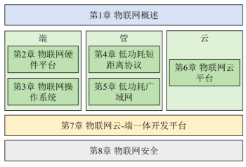
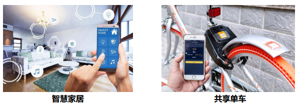
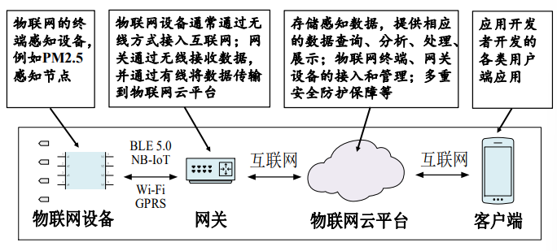
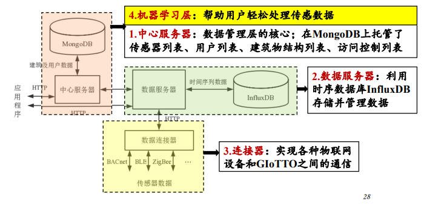
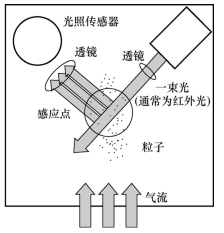

---

title: Chap 1 | Introduction

hide:
  #  - navigation # 显示右
  #  - toc #显示左
  #  - footer
  #  - feedback  
comments: true  #默认不开启评论

---

<h1 id="欢迎">Chap 1 | 物联网概述</h1>

!!! note "章节启示录"
    <!-- === "Tab 1" -->
        <!-- Markdown **content**. -->
    <!-- === "Tab 2"
        More Markdown **content**. -->
    本章节是物联网基础的第一章。

了解和掌握物联网“端-管-云”主流技术和开发工具，掌握快速开发物联网应用的能力      
{width="300"}

## 1.物联网的定义和发展趋势
定义：物联网就是物理设备以及其他嵌入了电子器件、软件、传感器的物件组成的网络。这些物件具有感知能力、计算能力以及连接能力，从而能更直接地将物理世界集成到数字世界中。   
{width="400"}

起源和发展：   

1. 1995年，比尔·盖茨（Bill Gates）在《未来之路》一书中提出了物物互联的基本思想  
2. 2005年，国际电信联盟指出，无所不在的“物联网”通信时代即将来临。  
3. 2009年，IBM公司提出了“智慧地球”的概念。  
4. 同年，中国提出了“感知中国”的概念。  
5. 近年来，人工智能技术赋能物联网(AloT)具有广阔发展前景，人类社会将迈向万物智联
## 2.物联网的应用架构及挑战
* 典型物联网应用架构   
{width="400"}  
部分常见的设备、平台与软件：传感器、开发板(RIOT)、网络设备、云服务(开源软件：ThingsBoard)
* 挑战1：开发链长。一个完整的物联网应用包括嵌入式开发、云平台开发以及用户端开发
，涉及嵌入式、前端、后端等不同开发技术，需要不同类型开发人员共同协作完成。
* 机遇1：低代码开发是目前重要的发展趋势。数字化场景落地需求爆发式增长，低
代码成为效能提升的突破点。根据Gartner预测，到2024年，75％的应用程序将在低代码平台中开发。IEEE Computer Society (IEEE CS)将低代码技术列为2022年16大技术趋势之一。
* 机遇2：AI大模型使得基于自然语言的开发成为可能。
* 挑战2：物联网领域还没有出现固定的终端类型
* 挑战3：目前，物联网应用开发的架构还是属于“垂直一体化”
## 3.物联网典型应用

* 鸿山物联网小镇      
* 智慧校园——CMU GIoTTO系统    
    {width="400"}       
    1. 工作过程：1.用户选择特定数据打标签 2.机器学习层训练分类器，得到虚拟传感器 3.虚拟传感器实时分类，进行状态监测   
    2. 优势：向用户隐藏了许多传感器细节，用户只需根据常识选择一些可能适用的传感器进行应用开发，不必纠结如何确定传感器数据阈值等细节，降低了开发难度

* 空气质量监测——Mosaic   
    粒子传感器测量PM2.5浓度原理：传感器一般搭载一个风扇，向上提供稳定的空气流。 激光发射器发出一束红外激光。激光照射到空气流上，被空气流中的粒子反射，并被光传感器感知。空气中粒子的数据可以通过反射的强弱程度来测。   
    {width="200"}

## 4.物联网相关学术研究及前沿问题

