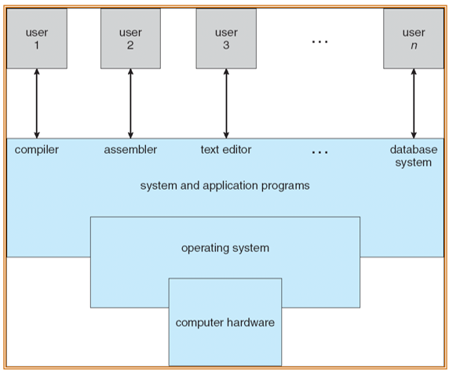

---

title: Chap 1 | Introduction

hide:
  #  - navigation # 显示右
  #  - toc #显示左
  #  - footer
  #  - feedback  
comments: true  #默认不开启评论

---

<h1 id="欢迎">Chap 1 | Introduction</h1>

!!! note "章节启示录"
    <!-- === "Tab 1" -->
        <!-- Markdown **content**. -->
    <!-- === "Tab 2"
        More Markdown **content**. -->
    本章节是OS的第一章。

* 什么是操作系统？    
    在计算机用户和计算机硬件之间充当媒介的程序。  
    让硬件能够更加高效地运转。
    1. resource allocator
    2. control program

{width="350"}