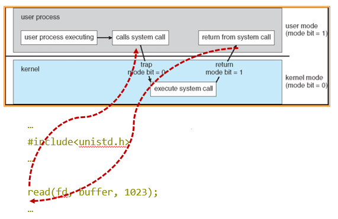

---

title: Chap 1 | Introduction

hide:
  #  - navigation # 显示右
  #  - toc #显示左
  #  - footer
  #  - feedback  
comments: true  #默认不开启评论

---

<h1 id="欢迎">Chap 1 | Introduction</h1>

!!! note "章节启示录"
    <!-- === "Tab 1" -->
        <!-- Markdown **content**. -->
    <!-- === "Tab 2"
        More Markdown **content**. -->
    本章节是OS的第一章。主要介绍了一些基本的概念，以及对操作系统的概述。

## 1.Overview
* 什么是操作系统？    
    在计算机用户和计算机硬件之间充当媒介的程序。  
    让硬件能够更加高效地运转。
    1. resource allocator
    2. control program

{width="350"}

* 操作系统的组成（冯诺依曼架构）  
    以内存为中心   
    一个或多个cpu、设备控制器通过公共总线连接，提供对共享内存的访问    
    cpu和设备竞争内存周期的并发执行   

{width="350"}

I/O设备和CPU可以并发执行。    
每个设备控制器负责一个特定的设备类型。   
每个设备控制器都有一个本地缓冲区(local buffer)。   
CPU将数据从主存移到本地缓冲区。（外卖放到快递柜）  
I/O是从设备到控制器的本地缓冲区。(退货的货物放到快递柜)         
设备控制器通过中断(interrupt)(通过系统总线via system bus)通知CPU它已经完成了它的操作。   
??? question "并发(Concurrent)与并行(Parallel)"
    并发是在同一时间间隔内
    并行是每个时刻两者都同时执行  
    9点-10点只吃面包，10点到11点只写字，11点到12点只吃面包，那么在9点到12点吃面包和写字就是并发执行的。   
    9点到12点左手吃面包右手写字，那么在9点到12点吃面包和写字就是并行执行的。     
    

* 中断   
    中断被广泛的使用，操作系统需要处理各种中断。      
    中断通过包含所有服务例程地址的中断向量(***interrupt vector***)将控制传递给中断服务例程(ISR)。    
    中断架构(Interrupt architecture)必须保存被中断指令的地址。    
    在处理另一个中断时禁用传入中断，以防止中断丢失。 

* 中断类型   
    * 硬件中断：I/O中断   
    * 软件中断：陷阱(trap)是由错误(error)或用户请求(request)(后者通常称为系统调用)引起的软件生成的中断。  
    >注意:名称在不同的体系结构中可能会有所不同。   
       

操作系统是中断驱动的。

* 中断处理   
    操作系统通过存储寄存器和程序计数器来保存CPU的状态。      
    确定发生了哪种类型的中断:   
          1. 通过泛型例程(generic routine)进行轮询(polling)   
          2. 矢量(vector)中断系统(中断表)     
    单独的代码段决定对每种类型的中断应该采取什么行动
    
{width="400"}

* 两种I/O的方法    
{width="500"}    
异步是非阻塞式的，不需要等待当前指令完全执行完毕（但非阻塞式不等于异步I/O处理）

* Direct Memory Access Structure    
用于能够以接近内存速度传输信息的高速I/O设备。     
设备控制器将数据块从缓冲存储器直接传输到主存储器，无需CPU干预。    
每个块(per block)只生成一个中断，而不是每个字节(per byte)生成一个中断。 

* Storage Structure
主存(Main memory)——只有CPU可以直接访问的大容量存储介质。      
辅助存储器(Secondary storage)——主存储器的扩展，提供大的非易失性存储容量。   
磁盘——覆盖有磁性记录材料的刚性金属或玻璃盘片。   
    * 磁盘表面逻辑上划分为磁道，磁道再细分为扇区。  
    * 磁盘控制器决定设备和计算机之间的逻辑交互。  

* Migration of Integer A from Disk to Register   
    多任务(Multitasking)环境必须小心使用最新的值，无论它存储在存储层次结构中的哪个位置       
    多处理器(Multiprocessor)环境必须在硬件中提供缓存一致性，以便所有cpu的缓存中都有最新的值

    {width="500"}

    * Multiprocessor Systems   
    Each CPU processor has its own set of registers  
    All processors share physical memory over the system bus  
    {width="300"}  

    * Multicore Systems  
    片内通信比片间通信快(在同一个L2 cache中进行会比较快，减少了数据的搬运)   
    功耗更低(适合移动设备)   
    {width="300"}  

    * The NUMA Architecture  
    cpu之间通过共享系统互连连接  
    随着添加更多处理器，扩展更有效  
    跨互连的远程内存很慢    
    操作系统需要仔细的CPU调度和内存管理   
    {width="300"}  

## 2.操作系统结构(分类)
* Multiprogramming needed for efficiency (CPU utilization 利用率)   
    1. 单用户无法使CPU和I/O设备始终处于繁忙状态     
    2. 多路编程组织工作(代码和数据)，所以CPU总是有一个要执行     
    3. 系统中总工作的一个子集保存在内存中   
    4. 选择一个工作并通过工作调度运行   
    5. 当它必须等待(例如I/O)时，操作系统切换到另一个工作   

* Timesharing (multitasking) is logical extension     
    分时(多任务)是一种逻辑扩展，在这种扩展中，CPU频繁地切换工作，用户可以在每个工作运行时与之交互，从而创建交互式计算(交互性)。每一个时刻只存一个用户的信息。  
    1. 响应时间应小于1秒，以便让用户之间感受不到彼此的存在  
    2. 每个用户至少有一个程序在内存中执行 => 进程  
    3. 如果多个作业准备同时运行 => CPU调度  
    4. 如果进程不适合内存，交换(swapping)将它们移进移出以运行   
    5. 虚拟内存(Virtual memory)允许执行不完全在内存中的进程   

## 3. Operating-System Operations

### 中断和异常的定义
* 中断也称外中断，是指来自CPU执行指令外部的事件，通常用于信息输入/输出
    1. 设备发出的I/O结束中断，表示设备输入/输出处理已经完成。
    2. 时钟中断，表示一个固定的时间片已到，让处理机处理计时、启动定时运行的任务等。
* 异常也称内终端，是指来自CPU执行指令内部的事件，如程序的非法操作码、地址越界、运算溢出、虚存系统的缺页及专门的陷入指令等引起的事件。异常不能被屏蔽，一旦出现，就应立即处理。

关于内中断和外中断的联系与区别如下所示：   

* 外中断可分为可屏蔽中断和不可屏蔽中断。
    1. 可屏蔽中断是指通过INTR线发出的中断请求，通过改变屏蔽字可以实现多重中断，从而使得中断处理更加灵活。
    2. 不可屏蔽中断是指NMI线发出的中断请求，通常是紧急的硬件故障，如电源掉电等。此外，异常也是不能被屏蔽的。

* 异常可分为故障、自陷和终止。
    1. 故障通常是指令执行引起的异常，如非法操作码、缺页故障、除数为0、运算溢出等。
    2. 自陷是一种事先安排的“异常”事件，用于在用户态下调用操作系统内核程序，如条件陷阱指令、系统调用指令等。
    3. 终止是指出现了使得CPU无法继续执行的硬件故障，如控制器出错、存储器校验错等。
    
    故障异常和自陷异常属于软件中断，终止异常和外部中断属于硬件中断。

因此，我们需要保护:   

* **双模式(Dual-mode)**操作:允许操作系统保护自身和其他系统组件   
    1. 用户模式(User mode)和内核模式(kernel mode)
    2. 硬件提供的模式位(Mode bit)
        1. 提供区分系统是在运行用户代码还是内核代码的能力
        2. 特权指令:只能在内核模式下执行(only execute in kernel mode)
        3. 系统调用(System calls)将模式更改为内核(change mode to kernel)，从调用返回将其重置为用户

!!! example "特权指令与非特权指令"
    * 特权指令：不允许用户直接使用的指令，如I/O指令、关中断指令、内存清零指令，存取用于内存保护的寄存器、送PSW到程序状态字寄存器等的指令。
    * 非特权指令：允许用户直接使用的指令，它不能直接访问系统中的软硬件资源，仅限于访问用户的地址空间，这也是为了防止用户程序对系统造成破坏。

* Transition from User to Kernel Mode      
    {width="500"}      
    
* Timer & Interrupt
    1. 计时器防止无限循环/进程占用资源   
    2. 在特定时间后设置中断    
    3. 操作系统递减计数器
    4. 当计数器为零时产生中断
    5. 在调度过程之前设置，以重新控制或终止超出分配时间的程序

* Process Management   

!!! tip "进程(process)与程序(program)"
    进程(process)是正在执行的程序(program)。它是系统内的一个工作单元。程序是一个被动的实体(passive entity)，过程是一个主动的实体(active entity)。

    >以话剧为例，程序像是剧本，进程像是演出。

进程需要资源来完成它的任务   
>CPU、内存、I/O、文件    
初始化数据    

进程终止需要回收任何可重用资源

* 单线程进程:   
    1. 有一个程序计数器(program counter)来指定下一个要执行的指令的位置      
    2. 进程按顺序执行指令，每次执行一条，直到完成    
* 多线程进程:    
    1. 每个线程有一个程序计数器(program counter per thread)       
    2. 通常系统有许多进程，一些用户，一些操作系统并发地运行在一个或多个cpu上    
    3. 通过在进程/线程之间复用cpu来实现并发性(multiplexing the CPUs)多路复用        

* Process Management Activities(进程管理)
    1. 创建和删除用户进程和系统进程 Creating and deleting
    2. 暂停和恢复进程 Suspending and resuming
    3. 提供流程同步机制 synchronization
    4. 提供流程通信机制 communication
    5. 提供死锁处理机制 deadlock

* Memory Management(内存管理)
    1. 所有数据(data)在处理前后都必须在内存中
    2. 所有指令(instruction)必须在内存中才能执行
    3. 内存管理来决定什么是在内存中   

        >优化CPU利用率和计算机对用户的响应

    4. 内存管理活动
        1. 跟踪内存的哪些部分当前正在被谁使用
        2. 决定将哪些进程(或其中的一部分)和数据移入和移出内存
        3. 根据需要分配和释放内存空间

* Storage Management(存储管理)   
    1. 操作系统提供统一的、逻辑的信息存储视图
        抽象物理属性到逻辑存储单元-文件 file
    2. 每种介质由设备(即磁盘驱动器、磁带驱动器)控制。   

        >不同的属性包括访问速度、容量、数据传输速率、访问方法(顺序或随机)

* Mass-Storage Management(海量存储管理)   

    !!! tip "操作系统活动"
        1. 空间管理
        2. 存储分配
        3. 磁盘调度

* 文件系统管理
    1. 文件通常组织到目录(directories)中
    2. 对大多数系统进行访问控制(access control)，以确定谁可以访问什么
    !!! tip "操作系统活动"
        1. 创建和删除文件和目录
        2. 操作文件和目录的原语
        3. 将文件映射到辅助存储
        4. 将文件备份到稳定(非易失性)存储介质上

* I/O Subsystem    
    操作系统的一个目的是向用户隐藏硬件设备的特性——易于使用和编程     
    * I/O子系统负责:    
        1. I/O的内存管理，包括缓冲 buffering (在传输数据时临时存储数据)、缓存 caching(将部分数据存储在更快的存储中以提高性能)、假脱机 spooling (一个作业的输出与其他作业的输入重叠)   
        全称: simultaneous peripheral operations online        
        2. 通用设备驱动程序接口   
        3. 特定硬件设备的驱动程序

## 4.OS Purposes
1. Abstraction 抽象与封装，只暴露一些接口
2. Multiplex 空间管理：内存，时间管理：进程
3. Isolation 用户和内核
4. Sharing 不同用户对于内存磁盘CPU都是共享的
5. Security 特权指令的安全，权限等
6. Performance 更高的性能
7. Range of uses 更广泛的应用，面对不同场景（网络传输、编译……）跨平台使用

!!! tip "题目收录"
    1. 现代操作系统中最基本的两个特征是：并发和共享（两者互为存在条件）
    2. 用户可以通过（ ）两种方式来使用计算机：命令接口和系统调用
    3. 系统调用是由操作系统提供给用户的，它只能通过用户程序间接使用
    4. 系统调用的目的是请求系统服务
    5. 在单CPU系统中，同一时刻只能有一个进程占用CPU，因此进程之间不能并行执行。
    6. 脱机技术是指在主机以外的设备上进行输入/输出操作，需要时再送主机处理，以提高设备利用率。
    7. 批处理系统的主要缺点是：无交互能力
    8. 操作系统的基本类型主要有批处理操作系统、分时操作系统、实时操作系统
    9. 分时系统中，当时间片固定时，用户数越多，每个用户分到的时间片就越少，响应时间就相应变长。分时系统的响应时间 $T≈Q*N$ , $Q$ 为时间片， $N$ 为用户数。
    10. 用户态到核心态的转换是由硬件完成的
    11. 在操作系统中，只能在核心态下运行的指令是____。A.屏蔽中断 B.设置时钟的值 C.修改内存单元的值 D.停机
        选C。其他都是特权指令。
    12. “访管”指令仅在用户态下使用，执行“访管”指令将用户态转变为核心态。且其不可能在核心态下进行，这是用户程序“自愿进管”的手段。
