---

title: Chap 2 | Operating-System Structures

hide:
  #  - navigation # 显示右
  #  - toc #显示左
  #  - footer
  #  - feedback  
comments: true  #默认不开启评论

---

<h1 id="欢迎">Chap 2 | Operating-System Structures</h1>

!!! note "章节启示录"
    <!-- === "Tab 1" -->
        <!-- Markdown **content**. -->
    <!-- === "Tab 2"
        More Markdown **content**. -->
    本章节是OS的第二章。

## 1.Operating System Services
1. 用户界面(User interface):
    几乎所有的操作系统都有一个用户界面(UI)   
    不同于命令行(CLI)、图形用户界面(GUI)、批处理
2. 程序执行(Program execution):
    系统必须能够将程序装入内存并运行该程序，结束执行，正常或异常(指示错误)。
3. I/O操作:
    运行的程序可能需要I/O，这可能涉及文件或I/O设备。
4. 文件系统操作(File-system manipulation):
    程序需要读取和写入文件和目录，创建和删除它们，搜索它们，列出文件信息，权限管理。
5. 通信:   
    进程可以在同一台计算机上或通过网络在计算机之间交换信息    
    通信可以通过共享内存或通过消息传递(由操作系统移动的数据包)进行。
6. 错误检测   
7. 资源分配   
8. 审计accounting/logging:     
    跟踪哪些用户使用了多少和哪种计算机资源  
9. 保护和安全    
    

## 2.System Calls
主要由程序通过 Application Program Interface(API) 访问，而不是直接使用系统调用     
!!! question "System Calls VS. API"
    * System Calls 更加底层一些，用户不会直接使用系统调用
    * API是提供的接口，用户程序通过API访问

### 2.1 系统调用的实现
每个系统调用有一个编号    
系统调用接口维护一个根据这些数字索引的表    

系统调用接口在OS内核中调用预期的系统调用，并返回系统调用的状态和任何返回值  

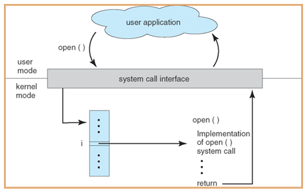{width="400"}

### 2.2 系统调用的参数传递
用于向操作系统传递参数的三种通用方法   

1. 最简单的:在寄存器中传递参数   

    >在某些情况下，可能有比寄存器更多的参数

    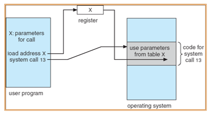{width="350"}   

2. 存储在内存块(block)或表中的参数，以及在寄存器中作为参数传递的块地址

    >Linux和Solaris采用这种方法

3. 由程序放置或推入堆栈(stack)的参数，由操作系统弹出堆栈    
    块和堆栈方法不限制传递参数的数量或长度

### 2.3 系统调用的分类
1. Process control
2. File management
3. Device management
4. Information maintenance (e.g. time, date)
5. Communications
6. Protection   

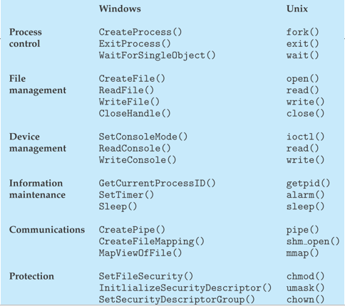{width="400"}

### 2.4 系统程序
1. File manipulation：Create, delete, copy, rename, print, dump, list, and generally manipulate files and directories
2. Status information：
    1. 有些请求系统提供日期、时间、可用内存量、磁盘空间、用户数量等信息
    2. 其他提供详细的性能、日志记录和调试信息
    3. 一些系统实现了一个注册表——用于存储和检索配置信息
3. File modification：用于创建和修改文件的文本编辑器
用于搜索文件内容或执行文本转换的特殊命令
4. Programming language support：Compilers, assemblers, debuggers and interpreters
5. Program loading and execution：Absolute loaders, relocatable loaders, linkage editors, and overlay-loaders, debugging systems for higher-level and machine language
6. Communications
7. Application programs

## 3.Operating System Design and Implementation 

Start by defining goals and specifications    

Affected by choice of  hardware, type of system

* Important principle to separate   
    1. Policy: What will be done? 策略Policy（确定具体做什么事）
    2. Mechanism: How to do it? 机制Mechanism（定义做事方式）  

    >Example: timer for CPU protection is a mechanism

机制决定如何做一件事，政策决定做什么    
策略与机制的分离是一个非常重要的原则，如果以后要更改策略决策，它可以提供最大的灵活性   

## 4.Operating System Structure

### 4.1 Simple Structure 
MS-DOS——用最少的空间提供最多的功能    
不分为模块     
虽然MS-DOS有一些结构，但它的接口和功能层次没有很好地分离   
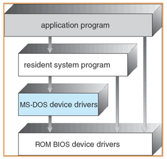{width="350"}

### 4.2 UNIX
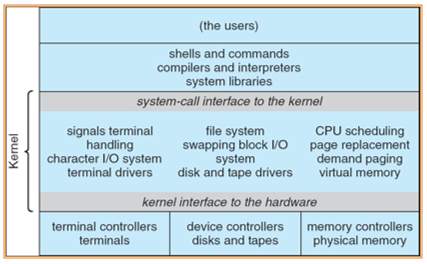{width="350"}

### 4.3 微内核与宏内核

#### 微内核
将尽可能多的内容从内核移到“用户”空间   
用户模块之间使用消息传递进行通信 

* 优势:
    1. 更容易扩展微内核
    2. 更容易将操作系统移植到新的体系结构中
    3. 更可靠(内核模式下运行的代码更少)
    4. 更安全的
* 劣势:   
    1. 用户空间到内核空间通信的性能开销

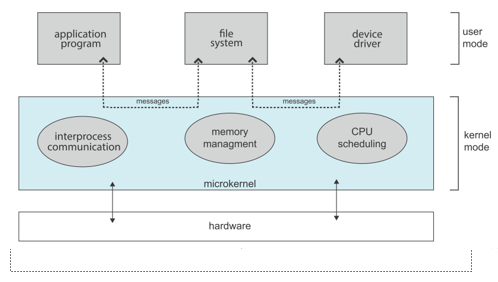{width="400"}

#### 宏内核
* 优势:
    1. 效率很高
* 劣势：
    1. 安全性低
    2. 因为大量功能互相耦合导致维护困难

### 4.4 Hybrid Structure - Darwin(A hybrid structure!混合结构)

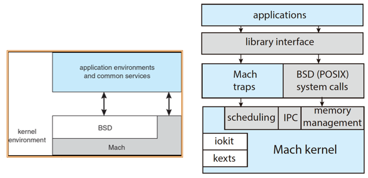{width="500"}

* MacOS / iOS Structure:以Darwin为基础，applications层很灵活，可以调用多个层     
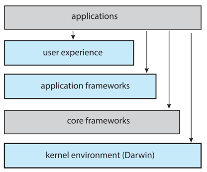{width="300"}

### 4.5 操作系统的设计思路

* Layered Approach(逻辑)分层：      
    1. 底层(第0层)是硬件;最高层(第N层)是用户界面。   
    2. 通过模块化、层的选择使得每个层只使用较低层的功能(操作)和服务(不能跨层使用)       
    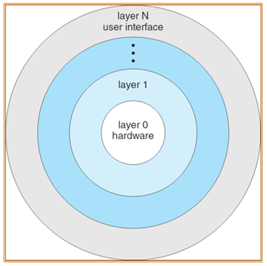{width="200"}

* Modules(模块化)：对宏内核很重要    
    1. 每个核心组件都是独立的
    2. 每个系统都通过已知接口与其他系统通信
    3. 模块相互调用而不是消息传递

    * 类太阳系模块方法（~~我自己取的名字~~）Solaris Modular Approach：
        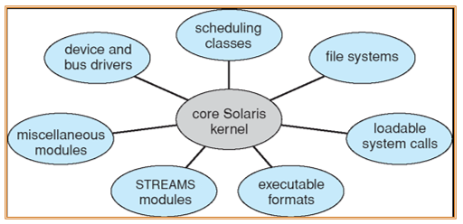{width="300"}    
        为操作系统提供了扩展的能力，方便运维。

* Other Structures：
    1. Exokernel外核：     
        1. 高度简化kernel，只负责资源分配，提供了低级的硬件操作，必须通过定制library供应用使用。不涉及状态的转化。         
        2. 高性能，但定制化library难度大，兼容性差。      
        （学术界中很成功，但无法形成产业。强调性能，但维护成本很高）     
        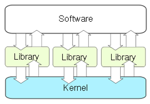{width="300"}   
    2. Unikernel: statically linked with the OS code needed.
        Good for cloud service, APP boots in tens of ms.    
        启动速度很快，性能很高。

## 5. 虚拟机
虚拟机采用分层方法得出其逻辑结论。它将硬件和操作系统内核视为硬件    

虚拟机提供与底层裸硬件相同的接口     

操作系统创建了多个进程的假象，每个进程在自己的处理器上使用自己的(虚拟)内存执行

人话：虚拟机其实就是一个虚拟化的平台

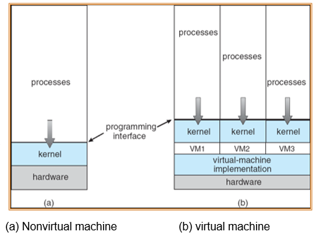{width="400"}
    
    