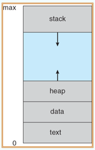
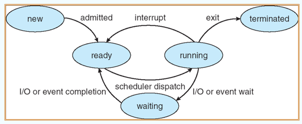

---

title: Chap 3 | Processes

hide:
  #  - navigation # 显示右
  #  - toc #显示左
  #  - footer
  #  - feedback  
comments: true  #默认不开启评论

---

<h1 id="欢迎">Chap 3 | Processes</h1>

!!! note "章节启示录"
    <!-- === "Tab 1" -->
        <!-- Markdown **content**. -->
    <!-- === "Tab 2"
        More Markdown **content**. -->
    本章节是OS的第三章。

## 1. 进程的概念
Process—正在执行的程序;流程执行必须以顺序方式进行

* A process includes:
    1. text section (code)：存储代码
    2. data section (global vars)：存储全局变量、静态变量
    3. stack (function parameters, local vars, return addresses)：被动态分配的内存
    4. heap (dynamically allocated memory)：栈，存储一些临时的数据，如函数传参、返回值、局部变量等
    5. program counter 

    {width="150"}

??? question "为什么stack核heap不往同一个方向增长"
    不够灵活，中间未被利用的内存可以被stack用也可以被heap用，提高了利用率。    
    tips：中间的部分称为hole，是一个“巨大的洞”，比图中展示的还要大的多。但实际上它只是虚拟的映射，只有当需要的时候才会转化成实际的内存。

* process的state：
    1. new:  The process is being created,正在被创建的过程当中
    2. running:  Instructions are being executed
    3. ready:  The process is waiting to be assigned to a processor (loaded into main memory)
    4. waiting/blocked:  The process is waiting/blocked for some event to occur
    5. terminated:  The process has finished execution即将被抹除前的状态

    状态转换图：    
    {width="500"}   

    !!! example "一个例子🌰"
        1. 运动员：Process:   
            号码簿：Process ID
        2. 跑道：CPU core    
            1. 每条跑道只能有一个运动员
            2. 运动场可以有一条/多条跑道
        3. 跑步：Running
            1. 允许打水喝
            2. 接受调度，让出跑道
            3. 离场地点必须记录以便继续
        4. 口渴下场喝水：Wait I/O
            1. 打水过程运动员处于wait状态，直到喝完才能返回运动场
            2. 打水很慢，其他人也打水
        5. 等待上跑道: Ready 状态
        
    
