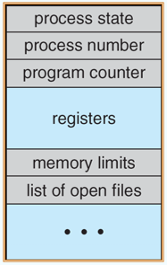
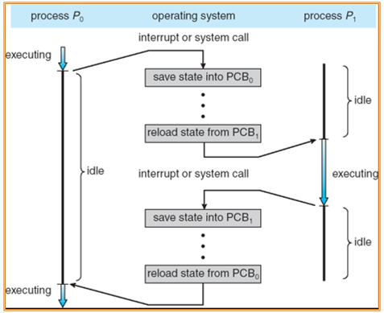
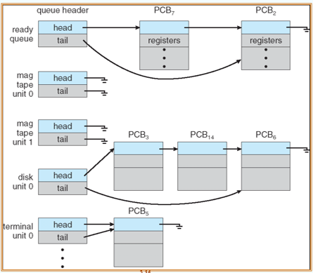
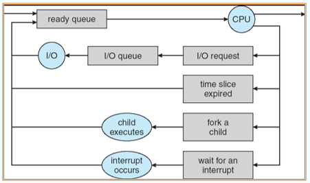
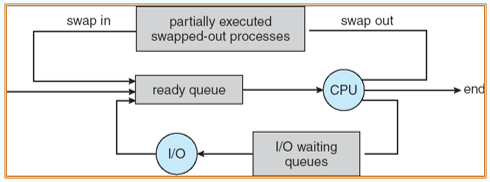

---

title: Chap 3 | Processes

hide:
  #  - navigation # 显示右
  #  - toc #显示左
  #  - footer
  #  - feedback  
comments: true  #默认不开启评论

---

<h1 id="欢迎">Chap 3 | Processes</h1>

!!! note "章节启示录"
    <!-- === "Tab 1" -->
        <!-- Markdown **content**. -->
    <!-- === "Tab 2"
        More Markdown **content**. -->
    本章节是OS的第三章。

## 1.进程的概念
Process—正在执行的程序;流程执行必须以顺序方式进行

* A process includes:
    1. text section (code)：存储代码
    2. data section (global vars)：存储全局变量、静态变量
    3. stack (function parameters, local vars, return addresses)：被动态分配的内存
    4. heap (dynamically allocated memory)：栈，存储一些临时的数据，如函数传参、返回值、局部变量等
    5. program counter 

    {width="150"}

??? question "为什么stack核heap不往同一个方向增长"
    不够灵活，中间未被利用的内存可以被stack用也可以被heap用，提高了利用率。    
    tips：中间的部分称为hole，是一个“巨大的洞”，比图中展示的还要大的多。但实际上它只是虚拟的映射，只有当需要的时候才会转化成实际的内存。

* process的state：
    1. new:  The process is being created,正在被创建的过程当中
    2. running:  Instructions are being executed
    3. ready:  The process is waiting to be assigned to a processor (loaded into main memory)
    4. waiting/blocked:  The process is waiting/blocked for some event to occur
    5. terminated:  The process has finished execution即将被抹除前的状态

    状态转换图：    
    {width="500"}   

    !!! example "一个例子🌰"
        1. 运动员：Process:   
            号码簿：Process ID
        2. 跑道：CPU core    
            1. 每条跑道只能有一个运动员
            2. 运动场可以有一条/多条跑道
        3. 跑步：Running
            1. 允许打水喝
            2. 接受调度，让出跑道
            3. 离场地点必须记录以便继续
        4. 口渴下场喝水：Wait I/O
            1. 打水过程运动员处于wait状态，直到喝完才能返回运动场
            2. 打水很慢，其他人也打水
        5. 等待上跑道: Ready 状态

* Process Control Block：Information associated with each process   
    1. Process state：进程的状态
    2. Program counter：标识该进程跑到了哪里，由于进程是动态的，每一被切换都需要保证下一次能无缝衔接之前的进度，所以需要存储每次的工作状态
    3. Contents of CPU registers：保存进程相关的寄存器信息
    4. CPU scheduling information：CPU 调度参考的信息，包括优先级、调度队列的指针、调度参数等
    5. Memory-management information：包括页表、段表等信息，具体与实现的内存系统有关
    6. Accounting information：一些关于进程的动态数据的统计和记录，比如总共已经跑了多久、时间限制、进程号等
    7. I/O status information：被分配给进程的 I/O 设备列表、打开的文件列表等
   
    {width="150"}

先存储PCB0，再把CPU资源分配给其他进程，把PCB1加载进来，I/O做完后，会给CPU发送一个中断，CPU会处理这个中断，会把PCB1的资源存储下来，再把PCB0（处在归零状态）的状态置成“ready”，再让他进入进程队列中，最后把PCB0 load 进来，继续执行。    
其中蓝色部分是CPU实际使用的时间   
{width="400"}

因此我们需要CPU的合理调度，不能让CPU换进来后很快换出，这样十分消耗资源。
        

## 2.Process Scheduling
Job queue：系统中所有进程的集合    

Ready queue：驻留在主存中的所有进程的集合，准备就绪并等待执行   

Device queues：等待I/O设备的一组进程   

进程在各个队列之间迁移,基本结构如下：一个进程不可以同时在两个queue中排队    
{width="400"}

实际实现中，由于等待的 I/O 或事件不同，可能维护多个等待队列，于是实际过程中的情况可能如下：

### 2.1 Scheduler调度器  
1. Long-term scheduler(or job scheduler)：选择应该将哪些进程放入内存(就绪队列)
2. Short-term scheduler(or CPU scheduler)：选择下一个应该执行的进程并分配CPU

非常频繁地调用Short-term scheduler(毫秒)(必须很快)，快到体感上两个程序同时执行（分时操作系统中涉及的目标）

很少调用Long-term scheduler(秒、分钟)(可能很慢)

Long-term scheduler控制 [Multiprogramming](https://sh17c.top/LessonsNotes/D3QD_OperatingSystem/Chap01/#2) 的 degree

* 过程：    
    1. I/O绑定进程：花在I/O上的时间较多;有很多短的CPU爆发
        
        >下载

    2. cpu绑定进程：花在CPU上的时间较多;很少有长的CPU爆发
        
        >打游戏，科学计算

* Medium Term Scheduling:比CPU要慢，做一个暂时性的托管，涉及到磁盘的调度操作，不能做频繁的操作   
    

* Context Switch 上下文切换：
    1. 当CPU切换到其他进程时，系统必须保存旧进程的状态，并为新进程加载保存的状态
    2. 上下文切换时间是 overhead ;系统在切换时不做任何有用的工作——通常需要几毫秒
    3. 时间取决于硬件。在SPARC体系结构中，提供了寄存器组。

## 3.Operations on Processes
### 3.1 进程创建
父进程创建子进程，子进程依次创建其他进程，形成进程树

* 资源共享:   
    1. 父母和孩子共享所有资源
    2. 子节点共享父节点资源的子集
    3. 父节点和子节点不共享资源

* 执行(两种方式):   
    1. 父节点和子节点并发执行
    2. 父进程等待子进程终止