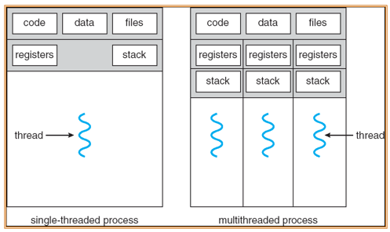
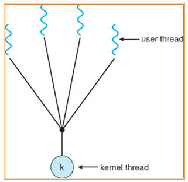
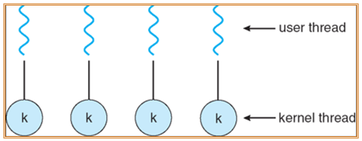
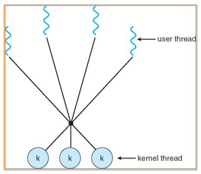
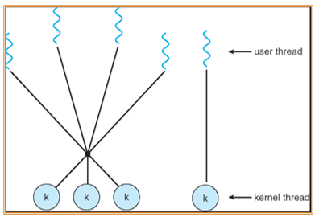

---

title: Chap 4 | Threads

hide:
  #  - navigation # 显示右
  #  - toc #显示左
  #  - footer
  #  - feedback  
comments: true  #默认不开启评论

---

<h1 id="欢迎">Chap 4 | Threads</h1>

!!! note "章节启示录"
    <!-- === "Tab 1" -->
        <!-- Markdown **content**. -->
    <!-- === "Tab 2"
        More Markdown **content**. -->
    本章节是OS的第四章。

在多线程进程中，需要寄存器和栈为每一个线程进维护。

* Benefits：
    1. 响应性：交互式应用程序。
    2. 资源共享：用于代码和数据的内存可以共享。
    3. 经济：创建进程更昂贵（需要分配资源），而创建线程能节约资源。
    4. MP架构的利用：多线程提高了并发性。

!!! tip "ULT(user态中) VS. KLT(kernel态中)"
    1. ULT线程其实是进程内部的划分，不需要Context的转换，只在user层面可见，对于kernel态来说，依然只能看到一个线程。
    2. ULT并发性不强，其中一个线程被block后另一个线程可能无法进行，但对于KLT来说，其中一个线程被block，另一个线程可以很快地执行。
    3. 有限性，ULT能创建的线程是有限的。

## 1.Multithreading Models
### Many-to-One
线程管理是有效的，但是如果进行系统调用会阻塞，内核一次只能调度一个线程  
{width="270"}

!!! example "一个例子🌰"
    * 班级：Process
        1. 号码簿/班级号：Process ID
    * 跑道：CPU core
        1. 每条跑道只能有一个运动员
        2. 运动场可以有一条/多条跑道
    * 班级成员：Threads
    * 规则
        1. 每班发一个号码簿
        2. 成员能跑的戴号码簿上场
        3. 全班跑完为止
   
    班级内部选一个成员佩戴号码簿，kernel根据号码簿调度场上运动员
### One-to-One
更高的并发性，但创建线程的成本很高  
{width="400"}

!!! example "一个例子🌰"
    * 班级：Process
        1. 号码簿：Thread ID
        2. 班级号：Process ID
    * 跑道：CPU core
        1. 每条跑道只能有一个运动员
        2. 运动场可以有一条/多条跑道
    * 班级成员：Threads
    * 规则
        1. 每人可申请一个号码簿
        2. 成员戴号码簿上场
        3. 全班跑完为止
   
    kernel根据号码簿调度场上运动员，一个班可以有多个运动员在跑
    
    
### Many-to-Many
灵活的  
{width="300"}

!!! example "一个例子🌰"
    * 班级：Process
        1. 号码簿（1班x号）：LWP ID
        2. 班级号：Process ID
    * 跑道：CPU core
        1. 每条跑道只能有一个运动员
        2. 运动场可以有一条/多条跑道
    * 班级成员：Threads
    * 规则
        1. 每班限发若干个号码簿
        2. 成员能跑的戴号码簿上场
        3. 全班跑完为止
   
    班级内部指定号码簿给谁戴，kernel根据号码簿调度场上运动员
    

### Two-level Model
{width="300"}

## 2.Threading Issues
* fork()只复制调用线程还是复制所有线程?
    1. 一些unix系统有两个版本的fork()，一个复制所有线程，另一个复制调用fork()的线程。
    2. Exec()将替换整个进程。

* Thread Cancellation:在线程完成之前终止它,两种一般方法:
    1. Asynchronous cancellation(异步取消):立即终止目标线程。可能导致泄露和不一致
    2. Deferred cancellation(延迟取消):允许目标线程通过标志定期检查是否应该取消。

* Signal Handling
    * 在UNIX系统中，信号用于通知进程某个特定事件已经发生

    * 信号处理程序用于处理同步或异步信号:   
        1. 信号是由特定事件产生的
        2. 信号被传送到一个进程
        3. 信号被处理
    * Options:(传送方式依讯号类型而定)
        1. 将信号传递给应用该信号的线程
        2. 将信号传递给进程中的每个线程
        3. 将信号传递给进程中的某些线程
        4. 指定一个特定的线程来接收进程的所有信号

* Thread Pools：在一个线程池中创建一些等待工作的线程
    * 优点:
        1. 使用现有线程处理请求通常比创建新线程快一些
        2. 允许将应用程序中的线程数绑定到池的大小

* Thread Specific Data(TLS)
    1. 允许每个线程拥有自己的数据副本
    2. 在某些方面类似于静态数据，但对每个线程都是唯一的
    3. 当无法控制线程创建过程时(例如使用线程池时)非常有用。