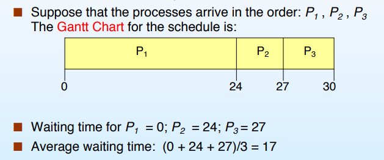
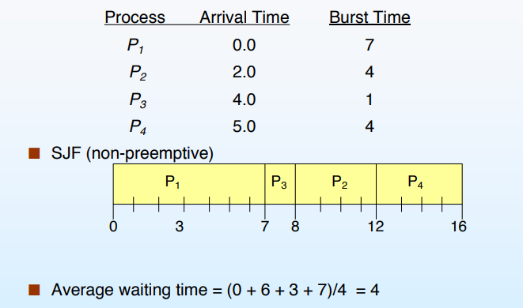
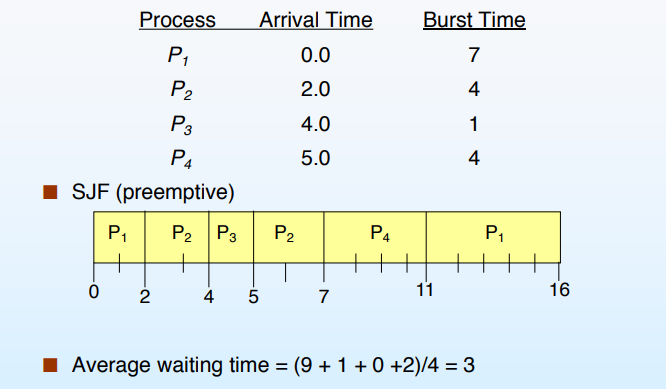
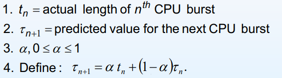
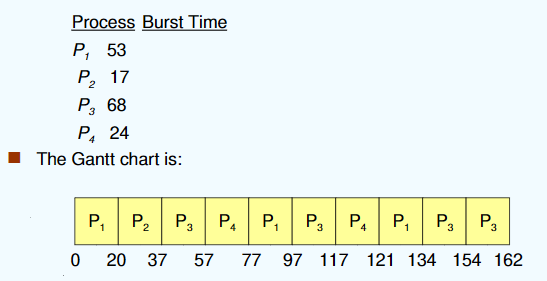
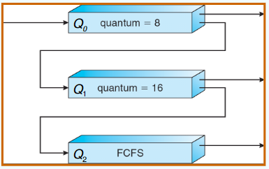

---

title: Chap 5 | CPU Scheduling

hide:
  #  - navigation # 显示右
  #  - toc #显示左
  #  - footer
  #  - feedback  
comments: true  #默认不开启评论

---

<h1 id="欢迎">Chap 5 | CPU Scheduling</h1>

!!! note "章节启示录"
    <!-- === "Tab 1" -->
        <!-- Markdown **content**. -->
    <!-- === "Tab 2"
        More Markdown **content**. -->
    本章节是OS的第五章。

## 1.基础概念
为什么要进行CPU调度？通过 multiprogramming 获得的最大CPU利用率

从内存中准备好的进程中进行选择执行，并将CPU分配给其中一个

* CPU调度决策可能发生在进程:
    1. 从运行状态切换到等待状态
    2. 从运行状态切换到就绪状态
    3. 从等待切换到准备
    4. 终止     

    1和4下的调度是非抢占式的（nonpreemptive）        
    所有其他调度都是抢占式的（preemptive）

* Dispatcher模块将CPU的控制权交给进程，并由短期调度器选择:
    1. 切换上下文
    2. 切换到用户模式（不一定需要切换到用户态，可能仍在内核态运行）
    3. 跳转到用户程序中的适当位置
    4. 重新启动程序

    调度延迟：调度程序停止一个进程并启动另一个进程所需的时间

## 2.Scheduling Criteria
* CPU利用率：使CPU尽可能的繁忙
* 吞吐量：每单位时间内完成执行的进程数
* 周转时间：执行一个特定过程的时间
* 等待时间：进程在就绪队列（ready queue）中等待的时间
* 响应时间：从请求被提交到产生第一个响应所花费的时间，而不是输出(对于分时环境)

### 2.1 First-Come, First-Served (FCFS) Scheduling
先来先服务：    
{width="450"}         
对于上图来说，采用P2,P3,P1的方式更加合理，这样平均等待时间就缩短为：$(6+0+3)/3 = 3$

FCFS是非抢占式的算法，对于短的调度有利（会先执行）

Convey effect（护航效应）：如果短进程落后于长进程，平均等待时间就会变长，导致I/O设备或CPU存在较多空闲，因此它不能作为分时系统和实时系统的主要调度策略。

因为I/O-bound processes wait for the CPU-bound one，所以有利于长作业，不利于短作业；有利于CPU繁忙型，不利于I/O繁忙型。

### 2.2 Shortest-Job-First (SJF) Scheduling
每个进程关联下一个CPU-burst的长度。使用这些长度去调度时间最短的进程。

* 两种方案：
    1. 非抢占:一旦CPU被分配给进程，它就不能被抢占，直到完成它的CPU突发
    2. 抢占:如果一个新的进程到达CPU突发长度小于当前执行进程的剩余时间，抢占。这个方案被称为“Shortest-Remaining-Time-First”（SRTF）

* 非抢占：  
    {width="450"} 

    * 调度次数：4次（注意P1进来的时候算1次调度，而P4结束时不算调度）  

    当burst time 相同时，用其他调度策略，比如这里使用了“FCFS”策略

* 抢占：    
    {width="450"}  
    * 调度次数：6次

由于没有办法预知下一次爆发的长度，因此只能估计长度
考虑通过使用之前CPU突发的长度来实现预测估计，使用指数平均法：

{width="350"}

不管什么情况，短作业优先是最优的（平均等待时间最短）

??? question "抢占式 VS. 非抢占式"
    不一定。在不同情况下都有可能更短

有利于短作业，不利于长作业。

### 2.3 Priority Scheduling
每个进程都有一个优先级号（整数）

* CPU分配给优先级最高的进程（最小整数==最高优先级）
    1. 抢占式
    2. 非抢占式

>SJF是一种优先级调度，其中优先级是预测的下一次CPU突发时间

饥饿问题：低优先级进程可能永远不会执行

解决方案：Aging（老人福利）,随着时间的推移,增加工艺的优先级

### 2.4 Highest Response Ratio Next （HRRN）
高响应比优先。（非抢占式，否则每个时刻都需要计算）  
这是对于SJF和FCFS的 compromise ，避免一部分进程一直获得较高的优先级。

* 响应比 = 1 + 等待时间/服务时间（CPU-burst）

* HRRN 算法的工作原理
    1. 初始化：记录每个进程的到达时间和所需的服务时间。
    2. 计算响应比：对于每个就绪队列中的进程，计算其响应比。
    3. 选择最高响应比的进程：
        1. 选择具有最高响应比的进程执行。
        2. 如果有多个进程具有相同的最高响应比，则可以按照其他规则（如先到先服务）来选择。
    4. 更新等待时间和响应比：
        1. 每次调度后，更新所有就绪队列中进程的等待时间。
        2. 重新计算所有进程的响应比。

### 2.5 Round Robin (RR) （时间片轮转调度算法）
每个进程获得一个小的CPU时间单位（时间片），通常是10-100毫秒。在此时间过去之后，该进程被抢占并添加到就绪队列的末尾。

如果进程的时间小于时间片的长度，执行完后直接到下一个进程，无需等待时间片耗尽。

{width="450"}

一般来说，平均周转时间比SJF高，但response方面更好（交互性更好）

>CPU利用率和交互性可能无法同时得到满足

如果就绪队列中有n个进程，时间量为q，则每个进程一次最多获得q个时间单位的块，占CPU时间的1/n。没有进程等待时间超过（n-1）q个时间单位

* 性能：
    1. q large -> FCFS
    2. q small -> 上下文切换开销太高

* 应用：分时系统，多任务系统

### 2.6 多层队列（multi - level Queue）

* Ready队列划分为单独的队列：
    1. 前台（交互式）
    2. 后台（批处理）；
* 每个队列都有自己的调度算法，例如:
    1. foreground - RR
    2. background - FCFS
* 在队列之间必须进行调度:
    1. 固定优先级调度（即，先从前台服务，再从后台服务）。可能会饿死。
    2. 时间片:每个队列获得一定数量的CPU时间，它可以在其进程之间调度；例如， 80% to foreground in RR，20% to background in FCFS 

### 2.7 Multilevel Feedback Queue
* 设置多个就绪队列，优先级从第一级依次降低
* 优先级高的队列，进程时间片越短
* 每个队列都采用FCFS，若在该时间片完成，则撒离系统，未完成，转入下一级级队列
* 按队列优先级调度，仅当上一级为空时，才运行下一级

!!! example "一个例子🌰"
    {width="350"}

    1. 一个新作业进入队列q0，该队列为fcfs服务。当获得CPU时，job收到8毫秒。如果它没有在8毫秒内完成，则将作业移动到队列Q1。
    2. 在Q1的工作再次被送达FCFS，并收到额外的16毫秒。如果它仍然没有完成，它将被抢占并移动到队列Q2。

### 2.8 Real-Time Scheduling
硬实时系统:需要在保证的时间内完成关键任务

软实时计算:要求关键进程优先于不那么重要的进程

* Schedule:
    1. Earliest Deadline First (最早截止时间优先)   
    2. Least Laxity First (最低松弛度优先)      
        A的松弛度 = A必须完成的时间 - A运行需要的时间 - 当前时间    
    
        >例如: 有一个任务需要在 400ms 时必须完成，它需要运行 150ms，当前时刻为100ms, 其松弛程度为 400 - 150 - 100 = 150ms

    3. Rate Monotonic Scheduling （速率单调调度）：基于任务的周期来分配优先级，周期越短的任务优先级越高（相当于拿周期的倒数当优先级）

​

