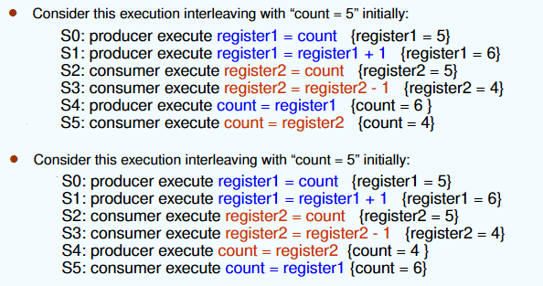
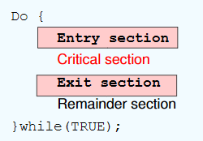

---

title: Chap 6 | Process Synchronization

hide:
  #  - navigation # 显示右
  #  - toc #显示左
  #  - footer
  #  - feedback  
comments: true  #默认不开启评论

---

<h1 id="欢迎">Chap 6 | Process Synchronization</h1>

!!! note "章节启示录"
    <!-- === "Tab 1" -->
        <!-- Markdown **content**. -->
    <!-- === "Tab 2"
        More Markdown **content**. -->
    本章节是OS的第六章。

## 1.Background
进程同步是指在多进程或多线程环境中，为了确保多个进程或线程能够按照一定的顺序或条件正确地访问共享资源而采取的各种协调机制。

* 使用count来追踪整个buffer
    1. 生产者生产后count++
    2. 消费者消费后count--

```c++
while(true){
    while(count == BUFFER_SIZE);
    buffer[in] = nextProduced;
    in = (in + 1) % BUFFER_SIZE;
    count++;
}
```
```c++
while(true){
    while(count == 0);
    nextConsumed = buffer[out];
    out = (out + 1) % BUFFER_SIZE;
    count--;
}
```

### Race Condition （竞态条件）:
竞态条件是指一个内存位置被并发访问，并且至少有一次是写访问。

* count++ could be implemented as
    1. register1 = count     
    2. register1 = register1 + 1     
    3. count = register1

* count-- could be implemented as
    1. register2 = count     
    2. register2 = register2 - 1     
    3. count = register2

如果在抢占式中打乱顺序就会出错    
{width="500"}


??? question "对于访问共享的内核数据(shared kernel data)，非抢占的内核是否受竞态条件(race conditions)的影响？"
    多核情况下，两个进程同时运行时还是有可能出现竞态条件。

* 临界资源：指的是在多线程或多进程环境中被多个线程或进程共享的资源。这些资源需要通过适当的同步机制来保护，以确保同一时刻只有一个线程或进程可以访问这些资源。        
  
* 临界区(Critical section)：指的是程序中一个访问共用资源的程序片段。每个进程中访问临界资源的那段代码称为临界区。



!!! question "几个例子：是否为临界资源"
    全局共享变量？是    
    局部变量？ 不是 
    只读数据？ 不是 
    CPU？ 不是（不需要同步机制来保护）    


* Solution to Critical-Section Problem：(需要满足以下三个条件)
    1. Mutual Exclusion（互斥）：如果进程Pi在它的临界区执行，那么没有其他进程可以在它们的临界区执行。
    2. Progress（空闲让进）：如果没有进程在其临界区执行，并且有一些进程希望进入其临界区，那么下一个进入临界区的进程的选择不能无限期推迟。
    3. Bounded Waiting（有限等待）：在一个进程请求进入其临界区之后，在该请求被批准之前，允许其他进程进入其临界区的次数必须存在一个界限
        1. 假设每个进程以非零速度执行
        2. 没有关于N个进程的相对速度的假设

## 2.软件方法

### 2.1 单标志法   
设置公共整型变量turn，指示允许进入临界区的进程编号turn = i，允许Pi进入临界区      
进程退出临界区时交给另一个进程turn = j

* Process Pi:
```c++
do{
    while(turn != i);
    critical section
    turn=j; 
    remainder section
} while (1);
```

* Process Pj:
```c++
do{
    while(turn != j);
    critical section
    turn=i; 
    remainder section
} while (1);
```

Mutual Exclusion? Yes  
Progress? No  
Bounded Waiting? Yes  

可实现两个进程轮替进入临界区    
必须轮替进入，不满足空闲让进

### 2.2 双标志后检查法
设置布尔型数组flag[2]，用来标记各进程进入临界区的意愿flag[i]=true表示进程Pi想进入   
先表达自己进入临界区意愿    
再轮询对方是否想进入，确定对方不想进入后再进入  
访问结束退出后设置flag[i]=false，表示不想进入，允许对方进入

boolean flag[2];  flag[0] = flag[1] = 0;    
flag[i] = true  if Pi tries to enter CS 

* Process Pi:
```c++
do{
    flag[i]=true;//先表达自己的意愿
    while( flag[j] );//再等待对方
    critical section
    flag[i]=false; 
    remainder section
} while (1);
```

* Process Pj:
```c++
do{
    flag[j]=true;
    while( flag[i] );
    critical section
    flag[j]=false; 
    remainder section
} while (1);
```


Mutual Exclusion? Yes   
Progress? No   
Bounded Waiting? Yes(j进入一次后就会轮到i)

可能导致双方都不能进入      
违反空闲让进

### 2.3 双标志先检查法 
设置布尔型数组flag[2]，用来标记各进程进入临界区的意愿flag[i]=true表示进程Pi想进入   
进程进入临界区前先轮询对方是否想进入    
确定对方不想进入后再进入    
访问结束退出后设置flag[i]=false，表示不想进入，允许对方进入

boolean flag[2];  flag[0] = flag[1] = 0;    
flag[i] = true  if Pi tries to enter CS

* Process Pi:
```c++
do{
    while(flag[j]); 
    flag[i]=TRUE; 
    critical section; 
    flag[i] = FALSE; 
    remainder section;
}while(1);
```

* Process Pj:
```c++
do{
    while(flag[i]); 
    flag[j]=TRUE; 
    critical section; 
    flag[j] = FALSE; 
    remainder section;
}while(1);
```

Mutual Exclusion? No (都是false时，就不满足了)
Progress? Yes

不用交替进入    
违反互斥

### 2.4 Peterson’s Solution
结合单标志法和双标志后检查法，首先表达自身意愿(flag[]=true)之后设置自身要进入(turn=0/1)；   
若双方互相确定对方都想进入时，turn只能等于一个值，因此会谦让对方进入    
若一方不想进入，则其flag[i]=false，对方可直接进入   

* Process Pi：
```c++
while (true) {
    flag[i] = TRUE;
    turn = j;
    while ( flag[j] && turn == j);
    CRITICAL SECTION
    flag[i] = FALSE;
    REMAINDER SECTION
}
```

* Process Pj：
```c++
while (true) {
    flag[j] = TRUE;
    turn = i;
    while ( flag[i] && turn == i);
    CRITICAL SECTION
    flag[j] = FALSE;
    REMAINDER SECTION
}
```

Mutual Exclusion? Yes   
Progress? Yes   
Bounded Waiting? Yes

* Question:There are no guarantees that Peterson's solution works correctly on modern computer architectures,因为编译时会对代码执行的顺序进行优化，会把load代码放到store代码上面，相当于实际编译时会把 `while ( flag[i] && turn == i);` 放到上面，也就是先执行这一句，这样就会变成先检查法，从而不满足互斥。

* 解决：使用内存栅栏 `asm(“mfence”);` ,放在while语句上方。

### 2.5 Bakery Algorithm (面包房算法) Lamport

* Dijkstra's concurrent programming problem:
    1. 任何时间，最多只能有一个进程进入 critical section；
    2. 每个进程最终都会进入 critical section；
    3. 每个进程都能停在 noncritical section；
    4. 不能对进程的速度做任何假设。

* idea：
    1. 在进入临界区之前，进程接收一个数字。最小数字的持有者进入临界区。
    2. 如果进程Pi和Pj收到相同的数字，如果i < j，则优先服务Pi；否则Pj先上。
    3. 编号方案总是按枚举的递增顺序生成数字；例如：1、2、3、3、3、3、4、5

boolean choosing[n]: 表示进程是否在取号；初始false。    
int number[n]: 记录每个进程取到的号码；初始0。  
（a，b）＜（c，d）: (1) a＜c, or (2) a==c且b＜d 

```c++
do{
    choosing[i] = true;
    number[i] = max{number[0],number[1],...,number[n-1]}+1; //选号码
    choosing[i] = false;
    for(j = 0; j＜n; j++){
        while (choosing[j]);
        while ((number[j] != 0) && (number[j], j)＜(number[i], i));
    };
    CRITICAL SECTION
    number[i] = 0;
    REMAINDER SECTION
} while(1);
```

Mutual Exclusion? Yes  
Progress? Yes  
Bounded Waiting? Yes

## 3.硬件方法
atmoic == non-interruptable

### 2.1 Disable interrupts (关中断法，中断屏蔽法)
* idea：
    1. 进入临界区前直接屏蔽中断，保证临界区资源顺利使用    
    2. 使用完毕，打开中断


```c++
while (true) {
    Disable Interrupts; 
    Critical section;
    Enable Interrupts;
    Remainder section;
}
```
* 缺点：
    1. 可能影响系统效率：滥用关中断会严重影响CPU执行效率，其锁住CPU可能导致原本一些短时间即可完成的需要等待开中断。
    2. 不适用于多CPU系统 ：中断屏蔽法适用于单CPU系统，在多CPU系统中无法有效同步各个CPU的操作。
    3. 安全性问题：滥用关中断权力可能导致严重后果，例如在关闭中断期间，一些重要的中断请求可能被错过，影响系统的稳定性和可靠性。

### 2.2 TestAndSet Instruction

```c++
boolean TestAndSet (boolean *target){
    boolean rv = *target;
    *target = TRUE;
    return rv;
}
```

```c++
while (true) {
    while ( TestAndSet (&lock ));   // do nothing
    //    critical section
    lock = FALSE;
    //    remainder section 
}
```

Mutual Exclusion? Yes
Progress? Yes
Bounded Waiting? No
### 2.3 Swap  Instruction

```c++
void Swap(boolean *a, boolean *b){
    boolean temp = *a;
    *a = *b;
    *b = *temp;
}
```

* idea:
    1. 对每个临界资源，swap设置一个全局bool变量lock(初值为false)，每个进程设置局部变量key(初值为true)  
    2. 进程调用swap()指令访问临界区，会交换key和lock的值，实现上锁，进入访问   
    3. 退出时把lock重置为false

```c++
while (true) {
    key = TRUE;
    while (key ==TRUE)
        Swap(&lock, &key) ;   
    //    critical section
    lock = FALSE;
    //    remainder section 
}
```
Mutual Exclusion? Yes
Progress? Yes
Bounded Waiting? No

* The compare_and_swap (CAS)  Instruction 
```c++
int compare_and_swap(int *value, int expected, int new_value){ 
    int temp = *value; 
    if (*value == expected) 
        *value = new_value; 
    return temp; 
} 
```
```c++
while (true){
    while (compare_and_swap(&lock, 0, 1) != 0) ;  // do nothing 
    // critical section 
    lock = 0;  
    // remainder section 
} 
```
Mutual Exclusion? Yes
Progress? Yes
Bounded Waiting? No

* Bounded-waiting with compare-and-swap:
```c++
while (true) {         
    waiting[i] = true;         
    key = 1;         
    while (waiting[i] && key == 1) 
        key = compare_and_swap(&lock,0,1); 
    waiting[i] = false; 
    /* critical section */ 
    j = (i + 1) % n; 
    while ((j != i) && !waiting[j]) 
        j = (j + 1) % n; 
    if (j == i) 
        lock = 0; 
    else 
        waiting[j] = false; 
    /* remainder section */ 
}
```

### 2.4 Mutex Locks
```c++
acquire() {
    while (!available); 
    /* busy wait */
    available = false;
}
release() {
    available = true;
}
```

```c++
while (true) { 
    acquire lock
    critical section 
    release lock 
    remainder section 
}
```

### 硬件实现方法总结
* 优点
    1. 适用于任意数目的进程，在单处理器或多处理器上
    2. 简单，容易验证其正确性
    3. 可以支持进程内存在多个临界区，只需为每个临界区设立一个布尔变量
* 缺点
    1. 耗费CPU时间，不能实现“让权等待”
    2. 可能不满足有限等待：从等待进程中随机选择一个进入临界区，有的进程可能一直选不上
    3. 可能死锁

## 4.信号量方法
* Two indivisible operations modify S: 
    1. wait() and signal()
    2. originally called P() andV() 
    3. Proberen(测试)，Verhogen(增加)

```c++
wait (S) {
     while S <= 0; // no-op
     S--;
}
```
```c++
signal (S) {
    S++;
}
```