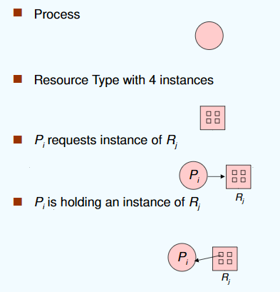
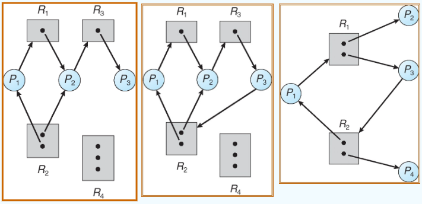

---

title: Chap 7 | Deadlocks

hide:
  #  - navigation # 显示右
  #  - toc #显示左
  #  - footer
  #  - feedback  
comments: true  #默认不开启评论

---

<h1 id="欢迎">Chap 7 | Deadlocks</h1>

!!! note "章节启示录"
    <!-- === "Tab 1" -->
        <!-- Markdown **content**. -->
    <!-- === "Tab 2"
        More Markdown **content**. -->
    本章节是OS的第七章。

## 1.The Deadlock Problem
指多个进程因竞争共享资源而造成相互等待的一种僵局，若无外力作用，这些进程都将永远不能再向前推进。

* Example：semaphores A and B, initialized to 1
    * P0:   
    ```c++
    wait (A);
    wait (B);
    ```
    * P1:   
    ```c++
    wait (B);
    wait (A);
    ```

* 产生死锁的四个必要条件:
    1. Mutual exclusion（互斥条件）：一个资源一次只能被一个进程使用。
    2. Hold and wait（请求并保持条件）：持有至少一个资源的进程正在等待获取其他进程持有的额外资源。
    3. No preemption（不剥夺条件）：资源只能由持有该资源的进程在完成其任务后自愿释放。
    4. Circular wait(循环等待/环路等待条件)：存在一组{P0, P1,…， Pn}的等待进程，使得P0正在等待由P1持有的资源，P1正在等待由P2持有的资源，…， Pn - 1在等待一个由Pn持有的资源，Pn在等待一个由P0持有的资源。

* Resource-Allocation Graph：资源分配图分为点集和边集
    1. V划分为两种类型：
        1. P = {P1, P2，…， Pn}，系统中所有进程的集合。
        2. R = {R1, R2，…， Rm}，系统中所有资源类型的集合。
    2. E的两种方向：
       1. request请求资源：边Pi->Rj
       2. assignment分配资源：边Ri->Pi  

{width="350"}

* 如果图不包含循环:没有死锁。
* 如果每个资源类型只有一个实例，则为死锁。
* 如果每个资源类型有多个实例，则可能出现死锁。

以下的例子只有第二个存在死锁：    
{width="500"}