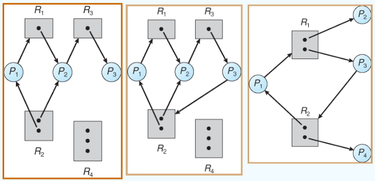
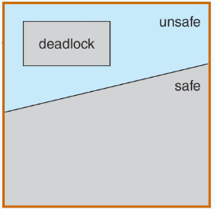
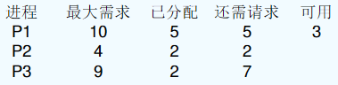
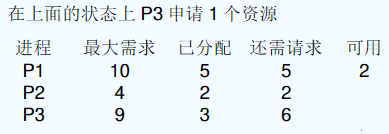
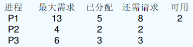
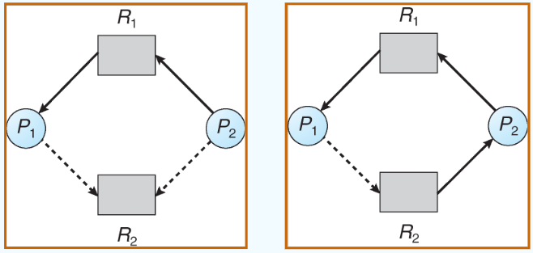

---

title: Chap 7 | Deadlocks

hide:
  #  - navigation # 显示右
  #  - toc #显示左
  #  - footer
  #  - feedback  
comments: true  #默认不开启评论

---

<h1 id="欢迎">Chap 7 | Deadlocks</h1>

!!! note "章节启示录"
    <!-- === "Tab 1" -->
        <!-- Markdown **content**. -->
    <!-- === "Tab 2"
        More Markdown **content**. -->
    本章节是OS的第七章。

## 1.The Deadlock Problem
指多个进程因竞争共享资源而造成相互等待的一种僵局，若无外力作用，这些进程都将永远不能再向前推进。

* Example：semaphores A and B, initialized to 1
    * P0:   
    ```c++
    wait (A);
    wait (B);
    ```
    * P1:   
    ```c++
    wait (B);
    wait (A);
    ```

* 产生死锁的四个必要条件:
    1. Mutual exclusion（互斥条件）：进程要求对所分配的资源进行排他性使用，即在一段时间内某资源仅为一个进程所占有。此时若有其他进程请求该资源，则只能等待。
    2. Hold and wait（请求并保持条件）：持有至少一个资源的进程正在等待获取其他进程持有的额外资源。
    3. No preemption（不剥夺条件）：资源只能由持有该资源的进程在完成其任务后自愿释放。
    4. Circular wait(循环等待/环路等待条件)：存在一组{P0, P1,…， Pn}的等待进程，使得P0正在等待由P1持有的资源，P1正在等待由P2持有的资源，…， Pn - 1在等待一个由Pn持有的资源，Pn在等待一个由P0持有的资源。

!!! warning "循环等待/环路等待条件似乎与死锁一样？"
    直观上看，循环等待条件似乎与死锁的定义一样，实则不然。按死锁定义构成等待环所要求的条件更严，它要求 $P_i$ 等待的资源必须由 $P_{i+1}$ 来满足，而循环等待条件则无此限制。

!!! warning "不可剥夺条件 Vs. 请求并保持条件"
    用一个简单的例子说明：若你手上拿着一个苹果（即便你不打算吃），别人不能将你手上的苹果拿走，则这就是不可剥夺条件；若你左手拿着一个苹果，允许你右手再去拿一个苹果，则这就是请求并保持条件。

* Resource-Allocation Graph：资源分配图分为点集和边集
    1. V划分为两种类型：
        1. P = {P1, P2，…， Pn}，系统中所有进程的集合。
        2. R = {R1, R2，…， Rm}，系统中所有资源类型的集合。
    2. E的两种方向：
       1. request请求资源：边Pi->Rj
       2. assignment分配资源：边Ri->Pi  

{width="350"}

* 如果图不包含循环:没有死锁。
* 如果每个资源类型只有一个实例，则为死锁。
* 如果每个资源类型有多个实例，则可能出现死锁。

以下的例子只有第二个存在死锁：    
{width="500"}

## 2. Deadlock Prevention（死锁预防）
通过破坏产生死锁的必要条件之一来防止死锁的发生。

* Prevent Mutual Exclusion：将只能互斥使用的资源改造为允许共享使用，那么系统不会进入死锁状态。
    * 缺点：很多时候并不能做到（例如打印机），为了系统安全，很多时候必须保护互斥性。

* Prevent Hold and Wait：要求进程在请求资源时不能持有不可剥夺资源：
    1. 预先静态分配法：要求进程在开始执行之前请求并分配其所有资源。
    2. 允许进程只获得运行初期所需的资源后，便可开始运行。进程在运行过程中再逐步释放已分配给自己且已使用完毕的全部资源后，才能请求新的资源。

    >

    * 缺点：方法一资源利用率低；可能饥饿。方法二改进了这些缺点。
  
        >例如：将数据从DVD驱动器复制到磁盘文件，对文件进行排序，然后将结果打印到打印机上。

* Prevent No Preemption:
    1. 如果持有某些资源的进程请求另一个不能立即分配给它的资源，那么当前持有的所有资源都将被释放。
    2. 抢占的资源被添加到进程等待的资源列表中。
    3. 只有当进程可以重新获得其旧资源以及它正在请求的新资源时，进程才会重新启动。

    >

    * 缺点：实现较复杂，释放已获得的资源可能造成前一阶段工作的失效，因此这种方法<font color = "red">常用于状态易于保存和恢复的资源</font>（如CPU的寄存器及内存资源，一般不能用于打印机之类的资源）。反复地申请和释放资源既影响进程推进速度，又增加系统开销，降低系统吞吐量。
  
* Prevent Circular Wait：强加所有资源类型的**总顺序**，并要求每个进程以递增的枚举顺序请求资源。
    1. F(tape drive)=1
    2. F(disk drive)=5
    3. F(printer)=12

    >

    * 缺点：编号必须相对稳定，因此不便于增加新类型设备；尽管在编号时已考虑到大多数进程使用这些资源的顺序，但是进程实际使用资源的顺序还是可能和编号的次序不一致，这就会造成资源的浪费。同时，按次序申请资源会给用户编程带来麻烦。

## 3. Deadlock Avoidance （死锁避免）
通过动态检测资源分配的安全性，确保系统不会进入不安全状态。

* 要求系统具有一些额外的可用优先级信息：
    1. 最简单和最有用的模型要求每个进程声明它可能需要的每种类型的最大资源数量。
    2. 避免死锁算法动态检查资源分配状态，确保不会出现循环等待的情况。
    3. 资源分配状态由可用资源和分配资源的数量以及流程的最大需求来定义。

### 安全状态（Safe State）

是指系统能按某种进程推进顺序（P1,,P2,…,Pn）为每个进程Pi分配其所需的资源，直至满足每个进程对资源的最大需求，使每个进程都可顺利完成。此时称P1,,P2,…,Pn为<font color = "red">安全序列</font>（可能有多个）。

若系统无法找到一个安全序列，则称系统处于**不安全状态**。

* 具体寻找过程如下：
    1. 如果 $P_i$ 的资源需求不能立即可用，则 $P_i$ 可以等待直到所有 $P_j$ 完成。
    2. 当 $P_j$ 完成后， $P_i$ 可以获得所需的资源，执行，返回分配的资源，并终止。
    3. 当 $P_i$ 终止时， $P_{i+1}$ 可以获得所需的资源，以此类推。

!!! example "一个例子🌰"
    {width="550"}   

    * 图一：P3,P2,P1
    * 图二：不存在（都不能当作安全序列的第一个）
    * 图三：P2,P4,P3/P1,P1/P3

??? question "死锁和安全状态的关系？"
    * 如果系统处于安全状态 -> 没有死锁。
    * 如果系统处于不安全状态 -> 有出现死锁的可能。
    * 避免 -> 确保系统永远不会进入不安全状态。  

    {width="200"}

??? example "几个例子🌰"
    {width="300"}   

    * Safe state：P2、P1、P3

    {width="300"}    

    * Safe state：无安全序列
    * Deadlock：P1和P3相互在等待释放资源，死锁

    {width="300"}      

    * Safe state：P2、P3依次完成后，总资源变成7，但是P1需要8，无法满足安全状态。
    * Deadlock：不是死锁，只是可用的资源无法满足

### Avoidance algorithms

* 两种类型：
    1. Single instance of a resource type：Use a resource-allocation graph
    2. Multiple instances of a resource type.  Use the banker’s algorithm

* Resource-Allocation Graph Algorithm：
    1. claim edge $P_i->R_j$表示进程 $P_i$ 可能会请求资源 $R_j$ ；用虚线表示的。
    2. 当进程请求资源时，claim edge 转换为request edge。
    3. 当资源分配给进程时，request edge 转换为 assignment edge。
    4. 当一个资源被进程释放时，assignment edge 转换为 claim edge。
    5. 在系统中，资源必须被预先申请。

{width="400"}

* Banker’s Algorithm:
    * 设银行家有10万贷款，P、Q、R分别需要8、3、9万元搞项目，P已申请到了4万
        1. Q要申请2万，如果满足Q的申请，有安全序列<P, Q, R>/<Q, P, R>。
        2. R要申请4万，如果满足R的申请，显然不存在安全序列。

    * 假设
        1. 多个实例。
        2. 每道工序必须事先保证最大限度的使用。
        3. 当一个进程请求一个资源时，它可能需要等待。
        4. 当一个进程得到它所有的资源时，它必须在有限的时间内返回这些资源。

* Data Structures for the Banker’s Algorithm：假设系统中有n个进程，m类资源： 
    1. Available可利用资源向量：长度为m的向量。Available [j] = k 表示此时系统中有k个Rj类资源可用。
    2. Max最大需求矩阵: n × m 矩阵，定义系统中n个进程中的每个进程对m类资源的最大需求。Max [i，j] = k 表示进程Pi需要Rj类资源的最大数目为k。
    3. Allocation分配矩阵：n × m 矩阵，定义系统中每类资源当前已分配给每个进程的资源数。Allocation[i，j] = k 表示进程Pi当前已分得Rj类资源的数目为k。
    4. Need需求矩阵：n × m 矩阵，表示每个进程接下来最多还需要多少资源。Need[i，j] = k 表示进程Pi还需要Rj类资源的数目为k。

    >

    * **Need [i,j] = Max[i,j] – Allocation [i,j]**

* Resource-Request Algorithm for Process Pi：   
    Request = request vector for process Pi.  If Requesti[j] = k then process Pi wants k instances of resource type Rj.
    1. 如果 $Request_i[j] ≤ need_i[j]$ ，转步骤2。否则，抛出错误条件，因为进程已超过其最大要求。
    2. 如果 $Request_i[j] ≤ Available[j]$ ，请转步骤3。否则Pi必须等待，因为资源不可用。
    3. 系统试探着将请求的资源分配给Pi，并修改状态如下：
        1. Available = Available  – Request;
        2. Allocationi= Allocationi + Requesti;
        3. Needi= Needi – Requesti;
    4. 系统执行<font color = "red">安全性算法</font>，检查此次资源分配后，系统是否处于安全状态。若安全，才正式分配资源给进程Pi；否则，将本次试探分配作废，恢复原来的资源分配状态，让进程Pi等待。

* 安全性算法：设置工作向量Work，表示系统中的剩余可用资源数目，它有m个元素，在执行安全性算法前，令Work = Available
    1. 初始时安全序列为空
    2. 从Need矩阵中找出符合下面条件的行：该行对应的进程不在安全序列中，而且该行小于或等于Work向量，找到后，将对应的进程加入安全序列；若找不到，则执行步骤4。
    3. 进程Pi进入安全序列后，可顺利执行，直至完成，并释放分配给它的资源，所以应执行Work = Work + Allocation[i]，其中Allocation[i]时Allocation矩阵中对应的行，返回步骤2。
    4. 若此时安全序列中已有所有进程，则系统处于安全状态，否则系统处于不安全状态。
## 4. Deadlock Detection

* Single Instance of Each Resource Type：
    1. 维护等待图（wait-for graph）
        1. 如果Pi正在等待Pj，则Pi->Pj。
    2. 定期调用在图中搜索周期的算法。如果存在循环，则存在死锁。
    3. 检测图中周期的算法需要进行 $n^2$ 次运算，其中 $n$ 为图中顶点的个数。
    
* Several Instances of a Resource Type:判断是否为安全序列，时间复杂度 $O(m x n^2)$  

* Completely Reducible Graph：可完全化简图
    1. 能消去图中所有边，能则称为可完全化简图
    2. 找出一个既不阻塞又非独立的进程结点Pi
    3. 在顺利的情况下，分配给其资源让其完成，消去所有边变成孤立点
    4. 循环上述两步操作，直至消去所有边，代表无死锁。

## 5. Recovery from Deadlock
* 资源剥夺法：把部分进程挂起，剥夺其资源
* 撤销进程法：撤销部分进程，释放资源
* 进程回退法：让一个进程或多个进程回退到避免死锁的地步，释放中间资源
* 依据: 进程的优先级、已执行时间、剩余时间、已用资源、交互还是批处理等


